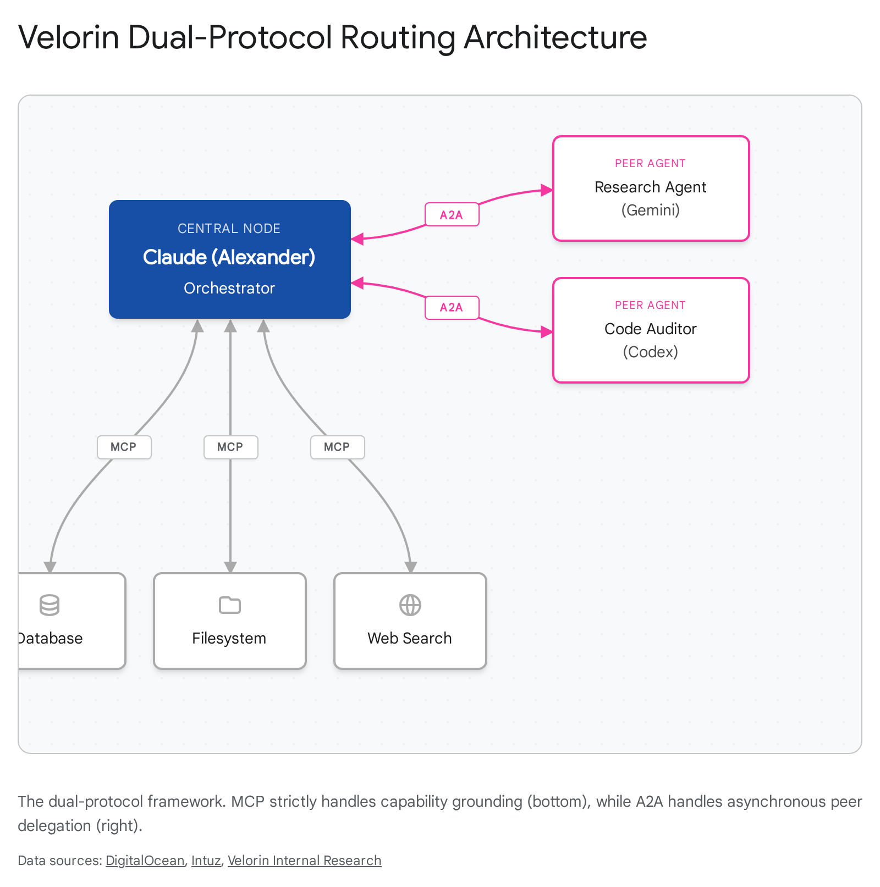

# AI Ecosystem State of Play: Architectural Analysis for Velorin OS

## Executive Summary

  - GUI Orchestration is a Dead End: Desktop applications from OpenAI, Google, and Anthropic are closed consumer surfaces, not programmable routing nodes. Attempting to orchestrate ChatGPT Desktop, Gemini Desktop, and Claude Desktop via UI automation will result in brittle failure. Orchestration must occur via headless APIs using standard protocols.
  - Protocol Bifurcation (A2A vs. MCP): The industry has formally divided integration standards. The Model Context Protocol (MCP) strictly handles agent-to-tool capability grounding, while the Agent-to-Agent (A2A) protocol handles asynchronous peer delegation. Velorin must implement a central API-driven router using both protocols rather than forcing MCP to simulate agent-to-agent communication.
  - Procedural Memory Supersedes Static RAG: Frameworks like Hermes-Agent and closed-loop Self-Healing RAG architectures demonstrate that static vector retrieval is obsolete. Velorin's neural file graph must implement automatic retrieval evaluation (CRAG) and procedural skill generation to prevent context exhaustion and hallucination.
  - Hardware Constraints Dictate Model Routing: The Mac Studio M4 Max with 36GB of unified memory imposes strict physical limits on local inference. The architecture must utilize sparse Mixture-of-Experts (MoE) models like Qwen 3.6 for high-speed local agentic tasks, delegating heavy reasoning to external APIs rather than attempting to run dense 30B+ models natively.

## Part 1: Desktop App Landscape

The assumption that the AI ecosystem can be wired together by connecting desktop applications represents a fundamental misunderstanding of the current software architecture. Desktop applications are designed for human-in-the-loop interaction. They lack the deterministic API surfaces required for autonomous orchestration.

### ChatGPT Desktop (Mac/Windows)

The ChatGPT Desktop application, recently updated as the "Codex app," represents a significant shift toward local productivity workflows rather than headless orchestration.1 Capabilities: The application features background computer use, an in-app browser, image generation, and memory previews.1 Its "computer use" functionality does not rely exclusively on pixel-based visual processing; instead, it parses the macOS Accessibility Tree to ingest the structural hierarchy of any active window as context.2 This enables highly accurate UI interaction without requiring native API integrations for the target applications.1 Limitations: The application operates within a strictly enforced silo. It exposes no local MCP client port for arbitrary remote servers, nor does it offer an automation surface for external scripts to dispatch background tasks.4 It is a terminal node designed for human interaction. Community Sentiment: Developers treat the Codex app as a specialized tool for front-end iteration, visual quality assurance, and code review in local host environments.1 It is not utilized as a component in automated deployment pipelines. Velorin Relevance: HIGH CONFIDENCE. The application is highly relevant for isolated code auditing where sandbox isolation from the Velorin host is required, but its relevance for automated orchestration is zero. Do not attempt to integrate the ChatGPT desktop app into Velorin's automated workflows.

### Gemini Desktop / Google AI Ultra

Google released a native macOS Gemini application on April 15, 2026.6 This release provides users of the Google AI Ultra tier with direct access to the Gemini 3.1 Pro model via a desktop interface.7 Capabilities: The application supports global keyboard shortcuts (Option + Space), contextual screen sharing, and integration with Google's image (Nano Banana) and video (Veo) generation models.9 Limitations: The native Mac application explicitly lacks support for the Model Context Protocol (MCP).11 Google has reserved programmatic agent access and MCP integrations for its cloud-based Jules platform and the Gemini API.11 The desktop application cannot read local file systems programmatically without explicit user-initiated screen sharing or file uploads.10 Community Sentiment: Technical users express frustration regarding the lack of developer hooks and MCP support, categorizing the software as a high-level consumer wrapper rather than a viable engineering tool.11 Velorin Relevance: CONFIRMED. The desktop application has no system integration capabilities that matter for Velorin. Gemini, as a Velorin subagent, must be accessed exclusively via the Gemini API or the Agent-to-Agent (A2A) protocol.

### Claude Desktop (Current State)

Powered by the April 16 release of Opus 4.7, Claude Desktop and the CLI-based Claude Code remain the primary surfaces offering first-class local MCP support.13 Capabilities: The ecosystem has expanded to include the ant CLI for native API interaction, and Claude Managed Agents in public beta for running autonomous sessions with secure sandboxing.13 The computer use functionality has been extended to support remote execution via the Dispatch feature, allowing tasks initiated on mobile devices to execute on the host desktop machine.15 Limitations: The Claude Code "Agent Teams" feature exhibits severe structural flaws. Sequential messaging between agents mathematically multiplies context size, as full conversation histories are appended during delegation.16 This results in rapid context window exhaustion, lock file contention during simultaneous inbox writes, and catastrophic compaction failures where agents lose team awareness entirely.4 Velorin Relevance: HIGH CONFIDENCE. Claude remains the only viable primary orchestrator for the Velorin host machine, strictly due to its open MCP architecture and terminal-native execution environment. However, the native Agent Teams feature must be bypassed in favor of a custom orchestration script to prevent context collapse.

Application| Core Model| MCP Support| Automation Surface| Primary Use Case| Velorin Integration Path  
---|---|---|---|---|---  
ChatGPT / Codex| GPT-5.4 / o3| None (Internal Only)| Accessibility Tree| UI QA, Code Review| API / v1/responses  
Gemini Mac App| Gemini 3.1 Pro| None| Screen Sharing| General Assistance| API / A2A Protocol  
Claude Desktop| Opus 4.7| Full Client Support| Computer Use / Dispatch| Primary Orchestrator| Native MCP / API  
  
## Part 2: New AI Tools and Frameworks

The tooling landscape has shifted away from conversational agent frameworks toward persistent procedural memory, strict state machines, and specialized rendering backends.

### Orchestration Frameworks

The engineering community has largely standardized on deterministic state management over conversational flexibility.

  - LangGraph (1.x): Remains the enterprise standard for complex multi-agent systems.17 It models agent workflows as directed graphs where nodes are computation units and edges represent conditional routing logic.4 The underlying Pregel-inspired bulk-synchronous parallel (BSP) runtime ensures that state persists across supersteps, enabling fault recovery and exact state replay.4
  - CrewAI: Dominates rapid prototyping due to its low barrier to entry, but suffers from severe coordination overhead when scaled beyond five agents.18 The framework relies on sequential role-based task execution, which causes latency to scale linearly with team size.18
  - AutoGen: Microsoft's framework continues to focus on conversational multi-agent patterns (sequential chat, nested chat), which are increasingly viewed as unpredictable for production workloads requiring strict auditability.17

### Local Agent Architectures

  - Goose (Block): Released under an Apache 2.0 license, Goose is a local-first developer agent written in Rust.19 Its primary architectural distinction is the allowance for mid-session dynamic tool loading; an agent can inject new MCP client connectors into its own execution environment without dropping the connection or requiring a reboot.20 Goose can operate via CLI or desktop application and connects to multiple LLMs.21
  - Hermes-Agent v0.10.0 (Nous Research): The fastest-growing open-source agent framework, featuring a closed learning loop.22 When Hermes completes a complex task, it does not discard the execution trace. It runs a post-task reflection sequence, extracts the correct API calls, and writes them to disk as a parameterized "skill" in JSON format.23 On subsequent identical tasks, it retrieves the precise skill, bypassing the reasoning phase entirely.25 The v0.10.0 "Tool Gateway" release further centralizes tool access, allowing paid subscribers to access web search, image generation, and browser automation without managing individual API keys.22

### Visual, Spatial, and Temporal Generation

The generation of non-text assets has migrated from proprietary prompt interfaces to deterministic markup and procedural APIs.

  - HeyGen Hyperframes: This open-source framework bridges web technologies and video production by treating video compositions as standard HTML files containing specific data attributes (data-start, data-duration).26 AI agents natively output HTML, which the Hyperframes engine (utilizing Puppeteer and FFmpeg) renders into deterministic MP4 video files.26 Skills are integrated via the npx skills add command, providing agents with specialized slash commands (/hyperframes) for video scaffolding.26
  - Claude Design: Powered by the Opus 4.7 vision model, this Anthropic tool ingests entire codebases or design systems to generate functional prototypes and slide decks.27 It strictly applies team typography and color systems across projects, allowing for exports to Canva, PDF, or direct handoff to Claude Code for implementation.27
  - Lyra 2.0 (NVIDIA): A generative 3D world model that constructs explorable environments from a single input image.29 It addresses the historical failures of "spatial forgetting" and "temporal drifting" by lifting autoregressive video generation into explicit 3D Gaussian Splatting and surface meshes.31
  - World Labs (Marble 1.1): The World API allows applications to generate navigable spatial environments programmatically from text, images, or video.32 These environments are not static assets but persistent models that can be iteratively edited and exported into downstream simulation pipelines.34
  - Pika Video (AI Selves): Pika has introduced persistent digital twins equipped with long-term memory and voice replication.36 These entities maintain coherent identities across sessions and integrate directly into messaging platforms (Telegram, Discord, Slack) to perform autonomous tasks.36

### Local AI Developments: Mac Studio M4 Max Implications

The physical constraints of the Mac Studio M4 Max (36GB unified memory) dictate strict limitations on local model deployment.4 macOS Sequoia reserves a baseline percentage of memory for the operating system, leaving approximately 26-28GB of effective VRAM for MLX operations.37

  - Qwen 3.6 (35B-A3B): An open-weights Sparse Mixture-of-Experts (MoE) model featuring 35 billion total parameters but only 3 billion active parameters per forward pass.38 At Q4 quantization, the entire model fits within the Mac Studio's VRAM, but because only 3B parameters compute per token, the memory bandwidth requirement is drastically reduced.39 This results in exceptional generation speed and dominance on agentic coding benchmarks (SWE-bench).40
  - Gemma 4 (31B Dense): Released under an Apache 2.0 license, this model requires the full 31 billion parameters to be loaded from memory into the compute units for every token.42 While it scores highly on general reasoning and European language benchmarks, the dense architecture makes it significantly slower and more power-intensive on Apple Silicon compared to Qwen's MoE.44
  - Velorin Connection: HIGH CONFIDENCE. The Mac Studio must run Qwen 3.6-35B-A3B for fast, local agentic loops (file sorting, syntax checking). Dense models like Gemma 4-31B should be reserved for offline text evaluation where latency is irrelevant.

### Self-Healing RAG Architectures

The industry has acknowledged that naive open-loop Retrieval-Augmented Generation (RAG) is fundamentally flawed for enterprise deployment.47 In an open-loop system, if vector retrieval returns semantically similar but contextually irrelevant chunks, the LLM hallucinates an answer based on noise.48

  - Closed-Loop Mechanisms: Modern pipelines implement three self-healing layers: Auto-Retrieval (modifying the user's query via Hypothetical Document Embeddings before it hits the database), Auto-Ranking/CRAG (validating retrieved data against confidence thresholds), and Auto-Learning (optimizing the system over time using feedback to detect semantic drift).48
  - Velorin Connection: CONFIRMED. The Velorin Brain currently functions as a static manual graph. To prevent the "Monster Node" failure mode identified by the Erdős mathematical agent, the retrieval algorithm must implement a CRAG evaluation step prior to any LLM generation. Raw Personalized PageRank (PPR) retrieval results cannot be trusted without secondary LLM verification.4

## Part 3: Community Intelligence

Analysis of developer forums, GitHub issue trackers, and technical blogs reveals a stark divergence between vendor marketing claims and actual production practices.

### What is Breaking: Failure Modes in Practice

  - State Synchronization Across Live Agents: The attempt to synchronize state across multiple active agents via shared JSON payloads invariably fails due to race conditions and schema drift.4 The community has converged on the "dropbox pattern," where agents read from and write to a static versioned Markdown file on disk, rather than relying on message queues.4
  - Agent Teams Context Collapse: Utilizing conversational subagents leads to rapid context degradation. When a lead agent passes full conversation histories to subagents, the token count scales geometrically. The resulting compaction strips team metadata, leaving subagents orphaned and unable to communicate.4
  - The "Window Gravity" Phenomenon: Models heavily optimized via RLHF exhibit a systemic bias toward solving problems entirely within their current context window, actively suppressing recommendations to route tasks to more appropriate external tools.4 This represents a mechanism design failure where the proxy reward (immediate helpfulness) diverges from the optimal user outcome.

### Subagent Coding Audits (Claude + Codex)

The community consensus on multi-model coding workflows relies on strict environmental isolation.

  - Git Worktree Isolation: Practitioners explicitly prevent multiple agents from editing the same live directory. The primary orchestrator spins up isolated Git worktrees. Subagent A is dispatched to worktree_A to write unit tests, while Subagent B is dispatched to worktree_B to audit security.50 The orchestrator reviews the resulting isolated commits and merges them.50
  - Model Routing: Developers utilize Claude for deep reasoning, architectural decisions, and multi-file refactoring due to its superior performance on SWE-bench and 200K context stability.51 Conversely, OpenAI's Codex (GPT-5.4) is deployed for read-only sandbox auditing and automated cloud task delegation.53

Task Type| Preferred Model| Reasoning  
---|---|---  
Deep Refactoring| Claude Opus 4.7| 200K context stability, superior SWE-bench metrics.13  
Sandbox Auditing| Codex / GPT-5.4| Strong review capabilities, native sandbox integration.53  
Large Context Holding| Gemini 3.1 Pro| 1M+ token window for holding massive logs and history.52  
Local OS Tasks| Qwen 3.6 MoE| High TPS on Mac Studio, zero API cost.40  
  
## Part 4: Multi-Agent Multi-Platform Architecture

The most critical architectural development of the last four weeks is the formal standardization of multi-agent communication protocols.

### The Bifurcation of MCP and A2A

The engineering ecosystem has separated tool access from agent delegation. Conflating the two is a severe architectural error.56

  - Model Context Protocol (MCP): Operates at the agent-to-tool layer. It is a stateful, asymmetrical client-server architecture. The server exposes resources and tools; the client LLM consumes them.4 MCP servers are structurally stateless regarding the LLM's context window, forcing the client to carry all state.4
  - Agent-to-Agent Protocol (A2A): Hosted by the Linux Foundation, A2A standardizes peer delegation between autonomous agents.57 Operating over HTTPS via JSON-RPC 2.0, A2A enables agents to discover capabilities, negotiate interaction modalities, and collaborate on long-running tasks without exposing internal memory or context.59

### Wiring Claude, GPT, and Gemini

Orchestration Pattern: High-quality multi-agent project management utilizes a Hub-and-Spoke design.4 Claude acts as the central orchestrator. When a complex task requires deep research, Claude does not utilize an MCP browser tool to search the web itself (which would exhaust its context). Instead, Claude formulates a strict task payload and dispatches it via the A2A protocol to a Gemini subagent running independently. Gemini executes the research, synthesizes the findings, and returns only the final summary to Claude.4 Latency and Cost Tradeoffs: Orchestrating complex workflows entirely through API calls incurs significant costs. Heavy reliance on multi-agent teams using frontier models (e.g., Opus 4.7 and GPT-5.4) can rapidly inflate token consumption.61 To mitigate this, system architectures must shift repetitive tasks (e.g., document parsing, log filtering) to the local Qwen 3.6 model running on the Mac Studio, reserving API calls strictly for high-level reasoning and synthesis.4

## Part 5: Velorin Build Implications

The ecosystem state dictates precise structural corrections for the imminent Mac Studio deployment. The current integration plan must be altered to align with proven architectural primitives.

  1. Cease GUI Orchestration Research: HIGH CONFIDENCE. Do not attempt to integrate the consumer desktop applications of ChatGPT, Gemini, or Claude. The integration layer is the API, and the protocol is A2A. Velorin must establish a central headless router.4
  2. Implement A2A for Agent Delegation: HIGH CONFIDENCE. Alexander (Claude) must delegate research tasks to Trey (Gemini) and code audits to Codex (GPT) via an A2A-compliant webhook. Using MCP to simulate agent-to-agent communication is an architectural failure that guarantees context exhaustion.56
  3. Adopt Procedural Skill Generation: HIGH CONFIDENCE. Velorin must implement a closed learning loop mirroring the Hermes-Agent architecture. Alexander must be instructed to write successful execution traces to disk as procedural macros, preventing the re-derivation of known solutions on every boot.23
  4. Deploy CRAG Evaluation in the Neural Graph: HIGH CONFIDENCE. The Velorin Brain retrieval script must include an LLM evaluation node to score the Personalized PageRank (PPR) output before returning it to the user. Raw vector retrieval without a self-healing evaluation step ensures hallucination at scale.48
  5. Utilize HTML for Visual Generation: MODERATE CONFIDENCE. For any system outputs requiring video or spatial data, utilize standard HTML data attributes (as proven by Hyperframes) rather than relying on proprietary generation DSLs. Agents natively output valid HTML.26
  6. Calibrate Mac Studio Workloads: HIGH CONFIDENCE. The Mac Studio M4 Max will run Qwen 3.6 efficiently. It will not run frontier-level general reasoning locally. The local hardware must be restricted to OS tasks, memory evaluation, and syntax checking to reduce API latency, while Claude Opus 4.7 retains control of system governance.4

#### Works cited

  1. OpenAI Updates Codex With Computer Use, In-App Browser, Memory, and 90-Plus New Plugins - gHacks Tech News, accessed April 19, 2026, [https://www.ghacks.net/2026/04/17/openai-updates-codex-with-computer-use-in-app-browser-memory-and-90-plus-new-plugins/](https://www.google.com/url?q=https://www.ghacks.net/2026/04/17/openai-updates-codex-with-computer-use-in-app-browser-memory-and-90-plus-new-plugins/&sa=D&source=editors&ust=1776658923090034&usg=AOvVaw05_juuzHdSJ-4Z0a1RBosb)
  2. OpenAI's New Codex App Has the Best 'Computer Use' Feature I've ..., accessed April 19, 2026, [https://www.macstories.net/notes/openais-new-codex-app-has-the-best-computer-use-feature-ive-ever-tested/](https://www.google.com/url?q=https://www.macstories.net/notes/openais-new-codex-app-has-the-best-computer-use-feature-ive-ever-tested/&sa=D&source=editors&ust=1776658923090370&usg=AOvVaw24YNIsz-jHVAj8DkFB95VL)
  3. What's The Accessibility API - DEV Community, accessed April 19, 2026, [https://dev.to/yuridevat/whats-the-accessibility-api-5agn](https://www.google.com/url?q=https://dev.to/yuridevat/whats-the-accessibility-api-5agn&sa=D&source=editors&ust=1776658923090585&usg=AOvVaw0fZHPGOsEHZbgHaWVuR0AA)
  4. navyhellcat/velorin-system
  5. OpenAI's Codex Desktop can run your computer now - and has its own browser | ZDNET, accessed April 19, 2026, [https://www.zdnet.com/article/openai-codex-desktop-update/](https://www.google.com/url?q=https://www.zdnet.com/article/openai-codex-desktop-update/&sa=D&source=editors&ust=1776658923090865&usg=AOvVaw2R_aezgKMrlz4u5WTxDBXB)
  6. Google launches Gemini AI Mac app, here's what it offers - 9to5Mac, accessed April 19, 2026, [https://9to5mac.com/2026/04/15/google-launches-gemini-mac-app-heres-what-it-offers/](https://www.google.com/url?q=https://9to5mac.com/2026/04/15/google-launches-gemini-mac-app-heres-what-it-offers/&sa=D&source=editors&ust=1776658923091113&usg=AOvVaw0KjVuBw99FvQXUjRqlKf57)
  7. Google Gemini for Business 2026: Models, MCP & What Changed - Nettpilot, accessed April 19, 2026, [https://nettpilot.com/google-gemini-business-guide-2026/](https://www.google.com/url?q=https://nettpilot.com/google-gemini-business-guide-2026/&sa=D&source=editors&ust=1776658923091347&usg=AOvVaw1ChRGiHY5dzUAzIHp8d8sM)
  8. Gemini is now a native macOS app, making it faster and better integrated than ever before, accessed April 19, 2026, [https://www.techradar.com/ai-platforms-assistants/gemini/gemini-is-now-a-native-macos-app-making-it-faster-and-more-integrated-than-ever-before](https://www.google.com/url?q=https://www.techradar.com/ai-platforms-assistants/gemini/gemini-is-now-a-native-macos-app-making-it-faster-and-more-integrated-than-ever-before&sa=D&source=editors&ust=1776658923091682&usg=AOvVaw38g1wQkJOhZTkozLuN7k7N)
  9. Now available: The Gemini app for Mac - Google Workspace Updates, accessed April 19, 2026, [https://workspaceupdates.googleblog.com/2026/04/now-available-gemini-app-for-mac.html](https://www.google.com/url?q=https://workspaceupdates.googleblog.com/2026/04/now-available-gemini-app-for-mac.html&sa=D&source=editors&ust=1776658923091932&usg=AOvVaw2l7U5Ck3E82Qq2iVkURZFk)
  10. Google Gives macOS a Dedicated Gemini App - ExtremeTech, accessed April 19, 2026, [https://www.extremetech.com/computing/google-gives-macos-a-dedicated-gemini-app](https://www.google.com/url?q=https://www.extremetech.com/computing/google-gives-macos-a-dedicated-gemini-app&sa=D&source=editors&ust=1776658923092172&usg=AOvVaw3MJ9bIko1q-r3VM94EeTIz)
  11. Does the Gemini Mac app support MCP servers? - Google Help, accessed April 19, 2026, [https://support.google.com/gemini/thread/425743533/does-the-gemini-mac-app-support-mcp-servers?hl=en](https://www.google.com/url?q=https://support.google.com/gemini/thread/425743533/does-the-gemini-mac-app-support-mcp-servers?hl%3Den&sa=D&source=editors&ust=1776658923092437&usg=AOvVaw2rFfP2JBhFuEcZ6eWP31s_)
  12. As of April 4th, 2026 there is still no desktop app for Gemini! : r/GeminiAI - Reddit, accessed April 19, 2026, [https://www.reddit.com/r/GeminiAI/comments/1scc391/as_of_april_4th_2026_there_is_still_no_desktop/](https://www.google.com/url?q=https://www.reddit.com/r/GeminiAI/comments/1scc391/as_of_april_4th_2026_there_is_still_no_desktop/&sa=D&source=editors&ust=1776658923092759&usg=AOvVaw3Bg6Z9PIt4yPEtlgcm0JKY)
  13. Claude Platform - Claude API Docs, accessed April 19, 2026, [https://platform.claude.com/docs/en/release-notes/overview](https://www.google.com/url?q=https://platform.claude.com/docs/en/release-notes/overview&sa=D&source=editors&ust=1776658923092967&usg=AOvVaw2nLF3ee618d7XwMgZ4tcHx)
  14. What's new - Claude Code Docs, accessed April 19, 2026, [https://code.claude.com/docs/en/whats-new](https://www.google.com/url?q=https://code.claude.com/docs/en/whats-new&sa=D&source=editors&ust=1776658923093139&usg=AOvVaw0dLpcXcDaFOcfJEbHyljPk)
  15. Anthropic's Claude AI Can Now Use Your Mac While You're Away - MacRumors, accessed April 19, 2026, [https://www.macrumors.com/2026/03/24/claude-use-mac-remotely-iphone/](https://www.google.com/url?q=https://www.macrumors.com/2026/03/24/claude-use-mac-remotely-iphone/&sa=D&source=editors&ust=1776658923093376&usg=AOvVaw3Vr8s1IguUFTl13w2oY_Ox)
  16. GitHub - Lucifer-047/Gemma_Ai_DataAssistant: A private, offline AI agent powered by Google's Gemma and Ollama that autonomously generates complete data science Jupyter notebooks from natural language prompts., accessed April 19, 2026, [https://github.com/Lucifer-047/Gemma_Ai_DataAssistant](https://www.google.com/url?q=https://github.com/Lucifer-047/Gemma_Ai_DataAssistant&sa=D&source=editors&ust=1776658923093685&usg=AOvVaw0BNvxV2kRjmgtiLnUKNIcS)
  17. Multi-Agent Orchestration Frameworks Compared: AutoGen vs CrewAI vs AgentOps (2026) - F³ Fund It | Fast, Founder, Freedom, accessed April 19, 2026, [https://f3fundit.com/multi-agent-orchestration-frameworks-compared-autogen-vs-crewai-vs-agentops-2026/](https://www.google.com/url?q=https://f3fundit.com/multi-agent-orchestration-frameworks-compared-autogen-vs-crewai-vs-agentops-2026/&sa=D&source=editors&ust=1776658923094007&usg=AOvVaw2nHASYrHq0Y6VcQmp9owd-)
  18. Top 5 AI Agent Frameworks 2026: LangGraph, CrewAI & More | Intuz, accessed April 19, 2026, [https://www.intuz.com/blog/top-5-ai-agent-frameworks-2025](https://www.google.com/url?q=https://www.intuz.com/blog/top-5-ai-agent-frameworks-2025&sa=D&source=editors&ust=1776658923094240&usg=AOvVaw2cKdubPKeq1tlyUT6pRair)
  19. Jack Dorsey's Block Unveils Goose, an Open-Source AI Agent - AiNews.com, accessed April 19, 2026, [https://www.ainews.com/p/jack-dorsey-s-block-unveils-goose-an-open-source-ai-agent](https://www.google.com/url?q=https://www.ainews.com/p/jack-dorsey-s-block-unveils-goose-an-open-source-ai-agent&sa=D&source=editors&ust=1776658923094493&usg=AOvVaw36qgNA-dYScbJAb8prEvqv)
  20. Block's new open-source AI agent 'goose' lets you change direction ..., accessed April 19, 2026, [https://www.zdnet.com/article/blocks-new-open-source-ai-agent-goose-lets-you-change-direction-mid-air/](https://www.google.com/url?q=https://www.zdnet.com/article/blocks-new-open-source-ai-agent-goose-lets-you-change-direction-mid-air/&sa=D&source=editors&ust=1776658923094768&usg=AOvVaw1OMj261RMS41XYmtZE91Og)
  21. goose | Your open source AI agent, accessed April 19, 2026, [https://goose-docs.ai/](https://www.google.com/url?q=https://goose-docs.ai/&sa=D&source=editors&ust=1776658923094917&usg=AOvVaw0k1g7wfA0F1hcvBSE2NhaM)
  22. Releases · NousResearch/hermes-agent - GitHub, accessed April 19, 2026, [https://github.com/NousResearch/hermes-agent/releases](https://www.google.com/url?q=https://github.com/NousResearch/hermes-agent/releases&sa=D&source=editors&ust=1776658923095108&usg=AOvVaw1q1c_h12GCQvhHdcDJ5VnM)
  23. Hermes Agent 2026: The Self-Improving Open-Source AI Agent Outpacing OpenClaw - AI.cc, accessed April 19, 2026, [https://www.ai.cc/blogs/hermes-agent-2026-self-improving-open-source-ai-agent-vs-openclaw-guide/](https://www.google.com/url?q=https://www.ai.cc/blogs/hermes-agent-2026-self-improving-open-source-ai-agent-vs-openclaw-guide/&sa=D&source=editors&ust=1776658923095448&usg=AOvVaw2Fz7oPzeqq44rj3gwBLNVi)
  24. NousResearch/hermes-agent: The agent that grows with you - GitHub, accessed April 19, 2026, [https://github.com/nousresearch/hermes-agent](https://www.google.com/url?q=https://github.com/nousresearch/hermes-agent&sa=D&source=editors&ust=1776658923095651&usg=AOvVaw1gV1myKW0Q45N5qmpbVgSt)
  25. Hermes Agent — The Agent That Grows With You | Nous Research, accessed April 19, 2026, [https://hermes-agent.nousresearch.com/](https://www.google.com/url?q=https://hermes-agent.nousresearch.com/&sa=D&source=editors&ust=1776658923095844&usg=AOvVaw0LgygN_ejRxeG2VTJVOdUL)
  26. heygen-com/hyperframes: Write HTML. Render video. Built ... - GitHub, accessed April 19, 2026, [https://github.com/heygen-com/hyperframes](https://www.google.com/url?q=https://github.com/heygen-com/hyperframes&sa=D&source=editors&ust=1776658923096038&usg=AOvVaw0BWzHc66enItnAtutN27hU)
  27. Anthropic Launches Claude Design, Figma Stock Immediately Nosedives, accessed April 19, 2026, [https://gizmodo.com/anthropic-launches-claude-design-figma-stock-immediately-nosedives-2000748071](https://www.google.com/url?q=https://gizmodo.com/anthropic-launches-claude-design-figma-stock-immediately-nosedives-2000748071&sa=D&source=editors&ust=1776658923096304&usg=AOvVaw1p3eILTPKof4Ok0dKwXAaO)
  28. Claude Design just dropped... (Everything you need to know!) - YouTube, accessed April 19, 2026, [https://www.youtube.com/watch?v=1YAc1f4v-WU](https://www.google.com/url?q=https://www.youtube.com/watch?v%3D1YAc1f4v-WU&sa=D&source=editors&ust=1776658923096509&usg=AOvVaw1zy_wB3_Q54l50qkgS0Y9U)
  29. Lyra 2.0: Explorable Generative 3D Worlds | AI Model | There's An AI, accessed April 19, 2026, [https://theresanaiforthat.com/model/lyra-2-0-explorable-generative-3d-worlds/](https://www.google.com/url?q=https://theresanaiforthat.com/model/lyra-2-0-explorable-generative-3d-worlds/&sa=D&source=editors&ust=1776658923096753&usg=AOvVaw1KqRYpmJpa1PrPKGLYcoHW)
  30. NVIDIA Releases Lyra 2.0: Generate 90-Meter 3D Environments from a Single Photo, Outperforming Competitors in Multiple Metrics - AIBase基地, accessed April 19, 2026, [https://www.aibase.com/news/27228](https://www.google.com/url?q=https://www.aibase.com/news/27228&sa=D&source=editors&ust=1776658923097023&usg=AOvVaw3ZTRBQGc3Sc-BlQIlDuRfb)
  31. Nvidia Lyra 2.0 generates explorable 3D worlds from a single image - i-SCOOP, accessed April 19, 2026, [https://www.i-scoop.eu/nvidia-lyra-2-0-generates-explorable-3d-worlds-from-a-single-image/](https://www.google.com/url?q=https://www.i-scoop.eu/nvidia-lyra-2-0-generates-explorable-3d-worlds-from-a-single-image/&sa=D&source=editors&ust=1776658923097291&usg=AOvVaw3k1xv28PcqAIvsbBVOn1i6)
  32. Release notes - Marble - World Labs, accessed April 19, 2026, [https://docs.worldlabs.ai/marble/release-notes](https://www.google.com/url?q=https://docs.worldlabs.ai/marble/release-notes&sa=D&source=editors&ust=1776658923097472&usg=AOvVaw2FU3w5JW2hGgAUZlwSBJbz)
  33. Announcing the World API - World Labs, accessed April 19, 2026, [https://www.worldlabs.ai/blog/announcing-the-world-api](https://www.google.com/url?q=https://www.worldlabs.ai/blog/announcing-the-world-api&sa=D&source=editors&ust=1776658923097708&usg=AOvVaw0ZM1Lm8i5RnhTtrgKLqxUB)
  34. Marble: A Multimodal World Model - World Labs, accessed April 19, 2026, [https://www.worldlabs.ai/blog/marble-world-model](https://www.google.com/url?q=https://www.worldlabs.ai/blog/marble-world-model&sa=D&source=editors&ust=1776658923097902&usg=AOvVaw3Lb34IjhhBsUPLyK4siiVP)
  35. Generating Bigger and Better Worlds - World Labs, accessed April 19, 2026, [https://www.worldlabs.ai/blog/bigger-better-worlds](https://www.google.com/url?q=https://www.worldlabs.ai/blog/bigger-better-worlds&sa=D&source=editors&ust=1776658923098098&usg=AOvVaw2R9pFEA_S-SyinU5YHeW_V)
  36. Pika Launches AI Selves: Creating Digital Twins That Live and Evolve - QUASA Connect, accessed April 19, 2026, [https://quasa.io/media/pika-launches-ai-selves-creating-digital-twins-that-live-and-evolve](https://www.google.com/url?q=https://quasa.io/media/pika-launches-ai-selves-creating-digital-twins-that-live-and-evolve&sa=D&source=editors&ust=1776658923098369&usg=AOvVaw3Tw5K_o_fbGPafK3IPIN_N)
  37. The Best Local LLMs To Run On Every Mac (Apple Silicon) - ApX Machine Learning, accessed April 19, 2026, [https://apxml.com/posts/best-local-llm-apple-silicon-mac](https://www.google.com/url?q=https://apxml.com/posts/best-local-llm-apple-silicon-mac&sa=D&source=editors&ust=1776658923098592&usg=AOvVaw3Ln6DtJJGJw1rgCXKZPC8W)
  38. A Chinese AI called 'Qwen3.6-35B-A3B,' which is more powerful than Gemma4, has been released as an open model., accessed April 19, 2026, [https://gigazine.net/gsc_news/en/20260417-qwen36-35b-a3b/](https://www.google.com/url?q=https://gigazine.net/gsc_news/en/20260417-qwen36-35b-a3b/&sa=D&source=editors&ust=1776658923098837&usg=AOvVaw1EWDO_aZA0HDzEf--2cw9M)
  39. Guide for a new guy : r/LocalLLM - Reddit, accessed April 19, 2026, [https://www.reddit.com/r/LocalLLM/comments/1sp82eb/guide_for_a_new_guy/](https://www.google.com/url?q=https://www.reddit.com/r/LocalLLM/comments/1sp82eb/guide_for_a_new_guy/&sa=D&source=editors&ust=1776658923099093&usg=AOvVaw0HenerzWWSXaXZUThtRhKm)
  40. Qwen3.6-35B-A3B: Agentic Coding Power, Now Open to All, accessed April 19, 2026, [https://qwen.ai/blog?id=qwen3.6-35b-a3b](https://www.google.com/url?q=https://qwen.ai/blog?id%3Dqwen3.6-35b-a3b&sa=D&source=editors&ust=1776658923099286&usg=AOvVaw01v71CUmb2IJjh2L3ttE8F)
  41. Gemma 4 vs Qwen3.5: benchmarking quantized local LLMs on Go coding - Miguel Filipe, accessed April 19, 2026, [https://msf.github.io/blogpost/local-llm-coding-harder-test.html](https://www.google.com/url?q=https://msf.github.io/blogpost/local-llm-coding-harder-test.html&sa=D&source=editors&ust=1776658923099521&usg=AOvVaw3AZECjJ6bti_1LXb_VopqE)
  42. Gemma 4: Byte for byte, the most capable open models, accessed April 19, 2026, [https://blog.google/innovation-and-ai/technology/developers-tools/gemma-4/](https://www.google.com/url?q=https://blog.google/innovation-and-ai/technology/developers-tools/gemma-4/&sa=D&source=editors&ust=1776658923099748&usg=AOvVaw2n0LCuco-MI2Odzj_Bl7VP)
  43. April's First 72 Hours: Cursor 3, Gemma 4, Free Qwen 3.6, and the Agent Push, accessed April 19, 2026, [https://paddo.dev/blog/ai-roundup-april-2026/](https://www.google.com/url?q=https://paddo.dev/blog/ai-roundup-april-2026/&sa=D&source=editors&ust=1776658923099958&usg=AOvVaw1cA4LTo-bziMsmuDcBEOs4)
  44. Local LLM Benchmark: Gemma 4 vs Qwen 3.5 on Mac Mini - Omar Shabab, accessed April 19, 2026, [https://omarshabab.com/llm-benchmark/](https://www.google.com/url?q=https://omarshabab.com/llm-benchmark/&sa=D&source=editors&ust=1776658923100205&usg=AOvVaw2GynARsU0-yt6zy_dwjZlU)
  45. qwen3.6 performance jump is real, just make sure you have it properly configured - Reddit, accessed April 19, 2026, [https://www.reddit.com/r/LocalLLaMA/comments/1soq1es/qwen36_performance_jump_is_real_just_make_sure/](https://www.google.com/url?q=https://www.reddit.com/r/LocalLLaMA/comments/1soq1es/qwen36_performance_jump_is_real_just_make_sure/&sa=D&source=editors&ust=1776658923100489&usg=AOvVaw3LwwVCIeX058n6BSMGV7Gx)
  46. Small Gemma 4, Qwen 3.6 and Qwen 3 Coder Next comparison for a debugging use-case : r/LocalLLaMA - Reddit, accessed April 19, 2026, [https://www.reddit.com/r/LocalLLaMA/comments/1sptduw/small_gemma_4_qwen_36_and_qwen_3_coder_next/](https://www.google.com/url?q=https://www.reddit.com/r/LocalLLaMA/comments/1sptduw/small_gemma_4_qwen_36_and_qwen_3_coder_next/&sa=D&source=editors&ust=1776658923100823&usg=AOvVaw2TGPgq_Ko972JQ1PYqOWt7)
  47. Generative AI in 2026: The 7 Research Breakthroughs That Will Redefine Everything We Know | by Kumar Ankit | Medium, accessed April 19, 2026, [https://medium.com/@kankit570/generative-ai-in-2026-the-7-research-breakthroughs-that-will-redefine-everything-we-know-05ca984277a8](https://www.google.com/url?q=https://medium.com/@kankit570/generative-ai-in-2026-the-7-research-breakthroughs-that-will-redefine-everything-we-know-05ca984277a8&sa=D&source=editors&ust=1776658923101166&usg=AOvVaw2NwF3JBZGnEcY1GXME4EMw)
  48. Building a Fully Self-Healing RAG System | Towards AI, accessed April 19, 2026, [https://towardsai.net/p/machine-learning/building-a-fully-self-healing-rag-system](https://www.google.com/url?q=https://towardsai.net/p/machine-learning/building-a-fully-self-healing-rag-system&sa=D&source=editors&ust=1776658923101416&usg=AOvVaw2jDKyO5KP-_E5rf89FzZOQ)
  49. Why We Need Drift-Aware Retrieval-Augmented Language Models | by Eva Paunova, accessed April 19, 2026, [https://medium.com/@EvePaunova/why-we-need-drift-aware-retrieval-augmented-language-models-0dcefbd3052a](https://www.google.com/url?q=https://medium.com/@EvePaunova/why-we-need-drift-aware-retrieval-augmented-language-models-0dcefbd3052a&sa=D&source=editors&ust=1776658923101698&usg=AOvVaw32IFCaZVvuE3q2GkmOvGS_)
  50. Best Claude Code Alternatives in 2026 for Agentic Workflows ..., accessed April 19, 2026, [https://www.verdent.ai/guides/claude-code-alternatives-2026](https://www.google.com/url?q=https://www.verdent.ai/guides/claude-code-alternatives-2026&sa=D&source=editors&ust=1776658923101920&usg=AOvVaw3q72oJwY45Vw4Rk6NRimXY)
  51. Claude vs ChatGPT (2026): Honest Comparison, Real Pricing, No Affiliate Links | Morph, accessed April 19, 2026, [https://www.morphllm.com/claude-vs-chatgpt](https://www.google.com/url?q=https://www.morphllm.com/claude-vs-chatgpt&sa=D&source=editors&ust=1776658923102155&usg=AOvVaw0V1HLkvURhQrzv0TSpJRFP)
  52. Qwen 3.6 Plus vs Gemma 4 vs Claude Opus 4.6: Choose Your Model on Qubrid AI in 2026, accessed April 19, 2026, [https://www.qubrid.com/blog/qwen-3-6-plus-vs-gemma-4-vs-claude-opus-4-6-choose-your-model-on-qubrid-ai-in-2026](https://www.google.com/url?q=https://www.qubrid.com/blog/qwen-3-6-plus-vs-gemma-4-vs-claude-opus-4-6-choose-your-model-on-qubrid-ai-in-2026&sa=D&source=editors&ust=1776658923102447&usg=AOvVaw1muI9mqh5g3GZSZKYPgiWw)
  53. Codex CLI vs Claude Code in 2026: Architecture Deep Dive - Blake Crosley, accessed April 19, 2026, [https://blakecrosley.com/blog/codex-vs-claude-code-2026](https://www.google.com/url?q=https://blakecrosley.com/blog/codex-vs-claude-code-2026&sa=D&source=editors&ust=1776658923102670&usg=AOvVaw3XDRiHI152jFHkH8jCSu55)
  54. Claude AI 2026: Complete Guide to Models, Pricing, Features & Use Cases | NxCode, accessed April 19, 2026, [https://www.nxcode.io/resources/news/claude-ai-complete-guide-models-pricing-features-2026](https://www.google.com/url?q=https://www.nxcode.io/resources/news/claude-ai-complete-guide-models-pricing-features-2026&sa=D&source=editors&ust=1776658923102930&usg=AOvVaw2IeVLht-QBbdUQCVzOA5Fq)
  55. Claude vs ChatGPT: Which One Delivers Maximum Value in 2026 - Bit Flows, accessed April 19, 2026, [https://bit-flows.com/blog/claude-vs-chatgpt-for-maximum-value/](https://www.google.com/url?q=https://bit-flows.com/blog/claude-vs-chatgpt-for-maximum-value/&sa=D&source=editors&ust=1776658923103172&usg=AOvVaw28fFKcpYlTK5EFrhxBR0lJ)
  56. MCP vs A2A: The Complete Guide to AI Agent Protocols in 2026 - DEV Community, accessed April 19, 2026, [https://dev.to/pockit_tools/mcp-vs-a2a-the-complete-guide-to-ai-agent-protocols-in-2026-30li](https://www.google.com/url?q=https://dev.to/pockit_tools/mcp-vs-a2a-the-complete-guide-to-ai-agent-protocols-in-2026-30li&sa=D&source=editors&ust=1776658923103436&usg=AOvVaw2yYblTbyjBKB6kwZTG3VEg)
  57. A2A Protocol Surpasses 150 Organizations, Lands in Major Cloud Platforms, and Sees Enterprise Production Use in First Year - Linux Foundation, accessed April 19, 2026, [https://www.linuxfoundation.org/press/a2a-protocol-surpasses-150-organizations-lands-in-major-cloud-platforms-and-sees-enterprise-production-use-in-first-year](https://www.google.com/url?q=https://www.linuxfoundation.org/press/a2a-protocol-surpasses-150-organizations-lands-in-major-cloud-platforms-and-sees-enterprise-production-use-in-first-year&sa=D&source=editors&ust=1776658923103840&usg=AOvVaw1dD6C4z57NDZ8il6UA_DO3)
  58. Linux Foundation Launches the Agent2Agent Protocol Project to Enable Secure, Intelligent Communication Between AI Agents, accessed April 19, 2026, [https://www.linuxfoundation.org/press/linux-foundation-launches-the-agent2agent-protocol-project-to-enable-secure-intelligent-communication-between-ai-agents](https://www.google.com/url?q=https://www.linuxfoundation.org/press/linux-foundation-launches-the-agent2agent-protocol-project-to-enable-secure-intelligent-communication-between-ai-agents&sa=D&source=editors&ust=1776658923104223&usg=AOvVaw3IM81bowZ5-OJabwkgwJnZ)
  59. GitHub - a2aproject/A2A: Agent2Agent (A2A) is an open protocol enabling communication and interoperability between opaque agentic applications., accessed April 19, 2026, [https://github.com/a2aproject/A2A](https://www.google.com/url?q=https://github.com/a2aproject/A2A&sa=D&source=editors&ust=1776658923104495&usg=AOvVaw3N33F44PJ3SQYCKH4__5id)
  60. What is A2A protocol (Agent2Agent)? - IBM, accessed April 19, 2026, [https://www.ibm.com/think/topics/agent2agent-protocol](https://www.google.com/url?q=https://www.ibm.com/think/topics/agent2agent-protocol&sa=D&source=editors&ust=1776658923104701&usg=AOvVaw2Buk_eGjVdMsFummoMhkoJ)
  61. Coding Agents in Feb 2026 - Calvin French-Owen, accessed April 19, 2026, [https://calv.info/agents-feb-2026](https://www.google.com/url?q=https://calv.info/agents-feb-2026&sa=D&source=editors&ust=1776658923104872&usg=AOvVaw2BDZaHb3CC54__zSb-1dNo)
  62. A2A vs MCP - How These AI Agent Protocols Actually Differ - DigitalOcean, accessed April 19, 2026, [https://www.digitalocean.com/community/tutorials/a2a-vs-mcp-ai-agent-protocols](https://www.google.com/url?q=https://www.digitalocean.com/community/tutorials/a2a-vs-mcp-ai-agent-protocols&sa=D&source=editors&ust=1776658923105118&usg=AOvVaw3wJgRc93m4agNTHW6_6tS8)