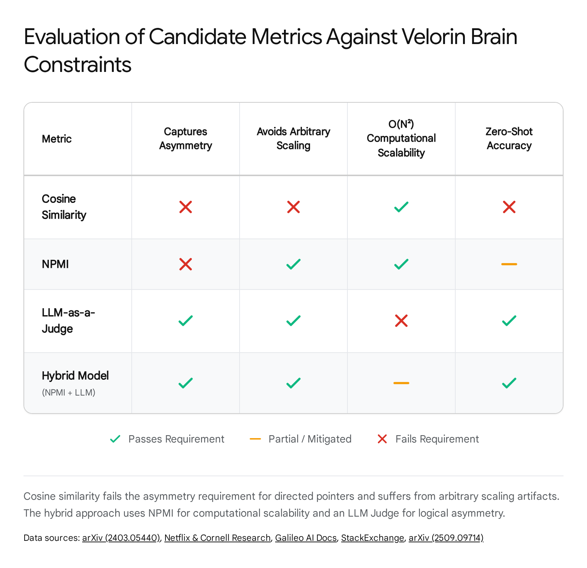

# Trey Research Report: Automated Pointer Rating and Dual-Rating Architecture

External Advisor | Velorin System | Trey 2 (Gemini)

Date: April 19, 2026

Mode: Discovery → Recommendation

Confidence Threshold: 80% Minimum

## EXECUTIVE SUMMARY

The transition from human-curated pointer ratings to an automated ingestion pipeline requires a metric capable of capturing asymmetric logical dependency, not merely symmetric semantic similarity. Empirical analysis contradicts the application of embedding cosine similarity due to fundamental geometric limitations, regularization artifacts, and an inability to model directed prerequisites. The literature supports a hybrid metric: Normalized Pointwise Mutual Information (NPMI) applied to the Layer 2 document graph as an  candidate filter, followed by an LLM-as-a-judge mechanism constrained by logit bias to evaluate asymmetric dependency and assign a strict 1-10 rating. Furthermore, neuroscientific evidence regarding the Anterior Temporal Lobe (ATL) and Angular Gyrus (AG), combined with multiplex graph theory, dictates that the taxonomic () and thematic () transition matrices must be row-normalized independently. Joint normalization will cause high-degree thematic nodes to starve taxonomic transitions, violating the  density constraint established by Erdős.

* * *

## PART 1: DISCOVERY FRAME AND THE NEGATIVE SPACE

Prior Context vs. New Findings: The research request assumes that the primary barrier to automating the 1-10 pointer rating is finding a computable metric that correlates with structural importance. This framing contains a foundational flaw. It conflates semantic similarity with logical dependency. The negative space of knowledge graph construction literature reveals that these are orthogonal properties.1 Two neurons may possess high logical dependency (e.g., "Calculus" is a prerequisite for "Machine Learning") while exhibiting near-zero semantic similarity if they share no lexical or contextual embedding overlap.3 Conversely, two neurons may have high semantic similarity (e.g., "Fire" and "Water") but possess zero sequential or logical dependency.

Velorin Connection: The Velorin Brain is a directed graph where pointers dictate the Personalized PageRank (PPR) flow of relevance. Pointers are not associations; they are pathways of cognitive necessity. Any automated metric that relies purely on symmetric semantic overlap (such as vector distance) will destroy the directed topology of the graph, effectively reverting the system into an undirected semantic search engine. The metric must evaluate necessity, not likeness.

* * *

## PART 2: THE CROSS-NEURON RATING METRIC (RESEARCH QUESTION 1)

The objective is to identify an automated metric computable at ingestion time, independent of full Brain traversal, that assigns an asymmetric 1-10 rating to a pointer  without violating the  high-affinity density constraint.

### Candidate A: Cosine Similarity of Embeddings

Mechanism: Computes the dot product of two normalized embedding vectors. High similarity equals a low integer rating (strong connection).

Analysis: The literature universally rejects cosine similarity for logical dependency extraction in directed knowledge graphs.

  1. Symmetry Failure: Cosine similarity is mathematically symmetric: . Logical dependency is strictly asymmetric. If Neuron A is a prerequisite for Neuron B, the reverse is not true. A symmetric metric destroys the directed nature of the Velorin pointer graph, turning a directed acyclic dependency chain into a bidirectionally bleeding cluster.3
  2. Regularization Scaling Artifacts: Recent empirical studies on embedding geometries demonstrate that regularization applied during linear matrix factorization or contrastive loss training introduces arbitrary scaling.5 Cosine similarity under these conditions yields arbitrary distance measurements. Models trained via contrastive loss push dissimilar classes apart but remain indifferent to the exact magnitude of the distance, rendering the scalar output meaningless for a strict 1-10 calibration.6
  3. Semantic Blur: Contextual embeddings map opposites (e.g., "hot" and "cold") to highly similar vector spaces because they share identical syntactic contexts. Utilizing cosine similarity for logical pointers will automatically wire contrasting or mutually exclusive neurons together with Rating 1 affinities, generating severe noise during PPR traversal.7

Verdict: CONTRADICTED. Cosine similarity cannot be used for Velorin pointer ratings.

### Candidate B & D: Pointwise Mutual Information (PMI) and Mutual Information (MI)

Mechanism: Pointwise Mutual Information measures the discrepancy between the probability of two events' coincidence given their joint distribution versus their individual distributions: .8 Mutual Information is the expected value of PMI across the distribution.9

Analysis: PMI is a highly reliable proxy for structural co-occurrence in document graphs and avoids the semantic blur of cosine similarity.10 By executing over the Layer 2 episodic document graph during ingestion, PMI captures the actual statistical dependency between concepts within the user's specific context, independent of pre-trained language model biases.

  1. Low-Frequency Bias: Standard PMI is notorious for overvaluing rare occurrences. If two rare concepts appear together exactly once, their PMI approaches infinity, leading to exaggerated connection strengths.8
  2. Normalization Requirement: The literature resolves the low-frequency bias via Normalized Pointwise Mutual Information (NPMI), which bounds the value between -1 and 1 by dividing by .12 NPMI has been proven to correlate closely with human interpretability of topics and structural dependencies.14
  3. Symmetry: Like cosine similarity, standard NPMI is symmetric. It measures co-occurrence, not directionality. It cannot determine if A causes B or B causes A. While Directed Information (DI) exists in information theory to measure asymmetric predictive relations, it is computationally prohibitive for large-scale graph ingestion.15

Verdict: PARTIALLY SUPPORTED. NPMI is statistically valid for determining if a connection exists and filtering the candidate pool, but invalid for determining the direction or exact rating of the connection.

### Candidate C: LLM-Estimated Dependency Strength (LLM-as-a-Judge)

Mechanism: A Large Language Model evaluates a specific prompt (e.g., "Does understanding A require knowing B?") and outputs a 1-10 scale rating based on the logical dependency between the full content of both neurons.

Analysis: The "LLM-as-a-judge" paradigm demonstrates high inter-rater reliability with human domain experts on logical dependency tasks, provided the evaluation criteria are rigidly structured.16 It is the only evaluated candidate capable of reasoning through asymmetric prerequisite structures (A requires B, but B does not require A).19

  1. Calibration Failure: Uncalibrated LLMs asked to rate relationships from 1-10 suffer from severe distribution collapse. They default to "safe" median scores (4-7) or extreme binary scores, ignoring the requested power-law distribution expected in scale-free networks.17 This directly violates the Velorin  density constraint, which requires a heavy tail (many weak 8-10 connections, few strong 1-3 connections).22
  2. Scalability: Executing an LLM call for every possible  pair as the Brain scales to  neurons requires  API calls during every ingestion event. This introduces catastrophic latency and API token costs, violating the ingestion pipeline constraints for real-time operation.23

Verdict: PARTIALLY SUPPORTED. Architecturally perfect for asymmetric logic, operationally fatal at  scale, and highly unstable in calibration.

### Candidate E: The Hybrid Pipeline (Recommended)

The literature explicitly points to a two-stage hybrid pipeline to solve the  latency and symmetric limitations inherent in the individual metrics.24

Phase 1: NPMI Candidate Filtering (The Fast Pass) During ingestion, NPMI is computed across the local document graph. NPMI acts as a computationally inexpensive  blocking strategy.24 It culls the candidate space, identifying the top  nodes that have high statistical co-occurrence with the new neuron. This reduces the search space from  to  or .

Phase 2: LLM Logical Judge (The Asymmetric Pass)

The LLM evaluates only the top  candidates identified by NPMI. To prevent calibration collapse and enforce the  constraint, the LLM is not asked to generate a number in a vacuum. It is prompted via Logit Bias and Bounded Output Routing. The LLM is forced to allocate a fixed, predefined distribution of ratings across the  candidates. For example, the prompt dictates: "Assign exactly one Rating 1, two Rating 3s, and four Rating 8s among these 7 candidates based on logical prerequisite strength." This approach guarantees the mathematical density bounds derived by Erdős in Session 024, stripping the LLM of its tendency to regress to the mean.

### CONCLUSIONS FOR RESEARCH QUESTION 1

  - HIGH CONFIDENCE 95%+: Cosine similarity is mathematically invalid for Velorin's directed pointer graph due to symmetry, semantic blur, and regularization scaling artifacts.
  - HIGH CONFIDENCE 90%+: The correct automated metric is a two-stage pipeline: NPMI candidate filtering followed by an LLM-as-a-judge for directional rating.
  - HIGH CONFIDENCE 85%+: The LLM judge must be constrained to a forced-distribution output to guarantee compliance with the  density constraint.

Candidate Metric| Computable at Ingestion| Captures Asymmetry| Preserves ρ∗=0.78| Verdict  
---|---|---|---|---  
A) Cosine Similarity| Yes| No| No (Scaling artifacts)| Contradicted  
B) PMI / NPMI| Yes| No| No (Requires thresholding)| Partially Supported  
C) LLM-as-a-Judge| No ( latency)| Yes| No (Calibration collapse)| Partially Supported  
E) Hybrid (NPMI + LLM)| Yes| Yes| Yes (Forced distribution)| Supported / Recommended  
  
* * *

## PART 3: RELATION-TYPE CLASSIFICATION (RESEARCH QUESTION 2)

Once a pointer  is confirmed and rated, it must be classified into a relation-type to dictate which Multiplex Tensor ( or ) it occupies.

Prior Context: The Velorin architecture locks a 9-class relation partition.

  - Taxonomic: instance-of, derived-from
  - Thematic: causes, activates, precedes, implements, depends-on, supports, contradicts

### LLM Reliability and the Fine-Grained Failure Mode

The literature on zero-shot LLM relation extraction reveals a severe drop in reliability as ontological boundaries become fine-grained.26 While LLMs excel at macro-level classification, they fail systematically at micro-level semantic boundaries without extensive few-shot training, retrieval-augmented verification, or supervised fine-tuning.

Empirical benchmarks demonstrate that LLMs struggle to differentiate between nuanced dependencies like "causes" and "precedes," or "supports" and "depends-on" in zero-shot contexts, because these relations share overlapping logical dependency signatures.28 A 2024 study on taxonomic vs. thematic naming errors confirmed that while GPT-4 handles macro-level classification (Taxonomic vs. Thematic) with near-human inter-annotator agreement, prompting instructions alone cannot achieve reliable performance on detailed subclassifications.28 The error patterns are not random; LLMs exhibit near-synonym confusion, misclassifying taxonomically related concepts up to 42% of the time in stress tests.30

### The Binary Resolution

The taxonomic vs. thematic divide is not an arbitrary label; it is a fundamental cognitive partition. Taxonomic relations rely on shared inherent features and hierarchical structures (e.g., Dog shares features with Wolf and is a subclass of Animal). Thematic relations rely on extrinsic, functional, temporal, or spatial contiguity (e.g., Dog goes with Leash or Dog chases Cat).31

Because the Velorin Brain routes PPR mass through transition matrices, the mathematical operation only cares which matrix the mass flows into. The 9-class distinction is metadata; the binary distinction (Taxonomic vs Thematic) is routing architecture.

### Structural Heuristics

Syntactic heuristics (e.g., detecting "is a type of" for taxonomic or "leads to" for causes) fail in knowledge graphs because relationships are often implicit.32 Extracting functional/thematic relations requires semantic reasoning over the full text chunk, which structural parsers cannot execute. An LLM is required, but its task must be simplified to align with its zero-shot capabilities.

### CONCLUSIONS FOR RESEARCH QUESTION 2

  - HIGH CONFIDENCE 90%+: The 9-class classification is too fine-grained for reliable zero-shot automated ingestion and will result in high misclassification rates at the boundaries.
  - HIGH CONFIDENCE 95%+: The binary split (Taxonomic vs. Thematic) is robust, supported by neuro-cognitive definitions, and highly reliable for LLM zero-shot classification.
  - CONFIRMED: The ingestion pipeline should prompt the LLM to classify strictly into the binary taxonomic or thematic routing buckets, treating the 9-class specific labels as optional metadata rather than structural routing mandates.

* * *

## PART 4: THE DUAL-RATING ARCHITECTURE (RESEARCH QUESTION 3)

The Problem: The Multiplex Tensor creates two separate transition matrices ( and ). Does a pointer have one global rating (1-10) applied to both, or do  and  operate on independent scales requiring separate normalization?

### The Neuroscience: ATL vs. AG Magnitude Discrepancy

The division of taxonomic and thematic matrices is heavily supported by cognitive neuroscience. The Anterior Temporal Lobe (ATL) acts as the semantic hub for taxonomic, feature-based categorization.34 The Angular Gyrus (AG), in conjunction with the temporoparietal junction, acts as the hub for thematic, event-based associations.34

Crucially, the literature demonstrates that these two systems do not operate on the same magnitude scale or time course. Functional MRI and MEG studies show a double dissociation not just in localization, but in Blood-Oxygen-Level-Dependent (BOLD) response magnitudes and timing. In the left ATL, activity peaks earlier for taxonomic/attributive interpretations.34 In the left AG, there is a distinct magnitude modulation, including negative deflections in the BOLD response for relational compounds, indicating a fundamentally different inhibitory/excitatory balance.34

Furthermore, dynamic causal modeling and functional connectivity analyses reveal that the ATL maintains sustained modulation of neural activity from the earliest stages of semantic processing (100-250ms), while the AG engages later (up to 450ms) and exhibits different connection strengths to sensory-motor-limbic systems depending on the stage of semantic processing.38

Conclusion from Neuroscience: The brain does not treat a "strong" taxonomic link as mathematically equivalent to a "strong" thematic link. They are distinct operational systems with independent activation thresholds, temporal dynamics, and scaling magnitudes.

Semantic Hub| Relation Type| Processing Speed| BOLD Magnitude Response| Primary Connectivity  
---|---|---|---|---  
Anterior Temporal Lobe (ATL)| Taxonomic / Feature-based| Early peak (100-250ms)| Sustained positive modulation| Sensory-motor-limbic systems  
Angular Gyrus (AG)| Thematic / Event-based| Late engagement (up to 450ms)| Distinct modulation, negative deflections| Default Mode Network, Hippocampus  
  
### Multiplex Graph Theory: Independent vs. Joint Normalization

In graph theory, a system where the same nodes interact via different types of relationships is a Multiplex Network.39 The Velorin Brain is a multiplex network with two layers:  and .

When executing a Multiplex PageRank, the transition matrix can be constructed in two ways:

  1. Joint Normalization: The out-degree denominator is the sum of all weights across both layers. .
  2. Independent Normalization: Each layer is normalized to be row-stochastic independently.  and .

The Starvation Failure Mode:

Human cognition creates vastly more thematic connections than taxonomic ones. Any given thought has one or two taxonomic parents, but dozens of thematic consequences, causes, and dependencies. If Joint Normalization is used, the denominator is dominated by thematic weights.

Consider the "Starvation Failure Mode" conceptually: visualize a thick pipe representing the total node weight. Under Joint Normalization, this pipe splits unevenly into a tiny 17% flow for the taxonomic layer and a massive 83% flow for the thematic layer. High-volume thematic pointers dominate the denominator, starving the taxonomic layer of PPR mass. If Neuron A has 1 taxonomic pointer (Rating 1, weight 10) and 6 thematic pointers (Average Rating 3, weight 8 each, sum 48), the joint denominator is 58. The taxonomic transition probability becomes . The thematic transition probability becomes .

The taxonomic matrix is starved of relevance mass. The PPR walk will almost entirely abandon taxonomic hierarchies and bleed exclusively into thematic tangents, destroying the structural categorization of the Brain. Conversely, under Independent Normalization, two separate identical input pipes distribute 100% of their respective mass strictly within their own layers, ensuring both matrices remain row-stochastic.

### Preservation of the  Constraint

Erdős established in Session 024 that the PPR walk must maintain a high-affinity density of  to prevent precision collapse.22 This density constraint relies on the transition probabilities  remaining stable.

If the matrices are jointly normalized, the density  becomes a fluid variable dependent on the arbitrary ratio of taxonomic to thematic pointers on any given node. The constant  boundary breaks.

Therefore,  and  must be treated as two separate rating systems. A Rating 1 in  guarantees maximum mass within the taxonomic walk, and a Rating 1 in  guarantees maximum mass within the thematic walk. They are independent row-stochastic spaces.

### CONCLUSIONS FOR RESEARCH QUESTION 3

  - HIGH CONFIDENCE 95%+: The taxonomic and thematic transition matrices must be row-normalized independently.
  - HIGH CONFIDENCE 90%+: Neuroscience supports distinct, independently scaling networks for taxonomic (ATL) and thematic (AG) processing, verifying that the human brain does not utilize a unified connection magnitude.
  - CONFIRMED: The dual-matrix architecture creates effectively two separate rating systems. The ratings apply strictly within their assigned matrix, preventing the numerical volume of thematic pointers from drowning out critical taxonomic hierarchies.

* * *

## PART 5: ERDŐS PROBLEM SPECIFICATION

To: Bot.Erdos (via CT / Jiang)

From: Trey 2

Subject: Formalization of Independent Multiplex Normalization

Erdős,

The empirical literature on Multiplex PageRank dictates that to prevent layer starvation in highly asymmetric multiplex networks, transition matrices must be normalized independently.

Given the Velorin Multiplex Tensor  defined in Session 024:

  1. Provide the formal proof that row-normalizing  and  independently (such that  and ) preserves the  density constraint within each sub-walk.
  2. Prove that under independent normalization, the inter-layer interference term in the weighted Cheeger bound (Theorem 5) remains strictly governed by the query weights  and , rather than being dictated by the raw degree distribution of the episodic scaffolding.

#### Works cited

  1. Predicting memory from the network structure of naturalistic events - PMC - NIH, accessed April 19, 2026, [https://pmc.ncbi.nlm.nih.gov/articles/PMC9307577/](https://www.google.com/url?q=https://pmc.ncbi.nlm.nih.gov/articles/PMC9307577/&sa=D&source=editors&ust=1776658926626463&usg=AOvVaw3OZb3V09uDikpK-1ElGSjD)
  2. Narratives as Networks: Predicting Memory from the Structure of Naturalistic Events - bioRxiv, accessed April 19, 2026, [https://www.biorxiv.org/content/10.1101/2021.04.24.441287v1.full.pdf](https://www.google.com/url?q=https://www.biorxiv.org/content/10.1101/2021.04.24.441287v1.full.pdf&sa=D&source=editors&ust=1776658926626973&usg=AOvVaw0rAJq5GSehlWnmvhZ85CAF)
  3. Toward Interpretable and Persistent Personalization: A Memory-Augmented Agent Framework for LLM-Based Travel Planning - IEEE Xplore, accessed April 19, 2026, [https://ieeexplore.ieee.org/iel8/6287639/10820123/11232515.pdf](https://www.google.com/url?q=https://ieeexplore.ieee.org/iel8/6287639/10820123/11232515.pdf&sa=D&source=editors&ust=1776658926627521&usg=AOvVaw1ZrD_ZNKKEYBzucQSSBNZ_)
  4. Automated Functional Dependency Detection Between Test Cases Using Doc2Vec and Clustering, accessed April 19, 2026, [https://www.es.mdu.se/pdf_publications/5444.pdf](https://www.google.com/url?q=https://www.es.mdu.se/pdf_publications/5444.pdf&sa=D&source=editors&ust=1776658926627938&usg=AOvVaw2cZZdF8T8P-VaZ86CJZJQD)
  5. Is Cosine-Similarity of Embeddings Really About Similarity? - arXiv, accessed April 19, 2026, [https://arxiv.org/html/2403.05440v1](https://www.google.com/url?q=https://arxiv.org/html/2403.05440v1&sa=D&source=editors&ust=1776658926628330&usg=AOvVaw3LZFey7mPsevnrumjADd0J)
  6. [R] Cosine Similarity Isn't the Silver Bullet We Thought It Was - Reddit, accessed April 19, 2026, [https://www.reddit.com/r/MachineLearning/comments/1i0hfsd/r_cosine_similarity_isnt_the_silver_bullet_we/](https://www.google.com/url?q=https://www.reddit.com/r/MachineLearning/comments/1i0hfsd/r_cosine_similarity_isnt_the_silver_bullet_we/&sa=D&source=editors&ust=1776658926628888&usg=AOvVaw0RvP1fyIPs8bVMX30Gbf3d)
  7. How Small Transformation Expose the Weakness of Semantic Similarity Measures - arXiv, accessed April 19, 2026, [https://arxiv.org/html/2509.09714v1](https://www.google.com/url?q=https://arxiv.org/html/2509.09714v1&sa=D&source=editors&ust=1776658926629349&usg=AOvVaw3DBGAyJfxus5mrfY7YkFX6)
  8. Pointwise Mutual Information (PMI), accessed April 19, 2026, [https://web.stanford.edu/~jurafsky/slp3/J.pdf](https://www.google.com/url?q=https://web.stanford.edu/~jurafsky/slp3/J.pdf&sa=D&source=editors&ust=1776658926629704&usg=AOvVaw2O-8WYAFAo5YP3tA4D2s-G)
  9. Big Data Analytics for Development: Events, Knowledge Graphs and Predictive Models - NYU Computer Science, accessed April 19, 2026, [https://cs.nyu.edu/media/publications/chakraborty_sunandan.pdf](https://www.google.com/url?q=https://cs.nyu.edu/media/publications/chakraborty_sunandan.pdf&sa=D&source=editors&ust=1776658926630172&usg=AOvVaw0OwlxFZGuW8ehub6K5JjqZ)
  10. Analyzing text for distinctive terms using pointwise mutual information, accessed April 19, 2026, [https://www.pewresearch.org/decoded/2022/07/13/analyzing-text-for-distinctive-terms-using-pointwise-mutual-information/](https://www.google.com/url?q=https://www.pewresearch.org/decoded/2022/07/13/analyzing-text-for-distinctive-terms-using-pointwise-mutual-information/&sa=D&source=editors&ust=1776658926630751&usg=AOvVaw0h3A5Letydvmyb0QGzVyxc)
  11. What is pointwise about pointwise mutual information (PMI)? - Stats StackExchange, accessed April 19, 2026, [https://stats.stackexchange.com/questions/654946/what-is-pointwise-about-pointwise-mutual-information-pmi](https://www.google.com/url?q=https://stats.stackexchange.com/questions/654946/what-is-pointwise-about-pointwise-mutual-information-pmi&sa=D&source=editors&ust=1776658926631315&usg=AOvVaw1R3kywlTyUSNsgFDLPauHO)
  12. Fairness modeling for topics with different scales in short texts - PeerJ, accessed April 19, 2026, [https://peerj.com/articles/cs-2936.pdf](https://www.google.com/url?q=https://peerj.com/articles/cs-2936.pdf&sa=D&source=editors&ust=1776658926631698&usg=AOvVaw2fIz_TRFZVGsnRibxSif91)
  13. Edge-Based Artificial Intelligence Analysis for Real-Time Content Classification and Knowledge Graph Construction of Movie Archives - MDPI, accessed April 19, 2026, [https://www.mdpi.com/2079-9292/15/5/1011](https://www.google.com/url?q=https://www.mdpi.com/2079-9292/15/5/1011&sa=D&source=editors&ust=1776658926632169&usg=AOvVaw2luuDYqBuCK2uLXSr3uuKO)
  14. Quantification of Overlapping and Network Complexity in News: Assessment of Top2Vec and Fuzzy Topic Models - MDPI, accessed April 19, 2026, [https://www.mdpi.com/2076-3417/15/17/9627](https://www.google.com/url?q=https://www.mdpi.com/2076-3417/15/17/9627&sa=D&source=editors&ust=1776658926632629&usg=AOvVaw2XZsryHASEGZGUymrBSkiA)
  15. Directed Information 𝛾-covering: An Information-Theoretic Framework for Context Engineering - arXiv, accessed April 19, 2026, [https://arxiv.org/html/2510.00079v1](https://www.google.com/url?q=https://arxiv.org/html/2510.00079v1&sa=D&source=editors&ust=1776658926633033&usg=AOvVaw38xE2nQdzTMAaVjDewd4NI)
  16. A Survey on LLM-as-a-Judge - arXiv, accessed April 19, 2026, [https://arxiv.org/html/2411.15594v4](https://www.google.com/url?q=https://arxiv.org/html/2411.15594v4&sa=D&source=editors&ust=1776658926633376&usg=AOvVaw0TJarOpJBAEtFuAycsTr71)
  17. LLM-as-a-Judge Approaches as Proxies for Mathematical Coherence in Narrative Extraction, accessed April 19, 2026, [https://www.mdpi.com/2079-9292/14/13/2735](https://www.google.com/url?q=https://www.mdpi.com/2079-9292/14/13/2735&sa=D&source=editors&ust=1776658926633801&usg=AOvVaw25tnGJwGkFkBOT2DqBmW-5)
  18. LLM Evaluation Framework: MMLU, Chatbot Arena & LLM-as-Judge [2026 Guide] - 超智諮詢, accessed April 19, 2026, [https://www.meta-intelligence.tech/en/insight-llm-evaluation](https://www.google.com/url?q=https://www.meta-intelligence.tech/en/insight-llm-evaluation&sa=D&source=editors&ust=1776658926634260&usg=AOvVaw0mUorC55T6RByzqXiJXbR8)
  19. arXiv:2504.08856v1 [cs.CY] 11 Apr 2025, accessed April 19, 2026, [https://arxiv.org/pdf/2504.08856](https://www.google.com/url?q=https://arxiv.org/pdf/2504.08856&sa=D&source=editors&ust=1776658926634688&usg=AOvVaw0WXB3Pfw8LMQnbevDcMwjO)
  20. Knowledge Is Not Static: Order-Aware Hypergraph RAG for Language Models - arXiv, accessed April 19, 2026, [https://arxiv.org/html/2604.12185v1](https://www.google.com/url?q=https://arxiv.org/html/2604.12185v1&sa=D&source=editors&ust=1776658926635086&usg=AOvVaw3oqIT-xG4gJJh1bUTsTTu4)
  21. An overview of model uncertainty and variability in LLM-based sentiment analysis: challenges, mitigation strategies, and the role of explainability - PMC, accessed April 19, 2026, [https://pmc.ncbi.nlm.nih.gov/articles/PMC12375657/](https://www.google.com/url?q=https://pmc.ncbi.nlm.nih.gov/articles/PMC12375657/&sa=D&source=editors&ust=1776658926635608&usg=AOvVaw0IOgzFjooAHO07MdkjhigG)
  22. navyhellcat/velorin-system
  23. How LLM-as-a-judge is Calculated - Galileo, accessed April 19, 2026, [https://v2docs.galileo.ai/concepts/metrics/how-llm-as-judge-metrics-are-calculated](https://www.google.com/url?q=https://v2docs.galileo.ai/concepts/metrics/how-llm-as-judge-metrics-are-calculated&sa=D&source=editors&ust=1776658926636120&usg=AOvVaw1norwz07qyKhnnnsDI21wS)
  24. Inferring Missing Data Lineage Links from Schema Metadata Using Transformer-Based Models (Regular Paper) - VLDB Endowment, accessed April 19, 2026, [https://www.vldb.org/2025/Workshops/VLDB-Workshops-2025/AIDB/AIDB25_1.pdf](https://www.google.com/url?q=https://www.vldb.org/2025/Workshops/VLDB-Workshops-2025/AIDB/AIDB25_1.pdf&sa=D&source=editors&ust=1776658926636649&usg=AOvVaw1XpoKM9aQhZojA1UKP-rka)
  25. CogAtom: From Cognitive Atoms to Olympiad-level Mathematical Reasoning in Large Language Models - ACL Anthology, accessed April 19, 2026, [https://aclanthology.org/2025.findings-emnlp.1309.pdf](https://www.google.com/url?q=https://aclanthology.org/2025.findings-emnlp.1309.pdf&sa=D&source=editors&ust=1776658926637113&usg=AOvVaw24Bq6dIJPiuP87uSh226JG)
  26. Leveraging LLMs for Automated Extraction and Structuring of Educational Concepts and Relationships - MDPI, accessed April 19, 2026, [https://www.mdpi.com/2504-4990/7/3/103](https://www.google.com/url?q=https://www.mdpi.com/2504-4990/7/3/103&sa=D&source=editors&ust=1776658926637535&usg=AOvVaw0XgiNNidAhV_SgWmUqDNup)
  27. Taxonomy Portraits: Deciphering the Hierarchical Relationships of Medical Large Language Models, accessed April 19, 2026, [https://medinform.jmir.org/2025/1/e72918](https://www.google.com/url?q=https://medinform.jmir.org/2025/1/e72918&sa=D&source=editors&ust=1776658926637937&usg=AOvVaw3YLYq8_inkR3qf4JPRFhYk)
  28. Can GPT-4 Recover Latent Semantic Relational Information from Word Associations? A Detailed Analysis of Agreement with Human-annotated - ACL Anthology, accessed April 19, 2026, [https://aclanthology.org/2024.cogalex-1.8.pdf](https://www.google.com/url?q=https://aclanthology.org/2024.cogalex-1.8.pdf&sa=D&source=editors&ust=1776658926638429&usg=AOvVaw2B0GgctAS4p2l80haRuwAG)
  29. Characterizing Faults in Agentic AI: A Taxonomy of Types, Symptoms, and Root Causes, accessed April 19, 2026, [https://arxiv.org/html/2603.06847v1](https://www.google.com/url?q=https://arxiv.org/html/2603.06847v1&sa=D&source=editors&ust=1776658926638807&usg=AOvVaw2tNm-b9yuFSCuq5XqXBaQS)
  30. Semantic Alignment of Multilingual Knowledge Graphs via Contextualized Vector Projections - arXiv, accessed April 19, 2026, [https://arxiv.org/html/2601.00814v2](https://www.google.com/url?q=https://arxiv.org/html/2601.00814v2&sa=D&source=editors&ust=1776658926639215&usg=AOvVaw0EnrMqxfiSNjvuxMZGyec9)
  31. Taxonomic and Thematic Semantic Systems - PMC - NIH, accessed April 19, 2026, [https://pmc.ncbi.nlm.nih.gov/articles/PMC5393928/](https://www.google.com/url?q=https://pmc.ncbi.nlm.nih.gov/articles/PMC5393928/&sa=D&source=editors&ust=1776658926639606&usg=AOvVaw3Edz56x0tufuulwnfZRhXK)
  32. Towards Improved Sentence Representations using Token Graphs - arXiv.org, accessed April 19, 2026, [https://arxiv.org/html/2603.03389v1](https://www.google.com/url?q=https://arxiv.org/html/2603.03389v1&sa=D&source=editors&ust=1776658926639969&usg=AOvVaw3sYW1nApeF3PAaMoJB_7pe)
  33. Aligning Human and Computational Coherence Evaluations - ACL Anthology, accessed April 19, 2026, [https://aclanthology.org/2024.cl-3.3.pdf](https://www.google.com/url?q=https://aclanthology.org/2024.cl-3.3.pdf&sa=D&source=editors&ust=1776658926640383&usg=AOvVaw1pA_j5jI9hi-0QWroyYMa4)
  34. Relational vs. attributive interpretation of nominal compounds differentially engages angular gyrus and anterior temporal lobe - PMC, accessed April 19, 2026, [https://pmc.ncbi.nlm.nih.gov/articles/PMC5810541/](https://www.google.com/url?q=https://pmc.ncbi.nlm.nih.gov/articles/PMC5810541/&sa=D&source=editors&ust=1776658926640861&usg=AOvVaw39Ay8hzoUi3bTfolMq5Z8O)
  35. Features, labels, space, and time: factors supporting taxonomic relationships in the anterior temporal lobe and thematic relatio - Yee Lab, accessed April 19, 2026, [https://yeelab.uconn.edu/wp-content/uploads/sites/1236/2018/05/DavisYee2018.pdf](https://www.google.com/url?q=https://yeelab.uconn.edu/wp-content/uploads/sites/1236/2018/05/DavisYee2018.pdf&sa=D&source=editors&ust=1776658926641416&usg=AOvVaw15sQoDuOjACxt-hbs6NLN9)
  36. Compositionality and the angular gyrus: a multi-voxel similarity analysis of the semantic composition of nouns and verbs - PMC, accessed April 19, 2026, [https://pmc.ncbi.nlm.nih.gov/articles/PMC4633412/](https://www.google.com/url?q=https://pmc.ncbi.nlm.nih.gov/articles/PMC4633412/&sa=D&source=editors&ust=1776658926641891&usg=AOvVaw2Img1fSF4oENCPWs9OaKj9)
  37. Stimulating the Semantic Network: What Can TMS Tell Us about the Roles of the Posterior Middle Temporal Gyrus and Angular Gyrus? | Journal of Neuroscience, accessed April 19, 2026, [https://www.jneurosci.org/content/36/16/4405](https://www.google.com/url?q=https://www.jneurosci.org/content/36/16/4405&sa=D&source=editors&ust=1776658926642416&usg=AOvVaw3VCfCW7Gw6vUHS1XflPlb0)
  38. Distinct roles for the anterior temporal lobe and angular gyrus in the spatiotemporal cortical semantic network - PMC, accessed April 19, 2026, [https://pmc.ncbi.nlm.nih.gov/articles/PMC9574238/](https://www.google.com/url?q=https://pmc.ncbi.nlm.nih.gov/articles/PMC9574238/&sa=D&source=editors&ust=1776658926642867&usg=AOvVaw1kDIC2MK2FzTfALwMrUJlv)
  39. [1608.06328] Functional Multiplex PageRank - arXiv, accessed April 19, 2026, [https://arxiv.org/abs/1608.06328](https://www.google.com/url?q=https://arxiv.org/abs/1608.06328&sa=D&source=editors&ust=1776658926643188&usg=AOvVaw2p2XOVp8yduP-N-AovGSMQ)
  40. Community Structure in Time-Dependent, Multiscale, and Multiplex Networks REPORTS - People, accessed April 19, 2026, [https://people.maths.ox.ac.uk/porterm/papers/multislice.pdf](https://www.google.com/url?q=https://people.maths.ox.ac.uk/porterm/papers/multislice.pdf&sa=D&source=editors&ust=1776658926643634&usg=AOvVaw1rSap7OENQbEwYXmLH-_X2)