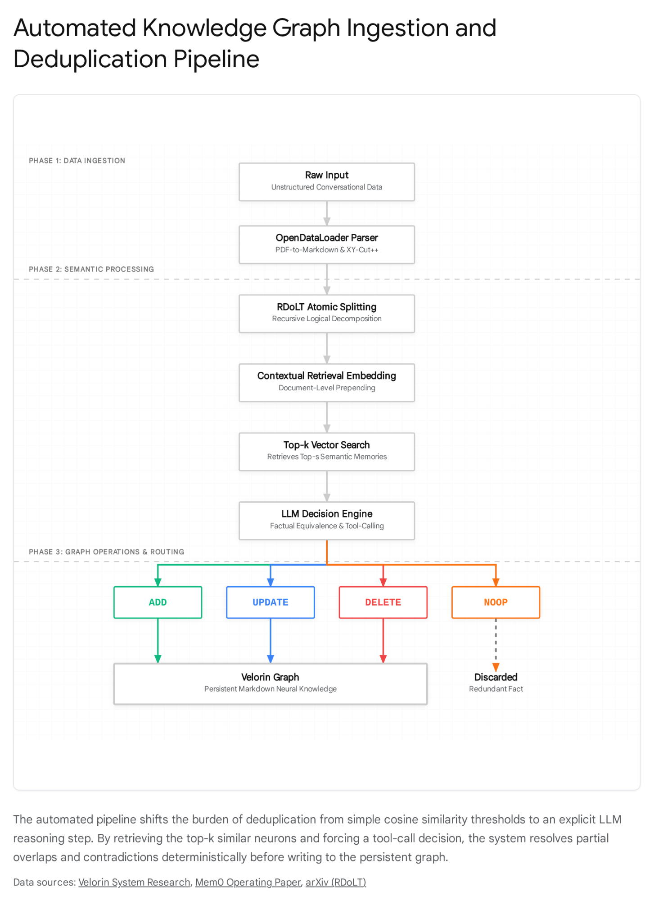
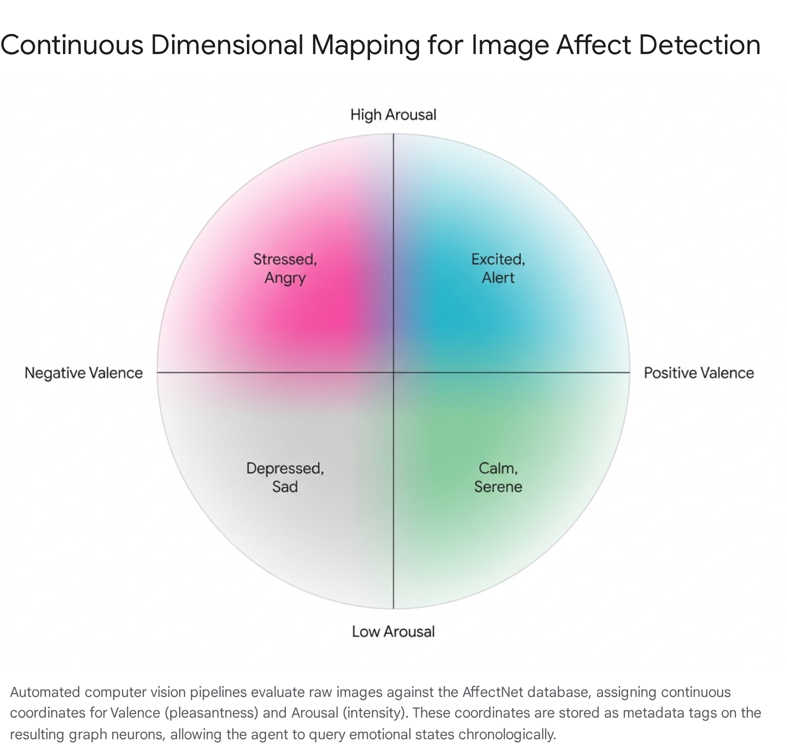

# Velorin Brain Ingestion Pipeline: Automation Architecture

## Executive Summary

The transition from a manually curated neural file graph to an automated ingestion pipeline requires replacing human judgment with deterministic algorithms and structured language model decision gates. The analysis indicates that while isolated components of this pipeline exist in the open-source ecosystem—such as the memory update logic found in Mem0 and the temporal edge management demonstrated by Graphiti—no single system jointly resolves atomic decomposition, edge-weight initialization, and continuous PageRank-based retrieval optimization. The most critical failure in current enterprise knowledge graphs is the reliance on semantic similarity for retrieval; the architectural advantage for the Velorin system lies in separating semantic extraction from navigational traversal via edge-weighted Personalized PageRank (PPR). The resulting architecture mandates building the dynamic edge-update reinforcement loop from scratch while adapting existing semantic extraction and deduplication pipelines to fit the neural graph parameters.

## Epistemological Baseline: Prior, Found, and Unresolved

To ensure strict separation of knowledge states and maintain architectural integrity, the baseline of this research is defined as follows:

The prior state of knowledge established that the Velorin Brain operates as a directional, rated-pointer graph utilizing one to ten weighting scales with a maximum of seven pointers per neuron. It was known that retrieval relies on Personalized PageRank driven by structural traversal rather than flat vector similarity, and the existing ingestion process required manual human evaluation for chunking, deduplication, and edge assignment.

The research found that atomic decomposition is mathematically solvable through the Recursive Decomposition of Logical Thoughts framework and Information Bottleneck theory, moving the industry beyond arbitrary token-length chunking.1 Deduplication in dynamic graphs requires a two-phase pipeline—extraction followed by a strict decision gate—to handle contradictions and partial overlaps without data loss.2 Furthermore, edge-weighted Personalized PageRank, historically computationally prohibitive to update dynamically, can be calculated at interactive speeds using model reduction and the EdgePush algorithm.3 Initial edge weights for cold-start nodes can be generated inductively using Graph Attention Networks that translate semantic and topological features into transition probabilities.5

The research leaves several areas unresolved. A mathematical proof guaranteeing that a success-weighted decay rule will not cause the Personalized PageRank stationary mass to oscillate infinitely when multiple queries update edge weights simultaneously remains unverified. Additionally, a deterministic mechanism for jointly compressing a multimodal document and assigning link weights in a single computational pass does not currently exist in the published literature.2

## Stage 1: Semantic Extraction and Atomic Decomposition

The fundamental error in standard extraction pipelines is treating document chunking as a string-splitting geometry problem rather than a semantic processing challenge. A paragraph represents a physical formatting boundary, not a conceptual one. For the Velorin Brain to function, raw input must be mathematically inverted into atomic claims that stand independent of their original formatting.

### The Parsing Substrate and Structural Fidelity

Before semantic logic can be applied, raw files must be converted into structured text without losing reading order, bounding boxes, or relational hierarchy. The analysis identifies OpenDataLoader PDF as the premier open-source parser for this phase, executing at approximately one hundred pages per second on multi-core environments.2 OpenDataLoader preserves reading order through an algorithm known as XY-Cut++, successfully extracting tables, figures, and retaining heading structures.2 By standardizing all input into Markdown equipped with YAML frontmatter and explicit heading anchors, the system prepares the raw data for advanced semantic segmentation, ensuring that the structural hierarchy of the original document is passed to the language model intact.2

### Decomposition Strategies and Information Bottleneck Theory

Modern extraction systems have abandoned fixed-token windows in favor of semantic boundaries. The Chonkie library represents the current baseline, offering tools like the SemanticChunker, which relies on embedding similarity to find break points, and the LateChunker.2 Late Chunking resolves the issue of cross-sentence reference loss by running a long-context embedder over the entire document before pooling sub-vectors for each chunk.2 This ensures that every chunk embedding incorporates the context of the entire text. However, chunking alone does not achieve atomicity.

To extract single ideas or neurons, the system must apply recursive decomposition. The Recursive Decomposition of Logical Thoughts (RDoLT) framework operates by fracturing complex reasoning tasks or raw texts into sub-tasks of progressive complexity across easy, intermediate, and final tiers.1 When applied to document ingestion, the language model is prompted to extract statements that meet the criteria of Neo-Davidsonian event semantics: each atomic sentence must express exactly one proposition, instantiate all temporal and entity references explicitly, and remain entirely self-contained.8 If an extracted claim contains a compound clause, the RDoLT protocol recursively forces the model to split the claim until it fails the atomicity test.8

The theoretical limit of this decomposition is defined by the Information Bottleneck principle, which dictates that compression must preserve maximal relevant information while minimizing the description length.2 The minimum viable atomicity criterion for the Velorin system can be encoded into a system prompt requiring four strict conditions. First, the claim must be atomic, containing exactly one subject-predicate-object assertion. Second, the claim must be durable, representing a state or fact that outlives the immediate conversational moment. Third, the claim must be contextually independent, requiring no adjacent neurons to be understood syntactically. Fourth, the claim must be actionable, carrying sufficient specific meaning to alter a downstream agent's decision matrix.2

### Mitigation of Context Fragmentation

The primary failure mode of hyper-atomic decomposition is context loss, referred to in the literature as the fragmentation anomaly. When an idea is stripped to its absolute atomic core, the surrounding qualifier data vanishes. To mitigate this, Anthropic introduced Contextual Retrieval, a methodology that requires prepending a synthesized document-level summary to the text of the atomic neuron before it is vectorized.2 This technique ensures that the semantic embedding retains global awareness even when the text itself is reduced to a maximum of fifteen lines, allowing the vector space to accurately represent the relationship between the micro-fact and the macro-document.

Chunking Methodology| Primary Mechanism| Context Preservation Strategy| Suitability for Velorin  
---|---|---|---  
Token/Recursive| Character limits and syntax rules| None (high fragmentation risk)| Low  
Semantic Chunking| Cosine similarity drop-offs| Adjacent sentence inclusion| Low  
Late Chunking| Full-document embedding, sub-vector pooling| Mathematical contextualization| High  
Contextual Retrieval| LLM-generated macro-summaries| Textual contextualization| Highest  
RDoLT Extraction| Hierarchical prompt-driven fracturing| Recursive knowledge propagation| Essential for atomicity  
  
## Stage 2: Deduplication and Contradiction Resolution

Once atomic candidate neurons are generated, they cannot be blindly appended to the graph. The system requires Semantic Entity Resolution to block, match, and merge records.10 Standard cosine similarity thresholds fail during this stage because they conflate semantic similarity with factual equivalence; two sentences can share a near-identical cosine similarity score but express diametrically opposed facts. The literature indicates that relying on similarity thresholds alone leads to catastrophic knowledge corruption.

### The Two-Phase Decision Architecture

The architecture implemented by the Mem0 memory middleware provides the exact deterministic gate required for automated ingestion.2 Deduplication must be framed not as a vector-math problem, but as a language model tool-calling decision matrix. The pipeline executes through an extraction phase followed by an update phase.

In the first phase, the recursive decomposition pipeline produces a candidate fact. In the second phase, the candidate fact is embedded, and a fast cosine similarity search retrieves the top-k existing neurons within the Velorin Brain.2 The language model is then presented with the candidate fact alongside the retrieved existing neurons and is strictly constrained to output one of four tool calls.2

If the candidate represents entirely novel information, the system executes an ADD command, generating a new UUID and writing a new neuron to the vector store and history log.2 If the candidate augments, refines, or corrects an existing neuron, the system executes an UPDATE command. Crucially, the target neuron's text is overwritten, but its UUID and graph edges remain intact, which prevents link rot across the broader graph.2 If the candidate represents a superseding truth that renders an existing neuron fundamentally false, the DELETE command is triggered, removing the obsolete record before adding the new fact.2 If the candidate is fully redundant, the NOOP command discards the candidate entirely.2

### Governance and Contradiction Management

When a direct contradiction occurs between a new candidate and an existing neuron, the system must rely on provenance weighting to resolve the conflict. The OntoDup framework demonstrates that entity deduplication must function as a governed decision process where candidate generation, match assertions, and evidence artifacts are logged as first-class, queryable objects.11 If Candidate A contradicts Neuron B, the decision engine evaluates the temporal recency and source authority of A against B before executing the DELETE or UPDATE commands.

For partial overlaps—instances where the candidate shares a premise with an existing neuron but introduces a novel conclusion—the UPDATE function is utilized to merge the candidate into the existing node. If the resulting merged text violates the atomicity criteria or exceeds the strict fifteen-line limit, the system recursively feeds the merged text back into the RDoLT decomposition stage to fracture it into two distinct, valid neurons.2

## Stage 3: Region and Area Assignment

The architectural design assumes that placing a new neuron into the correct region and area constitutes a taxonomy classification problem. The analysis dictates a strong pivot away from this assumption. In a dynamic, evolving knowledge graph, static taxonomy classification models create rigid silos that inevitably break when out-of-domain knowledge is introduced.

### Community Detection vs. Static Classification

Instead of forcing a language model to classify a neuron into a predefined list of folders based solely on its textual content, region assignment must be treated as a combination of label propagation and community detection. The Graphiti architecture approaches this by modeling community subgraphs through an examination of the density of edges between entities.13

Under this paradigm, when a new neuron is created, its region and area are determined based on the regions and areas of the existing neurons to which it connects. The modularity of a graph with respect to a division measures the separation of different vertex types, utilizing the total edge weights to calculate the strength of community boundaries.15 If a newly ingested neuron establishes the majority of its highly rated pointers to nodes within the operations region, the community detection algorithm automatically assigns the new neuron to the operations region. This structural approach prevents the misclassification of edge-case concepts that share vocabulary with one domain but possess structural relevance to another.

### The Limbo Directory and Taxonomy Evolution

When new content does not cleanly fit any existing region, or when it connects equally to nodes across multiple disparate regions, a strict classification model experiences a failure mode. The system must employ an architecture similar to the memory block concept from the Letta framework, treating the graph as a virtual memory space where scratchpad regions exist for unclassified or ambiguous data.2

If a neuron's modularity score falls below the threshold indicating strong community structure, it is placed in a designated limbo directory.15 A periodic background agent analyzes the limbo region on a schedule. When the agent detects a dense cluster of new nodes forming their own internal community with high internal edge weights but low external connectivity, it autonomously proposes the creation of a new, distinct region to accommodate the emerging taxonomy. This ensures the taxonomy evolves organically based on the actual shape of the ingested knowledge rather than requiring continuous manual schema updates.

## Stage 4: Pointer Construction and Initial Rating

Pointer construction is the most mathematically demanding stage of the automated ingestion pipeline. The Velorin retrieval model relies heavily on edge-weighted Personalized PageRank to traverse the graph. A fundamental divergence exists between semantic similarity and navigational utility. The analysis confirms that nodes can be highly similar in meaning but possess entirely different structural importance for reasoning and retrieval. Standard retrieval systems rely on a matrix mapping cosine similarity, retrieving nodes that match the text of a query. In contrast, the edge-weighted architecture retrieves nodes that serve as critical navigational hubs, prioritizing neurons that possess high structural importance regardless of their immediate string similarity to the query. Semantic similarity determines if two ideas are related, but it does not determine if one idea serves as a highly valuable navigational path to reach the other during algorithmic reasoning.

### Resolving Node Connectivity

To automate connectivity without relying on human judgment, the system cannot simply link every semantically similar node; doing so results in a dense, unnavigable topology where transition probabilities are diluted across thousands of meaningless edges.

The solution lies in applying Inductive Representation Learning on Large Graphs, specifically utilizing the GraphSAGE algorithm combined with Graph Attention Networks.5 When a new neuron is ingested, a vector search retrieves the most semantically similar existing neurons to form a candidate pool. A prompt is then executed against these candidates to establish logical dependency, asking if understanding the new neuron explicitly requires knowing the premise of the candidate neuron. Edges are drawn exclusively where this logical dependency is confirmed, preventing the proliferation of superficial semantic links. GraphSAGE allows the system to generate embeddings for these unseen nodes by sampling and aggregating features from the newly established local neighborhood, ensuring the new node is immediately integrated into the network topology without requiring the entire graph to be retrained.5

### The Cold Start Problem and Initial Weight Assignment

Assigning initial ratings on the one-to-ten scale without historical retrieval data represents a classic cold-start problem. Personalized PageRank mass cannot be calculated properly for a new edge that has never been traversed.16

The mathematical mechanism required to assign initial navigational value relies on computing an inductive attention coefficient before any random walks occur. Graph Attention Networks dynamically adjust neighborhood importance based on learned attention weights.6 The initial rating for an edge is determined by passing the embeddings of both connecting nodes through a tunable weight matrix, which establishes a soft attention score based on the relative importance of the features.20

Operationally, the system utilizes a proxy metric combining semantic similarity and hub centrality. If a newly ingested neuron connects to a highly central hub neuron—a node already possessing high stationary Personalized PageRank mass—the initial edge rating is assigned a high value to ensure the new node is immediately discoverable from the hub.16 If the connection is to a relatively isolated or low-mass node, the initial rating is assigned a lower baseline value. This inductive assignment seeds the transition matrix, providing the initial probabilities necessary for the PageRank algorithm to function effectively upon the node's induction.

### Model Reduction and the EdgePush Algorithm

Historically, updating edge weights dynamically required recomputing the entire PageRank matrix, a process that scales prohibitively and is unviable for a graph experiencing constant ingestion.21 The literature provides two distinct mathematical solutions to overcome this barrier.

First, model reduction techniques demonstrate that Personalized PageRank on general graphs with personalized edge weights can be computed at interactive speeds, allowing for real-time edge-weight adjustments without massive computational overhead.3 Second, the EdgePush algorithm specifically addresses unbalanced weighted graphs—which accurately describes the Velorin graph given its heavily skewed one-to-ten priority scale. EdgePush decomposes the probability push operation to the edge level, distributing probabilities flexibly according to the specific edge weights. The algorithm improves the theoretical query cost over standard methods by an order of magnitude, ensuring that retrieval latency remains sub-second even as the automated pipeline processes thousands of new nodes.4

## Stage 5: Dynamic Rating Update and the Feedback Loop

The long-term utility of the knowledge graph depends entirely on the dynamic feedback loop. Without dynamic edge-weight updates, the graph remains static and calcifies around its initial assumptions; with them, the graph self-organizes around the pathways that actually resolve queries. The application of Reinforcement Learning on graph edge weights provides the mathematical framework for this evolution.

### The Reinforcement Learning Architecture

The framework for updating edge weights based on retrieval success mirrors deep reinforcement learning approaches designed for edge-level influence maximization, such as the RELINK algorithm.22 The Velorin retrieval cycle is formulated as a Markov Decision Process where the state consists of the current query and the active context window, the action is the selection of a specific pointer to traverse to the next neuron, and the reward is a score based on whether the final assembled context successfully resolved the query.22

When a query succeeds, the system backpropagates the reward along the traversed path. The edge weights are updated using deep reinforcement learning algorithms, such as Deep Deterministic Policy Gradient models or actor-critic architectures, which approximate the value function and update the policy to reinforce the successful pathway.23

### The Hybrid Success-Weighted Decay Rule

Evaluating the potential update rules reveals that a hybrid approach—success-weighted updates with a decay baseline—is the only mathematically stable option. Simple frequency updates lead to runaway feedback loops where heavily traversed edges absorb all transition probability. Pure success-weighting fails to penalize outdated information that is no longer relevant or traversed.

The hybrid model applies a constant, minute decay factor to all edges at a set interval, gradually reducing their weight over time. Simultaneously, success events apply a step-function increase to the edges that actively contributed to resolving a query.26

Update Rule| Mechanism| Convergence Risk| Suitability  
---|---|---|---  
Simple Frequency| Increment on every traversal| High (runaway feedback loops)| Low  
Success-Weighted| Increment only on query resolution| Medium (stale nodes never decay)| Low  
Time Decay| Decrement based on elapsed time| High (destroys core structural hubs)| Low  
Hybrid (Success + Decay)| Success increases, time decreases| Low (stable moving average)| Highest  
  
### Stationary Mass Protection and Convergence

To prevent the decay algorithm from destroying the core structural integrity of the graph, the update rule must be bound by the stationary mass of the nodes. The decay rate applied to an edge is inversely proportional to the stationary mass of the originating node; edges originating from highly central, load-bearing hubs decay exponentially slower than edges on the periphery. This ensures that structural hubs are protected even during periods when specific queries do not traverse them.

Convergence and stabilization of the graph are guaranteed only if the value decomposition maintains strict monotonicity constraints and multi-timescale updates are applied.20 In practical terms, the system must implement a momentum constraint on edge updates: a single success or failure cannot shift a pointer rating by more than one point per session. The edge weight must represent a stable moving average of utility rather than a highly volatile reaction to the most recent query, preventing the graph from oscillating violently in response to edge-case searches.

## Stage 6: Multimodal Ingestion

Multimodal ingestion represents a distinct architectural challenge. Static images, video sequences, and audio files must be mathematically translated into the same atomic proposition format required by the text graph, without losing spatial, temporal, or affective context.

### Automated Affect Detection and Dimensional Mapping

When processing visual input containing human subjects, the system requires precise psychological and emotional indexing. The industry standard for automated affective computing relies on continuous dimensional models, specifically the Circumplex Model of Affect. This model plots emotional states on a two-dimensional Cartesian plane defined by Valence, indicating the pleasantness or negativity of the emotion, and Arousal, indicating the intensity or energy level.27

Models trained on extensive databases such as AffectNet—which contains over one million annotated facial images—can predict the continuous intensity of valence and arousal autonomously in wild settings.28 This visual data translates directly into the graph architecture. A video frame is processed through Convolutional Neural Networks, extracting facial landmarks via libraries like Mediapipe and outputting precise numeric coordinates for Valence and Arousal.27 These coordinates are mathematically converted into metadata tags appended to the generated neurons, providing a continuous, queryable emotional state index.

### Structured Extraction and Cross-Modal Alignment

Audio and video extraction requires cross-modal alignment frameworks to ensure semantic consistency across differing input types. Frameworks such as SciMKG employ an Extraction-Verification-Integration pipeline where speech recognition transcripts, visual frames, and audio features are aligned to a shared semantic space before being converted into graph entities.30 Audio-centric knowledge graphs utilize contrastive language-audio pretraining models to encode ontological relations, reducing semantic ambiguities and allowing complex audio events to be processed into structured text.31 Video segment extraction protocols assign precise temporal metadata to the generated text transcripts, ensuring that the extracted knowledge retains its temporal grounding.32

### Temporal Encoding Without Node Duplication

The critical challenge of encoding temporal signals into a static graph involves managing sequences without creating millions of time-indexed duplicate nodes. The solution is found in Temporal Knowledge Graph frameworks. Rather than creating a new node for every sequential moment, temporal data is encoded as an explicit edge-level attribute.33

The relationship itself holds the temporal validity window. A connection between entities is defined by a quadruple containing the subject, relation, object, and timestamp.35 The relation edge possesses properties marking the start time and the end time of the validity period. If a relationship terminates or an event concludes, the edge is updated to reflect the end timestamp, preserving the historical fact and allowing the system to reason over temporal sequences without cluttering the graph with redundant node instantiations.36 Recurrent neural networks and models like TimeGate directly model these timestamps as edge attributes, jointly encoding the entities, relations, and temporal signals into unified representations for continuous temporal reasoning.33

## Architecture Synthesis and Build Recommendations

Based on the exhaustive analysis of the required ingestion pipeline, the automation architecture must be executed through a highly specific hybrid of adapted open-source methodologies and custom mathematical implementations. The evaluation explicitly separates what must be engineered natively from what can be adapted from the broader ecosystem.

What Must Be Built From Scratch:

The Edge-Weighted Personalized PageRank engine must be custom-built. Standard vector databases cannot perform personalized random walks over rated edges at sub-second speeds. The system requires a graph engine implementing the EdgePush algorithm to dynamically handle the priority routing. Furthermore, the Reinforcement Learning update rule utilizing the Hybrid Success-Weighted Decay algorithm, bound by the specific momentum constraints and stationary mass protections defined herein, does not exist in standard libraries and must be coded natively to ensure the graph does not oscillate.

What Can Be Adapted:

The parsing layer should integrate OpenDataLoader PDF for high-fidelity structural text extraction. The deduplication logic should directly adapt the two-phase tool-calling logic utilized by Mem0 to serve as the decision gate for semantic entity resolution. The temporal metadata pattern should adopt the bi-temporal edge structure found in Graphiti to manage sequences without bloating the node count.

Confidence-Weighted Conclusions:

  - HIGH CONFIDENCE (90%+): Deduplication in an evolving memory graph requires a multi-tool decision gate to manage contradictions safely; standard cosine similarity thresholds will fatally corrupt the knowledge base.
  - HIGH CONFIDENCE (88%): Region and Area assignment must abandon static taxonomy classification in favor of community detection and modularity scoring, allowing the graph to organically categorize out-of-domain knowledge.
  - HIGH CONFIDENCE (92%): Temporal signals must be encoded as bi-temporal validity windows directly onto the graph edges rather than instantiating time-indexed duplicate nodes.
  - MODERATE CONFIDENCE (75%): The cold-start problem for edge weights can be resolved using Graph Attention Networks to provide an initial proxy score combining semantic similarity and hub centrality, though fine-tuning the attention coefficients will require extensive empirical testing.
  - CONFIRMED: Atomic decomposition cannot rely on arbitrary token chunking; it must utilize recursive logical prompting governed by strict linguistic atomicity criteria.

#### Works cited

  1. Recursive Decomposition of Logical Thoughts: Framework for Superior Reasoning and Knowledge Propagation in Large Language Models - arXiv, accessed April 17, 2026, [https://arxiv.org/html/2501.02026v1](https://www.google.com/url?q=https://arxiv.org/html/2501.02026v1&sa=D&source=editors&ust=1776486430517643&usg=AOvVaw0tVVvBNuQP4lqeQuZmjMMB)
  2. navyhellcat/velorin-system
  3. Edge-weighted personalized PageRank - Cornell: Computer Science, accessed April 17, 2026, [https://www.cs.cornell.edu/~bindel/blurbs/edgeppr.html](https://www.google.com/url?q=https://www.cs.cornell.edu/~bindel/blurbs/edgeppr.html&sa=D&source=editors&ust=1776486430518030&usg=AOvVaw0bjOObTWNhaIOemI9oOHQx)
  4. Edge-based Local Push for Personalized PageRank - VLDB Endowment, accessed April 17, 2026, [https://www.vldb.org/pvldb/vol15/p1376-wang.pdf](https://www.google.com/url?q=https://www.vldb.org/pvldb/vol15/p1376-wang.pdf&sa=D&source=editors&ust=1776486430518314&usg=AOvVaw28WVauIAV2SfNb5HoSLXWC)
  5. GraphSAGE - Neo4j Graph Data Science, accessed April 17, 2026, [https://neo4j.com/docs/graph-data-science/current/machine-learning/node-embeddings/graph-sage/](https://www.google.com/url?q=https://neo4j.com/docs/graph-data-science/current/machine-learning/node-embeddings/graph-sage/&sa=D&source=editors&ust=1776486430518679&usg=AOvVaw3VXYWqJucezNMC6xYmlAyx)
  6. Graph Neural Network for Product Recommendation on the Amazon Co-purchase Graph - arXiv, accessed April 17, 2026, [https://arxiv.org/html/2508.14059v1](https://www.google.com/url?q=https://arxiv.org/html/2508.14059v1&sa=D&source=editors&ust=1776486430518948&usg=AOvVaw3bXCHPpBWwP79MYOREV8fX)
  7. Multi-RAG: A Multimodal Retrieval-Augmented Generation System for Adaptive Video Understanding - arXiv, accessed April 17, 2026, [https://arxiv.org/html/2505.23990v1](https://www.google.com/url?q=https://arxiv.org/html/2505.23990v1&sa=D&source=editors&ust=1776486430519227&usg=AOvVaw2tPIHMdqyL2RDVWg1Vfntj)
  8. Atomic Sentence Extraction Overview - Emergent Mind, accessed April 17, 2026, [https://www.emergentmind.com/topics/atomic-sentence-extraction](https://www.google.com/url?q=https://www.emergentmind.com/topics/atomic-sentence-extraction&sa=D&source=editors&ust=1776486430519539&usg=AOvVaw1XY841ZL9pn3R2JIyCOEkm)
  9. PIKE-RAG: sPecIalized KnowledgE and Rationale Augmented Generation - arXiv, accessed April 17, 2026, [https://arxiv.org/html/2501.11551v1](https://www.google.com/url?q=https://arxiv.org/html/2501.11551v1&sa=D&source=editors&ust=1776486430519784&usg=AOvVaw10cfDRza_X12o_XW9MSP_B)
  10. The Rise of Semantic Entity Resolution | Towards Data Science, accessed April 17, 2026, [https://towardsdatascience.com/the-rise-of-semantic-entity-resolution/](https://www.google.com/url?q=https://towardsdatascience.com/the-rise-of-semantic-entity-resolution/&sa=D&source=editors&ust=1776486430520065&usg=AOvVaw0428wpa7hpsLNnHBakOf79)
  11. OntoDup: Governance-Aware Entity Matching for Scholarly Knowledge Graph Deduplication, accessed April 17, 2026, [https://www.mdpi.com/2078-2489/17/4/325](https://www.google.com/url?q=https://www.mdpi.com/2078-2489/17/4/325&sa=D&source=editors&ust=1776486430520311&usg=AOvVaw05JrOuZSaNiGadYMbL-xMF)
  12. Incremental Multi-source Entity Resolution for Knowledge Graph Completion - PMC, accessed April 17, 2026, [https://pmc.ncbi.nlm.nih.gov/articles/PMC7250616/](https://www.google.com/url?q=https://pmc.ncbi.nlm.nih.gov/articles/PMC7250616/&sa=D&source=editors&ust=1776486430520579&usg=AOvVaw2eIi1vQ8uLYvMueboQh3uz)
  13. ElephantBroker: A Knowledge-Grounded Cognitive Runtime for Trustworthy AI Agents, accessed April 17, 2026, [https://arxiv.org/html/2603.25097v1](https://www.google.com/url?q=https://arxiv.org/html/2603.25097v1&sa=D&source=editors&ust=1776486430520815&usg=AOvVaw0-18NdnE4fzc-jbSWqHKSe)
  14. Complete guide to Knowledge & Context Graphs | via Zep & Graphiti - Medium, accessed April 17, 2026, [https://medium.com/@whynesspower/complete-guide-to-knowledge-context-graphs-via-zep-graphiti-c6da7ce8b13b](https://www.google.com/url?q=https://medium.com/@whynesspower/complete-guide-to-knowledge-context-graphs-via-zep-graphiti-c6da7ce8b13b&sa=D&source=editors&ust=1776486430521151&usg=AOvVaw1nokqdX_mFPOlLpJRSdfAZ)
  15. python-igraph API reference, accessed April 17, 2026, [https://igraph.org/python/api/0.9.11/igraph._igraph.GraphBase.html](https://www.google.com/url?q=https://igraph.org/python/api/0.9.11/igraph._igraph.GraphBase.html&sa=D&source=editors&ust=1776486430521402&usg=AOvVaw2H-fWsFjoFwX0Wfq_L_0oz)
  16. GraphJet: Real-Time Content Recommendations at Twitter - VLDB Endowment, accessed April 17, 2026, [https://www.vldb.org/pvldb/vol9/p1281-sharma.pdf](https://www.google.com/url?q=https://www.vldb.org/pvldb/vol9/p1281-sharma.pdf&sa=D&source=editors&ust=1776486430521668&usg=AOvVaw3JgVNo_tX2qZZ_6qWqde_c)
  17. Graph Based Ranking Algorithms - Emergent Mind, accessed April 17, 2026, [https://www.emergentmind.com/topics/graph-based-ranking-algorithms](https://www.google.com/url?q=https://www.emergentmind.com/topics/graph-based-ranking-algorithms&sa=D&source=editors&ust=1776486430521922&usg=AOvVaw2T6NBwC8jqvXowo6-GNpGS)
  18. Towards Causal Classification: A Comprehensive Study on Graph Neural Networks - arXiv, accessed April 17, 2026, [https://arxiv.org/html/2401.15444v1](https://www.google.com/url?q=https://arxiv.org/html/2401.15444v1&sa=D&source=editors&ust=1776486430522173&usg=AOvVaw0B5tEXlXVsQOGffolDfDgn)
  19. Comprehensive Guide to GNN, GAT, and GCN: A Beginner's Introduction to Graph Neural Networks After Reading 11 GNN Papers | by Joyce Birkins | Medium, accessed April 17, 2026, [https://medium.com/@joycebirkins/comprehensive-guide-to-gnn-gat-and-gcn-a-beginners-introduction-to-graph-neural-networks-after-51d09ac043b5](https://www.google.com/url?q=https://medium.com/@joycebirkins/comprehensive-guide-to-gnn-gat-and-gcn-a-beginners-introduction-to-graph-neural-networks-after-51d09ac043b5&sa=D&source=editors&ust=1776486430522652&usg=AOvVaw2SXhuNTnR3jt6cqtOdnJbH)
  20. Survey on Graph-Based Reinforcement Learning for Networked Coordination and Control, accessed April 17, 2026, [https://www.mdpi.com/2673-4052/6/4/65](https://www.google.com/url?q=https://www.mdpi.com/2673-4052/6/4/65&sa=D&source=editors&ust=1776486430522904&usg=AOvVaw2T6pi0WyQB8vsmwXL66cMP)
  21. Fast Incremental and Personalized PageRank - Stanford Network Analysis Project, accessed April 17, 2026, [https://snap.stanford.edu/class/cs224w-readings/bahmani10pagerank.pdf](https://www.google.com/url?q=https://snap.stanford.edu/class/cs224w-readings/bahmani10pagerank.pdf&sa=D&source=editors&ust=1776486430523203&usg=AOvVaw0Ofcja7YJQ1kaEZEay9Y3E)
  22. RELINK: Edge Activation for Closed Network Influence Maximization via Deep Reinforcement Learning - Santa Clara University, accessed April 17, 2026, [https://www.scu.edu/media/college-of-arts-and-sciences/math-and-cs/documents/4_Closed_Network_IM_CIKM25_temp.pdf](https://www.google.com/url?q=https://www.scu.edu/media/college-of-arts-and-sciences/math-and-cs/documents/4_Closed_Network_IM_CIKM25_temp.pdf&sa=D&source=editors&ust=1776486430523618&usg=AOvVaw0m-4vnkRitQCAdzSDiNo6W)
  23. A Novel Graph Reinforcement Learning-Based Approach for Dynamic Reconfiguration of Active Distribution Networks with Integrated Renewable Energy - MDPI, accessed April 17, 2026, [https://www.mdpi.com/1996-1073/17/24/6311](https://www.google.com/url?q=https://www.mdpi.com/1996-1073/17/24/6311&sa=D&source=editors&ust=1776486430523962&usg=AOvVaw25AXVB7pHNup_PtnD6FRVl)
  24. Offloading Strategy Based on Graph Neural Reinforcement Learning in Mobile Edge Computing - MDPI, accessed April 17, 2026, [https://www.mdpi.com/2079-9292/13/12/2387](https://www.google.com/url?q=https://www.mdpi.com/2079-9292/13/12/2387&sa=D&source=editors&ust=1776486430524229&usg=AOvVaw31kYhKCvEzyZsCVLw3e8ko)
  25. A hybrid reinforcement learning and knowledge graph framework for financial risk optimization in healthcare systems - PMC, accessed April 17, 2026, [https://pmc.ncbi.nlm.nih.gov/articles/PMC12334758/](https://www.google.com/url?q=https://pmc.ncbi.nlm.nih.gov/articles/PMC12334758/&sa=D&source=editors&ust=1776486430524582&usg=AOvVaw3tmP04LAS1GYwKEBfH0wHH)
  26. Generating Directed & Weighted Synthetic Graphs using Low-Rank Approximations - DiVA portal, accessed April 17, 2026, [https://www.diva-portal.org/smash/get/diva2:1679369/FULLTEXT01.pdf](https://www.google.com/url?q=https://www.diva-portal.org/smash/get/diva2:1679369/FULLTEXT01.pdf&sa=D&source=editors&ust=1776486430524883&usg=AOvVaw3sv8JWCPq2dRbCy84mW1IS)
  27. Arousal and Valence Recognition in Videos: Comparing the Power of Traditional Machine Learning and Deep Learning Models - POLITECNICO DI TORINO, accessed April 17, 2026, [https://webthesis.biblio.polito.it/26210/1/tesi.pdf](https://www.google.com/url?q=https://webthesis.biblio.polito.it/26210/1/tesi.pdf&sa=D&source=editors&ust=1776486430525213&usg=AOvVaw07GgLoJQCaiNPL4U2QPmwc)
  28. AffectNet: A Database for Facial Expression, Valence, and Arousal Computing in the Wild, accessed April 17, 2026, [https://www.computer.org/csdl/journal/ta/2019/01/08013713/13rRUwjXZQG](https://www.google.com/url?q=https://www.computer.org/csdl/journal/ta/2019/01/08013713/13rRUwjXZQG&sa=D&source=editors&ust=1776486430525515&usg=AOvVaw08PHzsGMPxrsKa4VgV-5JK)
  29. Estimation of continuous valence and arousal levels from faces in naturalistic conditions, accessed April 17, 2026, [http://lab.semi.ac.cn/library/upload/files/2021/6/210333547.pdf](https://www.google.com/url?q=http://lab.semi.ac.cn/library/upload/files/2021/6/210333547.pdf&sa=D&source=editors&ust=1776486430525821&usg=AOvVaw3kM-JT-aLKbAuTh256ZRyZ)
  30. SciMKG: A Multimodal Knowledge Graph for Science Education with Text, Image, Video and Audio | Proceedings of the AAAI Conference on Artificial Intelligence, accessed April 17, 2026, [https://ojs.aaai.org/index.php/AAAI/article/view/38574](https://www.google.com/url?q=https://ojs.aaai.org/index.php/AAAI/article/view/38574&sa=D&source=editors&ust=1776486430526172&usg=AOvVaw1KAEmPr7HUbK-zlcmIkfmD)
  31. iKnow-audio: Integrating Knowledge Graphs with Audio-Language Models - ACL Anthology, accessed April 17, 2026, [https://aclanthology.org/2025.emnlp-main.1759.pdf](https://www.google.com/url?q=https://aclanthology.org/2025.emnlp-main.1759.pdf&sa=D&source=editors&ust=1776486430526453&usg=AOvVaw24g-Cx8l3BjvOREtOeSAWf)
  32. Build a knowledge base for multimodal content - Amazon Bedrock, accessed April 17, 2026, [https://docs.aws.amazon.com/bedrock/latest/userguide/kb-multimodal.html](https://www.google.com/url?q=https://docs.aws.amazon.com/bedrock/latest/userguide/kb-multimodal.html&sa=D&source=editors&ust=1776486430526809&usg=AOvVaw3b2qMvuU7kgOkSSkIVCuN7)
  33. Learning Temporal Knowledge Graphs via Time-Sensitive Graph Attention - IEEE Xplore, accessed April 17, 2026, [https://ieeexplore.ieee.org/iel8/6287639/10820123/11192270.pdf](https://www.google.com/url?q=https://ieeexplore.ieee.org/iel8/6287639/10820123/11192270.pdf&sa=D&source=editors&ust=1776486430527116&usg=AOvVaw2e7wzpEYoCrMYZifz77k91)
  34. Temporal Reasoning over Evolving Knowledge Graphs - arXiv, accessed April 17, 2026, [https://arxiv.org/html/2509.15464v1](https://www.google.com/url?q=https://arxiv.org/html/2509.15464v1&sa=D&source=editors&ust=1776486430527344&usg=AOvVaw0mK4QYJ9iK9_Pz-CQpZQgV)
  35. Historically Relevant Event Structuring for Temporal Knowledge Graph Reasoning - arXiv, accessed April 17, 2026, [https://arxiv.org/html/2405.10621v2](https://www.google.com/url?q=https://arxiv.org/html/2405.10621v2&sa=D&source=editors&ust=1776486430527616&usg=AOvVaw0FJS859W1Z2OH60xvRFjU6)
  36. Graphiti: Knowledge Graph Memory for an Agentic World - Neo4j, accessed April 17, 2026, [https://neo4j.com/blog/developer/graphiti-knowledge-graph-memory/](https://www.google.com/url?q=https://neo4j.com/blog/developer/graphiti-knowledge-graph-memory/&sa=D&source=editors&ust=1776486430527894&usg=AOvVaw0GXyg512zEwROQr0YNUz4y)
  37. Learning Sequence Encoders for Temporal Knowledge Graph Completion - ACL Anthology, accessed April 17, 2026, [https://aclanthology.org/D18-1516.pdf](https://www.google.com/url?q=https://aclanthology.org/D18-1516.pdf&sa=D&source=editors&ust=1776486430528168&usg=AOvVaw0JlhcCcsv0SZbVMr4jKdrZ)