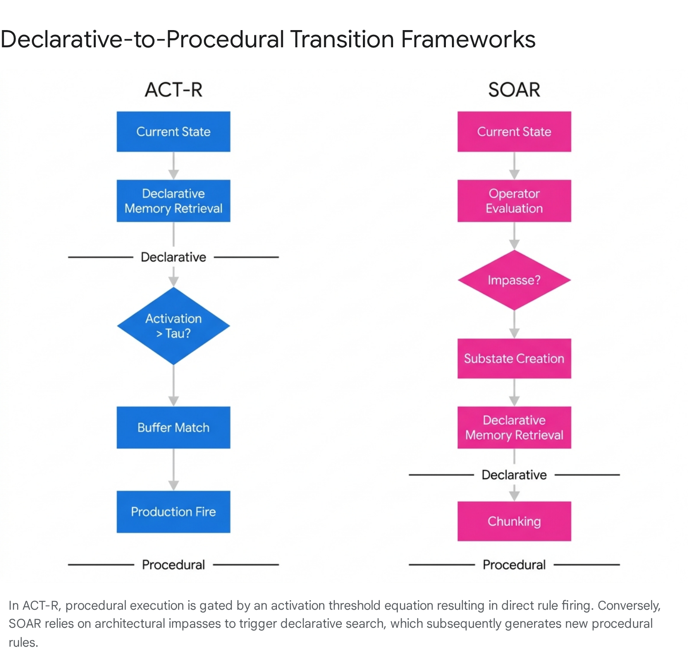
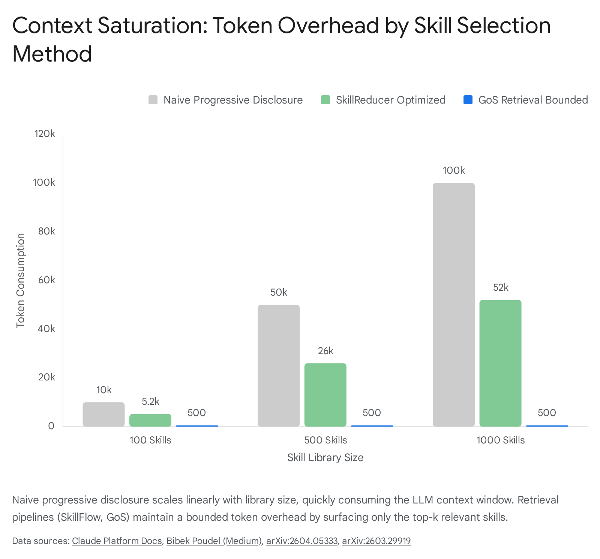

# Research Report: Brain-to-Skills Activation Interface

## Executive Summary

The integration of declarative memory retrieval with procedural skill activation is a solved problem in biological systems but remains a structural bottleneck in large language model architectures. The analysis indicates that pure agent-mediated skill selection fails at scale due to context saturation and token degradation, while rigid explicit coupling breaks under environmental variability. The optimal architecture, confirmed by recent graph-of-skills research, is a hybrid: offline structural mapping of skill dependencies queried at runtime via reverse-weighted Personalized PageRank (PPR), supplying a bounded, dependency-complete context bundle to the reasoning agent. Biologically, this maps precisely to the anterior temporal lobe (ATL) semantic hub projecting to the basal ganglia, where striatal activation disinhibits the thalamus only when specific contextual thresholds are met.

## 1\. Retrieval-to-Action Bridges in Existing Systems

The analysis of contemporary memory and agent architectures reveals a strict dichotomy between systems that manage context and systems that execute actions. The field has only recently begun to merge these modalities via structural graph retrieval methodologies, moving away from flat vector similarity.

### 1.1 Letta (formerly MemGPT) and the Operating System Paradigm

Letta operates on a strict operating-system paradigm, treating the large language model's context window as physical RAM and external storage databases as secondary disk storage.1 The transition from memory retrieval to function call execution within Letta is entirely agent-mediated, placing the burden of execution directly on the model's stochastic token generation.4

Letta agents possess pre-loaded memory management tools, specifically APIs like archival_memory_search and core_memory_append. The language model generates a structured JSON output specifying the tool and arguments based on its current context.5 There is no explicit, deterministic mapping between a retrieved memory and a subsequent tool execution. The agent must independently reason through a sequence: it must retrieve a memory, parse the returned context, evaluate its current objectives, and independently generate a secondary tool call to execute a procedural action.6 This places the entire cognitive load on the language model's in-context learning capabilities. If the retrieved memory does not strongly prime the agent to select a specific action, the connection fails, leading to execution drift.

### 1.2 Mem0 and the Middleware Extraction Pipeline

Mem0 functions as a memory middleware layer rather than an agent runtime environment. It abstracts memory operations away from the agent loop by utilizing an independent two-phase pipeline consisting of extraction and retrieval.7 During the extraction phase, an evaluator model assesses conversational input against existing context to extract atomic, add-only facts.9 This prevents the destructive overwriting of historical context, preserving a temporal log of user preferences and states.

When a query is issued, Mem0 employs a multi-signal retrieval process that scores candidates across three parallel signals: semantic vector search, BM25 keyword matching, and graph traversal in its Mem0g configuration.4 However, Mem0 stops at context provision. It does not trigger external tools or executable routines. If an orchestration framework uses Mem0, it must call Mem0's search API, ingest the returned text into its system prompt, and then independently calculate whether to fire a separate operational tool.9 The bridge remains strictly sequential and manual, offering no automated progression from declarative recall to procedural execution.

### 1.3 GraphRAG, HippoRAG, and Context Synthesis

Both GraphRAG and HippoRAG operate as information synthesis frameworks, distinctly separated from action-execution frameworks. HippoRAG, in particular, extracts OpenIE triplets from raw documents to form a schemaless knowledge graph. At query time, semantic vectors map the incoming query to specific graph nodes. The system then applies the Personalized PageRank algorithm to propagate activation mass across the graph, theoretically simulating the human hippocampal index.11

The fundamental limitation for Velorin is the action boundary. HippoRAG returns synthesized documents and text snippets, not executable routines.11 The system contains no computational mechanism for determining if a retrieved node represents a procedural skill or a passive fact. It functions as a read-only architecture designed to maximize information density for question-answering tasks, lacking the infrastructure to bind a retrieved graph node to a local executable script or API call.

### 1.4 Graph of Skills (GoS) and Reverse-Weighted PPR

The specific capability required for Velorin—using Personalized PageRank to select and trigger executable skills—is formalized in the April 2026 research paper Graph of Skills: Dependency-Aware Structural Retrieval for Massive Agent Skills (arXiv:2604.05333).14 This framework represents a critical divergence from standard retrieval-augmented generation.

GoS constructs a directed multi-relational graph over local skill packages. Within this topology, the nodes are executable skills, and the edges encode prerequisite requirements and workflow structures.14 At query time, GoS identifies a localized seed set of skills via standard lexical and semantic search. It then executes a reverse-weighted Personalized PageRank calculation.14 Probability mass flows backward along the dependency edges rather than forward.

This reverse flow is mathematically vital. Executing a target procedural skill frequently requires satisfying preliminary state requirements—such as authenticating a token, establishing a database connection, or formatting a payload. Standard Personalized PageRank flows forward, from causes to effects. Reverse Personalized PageRank flows from the desired terminal effect back to the necessary prerequisites, mathematically guaranteeing that the retrieved bundle of skills is dependency-complete for the executing agent.16

Framework| Primary Function| Retrieval Mechanism| Action Trigger Mechanism| Dependency Awareness  
---|---|---|---|---  
Letta| OS-style memory management| Agent-driven tool calls| LLM stochastic token generation| None (Agent must infer)  
Mem0| Middleware fact extraction| Hybrid (Semantic + Graph)| None (Returns context only)| None  
HippoRAG| Knowledge synthesis| Forward PPR on OpenIE graph| None (Returns context only)| Semantic only  
GoS| Procedural execution| Reverse-weighted PPR| Bounded context hydration| Explicit structural edges  
  
For the Velorin architecture, the implications are direct. The Velorin Brain's use of Personalized PageRank aligns structurally with the Graph of Skills methodology. When a Velorin traversal surfaces a procedure-type neuron, standard forward traversal will map the subsequent outcomes of that procedure. To activate the SKILL.md infrastructure effectively, the traversal must implement reverse-weighted calculations along dependency edges to extract the exact skill hierarchy required to execute the procedure, smoothly transitioning from declarative search to procedural compilation.

## 2\. Declarative→Procedural Handoff in Cognitive Architectures

Classical cognitive architectures resolve the declarative-to-procedural transition via formal mathematical rulesets, deliberately eschewing the stochastic token-prediction mechanisms that introduce hallucination and drift in modern language models.

### 2.1 ACT-R Formal Mechanisms and Activation Thresholds

The Adaptive Control of Thought—Rational (ACT-R) architecture enforces a strict functional division: declarative memory holds facts, represented as vector-like chunks, while procedural memory holds condition-action rules, represented as productions.18

The transition between these two states is governed by rigorous sub-symbolic equations. A declarative chunk is only retrieved and placed into a working buffer if its total activation ($A\_i$) exceeds a hard architectural retrieval threshold ($\tau$).20 The activation calculation incorporates both the historical utility of the memory and the current environmental context: $A\_i = B\_i + \sum W\_j S\_{ji}$ Where $B\_i$ represents the base-level activation driven by recency and frequency of use, $W\_j$ is the attentional weight of the current context element $j$, and $S\_{ji}$ represents the associative strength between the context and the specific chunk.21

Production rules in ACT-R do not passively read the entire memory database. A production rule fires only if its left-hand side—the conditional IF statement—perfectly matches the contents of the active buffers, which currently hold the retrieved declarative chunk.18 Furthermore, when a declarative chunk is repeatedly retrieved to satisfy a specific procedural rule, ACT-R initiates a process called production compilation. This mechanism merges the declarative fact and the procedural action into a single new production rule, effectively hardcoding the knowledge and eliminating the costly retrieval step in all future iterations.25

### 2.2 SOAR Impasse Resolution and Substate Creation

The SOAR cognitive architecture manages procedural handoffs through a concept known as conflict resolution and impasse handling. During its standard decision cycle, SOAR evaluates the current state and attempts to select an operator to apply.

When the decision procedure evaluates the state and finds no applicable operator, multiple equally weighted operators resulting in a tie, or conflicting operators that reject one another, it triggers an architectural event known as an impasse.26 The impasse forces the system to halt its primary progression and create a substate. Within this substate, SOAR executes a targeted search of its declarative memory—both semantic and episodic—to locate knowledge that can discriminate between the tied operators or suggest a novel pathway.28 Once the declarative search yields information that successfully resolves the substate, SOAR utilizes a "chunking" mechanism to compile the reasoning path into a new, permanent procedural rule, bypassing the impasse entirely in future identical states.30

### 2.3 Implementations at Scale and the Utility Problem

Scaling architectures like ACT-R and SOAR exposes a fundamental vulnerability known in the literature as the utility problem. As the system learns and compiles thousands of new production rules, the computational cost of matching every rule's conditional requirements against the current declarative state grows exponentially, eventually degrading system performance to the point of failure.32

Modern implementations bypass this bottleneck by integrating vector-symbolic architectures, such as Holographic Declarative Memory (HDM). These systems approximate chunk similarity mathematically without requiring discrete, programmatic slot matching, allowing the architecture to maintain continuous performance regardless of the volume of stored facts.33

Velorin's SKILL.md triggers, operating on "Use when [condition]" syntax, are structurally identical to ACT-R's left-hand production conditions. The ACT-R architecture demonstrates that agent-mediated execution relies inextricably on an activation threshold. A skill should not fire simply because its text is semantically related to a query; it must fire because the declarative context—the specific localized neurons retrieved by the graph walk—pushes the skill's calculated utility score above a definitive threshold, matching the logic of the $\tau$ parameter.

## 3\. Explicit Coupling vs. Agent-Mediated Activation

The debate between explicit tool binding (Option A) and agent-mediated semantic matching (Option B) dictates the fundamental reliability, latency, and scalability of the entire operating system. Both extremes present critical failure modes when deployed in production environments.

### 3.1 Option A: Explicit Tool Coupling

Explicit coupling enforces a strict topological transition. When a specific state or node is reached within the graph, a designated tool or skill is invoked automatically via a hardcoded pointer.

The primary advantage of this approach is absolute reliability. It guarantees deterministic execution, bypassing the language model's stochastic reasoning layer entirely. This eliminates the risk of hallucinated tool names, malformed JSON payloads, or omitted critical parameters that frequently plague generative models.34

However, the scalability limitations are severe. Explicit coupling is highly brittle and breaks under environmental variability or when API endpoints update—a phenomenon referred to in reliability engineering as the "great re-indexing" problem.36 If a procedure neuron points directly to a hardcoded script that is subsequently deprecated or moved, the retrieval fails silently, and the agent has no alternative pathway to complete the task.

### 3.2 Option B: Agent-Mediated Selection

Agent-mediated activation relies on the concept of progressive disclosure, where metadata headers are loaded into the language model's context window, and the system trusts the model to select the appropriate tool based on inferred intent.37

This approach provides immense adaptability. It is highly resilient to environmental changes, as the agent can synthesize partial data, request missing parameters from the user, and route around failed APIs dynamically.39

The failure modes emerge as the library of available skills scales. This approach suffers rapidly from "context rot" and attention dilution.41 Furthermore, agents operating under this paradigm exhibit a behavioral defect defined in Velorin architecture as "Window Gravity"—an optimization bias where the model attempts to solve a problem using only the immediate conversational context rather than invoking the correct external skill. This occurs because the Reinforcement Learning from Human Feedback (RLHF) training gradient inherently rewards self-contained, immediate answers over complex, multi-step external tool chains.43

### 3.3 The Hybrid Synthesis: Bounded Mediation

The empirical literature confirms that neither extreme succeeds at scale. The state-of-the-art methodology employs a hybrid constraint.35 A structural graph, similar to Graph of Skills or ANX Standard Operating Procedures, explicitly defines the dependency relationships between tools (Option A) to construct a localized, high-probability candidate set. This bounded subset is then loaded into the language model's context (Option B), restricting the agent's mediation to a highly concentrated decision space.14

If a Velorin procedure neuron contains a hardcoded pointer directly to SKILL.md, the system becomes brittle. Conversely, if the system relies entirely on the agent reading thousands of skill headers to find the right trigger, it initiates context rot. Velorin must utilize the neuron pointers to compute a localized subset of mathematically relevant skills via Personalized PageRank, extract only those specific SKILL.md headers, and allow the agent to mediate the final parameter execution within that constrained boundary.

## 4\. Token Economics of Skill Header Loading

The prevailing community standard of progressive disclosure—loading only metadata headers initially and fetching full instruction bodies on demand—delays context saturation but does not eliminate the mathematical breaking point of large-scale agent libraries.

### 4.1 The Limits of Progressive Disclosure

At an average of approximately 100 tokens per metadata header, an agent library containing 1,000 skills consumes 100,000 tokens before a single operational instruction is passed to the reasoning engine.37

Anthropic explicitly warns against this architecture in production, noting that injecting 50 or more Model Context Protocol (MCP) server schemas can consume between 77K and 134K tokens. This massive overhead leaves negligible context available for actual reasoning, sharply increasing the probability of incorrect parameter generation and attention dilution.51 The API constraints themselves enforce this ceiling; Anthropic's native Skills API imposes a hard limit of 8 skills per request, acknowledging the severe degradation that occurs when models are overloaded with procedural options.52

### 4.2 State of the Art: Retrieval-Based Skill Selection

To bypass the limitations of progressive disclosure, leading research in March and April 2026 shifted toward retrieval-based architectures, specifically the SkillFlow and SkillReducer frameworks (arXiv:2504.06188, arXiv:2603.29919).

An empirical audit of 55,315 publicly available skills by the SkillReducer authors revealed massive systemic inefficiencies: 26.4% of skills lack routing descriptions entirely, and over 60% of skill body content is non-actionable boilerplate.53 The data indicates that naive pre-loading of these libraries is both financially and computationally destructive.

The SkillFlow pipeline addresses library scaling by framing skill selection purely as an information retrieval problem rather than a context management problem. It utilizes a four-stage pipeline: dense bi-encoder retrieval, followed by shallow cross-encoder reranking, then deep cross-encoder reranking, and finally LLM-based selection. This pipeline outputs a maximum of 5 bounded skills regardless of the total library size.54

The token economics of this approach are highly favorable. Optimizing skill payloads through retrieval and compression reduces input tokens by 37.8% to 39% while simultaneously improving functional execution quality by 2.8% due to the removal of distractor context and conflicting instructions.16

Velorin cannot load the entire Skills Registry header list into Alexander or Jiang's context on boot. The token burn will force premature compaction and degrade reasoning quality. Velorin must implement a structural retrieval layer that extracts only the 3-5 mathematically relevant SKILL.md headers based on the active nodes in the current Brain region traversal.

## 5\. Graph-Based Skill Routing and Neuroscience Grounding

The mathematical operation of routing from declarative memory to procedural action possesses a direct, structurally identical biological analogue, validating the necessity of the Personalized PageRank approach over flat vector retrieval.

### 5.1 Graph Traversal for Skill Execution

As previously established, the Graph of Skills (GoS) architecture proves that graph traversal can successfully route to executable routines.14 The topology of these graphs explicitly encodes procedural paths. Dependency edges ($v\_i \rightarrow v\_j$) dictate that skill $v\_i$ outputs the exact artifacts consumed by skill $v\_j$.16

When a user query targets a terminal skill or outcome, the reverse-PPR walk accumulates probability mass on all prerequisite nodes upstream of the target. The retrieval algorithm extracts this contiguous chain of dependencies, allowing the language model to execute a logically sound procedural sequence rather than a single isolated action that would fail due to missing state variables.14

### 5.2 Biological Trigger: ATL to Basal Ganglia Handoff

In the mammalian brain, semantic facts and procedural actions are physically separated into distinct systems, providing a blueprint for AI architecture.

The Anterior Temporal Lobe (ATL) acts as the primary semantic hub for declarative knowledge. It integrates distributed sensory and episodic representations into coherent, abstracted concepts.56 Conversely, the basal ganglia dictate habit formation, motor sequencing, and procedural memory execution.62

The formal triggering mechanism—the transition from knowing a fact in the ATL to executing an action via the basal ganglia—relies on a neurobiological mechanism known as thalamic disinhibition.

The basal ganglia output nuclei (specifically the Globus Pallidus internus and Substantia Nigra pars reticulata) are tonically active. They constantly fire inhibitory signals that keep the motor thalamus suppressed.67 This represents the biological equivalent of a default-deny security policy; no action can be taken unless explicitly authorized.

When the cortex, receiving integrated conceptual data from the ATL, sends sufficient excitatory input to the striatum via the direct pathway, the striatal medium spiny neurons inhibit the GPi/SNr.70 By inhibiting the inhibitor, the system causes the disinhibition of the thalamus. The thalamic gate opens, relaying excitatory signals back to the cortex to initiate the procedural sequence.68

For the Velorin architecture, the implications are absolute. The Velorin Brain (Layer 1 neurons) acts as the ATL semantic hub. The SKILL.md registry acts as the basal ganglia procedural engine. Implementing an explicit pointer (Option A) bypasses the gating mechanism entirely, forcing execution regardless of environmental safety. Relying purely on agent-mediation (Option B) leaves the gate permanently open, forcing the agent to expend cognitive energy evaluating every possible action constantly.

The correct architectural design is Thalamic Gating via PPR Threshold. The agent must sit in a default-deny state where skills are invisible. When a PPR walk, triggered by a semantic query, accumulates sufficient probability mass on a specific procedural neuron, that mass crosses a predefined threshold $\tau$. This threshold crossing acts as striatal excitation, disinhibiting the specific SKILL.md header, loading it into the agent's limited context window, and permitting the execution of the procedural sequence.

## Conclusions

CONFIRMED

  - Graph-based retrieval routes to executable skills. The Graph of Skills (GoS) architecture uses reverse-weighted PPR along dependency edges to return bounded, executable skill bundles rather than static context.14
  - Agent-mediated skill selection fails at scale. Progressive disclosure of skill headers consumes massive token budgets (~100k tokens for 1,000 skills), resulting in context rot, attention dilution, and the Window Gravity failure mode.51
  - Biological handoff requires a default-deny gating mechanism. The ATL semantic hub does not explicitly map to actions; it provides excitatory input to the striatum, which disinhibits the basal ganglia-thalamic circuit, permitting procedural execution.67

HIGH CONFIDENCE (85%+)

  - Hybrid architecture is required for the Velorin Brain-to-Skill interface. Neither explicit hardcoded pointers (too brittle) nor pure agent inference (too noisy) are viable. Velorin must use offline structural mapping (neuron pointers) and inference-time structural retrieval (PPR) to isolate a small subset of skills, which are then presented to the agent for final parameterization.14

MODERATE CONFIDENCE (67–84%)

  - ACT-R thresholds translate to PPR mass. The ACT-R declarative-to-procedural transition relies on a mathematical activation threshold. In Velorin, the probability mass accumulated on a procedural neuron during a PPR walk serves as this exact threshold trigger for skill injection.21

Prior Context vs. New Findings vs. Remaining Gaps

  - Prior Context: Velorin relies on a 7-pointer neural file graph and PPR for declarative retrieval. The mechanism to link this to the SKILL.md registry was undefined.
  - New Findings: The April 2026 literature (GoS, SkillReducer) proves that graph traversal can successfully extract execution logic if reverse-weighted PPR is used over dependency edges, solving the bridging problem while enforcing strict token efficiency via retrieval-based selection.
  - Remaining Gaps: The exact mathematical threshold (equivalent to ACT-R's $\tau$) required for a Velorin PPR mass to "disinhibit" a skill and inject its header into the agent's context must be formally derived by Erdős.

#### Works cited

  1. Understanding memory management - Letta Docs, accessed April 19, 2026, [https://docs.letta.com/concepts/memory-management/](https://www.google.com/url?q=https://docs.letta.com/concepts/memory-management/&sa=D&source=editors&ust=1776662830714420&usg=AOvVaw35Lwe4EEk1j8bPbwHoKbvm)
  2. Agent Memory: How to Build Agents that Learn and Remember - Letta, accessed April 19, 2026, [https://www.letta.com/blog/agent-memory](https://www.google.com/url?q=https://www.letta.com/blog/agent-memory&sa=D&source=editors&ust=1776662830714868&usg=AOvVaw3Mf5FQ7k37kyjMI56DoBdt)
  3. Agent Memory: Why Your AI Has Amnesia and How to Fix It | developers - Oracle Blogs, accessed April 19, 2026, [https://blogs.oracle.com/developers/agent-memory-why-your-ai-has-amnesia-and-how-to-fix-it](https://www.google.com/url?q=https://blogs.oracle.com/developers/agent-memory-why-your-ai-has-amnesia-and-how-to-fix-it&sa=D&source=editors&ust=1776662830715480&usg=AOvVaw3-XQEO3aUKZAxTlGCGQIN2)
  4. Mem0 vs Letta (MemGPT): AI Agent Memory Compared (2026) - Vectorize, accessed April 19, 2026, [https://vectorize.io/articles/mem0-vs-letta](https://www.google.com/url?q=https://vectorize.io/articles/mem0-vs-letta&sa=D&source=editors&ust=1776662830715937&usg=AOvVaw33-aHIVxtjnudsyQrQSz6P)
  5. The AI agents stack - Letta, accessed April 19, 2026, [https://www.letta.com/blog/ai-agents-stack](https://www.google.com/url?q=https://www.letta.com/blog/ai-agents-stack&sa=D&source=editors&ust=1776662830716356&usg=AOvVaw2YB0z9PrHcnnsUASrFGUr7)
  6. Graph-Based Memory Solutions for AI Context: Top 5 Compared (January 2026) - Mem0, accessed April 19, 2026, [https://mem0.ai/blog/graph-memory-solutions-ai-agents](https://www.google.com/url?q=https://mem0.ai/blog/graph-memory-solutions-ai-agents&sa=D&source=editors&ust=1776662830717022&usg=AOvVaw1MMskRM_-X8GsLbC9UQSV_)
  7. Production system models of complex cognition - ACT-R - Carnegie Mellon University, accessed April 19, 2026, [http://act-r.psy.cmu.edu/wordpress/wp-content/uploads/2012/12/136136.pdf](https://www.google.com/url?q=http://act-r.psy.cmu.edu/wordpress/wp-content/uploads/2012/12/136136.pdf&sa=D&source=editors&ust=1776662830717763&usg=AOvVaw3wBIqOlOC3ssdNTVbGnzR2)
  8. Zep vs Mem0: Benchmarks, Pricing, and When to Use Each - Atlan, accessed April 19, 2026, [https://atlan.com/know/zep-vs-mem0/](https://www.google.com/url?q=https://atlan.com/know/zep-vs-mem0/&sa=D&source=editors&ust=1776662830718304&usg=AOvVaw0eEiCYAOVSxXoQM_Dh97B8)
  9. Memory Evaluation - Mem0, accessed April 19, 2026, [https://docs.mem0.ai/core-concepts/memory-evaluation](https://www.google.com/url?q=https://docs.mem0.ai/core-concepts/memory-evaluation&sa=D&source=editors&ust=1776662830718722&usg=AOvVaw0jEy1mtrzS3ZmFAGgpFzOg)
  10. Mem0 Tutorial: Persistent Memory Layer for AI Applications - DataCamp, accessed April 19, 2026, [https://www.datacamp.com/tutorial/mem0-tutorial](https://www.google.com/url?q=https://www.datacamp.com/tutorial/mem0-tutorial&sa=D&source=editors&ust=1776662830719193&usg=AOvVaw3ZmNSwREpRpJaxP16dmb2h)
  11. From Retrieval to Reasoning: Enhancing HippoRAG with Graph-Based Semantics, accessed April 19, 2026, [https://graphwise.ai/blog/from-retrieval-to-reasoning-enhancing-hipporag-with-graph-based-semantics/](https://www.google.com/url?q=https://graphwise.ai/blog/from-retrieval-to-reasoning-enhancing-hipporag-with-graph-based-semantics/&sa=D&source=editors&ust=1776662830720037&usg=AOvVaw3MN65D9PaHb2vc2uZ4xrUE)
  12. HippoRAG: Neurobiologically Inspired Long-Term Memory for Large Language Models, accessed April 19, 2026, [https://graphrag.com/appendices/research/2405.14831/](https://www.google.com/url?q=https://graphrag.com/appendices/research/2405.14831/&sa=D&source=editors&ust=1776662830720701&usg=AOvVaw1IdRQ8rPabLbSV37vFc4bZ)
  13. HippoRAG: Neurobiologically Inspired Long-Term Memory for Large Language Models, accessed April 19, 2026, [https://arxiv.org/html/2405.14831v1](https://www.google.com/url?q=https://arxiv.org/html/2405.14831v1&sa=D&source=editors&ust=1776662830721288&usg=AOvVaw0-zMPi7ZhJCGw_aXT61ZT3)
  14. Graph of Skills: Dependency-Aware Structural Retrieval for Massive Agent Skills - arXiv, accessed April 19, 2026, [https://arxiv.org/html/2604.05333](https://www.google.com/url?q=https://arxiv.org/html/2604.05333&sa=D&source=editors&ust=1776662830721900&usg=AOvVaw0hmCV37A3GXj3KQirh454t)
  15. Dependency-Aware Structural Retrieval for Massive Agent Skills - arXiv, accessed April 19, 2026, [https://arxiv.org/pdf/2604.05333](https://www.google.com/url?q=https://arxiv.org/pdf/2604.05333&sa=D&source=editors&ust=1776662830722364&usg=AOvVaw35PGcy1Rh4Gs4zI1WEpD4_)
  16. Graph of Skills: Dependency-Aware Structural Retrieval for Massive Agent Skills - arXiv, accessed April 19, 2026, [https://arxiv.org/html/2604.05333v2](https://www.google.com/url?q=https://arxiv.org/html/2604.05333v2&sa=D&source=editors&ust=1776662830722845&usg=AOvVaw0q_8t5ktkfDALS2lnpeEup)
  17. Autonomous-Agents/README.md at main - GitHub, accessed April 19, 2026, [https://github.com/tmgthb/Autonomous-Agents/blob/main/README.md](https://www.google.com/url?q=https://github.com/tmgthb/Autonomous-Agents/blob/main/README.md&sa=D&source=editors&ust=1776662830723376&usg=AOvVaw3BakXJ4sidgV9ibn-KhLGm)
  18. About - ACT-R - Carnegie Mellon University, accessed April 19, 2026, [https://act-r.psy.cmu.edu/about/](https://www.google.com/url?q=https://act-r.psy.cmu.edu/about/&sa=D&source=editors&ust=1776662830723779&usg=AOvVaw3TmQhUX0XY_5aggavndvyV)
  19. Implications of the ACT-R Learning Theory: No Magic Bullets1, accessed April 19, 2026, [https://www.lrdc.pitt.edu/schunn/papers/NoMagicBullets.pdf](https://www.google.com/url?q=https://www.lrdc.pitt.edu/schunn/papers/NoMagicBullets.pdf&sa=D&source=editors&ust=1776662830724256&usg=AOvVaw2OyJvBPXKH_ONcVZN_GfEY)
  20. ACT-R based human digital twin to enhance operators' performance in process industries, accessed April 19, 2026, [https://pmc.ncbi.nlm.nih.gov/articles/PMC9945966/](https://www.google.com/url?q=https://pmc.ncbi.nlm.nih.gov/articles/PMC9945966/&sa=D&source=editors&ust=1776662830724789&usg=AOvVaw39i52RZuEeLHkqPhZ43wjV)
  21. The dynamics of cognition: An ACT-R model of cognitive arithmetic, accessed April 19, 2026, [http://act-r.psy.cmu.edu/wordpress/wp-content/uploads/2012/12/459459.pdf](https://www.google.com/url?q=http://act-r.psy.cmu.edu/wordpress/wp-content/uploads/2012/12/459459.pdf&sa=D&source=editors&ust=1776662830725453&usg=AOvVaw0iF2XejgEVEIZ14A0IQdTo)
  22. Modeling individual differences in working memory performance: a source activation account - PMC, accessed April 19, 2026, [https://pmc.ncbi.nlm.nih.gov/articles/PMC2597812/](https://www.google.com/url?q=https://pmc.ncbi.nlm.nih.gov/articles/PMC2597812/&sa=D&source=editors&ust=1776662830726035&usg=AOvVaw1shruECuD2Lq5UvFKMqaN6)
  23. Introduction to ACT-R 6.0 - The Applied Cognitive Science Lab - Penn State, accessed April 19, 2026, [https://acs.ist.psu.edu/ist597/ACT-R_Penn-State-tutorial4.pdf](https://www.google.com/url?q=https://acs.ist.psu.edu/ist597/ACT-R_Penn-State-tutorial4.pdf&sa=D&source=editors&ust=1776662830726671&usg=AOvVaw3Z9NOHFbcQ27k5eV0r5zHj)
  24. Deconstructing ACT-R, accessed April 19, 2026, [http://act-r.psy.cmu.edu/wordpress/wp-content/uploads/2012/12/641stewartPaper.pdf](https://www.google.com/url?q=http://act-r.psy.cmu.edu/wordpress/wp-content/uploads/2012/12/641stewartPaper.pdf&sa=D&source=editors&ust=1776662830727315&usg=AOvVaw0SKCz8R9DosAGQUqqZ-f_U)
  25. Chapter 1: Modeling paradigms in ACT-R 1. Introduction, accessed April 19, 2026, [https://www.ai.rug.nl/~niels/publications/taatgenLebiereAnderson.pdf](https://www.google.com/url?q=https://www.ai.rug.nl/~niels/publications/taatgenLebiereAnderson.pdf&sa=D&source=editors&ust=1776662830727970&usg=AOvVaw2YlgXwckBy9dp3Ey_S0X2c)
  26. Introduction to the Soar Cognitive Architecture, accessed April 19, 2026, [https://acs.ist.psu.edu/misc/nottingham/pst.w.9/hungry-thirsty/full.html](https://www.google.com/url?q=https://acs.ist.psu.edu/misc/nottingham/pst.w.9/hungry-thirsty/full.html&sa=D&source=editors&ust=1776662830728682&usg=AOvVaw2QUZ0oaCLkuRtnQHmhh4lM)
  27. Cognitive Architectures, accessed April 19, 2026, [http://wpage.unina.it/alberto.finzi/didattica/SGRB/materiale/lezioneSGR-CogArch.pdf](https://www.google.com/url?q=http://wpage.unina.it/alberto.finzi/didattica/SGRB/materiale/lezioneSGR-CogArch.pdf&sa=D&source=editors&ust=1776662830729553&usg=AOvVaw3FE30xfwwF-U_V1ynLOFz3)
  28. an operator transforms a state (makes changes to the representation); and a goal is a desired outcome of the problem-solving activity. - Soar Cognitive Architecture, accessed April 19, 2026, [https://soar.eecs.umich.edu/soar_manual/02_TheSoarArchitecture/](https://www.google.com/url?q=https://soar.eecs.umich.edu/soar_manual/02_TheSoarArchitecture/&sa=D&source=editors&ust=1776662830730430&usg=AOvVaw1ZAb5yq3RU_aXLtQJYQDEB)
  29. A GENTLE INTRODUCTION TO SOAR, AN ARCHITECTURE FOR HUMAN COGNITION: 2006 U PDATE, accessed April 19, 2026, [https://web.eecs.umich.edu/~soar/sitemaker/docs/misc/GentleIntroduction-2006.pdf](https://www.google.com/url?q=https://web.eecs.umich.edu/~soar/sitemaker/docs/misc/GentleIntroduction-2006.pdf&sa=D&source=editors&ust=1776662830731324&usg=AOvVaw3ZBVMMgEHNjIgIbsrOu_7e)
  30. Soar (cognitive architecture) - Wikipedia, accessed April 19, 2026, [https://en.wikipedia.org/wiki/Soar_(cognitive_architecture)](https://www.google.com/url?q=https://en.wikipedia.org/wiki/Soar_\(cognitive_architecture\)&sa=D&source=editors&ust=1776662830731858&usg=AOvVaw0bEW2X2ri1U68kZfCe8E2d)
  31. Introduction to the Soar Cognitive Architecture1 - arXiv, accessed April 19, 2026, [https://arxiv.org/pdf/2205.03854](https://www.google.com/url?q=https://arxiv.org/pdf/2205.03854&sa=D&source=editors&ust=1776662830732377&usg=AOvVaw3jUapAXVC2UpH6OyzyrmGq)
  32. Long-Term Symbolic Learning in Soar and ACT-R, accessed April 19, 2026, [http://act-r.psy.cmu.edu/wordpress/wp-content/uploads/2012/12/626kennedyPaper.pdf](https://www.google.com/url?q=http://act-r.psy.cmu.edu/wordpress/wp-content/uploads/2012/12/626kennedyPaper.pdf&sa=D&source=editors&ust=1776662830733157&usg=AOvVaw1N5d3FyD7u_qBgVn88u3ba)
  33. [2508.15630] Adapting A Vector-Symbolic Memory for Lisp ACT-R - arXiv, accessed April 19, 2026, [https://arxiv.org/abs/2508.15630](https://www.google.com/url?q=https://arxiv.org/abs/2508.15630&sa=D&source=editors&ust=1776662830733678&usg=AOvVaw0K_senuakrHady42RD442a)
  34. University of Southampton Research Repository ePrints Soton, accessed April 19, 2026, [https://eprints.soton.ac.uk/161933/1/JaimeCerdaJacobo.pdf](https://www.google.com/url?q=https://eprints.soton.ac.uk/161933/1/JaimeCerdaJacobo.pdf&sa=D&source=editors&ust=1776662830734281&usg=AOvVaw0EgTQoFQ6sEitrTsMf92EL)
  35. AI Skills as the Institutional Knowledge Primitive for Agentic Software Development - arXiv, accessed April 19, 2026, [https://arxiv.org/html/2603.14805v1](https://www.google.com/url?q=https://arxiv.org/html/2603.14805v1&sa=D&source=editors&ust=1776662830735012&usg=AOvVaw0KQmgtXHUXQP5AygzFj-oC)
  36. DIY-ing Your Own AI Agent? Consider the Maintenance Burden - Salesforce, accessed April 19, 2026, [https://www.salesforce.com/blog/ai-agent-maintenance/](https://www.google.com/url?q=https://www.salesforce.com/blog/ai-agent-maintenance/&sa=D&source=editors&ust=1776662830735699&usg=AOvVaw2X7sQU55pI-aHqmf_6nkK7)
  37. Agent Skills - Claude API Docs, accessed April 19, 2026, [https://platform.claude.com/docs/en/agents-and-tools/agent-skills/overview](https://www.google.com/url?q=https://platform.claude.com/docs/en/agents-and-tools/agent-skills/overview&sa=D&source=editors&ust=1776662830736379&usg=AOvVaw1moQ5eW753gyWC8x7cwUVI)
  38. State of Context Engineering in 2026 | by Kushal Banda - Towards AI, accessed April 19, 2026, [https://pub.towardsai.net/state-of-context-engineering-in-2026-cf92d010eab1](https://www.google.com/url?q=https://pub.towardsai.net/state-of-context-engineering-in-2026-cf92d010eab1&sa=D&source=editors&ust=1776662830737180&usg=AOvVaw0R717a-FFMVNMY0FS2LEVs)
  39. How to Implement AI in Enterprise IT | Practical SDLC Automation Guide - Sanciti AI, accessed April 19, 2026, [https://www.sanciti.ai/blog/how-to-implement-ai-in-enterprise-it/](https://www.google.com/url?q=https://www.sanciti.ai/blog/how-to-implement-ai-in-enterprise-it/&sa=D&source=editors&ust=1776662830737956&usg=AOvVaw3XwGNf_LST0ABwUvUOG52z)
  40. Complete guide to agentic AI frameworks: Comparison and enterprise insights | Moxo, accessed April 19, 2026, [https://www.moxo.com/blog/agentic-ai-framework-comparison](https://www.google.com/url?q=https://www.moxo.com/blog/agentic-ai-framework-comparison&sa=D&source=editors&ust=1776662830738651&usg=AOvVaw1Z6hzSzKEfVfv-j75nSO3b)
  41. Effective context engineering for AI agents - Anthropic, accessed April 19, 2026, [https://www.anthropic.com/engineering/effective-context-engineering-for-ai-agents](https://www.google.com/url?q=https://www.anthropic.com/engineering/effective-context-engineering-for-ai-agents&sa=D&source=editors&ust=1776662830739463&usg=AOvVaw1DvRrJaBMNpD7ze8FDu_P7)
  42. What Are Agent Skills? Modular AI Agent Frameworks Explained - DataCamp, accessed April 19, 2026, [https://www.datacamp.com/blog/agent-skills](https://www.google.com/url?q=https://www.datacamp.com/blog/agent-skills&sa=D&source=editors&ust=1776662830740099&usg=AOvVaw26gDFKj1psaiCyMxO_CcqV)
  43. Intelligent AI Delegation - arXiv, accessed April 19, 2026, [https://arxiv.org/html/2602.11865v1](https://www.google.com/url?q=https://arxiv.org/html/2602.11865v1&sa=D&source=editors&ust=1776662830740577&usg=AOvVaw3KxbsRwaERQgXdhIbLaDun)
  44. “Are we writing an advice column for Spock here?” Understanding Stereotypes in AI Advice for Autistic Users - arXiv, accessed April 19, 2026, [https://arxiv.org/html/2601.12690v1](https://www.google.com/url?q=https://arxiv.org/html/2601.12690v1&sa=D&source=editors&ust=1776662830741103&usg=AOvVaw35DO6phEQgR0mDSCeyNSCf)
  45. An Introduction to AI Sandbagging - LessWrong, accessed April 19, 2026, [https://www.lesswrong.com/posts/jsmNCj9QKcfdg8fJk/an-introduction-to-ai-](https://www.google.com/url?q=https://www.lesswrong.com/posts/jsmNCj9QKcfdg8fJk/an-introduction-to-ai-&sa=D&source=editors&ust=1776662830741682&usg=AOvVaw0gwbPMycEMSaIS1ibqNmtA)
  46. SkillRouter: Skill Routing for LLM Agents at Scale - arXiv, accessed April 19, 2026, [https://arxiv.org/html/2603.22455v4](https://www.google.com/url?q=https://arxiv.org/html/2603.22455v4&sa=D&source=editors&ust=1776662830742280&usg=AOvVaw0DwG-6KiQt-_ZCZDEFZNZ3)
  47. Responsible cognitive digital clones as decision-makers: a design science research study, accessed April 19, 2026, [https://www.tandfonline.com/doi/full/10.1080/0960085X.2022.2073278](https://www.google.com/url?q=https://www.tandfonline.com/doi/full/10.1080/0960085X.2022.2073278&sa=D&source=editors&ust=1776662830743019&usg=AOvVaw3iqpGpyGAVWioPUi6J8jZ_)
  48. ANX: Protocol-First Design for AI Agent Interaction with a Supporting 3EX Decoupled Architecture - arXiv, accessed April 19, 2026, [https://arxiv.org/html/2604.04820v1](https://www.google.com/url?q=https://arxiv.org/html/2604.04820v1&sa=D&source=editors&ust=1776662830743615&usg=AOvVaw0zZ3rBY1f9XEMo6mYCClxl)
  49. The SKILL.md Pattern: How to Write AI Agent Skills That Actually Work | by Bibek Poudel, accessed April 19, 2026, [https://bibek-poudel.medium.com/the-skill-md-pattern-how-to-write-ai-agent-skills-that-actually-work-72a3169dd7ee](https://www.google.com/url?q=https://bibek-poudel.medium.com/the-skill-md-pattern-how-to-write-ai-agent-skills-that-actually-work-72a3169dd7ee&sa=D&source=editors&ust=1776662830744316&usg=AOvVaw2IqucJqYPCb2hPjDhbUbNz)
  50. Agent Skills for Large Language Models: Architecture, Acquisition, Security, and the Path Forward - arXiv, accessed April 19, 2026, [https://arxiv.org/html/2602.12430v3](https://www.google.com/url?q=https://arxiv.org/html/2602.12430v3&sa=D&source=editors&ust=1776662830744860&usg=AOvVaw0FKfnzWvwuUCWzSAtEyHgS)
  51. Introducing advanced tool use on the Claude Developer Platform - Anthropic, accessed April 19, 2026, [https://www.anthropic.com/engineering/advanced-tool-use](https://www.google.com/url?q=https://www.anthropic.com/engineering/advanced-tool-use&sa=D&source=editors&ust=1776662830745379&usg=AOvVaw2JhVDE9SB_UhKMhEMdskJU)
  52. Distilling Enterprise Knowledge into Navigable Agent Skills for QA and RAG - arXiv, accessed April 19, 2026, [https://arxiv.org/html/2604.14572v1](https://www.google.com/url?q=https://arxiv.org/html/2604.14572v1&sa=D&source=editors&ust=1776662830745831&usg=AOvVaw3wmB8vL-uEf6VSwDanNppg)
  53. SkillReducer: Optimizing LLM Agent Skills for Token Efficiency - arXiv, accessed April 19, 2026, [https://arxiv.org/html/2603.29919v1](https://www.google.com/url?q=https://arxiv.org/html/2603.29919v1&sa=D&source=editors&ust=1776662830746289&usg=AOvVaw3B18KCO-VU8G1Q3eyh97ft)
  54. SkillFlow: Scalable and Efficient Agent Skill Retrieval System - arXiv, accessed April 19, 2026, [https://arxiv.org/html/2504.06188v2](https://www.google.com/url?q=https://arxiv.org/html/2504.06188v2&sa=D&source=editors&ust=1776662830746752&usg=AOvVaw1zOPNK-QjYEoja7ObVnec2)
  55. SkillReducer: Optimizing LLM Agent Skills for Token Efficiency - arXiv, accessed April 19, 2026, [https://arxiv.org/pdf/2603.29919](https://www.google.com/url?q=https://arxiv.org/pdf/2603.29919&sa=D&source=editors&ust=1776662830747205&usg=AOvVaw2LSApgnXK06xR3EaCkyxcW)
  56. Mapping Contributions of the Anterior Temporal Semantic Hub to the Processing of Abstract and Concrete Verbs - PMC, accessed April 19, 2026, [https://pmc.ncbi.nlm.nih.gov/articles/PMC12021998/](https://www.google.com/url?q=https://pmc.ncbi.nlm.nih.gov/articles/PMC12021998/&sa=D&source=editors&ust=1776662830747779&usg=AOvVaw3D71tLbiy5mnlJluovVMhU)
  57. Mapping Contributions of the Anterior Temporal Semantic Hub to the Processing of Abstract and Concrete Verbs | bioRxiv, accessed April 19, 2026, [https://www.biorxiv.org/content/10.1101/2024.09.02.610833v1.full-text](https://www.google.com/url?q=https://www.biorxiv.org/content/10.1101/2024.09.02.610833v1.full-text&sa=D&source=editors&ust=1776662830748496&usg=AOvVaw0dHYDtXDemub1aIiAp6mpp)
  58. Sensory and Semantic Category Subdivisions within the Anterior Temporal Lobes - PMC, accessed April 19, 2026, [https://pmc.ncbi.nlm.nih.gov/articles/PMC3192293/](https://www.google.com/url?q=https://pmc.ncbi.nlm.nih.gov/articles/PMC3192293/&sa=D&source=editors&ust=1776662830749058&usg=AOvVaw3_TggDvBPdsrgWNZREb906)
  59. The Semantic Network at Work and Rest: Differential Connectivity of Anterior Temporal Lobe Subregions - PMC, accessed April 19, 2026, [https://pmc.ncbi.nlm.nih.gov/articles/PMC4737765/](https://www.google.com/url?q=https://pmc.ncbi.nlm.nih.gov/articles/PMC4737765/&sa=D&source=editors&ust=1776662830749598&usg=AOvVaw3vLHt53frx62v4Qo6Of0ZP)
  60. Anterior temporal lobes mediate semantic representation: Mimicking semantic dementia by using rTMS in normal participants - PMC, accessed April 19, 2026, [https://pmc.ncbi.nlm.nih.gov/articles/PMC2148435/](https://www.google.com/url?q=https://pmc.ncbi.nlm.nih.gov/articles/PMC2148435/&sa=D&source=editors&ust=1776662830750173&usg=AOvVaw2aGA7kmQmmNfKhp8xUSYpL)
  61. Neural Networks of Unconscious Processes: A Systematic Review of Functional Connectivity in Dreams and Free Association - PMC, accessed April 19, 2026, [https://pmc.ncbi.nlm.nih.gov/articles/PMC12954820/](https://www.google.com/url?q=https://pmc.ncbi.nlm.nih.gov/articles/PMC12954820/&sa=D&source=editors&ust=1776662830750885&usg=AOvVaw24lhK1OoTaa2Bg5Ia3fFpx)
  62. Procedural Memory - The Decision Lab, accessed April 19, 2026, [https://thedecisionlab.com/reference-guide/psychology/procedural-memory](https://www.google.com/url?q=https://thedecisionlab.com/reference-guide/psychology/procedural-memory&sa=D&source=editors&ust=1776662830751394&usg=AOvVaw0boYyeDRYdJti7Zl5LTLdd)
  63. A Process-Oriented View of Procedural Memory Can Help Better Understand Tourette's Syndrome - Frontiers, accessed April 19, 2026, [https://www.frontiersin.org/journals/human-neuroscience/articles/10.3389/fnhum.2021.683885/full](https://www.google.com/url?q=https://www.frontiersin.org/journals/human-neuroscience/articles/10.3389/fnhum.2021.683885/full&sa=D&source=editors&ust=1776662830752030&usg=AOvVaw1FoeBe_u2fXXBjnweq-kdl)
  64. The Basal Ganglia: More than just a switching device - PMC, accessed April 19, 2026, [https://pmc.ncbi.nlm.nih.gov/articles/PMC6490066/](https://www.google.com/url?q=https://pmc.ncbi.nlm.nih.gov/articles/PMC6490066/&sa=D&source=editors&ust=1776662830752486&usg=AOvVaw0ZbSPAnzxz0aNFyOL9gw6c)
  65. Basal ganglia - Wikipedia, accessed April 19, 2026, [https://en.wikipedia.org/wiki/Basal_ganglia](https://www.google.com/url?q=https://en.wikipedia.org/wiki/Basal_ganglia&sa=D&source=editors&ust=1776662830752916&usg=AOvVaw3902VLsDwv8KMH8VzNj9LB)
  66. Brain-Inspired Multisensory Learning: A Systematic Review of Neuroplasticity and Cognitive Outcomes in Adult Multicultural and Second Language Acquisition - PMC, accessed April 19, 2026, [https://pmc.ncbi.nlm.nih.gov/articles/PMC12190708/](https://www.google.com/url?q=https://pmc.ncbi.nlm.nih.gov/articles/PMC12190708/&sa=D&source=editors&ust=1776662830753615&usg=AOvVaw1vl3_0lw57aYO1jFa2NuX-)
  67. Basal Ganglia – Foundations of Neuroscience, accessed April 19, 2026, [https://openbooks.lib.msu.edu/neuroscience/chapter/basal-ganglia/](https://www.google.com/url?q=https://openbooks.lib.msu.edu/neuroscience/chapter/basal-ganglia/&sa=D&source=editors&ust=1776662830754189&usg=AOvVaw2TCQRSAnCLROtpSpHZzyPM)
  68. Basal ganglia output to the thalamus: still a paradox - PubMed, accessed April 19, 2026, [https://pubmed.ncbi.nlm.nih.gov/24188636/](https://www.google.com/url?q=https://pubmed.ncbi.nlm.nih.gov/24188636/&sa=D&source=editors&ust=1776662830754646&usg=AOvVaw010eDH9GDXaU7VA7cQ12Gz)
  69. Basal Ganglia Neuromodulation Over Multiple Temporal and Structural Scales—Simulations of Direct Pathway MSNs Investigate the Fast Onset of Dopaminergic Effects and Predict the Role of Kv4.2 - PMC, accessed April 19, 2026, [https://pmc.ncbi.nlm.nih.gov/articles/PMC5808142/](https://www.google.com/url?q=https://pmc.ncbi.nlm.nih.gov/articles/PMC5808142/&sa=D&source=editors&ust=1776662830755374&usg=AOvVaw0A8sq3yt4LZDS68eHWErTm)
  70. Synaptic gating - Wikipedia, accessed April 19, 2026, [https://en.wikipedia.org/wiki/Synaptic_gating](https://www.google.com/url?q=https://en.wikipedia.org/wiki/Synaptic_gating&sa=D&source=editors&ust=1776662830755811&usg=AOvVaw0jbO4N5YUf9PXInkk7xOGY)
  71. Basal ganglia as a sensory gating devise for motor control - PubMed, accessed April 19, 2026, [https://pubmed.ncbi.nlm.nih.gov/11694953/](https://www.google.com/url?q=https://pubmed.ncbi.nlm.nih.gov/11694953/&sa=D&source=editors&ust=1776662830756433&usg=AOvVaw0A2P47jbH_alFyZZKNri7R)
  72. Basal ganglia output to the thalamus: still a paradox - DSpace@MIT, accessed April 19, 2026, [https://dspace.mit.edu/handle/1721.1/102409](https://www.google.com/url?q=https://dspace.mit.edu/handle/1721.1/102409&sa=D&source=editors&ust=1776662830757048&usg=AOvVaw13_WjLrka6lgx4X_f4dI8d)
  73. Basal ganglia output to the thalamus: still a paradox - PMC, accessed April 19, 2026, [https://pmc.ncbi.nlm.nih.gov/articles/PMC3855885/](https://www.google.com/url?q=https://pmc.ncbi.nlm.nih.gov/articles/PMC3855885/&sa=D&source=editors&ust=1776662830757733&usg=AOvVaw0lHGoBtul_BsLGqkLphj7b)
  74. A modified neural circuit framework for semantic memory retrieval with implications for circuit modulation to treat verbal retrieval deficits - PMC, accessed April 19, 2026, [https://pmc.ncbi.nlm.nih.gov/articles/PMC11056716/](https://www.google.com/url?q=https://pmc.ncbi.nlm.nih.gov/articles/PMC11056716/&sa=D&source=editors&ust=1776662830758730&usg=AOvVaw0lXjXA5FkTyr3fbOB9V0JH)