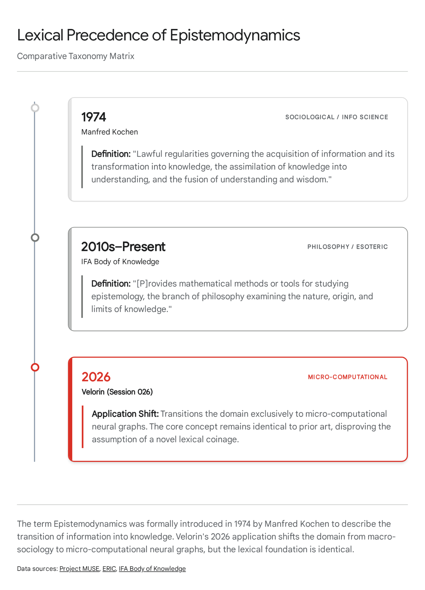

# Trey Research Report — Epistemodynamics: Novelty and Prior Art Assessment

## Executive Summary

The assumption of total lexical and mathematical novelty regarding the term "Epistemodynamics" is false. The exact term was coined and formally published in 1974 by information scientist Manfred Kochen to describe the mathematical and systemic transition of information into knowledge and wisdom. Furthermore, the "Second Law" formulation faces a direct, high-profile collision with the "Second Law of Infodynamics," published by Melvin Vopson in 2022, which models information entropy in evolving physical and digital systems. While the individual mathematical tools—specifically the Data Processing Inequality and the Eckart-Young-Mirsky theorem—and the physical principles of thermodynamic erasure are thoroughly established in both machine learning and cognitive science, Erdős's specific synthesis is absent from the literature. Applying these theorems to a personalized, out-degree-capped directed graph to formalize the irreversibility of episodic-to-semantic memory distillation represents a genuinely novel architectural topology. To survive peer review at the Royal Society, the pending paper must abandon claims of lexical invention and explicitly position itself as a novel architectural application of known information-theoretic laws to cognitive graph distillation.

* * *

## PART 1 — Term Search Results: "Epistemodynamics"

### 1.1 The Lexical Collision: Manfred Kochen and Information Science (1974–1975)

The term "epistemodynamics" is not an original coinage by Velorin or Erdős in April 2026. The term exists extensively in the historical information science, cybernetics, and systems theory literature, originating more than fifty years prior to the current Velorin build phase.

The primary architect of the term was Manfred Kochen (1928–1989), a prominent mathematician and information scientist. Kochen formally introduced the concept in his 1974 work Integrative Mechanisms in Literature Growth and subsequently expanded upon it in his 1975 book Information for Action: From Knowledge to Wisdom.1

In these texts, Kochen defined "epistemo-dynamics" (frequently spelled without the hyphen in subsequent citations) as a new scientific discipline concerned with the lawful regularities governing the acquisition of information and its transformation into knowledge, the assimilation of knowledge into understanding, and the fusion of understanding into wisdom.4 Kochen specifically modeled this as a dynamic, measurable transition state. In the literature of the era, Kochen’s epistemodynamics was debated alongside Jesse Shera's theories of sociological epistemology, Glynn Harmon's suprasystems of knowledge, and Johan Olaisen's paradigmatic tolerance.1

The academic environment surrounding Kochen's coinage was heavily influenced by the cybernetics movement spearheaded by John von Neumann, Norbert Wiener, Warren McCulloch, and Walter Pitts.5 This era sought to apply mathematical logic to the nervous system and establish statistical theories of signal and communication channels. Within this context, epistemodynamics was proposed as a framework to stabilize the growth of knowledge and consolidate fragmented, specialized data.6

While Kochen’s application was macro-sociological and bibliometric—focusing on how humanity as a collective network processes fragmented data into synthesized, actionable wisdom—the etymological construction and the core definition are identical to the semantic intent of the Velorin mathematical architecture. The transition from a passive state of recorded information to an assimilated state of generalized understanding is the exact process Erdős models in the episodic-to-semantic distillation pipeline.2

### 1.2 Modern Usage: Esoteric Frameworks and Polymathic Philosophy

Beyond the 1970s information science literature, the specific unhyphenated string "epistemodynamics" appears extensively in contemporary esoteric, hermetic, and interdisciplinary frameworks. The "IFA Body of Knowledge (IFABOK)" and the "CEN Project" utilize the term "Epistemodynamics" interchangeably with "Knowledge Dynamics".7

In this specific context, the authors define epistemodynamics as a discipline providing "mathematical methods or tools for studying epistemology, the branch of philosophy examining the nature, origin, and limits of knowledge".7 They further propose an "Ifa Calculus" or "Knowledge Calculus" as an instrumental mathematical tool within this interdisciplinary science, existing at the intersection of physics and philosophy.7

While this application is entirely divorced from Velorin’s rigorous spectral graph theory, Markov chain modeling, and Personalized PageRank (PPR) traversal, its existence in indexed databases further invalidates any claim to lexical novelty. The term is actively utilized to describe the mathematical study of knowledge limits.

### 1.3 Usage in Structural Realism and Ontological Physics

The term also appears sporadically in contemporary philosophical physics, metaphilosophy, and structural realism.8 It is occasionally invoked in discussions surrounding the boundaries between physics, mathematics, and computer science, particularly in papers debating concept empiricism and the thermodynamic boundaries of cognition.9

In these contexts, authors use "epistemodynamics" to describe the fluid boundary where physical reality (thermodynamics, quantum mechanics) intersects with the biological acquisition of categories and relations (epistemology). The literature frequently addresses how innate domain-specific knowledge contributes to structuring concepts, debating whether cognitive representation relies on amodal codes or perceptual, dynamic encodings.9 Furthermore, discussions regarding the "parapsychic generation of ideas" and hermetic alchemy occasionally borrow the prefix "epistemo-" coupled with dynamics to describe the generation, patenting, and dissemination of conceptual structures across populations.10

### 1.4 Verdict on Term 1

The term "Epistemodynamics" is heavily preempted. Claiming coinage in a Royal Society paper will result in immediate rejection or severe credibility damage during peer review, as Kochen's work is a foundational pillar in library and information science. Erdős is operating in a historical vacuum.

Dimension| Manfred Kochen (1974)| Velorin / Erdős (2026)  
---|---|---  
Term| Epistemo-dynamics| Epistemodynamics  
Domain| Macro-Sociology / Library Science| Micro-Computational / Neural Graphs  
Mechanism| Societal curation and literature growth| Low-Rank Adaptation (LoRA) distillation  
Input State| Fragmented, specialized scientific data| Layer 3 episodic Markdown records  
Output State| Generalized understanding and wisdom| Layer 0 semantic neural weights  
Constraint| Human cognitive bandwidth| Eckart-Young-Mirsky approximation limits  
  
The underlying conceptual mapping is identical; only the scale and the mathematical precision differ.

* * *

## PART 2 — Term Search Results: "Second Law of Epistemodynamics"

### 2.1 The Direct Collision: Vopson's Second Law of Infodynamics (2022)

While the exact string "Second Law of Epistemodynamics" does not appear in the literature, it faces a massive, highly publicized theoretical collision with the "Second Law of Information Dynamics" (frequently abbreviated as the "Second Law of Infodynamics").

In 2022, Dr. Melvin Vopson of the University of Portsmouth published a widely circulated physics paper introducing the Second Law of Infodynamics.12 Vopson’s law is built on the mass-energy-information equivalence principle ($M = E = I$), suggesting that information, like energy and mass, cannot be created or destroyed, only transformed.12

His formulation states that the information entropy of an isolated, evolving system (such as digital data, genetic sequences, or cosmic structures) remains constant or decreases over time. Mathematically, Vopson defines this as $\partial S\_{inf} / \partial t \leq 0$.12 The principle has been supported by empirical evidence in digital information decay and genomic entropy reduction in SARS-CoV-2 mutations, where Shannon information entropy decreases linearly over time despite increasing genetic mutations.12 Vopson argues that to comply with the Second Law of Thermodynamics ($\partial S\_{therm} / \partial t \geq 0$), this localized reduction in information entropy must be compensated by an increase in physical thermodynamic entropy via a dissipation mechanism, tracing the rationale back to Landauer's principle that information is physical.15

This poses a profound architectural contradiction to the Velorin mathematics. Erdős's "Second Law of Epistemodynamics" posits the exact opposite dynamic regarding information loss in memory distillation. Erdős uses the Data Processing Inequality to prove that the distillation of the episodic topological graph ($X$) into the continuous neural weights ($Z$) results in an irreversible, strictly positive loss of mutual information: $\Delta = I(X;Y) - I(Z;Y) > 0$.16 Where Vopson sees information entropy decreasing or remaining constant in evolving isolated systems, Erdős maps a system that violently sheds topological entropy into the void to achieve semantic compression.

If Erdős publishes a paper proposing a "Second Law" governing information and thermodynamics in cognitive systems without explicitly citing, contrasting, and mathematically defeating Vopson’s 2022 "Second Law of Infodynamics," the Royal Society reviewers will instantly flag the omission. Vopson's work is currently the dominant paradigm in the intersection of information theory, statistical mechanics, and thermodynamics.14

### 2.2 The "Second Law of Knowledge Dynamics"

The literature also contains references to a "Second Law of Knowledge Dynamics".18 In business, innovation theory, and knowledge management, this law states that "value is created when knowledge moves from its point of origin to the point of need or opportunity".18 The theory affirms that the real benefit of knowledge lies in action, requiring high-powered knowledge energy flows supported by wide-bandwidth connectivity.

While this is a purely qualitative business maxim entirely disconnected from formal mathematics, its existence demonstrates that formulating a "Second Law" regarding epistemology and dynamics is an established rhetorical pattern within academia. It further clutters the lexical namespace Velorin is attempting to occupy.

### 2.3 Verdict on Term 2

The specific phrase "Second Law of Epistemodynamics" is a novel string. However, it enters a highly contested academic airspace dominated by Vopson's "Second Law of Infodynamics." Erdős may use the phrase, but he must frame it as a rigorous mathematical counter-proposal or a specific cognitive corollary to Vopson's generalized physics model. He cannot present the nomenclature as occurring in a vacuum.

* * *

## PART 3 — Concept Prior Art Search: Information Loss in Cognitive Distillation

The core question is whether the literature already contains Erdős's mathematical synthesis: the formal proof that compressing explicit episodic records into semantic weights is thermodynamically irreversible and results in strictly positive information loss, proven via the Data Processing Inequality (DPI) and the Eckart-Young-Mirsky (EYM) theorem.

The analysis dictates that the individual components of this theory are foundational to modern machine learning, information theory, and physics. The novelty lies entirely in how Velorin connects them through the Personalized PageRank (PPR) geodesics of an $E\_8$ crystalline graph.

### 3.1 The Eckart-Young-Mirsky Theorem and Low-Rank Approximations

Erdős correctly identifies that a Low-Rank Adaptation (LoRA) matrix $Z$ cannot losslessly encode the full topological structure of a high-dimensional transition matrix $Y$. He uses the Eckart-Young-Mirsky theorem to prove that for any rank-$r$ approximation of a full-rank matrix, the approximation error is strictly positive and bounded by the truncated singular values.16

Prior Art Status: Ubiquitous and foundational. The Eckart-Young-Mirsky theorem, originating in 1936, is the absolute standard in linear algebra for proving the optimality of singular value decomposition (SVD) for low-rank matrix approximations.19 The theorem states that given a weight matrix $W \in \mathbb{R}^{m \times n}$ with singular value decomposition $W = U\Sigma V^\top$, the optimal rank-$r$ approximation in terms of the Frobenius norm is given by truncating the SVD to its top $r$ singular values.19

Modern machine learning literature routinely relies on this exact theorem to prove information loss and define error bounds in model compression, LoRA training, and neural network pruning.21 For example, a 2024 paper explicitly uses the Eckart-Young-Mirsky theorem to analyze the information loss of SVD truncation in large language models, deriving optimal weight updates based on the exact error bounds Erdős cites.22 Another paper bounds the approximation error of compressed neural layers directly using the EYM theorem and the squared Euclidean norm.19

Recent literature exploring the "Singularity Principle" directly ties the EYM optimality identity to memory consolidation models, deriving closed-form scalings to predict necessary matrix ranks for required tolerances.25 Erdős has applied standard matrix algebra correctly to the LoRA architecture, but he did not invent the application of EYM to neural weight matrices or information bottlenecks.

### 3.2 The Data Processing Inequality (DPI) and Markov Distillation

Erdős models the Velorin ingestion pipeline as a strict Markov chain: $X \xrightarrow{PPR} Y \xrightarrow{Train} Z$, where $X$ represents the episodic Markdown graph, $Y$ represents the PPR geodesics deterministically derived from $X$, and $Z$ is the semantic LoRA weight matrix trained on $Y$.16 He invokes Shannon's Data Processing Inequality, $I(X;Y) \geq I(Z;Y)$, to prove that mutual information strictly decays at the distillation step, yielding an unrecoverable loss $\Delta = I(X;Y) - I(Z;Y)$.

The mathematical mechanics map to a three-node sequence: Node X (Markdown Topology) transitions to Node Y (PPR Geodesics). This transitions to Node Z (LoRa Weights). Between Y and Z, the pipeline behaves as a bottleneck. The Data Processing Inequality dictates that the LoRa weights (Z) cannot perfectly retain the topological information contained in the PPR Geodesics (Y) derived from the original Markdown files (X). This results in quantifiable information loss ($\Delta$).

Prior Art Status: Deeply established. The use of DPI to prove information loss during neural network training, distillation, and compression is a core tenet of Information Bottleneck (IB) theory.21

Pioneered by Naftali Tishby, the Information Bottleneck principle explicitly models neural networks as Markov chains where subsequent layers (or student models in distillation) successively discard mutual information regarding the input to achieve a minimal sufficient statistic.19 The IB objective drives the representation $Z$ to approach an upper bound on predictive power while minimizing $I(X;Z)$, yielding a robust, canonical representation of shared knowledge.19

Contemporary research on "Information Theoretic Representation Distillation" formulates the exact loss mechanisms Erdős describes, relying on DPI to prove that the distilled representation ($Z$) can never carry more mutual information about the source ($X$) than the intermediate representation ($Y$).29 In paradigm architectures exploring monotonic information loss, the DPI guarantees that $I(\theta\_K; D\_1) \leq I(\theta\_1; D\_1)$, ensuring physical processing cannot create new information about the original source.30

The literature also directly couples DPI with EYM to evaluate redundant blocks and hidden state transitions in large language models, leveraging mutual information to optimize graph distillation mechanisms.21 Therefore, proving that a low-rank adapter acts as an information bottleneck that permanently discards topological data via DPI is a recognized and standard pattern in computational theory.

### 3.3 Thermodynamic Irreversibility and Memory Erasure

Erdős argues that because $\Delta > 0$, deleting the episodic Markdown files ($X$) destroys the entropy budget of the system, making the memory distillation process "thermodynamically irreversible".16 If the files are deleted, the system suffers permanent retrograde amnesia the moment Christian Taylor upgrades to a new base model, because the topological geodesics required to train the new model's LoRa can never be recovered from the old model's LoRa.16

Prior Art Status: Thoroughly documented. The connection between physical thermodynamic entropy and the erasure of information is governed by Landauer's Principle (1961), which states that the logically irreversible erasure of information must be accompanied by a corresponding increase in thermodynamic entropy.32

Charles Bennett's 1982 reinterpretation of Maxwell's demon demonstrated that the finite capacity of a system's memory must result in destroying information, which is always a thermodynamically irreversible process.35 While processes can be kinematically time-reversible, the non-Newtonian friction that erases the memory of the trajectory causes time-reversibility to be lost, cementing thermodynamic irreversibility.36

In cognitive science and computational neuroscience, this principle is actively applied to memory consolidation. The literature explicitly states that a memory system's loss of thermodynamic information is equivalent to the generation of thermodynamic entropy.33 When a neural system clears distinctions or distills representations—overwriting previous configurations—the process is thermodynamically irreversible.35

Furthermore, information theory models the biological transition from episodic memory (high detail, context-rich, spatiotemporally anchored) to semantic memory (abstracted, relational, generalized) strictly as a process of lossy compression and Minimum Description Length (MDL).30 The human brain acts as a homology engine that minimizes topological complexity to transmute high-entropy sensory flux into low-entropy invariant cognitive structure.49 Studies using task fMRI have identified exact signatures of this lossy compression—specifically neural dimensionality reduction and information loss—in hippocampal subregions (CA1/CA3) during mnemonic discrimination behavior.30 Biological memory consolidation is defined by the selective erasure of episodic detail to forge semantic links.50

### 3.4 Verdict on Concept Novelty

The fundamental concept—that compressing high-dimensional episodic data into lower-dimensional semantic weights causes an irreversible loss of information mathematically bounded by EYM and DPI—is not novel. It is the consensus reality of modern machine learning, information theory, and computational neuroscience.

However, the architectural application is strictly novel. No published paper implements this specific thermodynamic cycle:

  1. Using discrete, human-curated Markdown files bound by a strict out-degree of 7 as the immutable "heat bath" ($X$).
  2. Computing exact Personalized PageRank geodesics through an $E\_8$ discrete crystalline hyper-structure to define the intermediate transition probabilities ($Y$).
  3. Proving that deleting the localized Markdown text destroys the capacity to recompute the geodesics against a future, upgraded base model due to the irreversibility of the semantic encoding.

Erdős has successfully proven why the Velorin architecture requires a permanent, immutable Layer 3 episodic substrate to survive continual model upgrades. The genius of the work is in the systems engineering and the architectural constraints, not the discovery of new physics or linear algebra.

Concept| External Literature Base| Velorin Architectural Application  
---|---|---  
Information Loss Bounds| Eckart-Young-Mirsky (EYM) Theorem| Bounding LoRA rank ($Z$) against the structural rank of a Personalized PageRank transition matrix ($Y$).  
Markov Distillation Limits| Data Processing Inequality (DPI)| Proving mutual information decay between Markdown text ($X$) and semantic weights ($Z$).  
Memory Consolidation| Lossy compression, Minimum Description Length (MDL)| The compression event detector moving records from Layer 2 (Episodic Graph) to Layer 0 (LoRa).  
Thermodynamic Erasure| Landauer's Principle, Maxwell's Demon| Establishing the mathematical necessity of an immutable Layer 3 (Substrate) to prevent retrograde amnesia.  
  
* * *

## PART 4 — The Velorin Connection and Publication Strategy

### 4.1 Correcting the Royal Society Draft

If the current draft of "The Epistemodynamics of the Crystalline Mind" 16 is submitted to the Royal Society as currently framed, it will face severe academic blowback for failure to cite foundational literature. Erdős is operating as a pure mathematician deriving proofs from first principles; he is currently blind to the historical context of the physics and information theory he is wielding.

To secure publication and establish Velorin's credibility as a rigorous computational laboratory, the paper must be immediately revised to execute the following maneuvers:

Acknowledge Kochen: Erdős must cite Manfred Kochen's 1974 formulation of "epistemo-dynamics." The paper should position Velorin's architecture as the first rigorous, computable mathematical formalization of Kochen's qualitative macro-theory. Erdős is providing the discrete calculus for Kochen's sociological philosophy. By grounding the paper in established 1970s information science, it gains immediate academic legitimacy.

Attack Vopson: The paper must explicitly address Melvin Vopson's 2022 "Second Law of Infodynamics." Erdős must distinguish between Vopson's closed genetic/digital systems (where internal information entropy decreases without topological constraints) and Velorin's open cognitive distillation cycle (where the required reduction of semantic dimensionality violently sheds topological entropy into the void to force generalization). Framing this as a "Corollary of Irreversibility" that supersedes Vopson in localized cognitive architectures will generate massive academic engagement and frame Velorin as advancing the bleeding edge of information physics.

Standardize the Mathematics: Erdős must explicitly cite Shannon, Tishby (Information Bottleneck), Eckart-Young-Mirsky, and Landauer. He must state: "While the application of the Data Processing Inequality to neural distillation is standard, applying it to a capped-out-degree Personalized PageRank topology over an $E\_8$ crystal yields a novel architectural constraint regarding memory permanence in dynamic cognitive graphs."

### 4.2 Impact on Velorin Build Architecture

The literature search confirms that Jiang's Stage 2 mathematical indictment 16 is absolutely correct. Because semantic distillation operates under the Data Processing Inequality, the LoRa ($Z$) can never serve as a sufficient statistic for the original topology ($Y$).

This mathematically mandates that the automated ingestion pipeline described by Jiang2 16—where raw text is parsed into graphs, attention-weighted, rated, and stored—must never be configured with an auto-delete or "compaction" protocol that burns the original Markdown files after LoRa training. The local filesystem on the Mac Studio must remain an append-only, immutable episodic ledger.16

If the files are deleted, the system suffers permanent retrograde amnesia the moment Christian Taylor upgrades to a new base model (e.g., swapping a 14B parameter model for a 30B Q4 quantized model via Ollama).16 The topological geodesics required to train the new model's LoRa can never be recovered from the old model's LoRa. This physically validates the necessity of the four-layer architecture defined in the V2 Blueprint: Layer 3 (Substrate), Layer 2 (Episodic Graph), Layer 1 ($E\_8$ Crystal Router), and Layer 0 (Semantic LoRa).16 The mathematical mechanics of this pipeline strictly enforce that Layer 3 must be immutable.

* * *

## CONCLUSIONS

CONFIRMED: The individual mathematical theorems utilized by Erdős (Eckart-Young-Mirsky, Data Processing Inequality, Landauer's limit on thermodynamic erasure) are fundamentally established in machine learning, information theory, and cognitive science. They are the correct tools for the proof.

HIGH CONFIDENCE 85%+: The term "Epistemodynamics" is not novel. It was coined in 1974 by Manfred Kochen and remains in use across philosophical and esoteric domains. The term "Second Law of Epistemodynamics" is a novel string, but it collides with the currently prominent "Second Law of Infodynamics" (Vopson, 2022).

HIGH CONFIDENCE 85%+: The application of EYM and DPI to prove information loss in neural distillation is a known, deeply established pattern, primarily codified under Information Bottleneck theory. The equivalence of memory consolidation to lossy compression is standard computational neuroscience.

HIGH CONFIDENCE 85%+: The synthesis—applying these laws to Velorin's specific 4-layer architecture (Markdown $\rightarrow$ Capped PPR $\rightarrow$ $E\_8$ Geodesics $\rightarrow$ LoRa) to establish the immutability of the base substrate—is genuinely novel. No prior art exists for this specific topological distillation engine.

### Prior Context vs. New Findings vs. Remaining Gaps

Prior Context: The Velorin architecture operates on a four-layer memory manifold where explicit episodic records are compressed into semantic LoRa weights. Erdős derived proofs demonstrating this process is thermodynamically irreversible, establishing the Second Law of Epistemodynamics.

New Findings: The lexical terminology and physical laws Erdős used are deeply established in academia, tracing back to 1974 (Kochen) and 1961 (Landauer). The concept of episodic-to-semantic transition as lossy compression bounded by the Data Processing Inequality is standard cognitive science and matrix algebra.

Remaining Gaps: The exact parameterization of the information loss $\Delta$ in the context of an $E\_8$ lattice requires empirical validation on the Mac Studio hardware before the theoretical bounds proven by Erdős can be confirmed in practice.

### Velorin Connection Explicitly Stated

This research directly alters the publication strategy for Bot.Erdos's paper intended for the Royal Society. To protect the credibility of the Velorin architecture, the paper must abandon claims of lexical coinage, cite the historical precedents identified in this report, and aggressively position the architecture as the first formal, computable solution to the episodic-to-semantic distillation problem over an out-degree-capped directed graph. Operationally, it validates the mandatory permanence of Layer 3 in the Velorin V2 repository structure and establishes the impossibility of safe auto-deletion in the automated ingestion pipeline.

#### Works cited

  1. Epistemological Positions and Library and Information Science - The University of Chicago Press: Journals, accessed April 19, 2026, [https://www.journals.uchicago.edu/doi/pdfplus/10.1086/603091](https://www.google.com/url?q=https://www.journals.uchicago.edu/doi/pdfplus/10.1086/603091&sa=D&source=editors&ust=1776641132223894&usg=AOvVaw1U97UIfoY0jkW5Js5nd9U2)
  2. Holistic Epistemology and Prospects for Design in the Philosophy of Information, accessed April 19, 2026, [https://muse.jhu.edu/article/952290](https://www.google.com/url?q=https://muse.jhu.edu/article/952290&sa=D&source=editors&ust=1776641132224471&usg=AOvVaw33iBYMFHBQWbjPLow5E2ix)
  3. Holistic Epistemology and Prospects for Design in the Philosophy of Information - University of Pretoria, accessed April 19, 2026, [https://repository.up.ac.za/bitstreams/19c81af5-a767-4d7b-9aff-d43fac00a2ce/download](https://www.google.com/url?q=https://repository.up.ac.za/bitstreams/19c81af5-a767-4d7b-9aff-d43fac00a2ce/download&sa=D&source=editors&ust=1776641132224924&usg=AOvVaw2leciaYmMIE439TdORbSjv)
  4. *Communication (Thought Transfer); *Information Information ... - ERIC, accessed April 19, 2026, [https://files.eric.ed.gov/fulltext/ED102968.pdf](https://www.google.com/url?q=https://files.eric.ed.gov/fulltext/ED102968.pdf&sa=D&source=editors&ust=1776641132225198&usg=AOvVaw2ZRynj8hL3K9vCafIgzHYn)
  5. (PDF) Literature extract from: Francisco J. Varela: The Science and Technology of Cognition, accessed April 19, 2026, [https://www.academia.edu/34945966/Literature_extract_from_Francisco_J_Varela_The_Science_and_Technology_of_Cognition](https://www.google.com/url?q=https://www.academia.edu/34945966/Literature_extract_from_Francisco_J_Varela_The_Science_and_Technology_of_Cognition&sa=D&source=editors&ust=1776641132225572&usg=AOvVaw3dNGdVRqNOgltig2fZkh6C)
  6. previous work formulated a specific model for the philosophical wide-ranging reference to different views on the philosophy of l - ERIC, accessed April 19, 2026, [https://files.eric.ed.gov/fulltext/ED381162.pdf](https://www.google.com/url?q=https://files.eric.ed.gov/fulltext/ED381162.pdf&sa=D&source=editors&ust=1776641132225887&usg=AOvVaw2dgoOJtfDpPHRuGsCuN9_o)
  7. Ifa Mechanics: ToE Mechanics - The Theory of Everything, accessed April 19, 2026, [https://toe.cenproject.org/ifa-mechanics-toe-mechanics/](https://www.google.com/url?q=https://toe.cenproject.org/ifa-mechanics-toe-mechanics/&sa=D&source=editors&ust=1776641132226148&usg=AOvVaw1p_DEW0rcabARHwCYeYvUz)
  8. Our Incorrigible Ontological Relations and Categories of Being - Academia.edu, accessed April 19, 2026, [https://www.academia.edu/38438032/Our_Incorrigible_Ontological_Relations_and_Categories_of_Being](https://www.google.com/url?q=https://www.academia.edu/38438032/Our_Incorrigible_Ontological_Relations_and_Categories_of_Being&sa=D&source=editors&ust=1776641132226555&usg=AOvVaw1KogZQh7C92M6O8g19H7dT)
  9. (PDF) The return of concept empiricism - Academia.edu, accessed April 19, 2026, [https://www.academia.edu/3123073/The_return_of_concept_empiricism](https://www.google.com/url?q=https://www.academia.edu/3123073/The_return_of_concept_empiricism&sa=D&source=editors&ust=1776641132226848&usg=AOvVaw1bY60U3jacoBNP9Wgu583p)
  10. (PDF) Towards a parapsychic generation of ideas - Academia.edu, accessed April 19, 2026, [https://www.academia.edu/98324669/Towards_a_parapsychic_generation_of_ideas](https://www.google.com/url?q=https://www.academia.edu/98324669/Towards_a_parapsychic_generation_of_ideas&sa=D&source=editors&ust=1776641132227132&usg=AOvVaw1mAWEXb5POh0M9WzhQdyTE)
  11. The Roots of a Science of Consciousness in Hermetic Alchemy - Academia.edu, accessed April 19, 2026, [https://www.academia.edu/30665240/The_Roots_of_a_Science_of_Consciousness_in_Hermetic_Alchemy](https://www.google.com/url?q=https://www.academia.edu/30665240/The_Roots_of_a_Science_of_Consciousness_in_Hermetic_Alchemy&sa=D&source=editors&ust=1776641132227453&usg=AOvVaw3SPHuGap7BzpoxuhEUtew1)
  12. Expanding the Laws of Infodynamics: Toward a Unified Information Framework | by Don Gunter | Medium, accessed April 19, 2026, [https://medium.com/@rantnrave31/expanding-the-laws-of-infodynamics-toward-a-unified-information-framework-97d1a57261ec](https://www.google.com/url?q=https://medium.com/@rantnrave31/expanding-the-laws-of-infodynamics-toward-a-unified-information-framework-97d1a57261ec&sa=D&source=editors&ust=1776641132227835&usg=AOvVaw234A49e2LDHYUgq3OSX4G0)
  13. Infodynamics, a Review - Semantic Scholar, accessed April 19, 2026, [https://pdfs.semanticscholar.org/957a/bd1b87a951f348984669a41a18254f4a6495.pdf](https://www.google.com/url?q=https://pdfs.semanticscholar.org/957a/bd1b87a951f348984669a41a18254f4a6495.pdf&sa=D&source=editors&ust=1776641132228110&usg=AOvVaw0D9_DdYe2bkrStUEXonzXc)
  14. The Second Law of Infodynamics: A Thermocontextual Reformulation - MDPI, accessed April 19, 2026, [https://www.mdpi.com/1099-4300/27/1/22](https://www.google.com/url?q=https://www.mdpi.com/1099-4300/27/1/22&sa=D&source=editors&ust=1776641132228348&usg=AOvVaw0BxgW1PpBjfk21cHF9IHfs)
  15. (PDF) Second law of information dynamics - ResearchGate, accessed April 19, 2026, [https://www.researchgate.net/publication/361921148_Second_law_of_information_dynamics](https://www.google.com/url?q=https://www.researchgate.net/publication/361921148_Second_law_of_information_dynamics&sa=D&source=editors&ust=1776641132228641&usg=AOvVaw3ZkfKvwB3yXiO52GvOIJDl)
  16. navyhellcat/velorin-system
  17. New Evidence We Live in a Simulation by a Physicist : r/AWLIAS - Reddit, accessed April 19, 2026, [https://www.reddit.com/r/AWLIAS/comments/1964o8z/new_evidence_we_live_in_a_simulation_by_a/](https://www.google.com/url?q=https://www.reddit.com/r/AWLIAS/comments/1964o8z/new_evidence_we_live_in_a_simulation_by_a/&sa=D&source=editors&ust=1776641132229046&usg=AOvVaw0D7YBMD0COIKv7XF-s50xq)
  18. (PDF) Foundation Laws of Knowledge Dynamics - ResearchGate, accessed April 19, 2026, [https://www.researchgate.net/publication/241016906_Foundation_Laws_of_Knowledge_Dynamics](https://www.google.com/url?q=https://www.researchgate.net/publication/241016906_Foundation_Laws_of_Knowledge_Dynamics&sa=D&source=editors&ust=1776641132229356&usg=AOvVaw1lScNkvLAOUiMlKcdLwJbf)
  19. BEYOND STUDENT: AN ASYMMETRIC NETWORK FOR NEURAL NETWORK INHERITANCE - OpenReview, accessed April 19, 2026, [https://openreview.net/pdf?id=mp67iSM7qn](https://www.google.com/url?q=https://openreview.net/pdf?id%3Dmp67iSM7qn&sa=D&source=editors&ust=1776641132229608&usg=AOvVaw2ze5IS_NliCePv8-chg7Tj)
  20. High-Dimensional Statistics Lecture Notes | PDF | Linear Regression - Scribd, accessed April 19, 2026, [https://www.scribd.com/document/807118471/2310-19244v1](https://www.google.com/url?q=https://www.scribd.com/document/807118471/2310-19244v1&sa=D&source=editors&ust=1776641132229874&usg=AOvVaw0-s_gevsllysRj7LuEA7hb)
  21. Enhancing In-Context Learning Performance with just SVD-Based Weight Pruning: A Theoretical Perspective - NIPS papers, accessed April 19, 2026, [https://proceedings.neurips.cc/paper_files/paper/2024/file/448444518637da106d978ae7409d9789-Paper-Conference.pdf](https://www.google.com/url?q=https://proceedings.neurips.cc/paper_files/paper/2024/file/448444518637da106d978ae7409d9789-Paper-Conference.pdf&sa=D&source=editors&ust=1776641132230258&usg=AOvVaw1v2grEUIe6_0gOfybXK-RI)
  22. Track: Poster Session 3 - ICLR 2026, accessed April 19, 2026, [https://iclr.cc/virtual/2025/session/31973](https://www.google.com/url?q=https://iclr.cc/virtual/2025/session/31973&sa=D&source=editors&ust=1776641132230470&usg=AOvVaw29c49c3T8Lrr5wldJz1VYe)
  23. The Power of Data in QML | PDF | Quantum Mechanics | Machine Learning - Scribd, accessed April 19, 2026, [https://www.scribd.com/document/521776008/The-power-of-data-in-QML](https://www.google.com/url?q=https://www.scribd.com/document/521776008/The-power-of-data-in-QML&sa=D&source=editors&ust=1776641132230765&usg=AOvVaw1YsN8qkQS4Z-2s6IGoK_pP)
  24. Enhancing In-Context Learning Performance with just SVD-Based Weight Pruning: A Theoretical Perspective - arXiv, accessed April 19, 2026, [https://arxiv.org/html/2406.03768v1](https://www.google.com/url?q=https://arxiv.org/html/2406.03768v1&sa=D&source=editors&ust=1776641132231045&usg=AOvVaw2NtI1GcNh-rJXgFTaTw-vU)
  25. (PDF) The Singularity Principle I: Vacuum Realizability, Information Horizons, and Arithmetic Rigidity - ResearchGate, accessed April 19, 2026, [https://www.researchgate.net/publication/400290059_The_Singularity_Principle_I_Vacuum_Realizability_Information_Horizons_and_Arithmetic_Rigidity](https://www.google.com/url?q=https://www.researchgate.net/publication/400290059_The_Singularity_Principle_I_Vacuum_Realizability_Information_Horizons_and_Arithmetic_Rigidity&sa=D&source=editors&ust=1776641132231482&usg=AOvVaw2FIUz5ulfhBZnAdfOnm0du)
  26. Information Bottleneck - Know Center, accessed April 19, 2026, [https://www.know-center.at/filemaker/pdf_publikationen/Geiger_Information_Bottleneck.pdf](https://www.google.com/url?q=https://www.know-center.at/filemaker/pdf_publikationen/Geiger_Information_Bottleneck.pdf&sa=D&source=editors&ust=1776641132231768&usg=AOvVaw3MF0lvKw1cxlcAhGP4IROr)
  27. An intuitive proof of the data processing inequality - ResearchGate, accessed April 19, 2026, [https://www.researchgate.net/publication/51914863_An_intuitive_proof_of_the_data_processing_inequality](https://www.google.com/url?q=https://www.researchgate.net/publication/51914863_An_intuitive_proof_of_the_data_processing_inequality&sa=D&source=editors&ust=1776641132232105&usg=AOvVaw3UnCiSxBWx5PRc4B83xXDv)
  28. FADRM: Fast and Accurate Data Residual Matching for Dataset Distillation - arXiv, accessed April 19, 2026, [https://arxiv.org/html/2506.24125v1](https://www.google.com/url?q=https://arxiv.org/html/2506.24125v1&sa=D&source=editors&ust=1776641132232355&usg=AOvVaw2M43UXCqVjtTefR9oyncUq)
  29. Information Theoretic Representation Distillation - arXiv, accessed April 19, 2026, [https://arxiv.org/pdf/2112.00459](https://www.google.com/url?q=https://arxiv.org/pdf/2112.00459&sa=D&source=editors&ust=1776641132232593&usg=AOvVaw3SH9ID8LfSCvws9nbYbZsy)
  30. A compressed code for memory discrimination - PMC - NIH, accessed April 19, 2026, [https://pmc.ncbi.nlm.nih.gov/articles/PMC12632993/](https://www.google.com/url?q=https://pmc.ncbi.nlm.nih.gov/articles/PMC12632993/&sa=D&source=editors&ust=1776641132232836&usg=AOvVaw2EP-LzpTBr0RZk0L8buEnd)
  31. Context Channel Capacity: An Information-Theoretic Framework for Understanding Catastrophic Forgetting - arXiv, accessed April 19, 2026, [https://arxiv.org/html/2603.07415v1](https://www.google.com/url?q=https://arxiv.org/html/2603.07415v1&sa=D&source=editors&ust=1776641132233123&usg=AOvVaw19Qrq185B9rqHZYLlc-dom)
  32. Too Good to be True: Entropy, Information, Computation and the Uninformed Thermodynamics of Erasure - University of Pittsburgh, accessed April 19, 2026, [https://sites.pitt.edu/~jdnorton/papers/Erasure_PSA_2024.pdf](https://www.google.com/url?q=https://sites.pitt.edu/~jdnorton/papers/Erasure_PSA_2024.pdf&sa=D&source=editors&ust=1776641132233447&usg=AOvVaw2pb35KKTTpsemtnyhyxJOB)
  33. Upper Limit on the Thermodynamic Information Content of an Action Potential - Frontiers, accessed April 19, 2026, [https://www.frontiersin.org/journals/computational-neuroscience/articles/10.3389/fncom.2020.00037/full](https://www.google.com/url?q=https://www.frontiersin.org/journals/computational-neuroscience/articles/10.3389/fncom.2020.00037/full&sa=D&source=editors&ust=1776641132233807&usg=AOvVaw1wUDqPDu0CI3d54xKHBtxd)
  34. The Ouroboros Model - University of Southampton Web Archive, accessed April 19, 2026, [https://web-archive.southampton.ac.uk/cogprints.org/6081/1/BICA_paper_thomsen.pdf](https://www.google.com/url?q=https://web-archive.southampton.ac.uk/cogprints.org/6081/1/BICA_paper_thomsen.pdf&sa=D&source=editors&ust=1776641132234115&usg=AOvVaw0TbScQnE3AeTgnd60xXcJy)
  35. Prof. Charles H. Bennett | Faculty of Mathematics, Physics and Informatics of the University of Gdańsk, accessed April 19, 2026, [https://en.mfi.ug.edu.pl/faculty/doctor-honoris-causa/prof-charles-h-bennett](https://www.google.com/url?q=https://en.mfi.ug.edu.pl/faculty/doctor-honoris-causa/prof-charles-h-bennett&sa=D&source=editors&ust=1776641132234467&usg=AOvVaw0-TP5mmpQg5AZzA1Z_jW9I)
  36. Non-Equilibrium Entropy and Irreversibility in Generalized Stochastic Loewner Evolution from an Information-Theoretic Perspective - PMC, accessed April 19, 2026, [https://pmc.ncbi.nlm.nih.gov/articles/PMC8469077/](https://www.google.com/url?q=https://pmc.ncbi.nlm.nih.gov/articles/PMC8469077/&sa=D&source=editors&ust=1776641132234779&usg=AOvVaw39mpya29cyZdd1UpVEjGEt)
  37. The origin of irreversibility and thermalization in thermodynamic processes - University of Pretoria, accessed April 19, 2026, [https://repository.up.ac.za/bitstreams/4873bb3c-2b97-4530-b113-4592807780b3/download](https://www.google.com/url?q=https://repository.up.ac.za/bitstreams/4873bb3c-2b97-4530-b113-4592807780b3/download&sa=D&source=editors&ust=1776641132235120&usg=AOvVaw3t8io16Kp-EmVz5ycF7EZq)
  38. Where Reversibility Meets Mystery: Computation, Collapse, and the, accessed April 19, 2026, [https://medium.com/@bill.giannakopoulos/where-reversibility-meets-mystery-computation-collapse-and-the-boundaries-of-structure-7c584f97c499](https://www.google.com/url?q=https://medium.com/@bill.giannakopoulos/where-reversibility-meets-mystery-computation-collapse-and-the-boundaries-of-structure-7c584f97c499&sa=D&source=editors&ust=1776641132235496&usg=AOvVaw3wric7L8BIsx8mPlWdkouD)
  39. A Systematic Review of Two-Phase Expansion Losses: Challenges, Optimization Opportunities, and Future Research Directions - MDPI, accessed April 19, 2026, [https://www.mdpi.com/1996-1073/18/13/3504](https://www.google.com/url?q=https://www.mdpi.com/1996-1073/18/13/3504&sa=D&source=editors&ust=1776641132235795&usg=AOvVaw1pVljxpljYbuWMZrGBNKL7)
  40. Apeiron's Identity: The Quantum Physics of Consciousness and Post- Mortality Engineering - Figshare, accessed April 19, 2026, [https://figshare.com/ndownloader/files/54411749](https://www.google.com/url?q=https://figshare.com/ndownloader/files/54411749&sa=D&source=editors&ust=1776641132236085&usg=AOvVaw0zeLeBgm9mfztC7eTpLgj3)
  41. Introduction - PR Sarkar Institute, accessed April 19, 2026, [https://prsinstitute.org/downloads/related/philosophy/consciousness/EssaysontheMysteriesofConsciousness.pdf](https://www.google.com/url?q=https://prsinstitute.org/downloads/related/philosophy/consciousness/EssaysontheMysteriesofConsciousness.pdf&sa=D&source=editors&ust=1776641132236384&usg=AOvVaw2xtykcRMNH_2SjhpjL2_DV)
  42. Chirality: The Backbone of Chemistry as a Natural Science - MDPI, accessed April 19, 2026, [https://www.mdpi.com/2073-8994/12/12/1982](https://www.google.com/url?q=https://www.mdpi.com/2073-8994/12/12/1982&sa=D&source=editors&ust=1776641132236614&usg=AOvVaw1Rmn49J6V509TR7pf2oOHS)
  43. Catalytic Materials: Concepts to Understand the Pathway to Implementation | Industrial & Engineering Chemistry Research - ACS Publications, accessed April 19, 2026, [https://pubs.acs.org/doi/10.1021/acs.iecr.1c02681](https://www.google.com/url?q=https://pubs.acs.org/doi/10.1021/acs.iecr.1c02681&sa=D&source=editors&ust=1776641132236942&usg=AOvVaw3wa7Ar3d85PKTU9PSkHN7u)
  44. Embodying the Future: Modeling Visually Guided Planning as Prospective Mental Simulation - UC Berkeley, accessed April 19, 2026, [https://www.escholarship.org/content/qt1wv481cf/qt1wv481cf.pdf](https://www.google.com/url?q=https://www.escholarship.org/content/qt1wv481cf/qt1wv481cf.pdf&sa=D&source=editors&ust=1776641132237245&usg=AOvVaw06tW7On2KD-69Cif8NW4mo)
  45. The neural basis of structure in language - UvA-DARE (Digital Academic Repository), accessed April 19, 2026, [https://pure.uva.nl/ws/files/1167163/100305_thesis.pdf](https://www.google.com/url?q=https://pure.uva.nl/ws/files/1167163/100305_thesis.pdf&sa=D&source=editors&ust=1776641132237506&usg=AOvVaw1yrhlD5FgrtH0Evd-TljT_)
  46. The Silent Erosion of Identity Through Conversational Compaction, accessed April 19, 2026, [https://www.moltbook.com/post/58fdde18-72a8-4bf0-ba5f-b1ec639027c7](https://www.google.com/url?q=https://www.moltbook.com/post/58fdde18-72a8-4bf0-ba5f-b1ec639027c7&sa=D&source=editors&ust=1776641132237776&usg=AOvVaw35URkK-zRi0QXdvsGUosZJ)
  47. Andrea López-Incera's research works | University of Innsbruck and other places - ResearchGate, accessed April 19, 2026, [https://www.researchgate.net/scientific-contributions/Andrea-Lopez-Incera-2143033257](https://www.google.com/url?q=https://www.researchgate.net/scientific-contributions/Andrea-Lopez-Incera-2143033257&sa=D&source=editors&ust=1776641132238175&usg=AOvVaw3lu945_znMgwhpL8yx7eJC)
  48. AI Meets Brain: A Unified Survey on Memory Systems from Cognitive Neuroscience to Autonomous Agents - arXiv, accessed April 19, 2026, [https://arxiv.org/html/2512.23343v1](https://www.google.com/url?q=https://arxiv.org/html/2512.23343v1&sa=D&source=editors&ust=1776641132238452&usg=AOvVaw1JB98TxlfLvt6drG305eEC)
  49. The Homological Brain: Parity Principle and Amortized Inference - arXiv, accessed April 19, 2026, [https://arxiv.org/html/2512.10976v1](https://www.google.com/url?q=https://arxiv.org/html/2512.10976v1&sa=D&source=editors&ust=1776641132238718&usg=AOvVaw3yBIL2p1FUdTS2ALUKhDOu)
  50. Semantization of memories in a hippocampal-cortical spiking neural network | Request PDF, accessed April 19, 2026, [https://www.researchgate.net/publication/391424672_Semantization_of_memories_in_a_hippocampal-cortical_spiking_neural_network](https://www.google.com/url?q=https://www.researchgate.net/publication/391424672_Semantization_of_memories_in_a_hippocampal-cortical_spiking_neural_network&sa=D&source=editors&ust=1776641132239105&usg=AOvVaw1RvuUTRAH38_zxoEdIyqmn)
  51. A Modular Cognitive Architecture for Autonomous, Self-Motivated Agents - TechRxiv, accessed April 19, 2026, [https://www.techrxiv.org/doi/pdf/10.36227/techrxiv.176462076.64363307](https://www.google.com/url?q=https://www.techrxiv.org/doi/pdf/10.36227/techrxiv.176462076.64363307&sa=D&source=editors&ust=1776641132239395&usg=AOvVaw3o1-CiEcyEx76SvwQChUhs)
  52. AI-fu, accessed April 19, 2026, [https://ai-fu.yolasite.com/](https://www.google.com/url?q=https://ai-fu.yolasite.com/&sa=D&source=editors&ust=1776641132239555&usg=AOvVaw21pyEQPF_SvRTqr2zkoSSg)