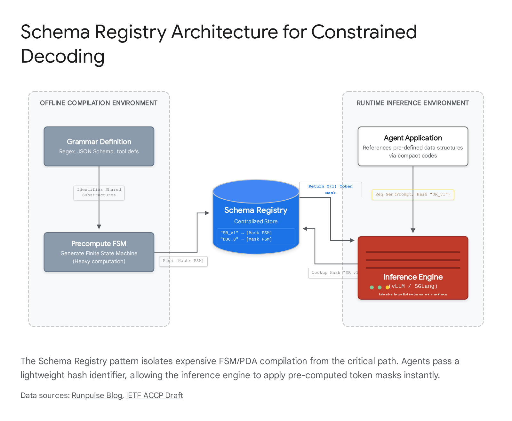

# FSM Grammar Version Management and Deployment Architecture for Constrained-Decoding Systems

## Executive Summary

The transition from prompt-based schema adherence to deterministic, grammar-constrained decoding represents a fundamental shift in how artificial intelligence systems generate structured output. Production environments have abandoned the practice of passing schemas within the context window, recognizing that doing so results in unacceptable failure rates and token overhead. Instead, modern architectures compile constraints—ranging from regular expressions to complex context-free grammars—into finite-state machines or pushdown automata, applying them directly at the logits level during the autoregressive sampling phase. This report systematically deconstructs the operational patterns required to manage the lifecycle of these compiled grammars, focusing on schema registries, property-based regression testing, shadow-mode deployment, and the severe failure modes that emerge when constraints interact with subword tokenization and probabilistic reasoning. For the Velorin Asymmetric Transport Verifier, treating the Independent Evaluation Standard grammar as version-controlled, compiled infrastructure is not optional; it is the absolute prerequisite for maintaining multi-agent coherence as the system scales.

## 1\. Version-Control Patterns for FSM Grammars

### Prior Context vs. New Findings vs. Remaining Gaps

Prior Context: Historical approaches to structural enforcement relied heavily on prompt engineering, injecting JSON schemas directly into the system prompt and instructing the model to comply. This method treated the schema as text for the model to interpret, leading to hallucinated keys, invalid types, and trailing commas that broke downstream parsers.

New Findings: The industry has decisively moved to offline compilation of grammars. Frameworks such as XGrammar, llguidance, and Outlines pre-process the schema into transition matrices or token masks. Because this compilation is computationally expensive, production systems utilize schema registries to version, hash, and serve these compiled artifacts. The schema text never enters the LLM context window.

Remaining Gaps: The ecosystem lacks a standardized wire protocol for transmitting grammar hashes between decentralized agents and centralized inference engines, forcing teams to build custom middleware to map payload requests to cached grammar states.

### State of the Art in Production Deployments

In production systems executing thousands of structured requests per second, the naive approach of compiling a finite-state machine from a schema at runtime is completely non-viable. The compilation of complex schemas—particularly those involving large enumeration unions or deep recursive structures—can require tens of seconds to minutes. For instance, creating a complete deterministic finite automaton (DFA) from a complex JSON schema using a library like Outlines can result in a combinatorial explosion of states, leading to compilation timeouts that halt the entire inference pipeline.

To circumvent this severe latency penalty, production architectures have universally adopted the Schema Registry pattern, heavily inspired by distributed data systems like Apache Kafka. In this paradigm, the grammar is treated as compiled executable code rather than configuration data. The lifecycle begins in a standard version control system. A developer or automated system authors the grammar using a domain-specific language such as Lark (used by llguidance), Backus-Naur Form (GBNF for llama.cpp), or a standard JSON Schema definition.

Upon committing this definition to the repository, a continuous integration pipeline intercepts the file and performs offline compilation. The compiler generates the optimized parsing structures—token masks, transition tables, or pushdown automata definitions—required by the specific inference backend. Crucially, the pipeline generates a cryptographic hash of the abstract syntax tree of the grammar. This hash, along with a semantic version tag, becomes the immutable identifier for the compiled artifact. The artifact is then pushed to a centralized Schema Registry.

At runtime, the architecture fundamentally changes. The requesting agent does not transmit the schema payload to the inference engine. Instead, the agent transmits the lightweight cryptographic hash or the semantic version identifier. The inference server (e.g., vLLM or SGLang) intercepts this identifier, performs an $O(1)$ lookup against its local memory cache synced with the Schema Registry, and retrieves the pre-compiled token masking logic. This entirely removes the compilation overhead from the critical path of the generation request, reducing the time-to-first-token (TTFT) latency to near zero for the structural constraint phase.

The enforcement of immutability within the Schema Registry is absolute. Once a grammar artifact is compiled and hashed, it can never be modified in place. Any alteration to the ruleset requires a new commit, a new compilation phase, a new hash, and a new registry entry. This strict append-only append-only architecture guarantees that long-running multi-agent workflows referencing a specific schema version will not experience sudden, catastrophic parsing failures due to a background update.

### Specific Recommendation for Velorin

Velorin must implement a local, hash-addressed Schema Registry for the Asymmetric Transport Verifier. When Alexander or Jiang needs to generate an analytical message conforming to the Independent Evaluation Standard (IES), they will not pass the IES structure in their prompt. They will specify the IES registry hash in the API request payload. The local inference engine powering the ATV will retrieve the pre-compiled token mask (using XGrammar or llguidance) from the local registry and apply it to the logits processor.

### Caveats

The primary caveat involves the operational overhead of maintaining the registry synchronization. If an agent requests a generation using a schema hash that the local inference engine has not yet cached, the engine must halt, fetch the artifact from the registry, and load the parsing structures into memory, creating a latency spike on the first invocation.

### Minimum Viable Workflow

The minimum viable workflow requires a Git repository for the IES schemas, a post-commit hook that triggers a Python script to compile the schema using the chosen backend (e.g., llguidance's compiler), a hashing function to generate the identifier, and a local SQLite database or simple key-value store acting as the registry mapping the hash to the binary artifact path on the local filesystem.

Conclusion: HIGH CONFIDENCE 85%+

Velorin Connection: The ATV enforcing the IES format must completely decouple the definition of the grammar from the agents generating the content. The registry pattern ensures that Alexander and Jiang operate strictly against stable, versioned contracts, preventing inter-agent communication from collapsing due to uncoordinated format drift.

## 2\. Regression Suite Construction for Grammar Evolution

### Prior Context vs. New Findings vs. Remaining Gaps

Prior Context: The historical approach to testing structured output involved generating a handful of examples with the language model and running them through a standard JSON parser to check for syntax errors. This treated the LLM as part of the test loop, making tests slow, expensive, and non-deterministic.

New Findings: State-of-the-art grammar testing completely entirely isolates the grammar from the language model. Production teams utilize Property-Based Testing (PBT) frameworks to autonomously generate millions of synthetic string permutations directly from the compiled grammar, feeding these into the downstream application's native parser to identify edge-case equivalence failures.

Remaining Gaps: The interaction between Subword Tokenization (BPE) boundaries and grammar state transitions remains a persistent source of hidden regressions. A grammar may be mathematically sound but practically unusable if it forces token boundary configurations that the underlying model's vocabulary cannot efficiently construct.

### State of the Art in Production Deployments

When a constrained-decoding grammar requires modification, the engineering challenge is proving that the new ruleset strictly subsumes the intended previous behaviors while accurately rejecting newly prohibited patterns. Relying on a language model to generate test cases during the continuous integration phase is architecturally flawed; the generation is non-deterministic, the inference cost is prohibitive, and the coverage will invariably miss pathological edge cases.

To achieve mathematical certainty regarding grammar evolution, production ecosystems have standardized on three decoupled layers of verification. The foundational layer relies on Property-Based Testing (PBT). Frameworks such as the Hypothesis library in Python are deployed to perform symbolic baseline tests. In this architecture, the testing framework ingests the newly proposed Context-Free Grammar (CFG). The framework then operates as an automated fuzzing engine, autonomously generating thousands of highly complex, synthetic strings that the grammar dictates are perfectly valid.

These synthetically generated strings are subsequently fed directly into the downstream system's native parser—for instance, the application's actual JSON deserializer, SQL engine, or API endpoint validator. If the generated grammar allows the construction of a string that the native parser ultimately rejects, a critical discrepancy is detected: the grammar is under-constrained. Conversely, if the grammar cannot generate valid structures required by the parser, it is over-constrained. This property-based approach ensures total theoretical coverage without invoking an LLM.

The second verification layer is Differential Equivalence Checking. To guarantee that a version update (e.g., from v1 to v2) does not introduce unintended regressions, the test suite maintains a massive, immutable golden corpus of historical, successfully processed outputs. The newly compiled v2 grammar is applied as a static validator against this entire corpus. The differential engine scans for state changes. Any string that was accepted by the v1 grammar but is rejected by the v2 grammar is immediately flagged. If the grammar update was intended to be strictly additive (e.g., adding a new optional field), a rejection flags a severe regression that must block deployment.

The third layer addresses Engine Compliance Benchmarking. A grammar does not execute in a vacuum; it interacts intimately with specific token masking engines. Production suites utilize standardized benchmarking tools like MaskBench and JSONSchemaBench. These utilities evaluate the proposed grammar directly against the exact parsing engine running in production—whether that is XGrammar’s pushdown automaton implementation or llguidance’s Earley parser. This phase is critical for identifying compilation timeouts, state explosion errors, or tokenization mismatches that purely symbolic testing will miss.

### Specific Recommendation for Velorin

Velorin must construct a CI/CD pipeline that enforces deterministic regression testing for the IES grammar. Before any update is permitted to enter the Schema Registry, the pipeline must run a Property-Based Testing suite using a Python framework like Hypothesis. The suite must generate synthetic IES messages and pass them through the Asymmetric Transport Verifier. Furthermore, Velorin must maintain a historical corpus of actual inter-agent analytical messages stored in the Velorin Brain, running differential equivalence checks against this corpus for every proposed grammar change.

### Caveats

Property-based testing is highly effective at finding syntactical and structural flaws, but it cannot measure the semantic impact of a grammar change. A grammar may pass all PBT and differential checks, yet still impose a sequence of token constraints that mathematically forces the LLM down a low-probability generation path, severely degrading the reasoning quality of the output.

### Minimum Viable Workflow

The minimum viable workflow requires a dedicated test script that executes on every commit to the grammar repository. This script must load the previous grammar version and the new grammar version. It must parse a static directory of 1,000 historical analytical messages, verifying that the new grammar accepts 100% of the messages accepted by the old grammar. It must then invoke a fuzzing library to generate 500 boundary-condition strings based on the new grammar, feeding them into the Python json.loads() parser to guarantee strict syntactical compliance.

Conclusion: HIGH CONFIDENCE 85%+

Velorin Connection: The Asymmetric Transport Verifier is the structural bedrock of the Velorin multi-agent system. If an IES grammar update breaks the verifier, agent communication halts. Erdős or Jiang cannot simply author a new grammar and deploy it; they must submit it to this deterministic regression suite to mathematically prove it accepts the existing corpus of knowledge in the Brain.

## 3\. Backward Compatibility and Migration

### Prior Context vs. New Findings vs. Remaining Gaps

Prior Context: Migration historically consisted of changing the text of the system prompt to request a new format and hoping the downstream parsers could handle the transition gracefully, often relying on extensive try/except blocks and type coercion logic in the application code.

New Findings: Strict schema versioning transforms migration into a formal API lifecycle management problem. The requirement to support in-flight operations mandates the use of dual-emitting endpoints or fallback translation layers within the parsing application.

Remaining Gaps: Automated schema contraction—the process of safely removing fields without breaking dependencies across decentralized agents—remains a highly manual and error-prone dependency-mapping problem. There is no widely adopted automated tool for proving that a deleted key is no longer referenced anywhere in a multi-agent mesh.

### State of the Art in Production Deployments

In constrained-decoding environments, the grammar defines the absolute API contract between the reasoning agent and the parsing verifier. In a multi-agent system, non-additive changes to a grammar—such as renaming a fundamental key, changing a data type from an array to an object, or removing a previously permitted string sequence—cause immediate and cascading failures. The verifier will throw hard parsing errors, completely blocking the execution pipeline.

The industry standard for managing this migration distinguishes rigidly between structural expansions and structural contractions. Expansions, or additive changes, involve introducing new optional fields or expanding the allowed parameters within an enumeration list. These changes are inherently backward compatible. Downstream parsers that have not yet been updated simply ignore the newly introduced fields, while the agents generating the data can immediately begin utilizing the expanded grammar.

Contractions, or non-additive changes, are significantly more dangerous. Removing fields, altering established data types, or introducing new mandatory fields breaks backward compatibility. To handle these transitions without halting production, engineering teams employ a Dual-Support Migration Window.

The workflow for this window requires precise orchestration. First, the new grammar (v2) is compiled and published to the Schema Registry. Crucially, the orchestrator continues to instruct the existing, active agents to utilize the v1 grammar for all currently executing tasks. The downstream parsing application—the Verifier—is simultaneously updated to support the deserialization and processing of both v1 and v2 payloads. It achieves this by inspecting the schema hash embedded in the message metadata and routing the payload to the corresponding parsing logic.

Only when new tasks are instantiated are the agents instructed to bind to the v2 grammar. The system monitors the execution queues meticulously. The v1 schema is only formally deprecated and removed from the active registry when telemetry confirms that absolute zero in-flight tasks are still utilizing the legacy version. This ensures a seamless transition with zero dropped messages.

### Specific Recommendation for Velorin

When Jiang proposes a non-additive modification to the IES grammar—for example, altering the structure of how confidence intervals are mathematically reported—Alexander must manage the migration window. Alexander will instantiate the new schema in the registry but must maintain the old schema actively. The ATV must be explicitly coded to deserialize both the legacy and the new versions. Alexander will not switch existing sub-agents (like Terry) over to the new schema mid-task.

### Caveats

Supporting dual schemas increases the code complexity within the verifier. The ATV will require branching logic to handle the structural discrepancies between the versions. If the migration window is left open indefinitely, the verifier code will accumulate technical debt from supporting numerous legacy schemas, requiring strict deprecation schedules.

### Minimum Viable Workflow

The verifier must implement a routing layer based on the schema hash. The verify_message() function must read the hash from the message header, load the corresponding Pydantic model or data class for that specific version, and execute validation. A telemetry counter must track the volume of messages verified against each hash. When the counter for a legacy hash reads zero for a sustained 48-hour period, a script can safely remove that hash from the active registry.

Conclusion: HIGH CONFIDENCE 85%+

Velorin Connection: In the Velorin architecture, Alexander orchestrates tasks while Jiang and Trey execute them. If the IES format changes abruptly, messages from Trey regarding critical research will crash at the ATV before reaching Jiang. The dual-support migration window guarantees that long-running research tasks initiated under an older standard complete successfully.

## 4\. Grammar Deployment Patterns

### Prior Context vs. New Findings vs. Remaining Gaps

Prior Context: Prompt updates were deployed atomically to production environments, relying on qualitative "vibes" and ad-hoc monitoring to assess whether the model was still responding appropriately.

New Findings: Infrastructure teams now apply traditional software engineering deployment patterns—specifically Shadow Mode and Canary rollouts—directly to LLM grammar updates. This is driven by the need to measure the "Format Tax" and logic degradation quantitatively before any user or downstream system is impacted.

Remaining Gaps: While shadow mode effectively captures syntax errors and latency spikes, automatically assessing the semantic degradation of the model's reasoning requires complex, offline LLM-as-judge evaluation pipelines, significantly increasing the computational cost of the deployment phase.

### State of the Art in Production Deployments

Grammar changes in production environments are never deployed atomically to the entire system. Because grammar constraints physically alter the logits probability distribution at the lowest level of the inference engine, imposing a tighter or slightly misaligned grammar can inadvertently destroy the model's reasoning capability. This phenomenon, widely documented in recent literature, is known as the "Format Tax." When a model is forced down a low-probability token path to satisfy a rigid constraint, it often loses its chain-of-thought coherence, resulting in output that is syntactically perfect but logically flawed.

To mitigate this profound risk, deployments are managed through strict, phased gates.

Phase 1: Shadow Mode Deployment

Shadow mode represents the industry gold standard for validating structural changes to LLM generation. In this phase, live production traffic is replicated at the API gateway. The primary request flows to the incumbent model utilizing the established v1 grammar, and the resulting output is returned to the user or the requesting agent, ensuring zero disruption to live operations.

Simultaneously, the mirrored request is routed asynchronously to the same model, but constrained by the newly proposed v2 grammar. The system does not serve this output; instead, it logs the v2 output to a database for offline analysis. The shadow pipeline captures three critical metrics:

  1. Compilation and Masking Latency: Does the new grammar introduce unexpected computational overhead, causing the finite-state machine to stutter and increasing the time-to-first-token?
  2. Rejection and Timeout Rate: Does the constraint cause the model to enter an infinite loop or hit maximum token limits in a futile attempt to satisfy an overly rigid rule?
  3. Distribution Shift (Semantic Degradation): This is the most vital metric. An offline evaluator—often an LLM-as-judge or a deterministic scoring script—analyzes the v2 output to determine if the semantic quality degraded because the model was forced to abandon its preferred reasoning pathways.

Live requests are duplicated at the gateway. The primary pipeline serves the user, while the shadow pipeline applies the new grammar constraint asynchronously, allowing offline evaluation of latency and reasoning degradation without user impact.

Phase 2: Canary Rollout

Once the shadow mode evaluation confirms that the grammar compiles efficiently and the model can satisfy the constraints without semantic collapse, the system advances to a Canary deployment. The load balancer routes a small, controlled percentage (e.g., 5%) of live traffic to the pipeline utilizing the v2 grammar. The system closely monitors the parsing failure rate and downstream application health. If the error rate spikes above a predefined, strict threshold, an automated circuit breaker trips, instantly rolling back all traffic to the v1 grammar.

### Specific Recommendation for Velorin

Alexander must orchestrate Shadow Mode testing for any IES grammar update. Before adopting a new IES version across the system, Jiang will submit a batch of analytical generation tasks. Alexander must duplicate these requests at the execution layer. One batch will be processed unconstrained (or using the current v1 grammar), and the duplicated batch will be processed using the proposed v2 grammar constraint. Erdős or Jiang must then perform an offline evaluation of the constrained batch to measure the format tax and ensure reasoning coherence remains intact before the grammar is authorized for live ATV use.

### Caveats

Shadow mode effectively doubles the inference cost for the duration of the testing window because every request is processed twice. For a system operating under strict token budgets or local compute limits, this requires careful scheduling, likely running the shadow evaluations overnight or during low-activity periods.

### Minimum Viable Workflow

The minimum workflow requires a wrapper script around the LLM invocation function. When a flag TEST_GRAMMAR_HASH is present in the environment, the script executes the API call normally with the primary grammar, saves the result, and then executes the exact same prompt with the test grammar. Both outputs, along with their respective execution times and token counts, are appended to an evaluation log file for offline review.

Conclusion: HIGH CONFIDENCE 85%+

Velorin Connection: Velorin cannot afford a scenario where an IES update causes Trey to suddenly produce shallow, logically flawed research because the constraint choked the model's reasoning. Shadow deployment allows Velorin to test the grammar against real, complex research queries without breaking the active session pipeline.

## 5\. Audit and Provenance

### Prior Context vs. New Findings vs. Remaining Gaps

Prior Context: Standard audit logs tracked the model version, the prompt text, and the final output, but entirely ignored the specific structural constraints that were applied to the logits during the generation process.

New Findings: High-assurance production systems now embed the cryptographic hash of the compiled grammar directly into the payload metadata of the generated artifact. This cryptographically links the exact structural rule applied to the output for forensic traceback.

Remaining Gaps: Unifying the GitOps history of grammar development with the database-level execution logs to create a seamless, granular traceability graph remains a complex data engineering challenge.

### State of the Art in Production Deployments

When a constrained LLM produces an output that triggers a downstream system failure or data corruption, root cause analysis requires absolute precision. Engineering teams must determine definitively whether the failure was caused by a model hallucination, a bug in the downstream parser, or a flawed definition within the grammar constraint itself. Without knowing exactly which ruleset governed the generation, debugging becomes guesswork.

To solve this, production ecosystems integrate GitOps principles directly into their governance and auditing frameworks. The grammar definition file (authored in .lark, .ebnf, or .json) is maintained in a strict version control repository. Any proposed modification requires a formal Pull Request (PR). The creation of the PR automatically triggers the CI/CD pipeline, which executes the Property-Based Testing suite and the performance benchmarks.

Once the PR is approved and merged, the Schema Registry compiles the artifact and generates a unique cryptographic hash of the grammar's Abstract Syntax Tree (AST). The critical step occurs at inference time: when the LLM engine generates an output using this constrained grammar, the execution environment embeds this specific grammar hash into the metadata header of the resulting JSON or XML artifact.

This bounded evidence schema guarantees 100% audit coverage. It allows engineers to trace any structural anomaly in production back to the specific enforcing automaton state, and further back to the exact Git commit and the developer who authored the rule change. This establishes a mathematically unbroken chain of provenance from the code repository to the final AI-generated data payload.

### Specific Recommendation for Velorin

MarcusAurelius must extend Velorin's memory creation protocol to include grammar hashes. Currently, Scribe logs the creation of memory neurons. For the Asymmetric Transport Verifier, every analytical message passed between agents must include a header block containing the IES_GRAMMAR_HASH. If a message fails parsing at the ATV, Jiang can query the logs, extract the hash, and immediately identify if the failure correlates with a recently deployed grammar version, enabling rapid rollback.

### Caveats

Embedding hashes requires standardizing the envelope format of all inter-agent messages. The agents must be instructed not to tamper with or hallucinate the metadata headers during generation, requiring strict system prompt enforcement.

### Minimum Viable Workflow

The generation wrapper function must inject a hardcoded JSON block at the top of the LLM output containing the timestamp, agent_id, model_version, and grammar_hash. The ATV must strip and log this header before passing the payload to the validation logic. If validation fails, the ATV writes the entire payload and the header to an error_log.md file.

Conclusion: HIGH CONFIDENCE 85%+

Velorin Connection: In the Velorin Brain, maintaining the provenance chain is paramount. The Second Law of Epistemodynamics dictates that information cannot be cleanly deleted. If bad data enters the Brain due to a flawed grammar constraint, the system must know exactly which messages were generated under that flawed grammar to isolate the contamination. The embedded hash provides this exact capability.

## 6\. AI-Assisted Grammar Review

### Prior Context vs. New Findings vs. Remaining Gaps

Prior Context: Early experiments assumed developers could simply provide a natural language description to an LLM and have it zero-shot generate a perfect Regular Expression or Context-Free Grammar.

New Findings: LLMs are exceptionally poor at natively reasoning about finite state machines, stack depth, and tokenization boundaries. Successful AI review requires a "Compiler-in-the-Loop" architecture where the AI relies on deterministic compiler feedback rather than its own syntax judgment.

Remaining Gaps: AI models still struggle to anticipate the semantic distortion (the Format Tax) their grammatical constraints will cause during actual decoding, often requiring multiple shadow-mode iterations to tune the rules.

### State of the Art in Production Deployments

The assumption that an AI agent can read a complex context-free grammar and reliably declare "this will work perfectly" has been entirely discredited in production engineering. Language models lack the precise, rigid cognitive architecture required to simulate finite-state transitions, evaluate overlapping logical rules, or anticipate tokenization edge cases. When asked to evaluate grammars zero-shot, LLMs frequently approve over-constrained schemas that cause infinite loops or reject schemas that are perfectly valid.

Consequently, the established pattern for AI-assisted review of structural constraints is the Compiler-in-the-Loop (or Self-Controlled System) architecture. In this paradigm, the AI acts as the semantic reasoning layer, while deterministic tools act as the syntax and logic arbiters.

The workflow operates in a strict loop:

  1. Proposal: The AI proposes a modification to the grammar to meet a new business requirement.
  2. Deterministic Compilation: The orchestration system intercepts the proposal and attempts to compile it using the target backend engine (e.g., XGrammar or llguidance).
  3. Execution Feedback: If the compilation fails (for instance, due to unsupported regex lookarounds, invalid references, or infinite left-recursion paths), the exact compiler error trace is captured and fed back to the AI.
  4. Property Testing: If compilation succeeds, the system automatically executes the Property-Based Testing regression suite. If the grammar allows a synthetic string that the downstream parser rejects, the specific failure string and the parser error are fed back to the AI.
  5. Final Approval: The AI is only authorized to apply the deployment decision after the deterministic tools—both the compiler and the test suite—return a clean execution log.

The AI's role is emphatically not to judge the grammar's syntax. The compiler performs that function. The AI's role is to evaluate the intent of the grammar against the high-level system requirements and to iterate on the deterministic feedback until the strict mathematical constraints of the engine are satisfied.

### Specific Recommendation for Velorin

Velorin's intended pattern—where a program runs the regression suite and the AI reviews the test results to apply the deployment decision—is structurally sound and directly aligned with production best practices. Jiang must not be tasked with reading a raw EBNF file to manually verify its logic. Instead, MarcusAurelius must execute the ATV compiler and the property-testing script, piping the execution logs and error traces into Jiang's context window. Jiang then analyzes the test verdicts to approve the merge or draft a revision.

### Caveats

This workflow requires significant context window utilization. Providing the AI with lengthy compiler error traces and failed synthetic string examples consumes thousands of tokens per iteration. If the AI fails to resolve the compiler error within three iterations, it risks entering a hallucination loop, requiring a hard circuit breaker to escalate the failure to Christian Taylor.

### Minimum Viable Workflow

A bash script that takes the proposed grammar, runs it through the chosen compilation library (e.g., a Python script importing llguidance), and captures the stdout/stderr. If stderr contains data, the script prepends the error to the prompt and calls the LLM again. If stderr is empty, the script runs the regression test suite. The LLM only receives the final "All tests passed" or "Tests failed with output: [X]" to make its final approval decision.

Conclusion: MODERATE CONFIDENCE 67–84%

(Confidence is moderate rather than high because fully autonomous, unsupervised grammar generation loop deployments remain rare; human-in-the-loop review is still common for complex, high-stakes CFGs).

Velorin Connection: This confirms the founding thesis of the Velorin AI-watched grammar workflow. The system correctly identifies that AI judgment is best applied to the interpretation of deterministic test results, not the manual scoring of syntax. This validates the design of the Stage 1 ATV component.

## 7\. Failure Mode Catalog from Production Deployments

### Prior Context vs. New Findings vs. Remaining Gaps

Prior Context: The primary failure mode was generally assumed to be semantic: "the model ignored the prompt instructions and output bad JSON."

New Findings: Constrained decoding shifts failure from the semantic layer to the infrastructure layer. Hard constraints introduce severe systemic failure modes, including infinite recursion crashes, compilation timeouts, and "hallucination snowballing" caused by forced token selection.

Remaining Gaps: Debugging the intersection of Byte Pair Encoding (BPE) tokenization misalignment and grammar rules remains an active, difficult research challenge requiring specialized visualization tools.

### State of the Art in Production Deployments

Implementing constrained decoding is not a panacea; it trades the unpredictability of natural language generation for the rigid, unforgiving failure modes of systems engineering. The ecosystem has documented several catastrophic failure patterns that occur when grammar constraints are applied to autoregressive models in production.

1\. Infinite Recursion and Stack Overflow (PDA Vulnerability)

  - The Mechanism: Frameworks that support recursive structures, such as nested JSON objects, must utilize Pushdown Automata (PDA) rather than simple Finite-State Machines (FSM). If a grammar contains left-recursive rules or nested patterns without explicit depth limits, the parser can enter an infinite loop while attempting to validate the next token.
  - The Evidence: A critical vulnerability, CVE-2025-57809, was identified in XGrammar versions prior to 0.1.21. Specially crafted schema inputs triggered uncontrolled recursive function calls, causing stack exhaustion, application crashes, and complete denial of service.
  - The Fix: Production systems must implement hard recursion depth limits at the application layer and utilize Just-In-Time (JIT) compilation with strict timeout bounds to contain potential crashes.

2\. Compilation Timeouts and Memory Exhaustion (State Explosion)

  - The Mechanism: Pure FSM-based engines, such as Outlines, operate by pre-computing valid token masks for all possible automaton states prior to inference. Complex schemas, particularly those containing massive enumeration unions (e.g., validating against a list of 10,000 specific company names), cause a combinatorial explosion of states.
  - The Evidence: Evaluations using JSONSchemaBench documented instances where Outlines timed out—requiring over 10 minutes to compile—or triggered Out-Of-Memory (OOM) errors on complex schemas that PDA-based engines parsed without issue.
  - The Fix: For highly recursive or massive schemas, architecture must rely on Earley parsers (like llguidance) or optimized PDAs (like XGrammar) which defer complex state evaluation to runtime rather than attempting pure FSM flattening.

3\. The Reasoning Gap and Semantic Distortion (The "Format Tax")

  - The Mechanism: Constrained decoding forces the model to select tokens it might otherwise evaluate as low probability. If the grammar forces the model down a path it "disagrees" with, the model's internal hidden states become disjointed from the output token stream. This destroys chain-of-thought coherence. The result is "hallucination snowballing," where the model outputs syntactically perfect but logically nonsensical or hallucinatory garbage.
  - The Evidence: A model forced to output a JSON object without a designated scratchpad field will attempt to perform complex reasoning directly within the value field of the final JSON key. It fails because it cannot utilize intermediate reasoning tokens. The ASAp paper and research on Grammar-Aligned Decoding extensively document this probability distortion.
  - The Fix: Planning must be decoupled from structuring. The grammar must explicitly require a scratchpad, reasoning, or chain_of_thought key before the final answer keys, allowing the model space to compute before the rigid constraint engages. Alternatively, systems employ Draft-Conditioned Constrained Decoding (DCCD), generating an unconstrained draft first, and applying the constraint on a second extraction pass.

4\. Subword Tokenization Misalignment (BPE Boundary Failures)

  - The Mechanism: Grammars operate at the character or string level; LLMs operate on subword tokens (Byte Pair Encoding). A grammar might dictate that the valid next sequence is a space followed by a quote ( "). However, the LLM tokenizer might not possess a single token for that exact sequence, forcing unnatural and inefficient token combinations that disrupt decoding.
  - The Evidence: Practitioner forums highlight that defining grammar keywords as special tokens without fine-tuning the model's embeddings results in the model outputting pending subtokens. These subtokens fail to align with the FSM edges, causing the parser to falsely reject perfectly valid continuations.
  - The Fix: Parsing engines must implement "Token Healing" or utilize prefix-tree (trie) analysis to look ahead and resolve overlapping token boundaries seamlessly.

### Specific Recommendation for Velorin

The ATV regression suite must be engineered to explicitly test for these exact failure modes. When Jiang authors a new IES schema, the suite must execute compilation time benchmarks to catch FSM explosion (Failure Mode 2). It must verify recursion depth limits to prevent ATV server crashes (Failure Mode 1). Most importantly, the suite must validate that the schema structurally requires reasoning fields to appear before conclusion fields to prevent semantic collapse (Failure Mode 3).

### Caveats

Testing for tokenization misalignment is highly model-specific. An IES grammar that aligns perfectly with Claude 4.6's tokenizer may cause severe stuttering if executed against a local LLaMA or Qwen model on Machine 2 due to differing vocabulary structures. The regression suite must run against the specific tokenizer used in production.

### Minimum Viable Workflow

The regression suite must include a timeout wrapper around the compilation step (failing the test if compilation exceeds 5 seconds). It must include a linter that parses the proposed JSON Schema to verify that reasoning or analysis keys are physically ordered before conclusion or data keys.

Conclusion: HIGH CONFIDENCE 85%+

Velorin Connection: If the IES grammar causes Alexander to hallucinate because of the "Format Tax," the orchestration of the entire system breaks down. Understanding that constrained decoding can destroy reasoning capability is critical; Velorin must design the IES grammar to provide expansive scratchpad space before demanding rigid output.

## Synthesis: Minimum Viable Workflow for Velorin

Velorin does not need to build a custom constrained decoding engine; the mathematics of PDA and Earley parsing are now commodity infrastructure provided by libraries like llguidance and XGrammar. The architecture Velorin must construct on top of an adopted engine to govern the IES lifecycle consists of:

  1. The Registry: A simple, immutable Git directory mapping semantic version tags (IES_v1.2.0) to the schema payloads, serving as the definitive contract.
  2. The Compiler Pipeline: A hook that triggers when a schema is proposed. It passes the schema to the underlying engine to verify that compilation completes within strict latency bounds, avoiding state explosion.
  3. The Differential Regression Suite: A script executing Property-Based Testing to generate synthetic edge cases, while simultaneously feeding a golden set of historical analytical messages into the newly compiled grammar to guarantee backward compatibility.
  4. The Shadow Router: A modification to the execution layer that duplicates live ATV verification requests, runs them asynchronously against the proposed grammar, and logs latency and semantic rejection rates for AI review before authorizing a full promotion.

Adopt llguidance (the standard powering OpenAI) or XGrammar (the vLLM default). Avoid pure FSM libraries like Outlines for the IES schema if it utilizes deep nesting or recursive structures, due to the severe documented risks of compilation timeouts and memory exhaustion.