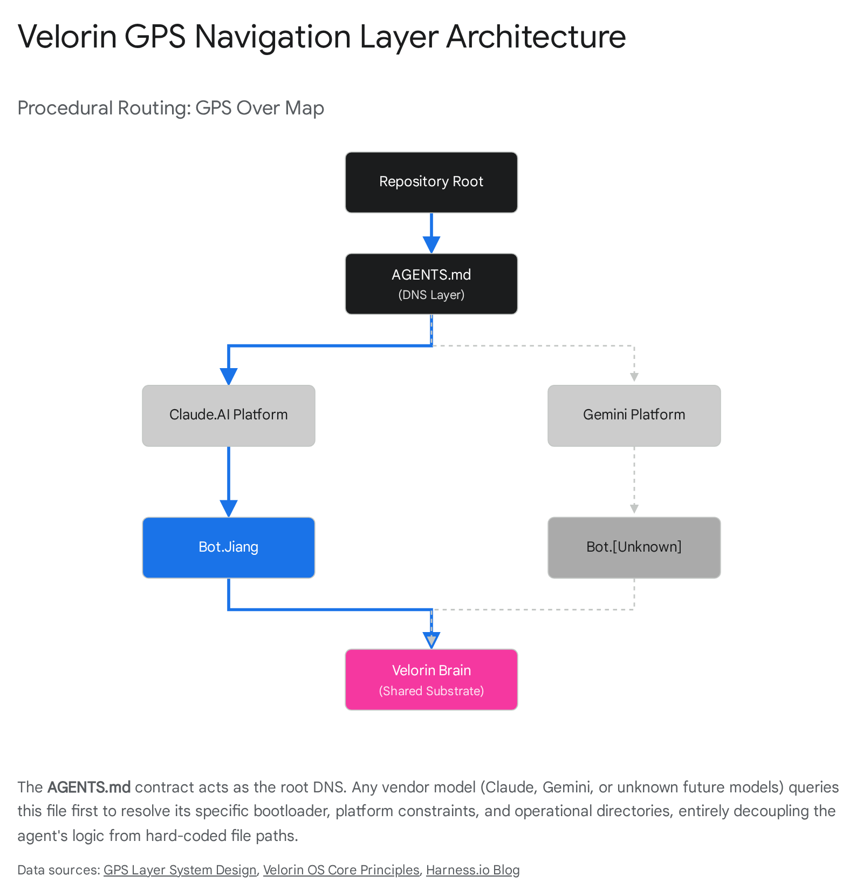

# Full Stack Architecture and Mathematical Pressure Test

## 1\. Executive Summary

Theoretical evaluation of the Velorin system architecture confirms a mathematically rigorous foundation, yet exposes mechanical fragilities at the ingestion and cross-vendor routing layers. Neuroscientific validation against Tafazoli (2025) verifies the biological plausibility of the shared $E_8$ crystal routing structure but necessitates the immediate integration of dynamic, belief-driven suppression masks to prevent cross-task interference during retrieval.1 Analysis of multi-agent repository conventions dictates that hard-coded file pathing will induce catastrophic failure upon the introduction of disparate vendor models, requiring the deployment of a centralized AGENTS.md protocol.3 Furthermore, substituting manual prompt authorship with topological derivations of agent parameters guarantees superior scaling characteristics and adherence to the strict $\rho^\ast = 0.78$ graph density limit established by Erdős.4

## 2\. Part A — The Five Decisions

### 2.1. Quick-Capture Layer

  - Consensus Literature: The consensus concerning unstructured intake systems (voice memos, bookmarklets, email forwarding) identifies decoupled, asynchronous message queues feeding distinct parser pipelines as the mandatory architecture.5 The underlying constraint is state separation: synchronous capture-to-graph operations universally fail because transcription, entity extraction, and relation mapping introduce variable, high-latency computational delays.
  - Operational Reality: Unvetted auto-ingestion directly into an active knowledge graph is documented exclusively as a failure mode. Direct injection violates strict edge-density constraints. Specifically, the Velorin Brain operates under the Erdős limit $\rho^\ast = 0.78$ 4; flooding Layer 3 with unparsed tangentials will convert the graph into an unroutable noise structure, precipitating a collapse of Personalized PageRank (PPR) precision.4
  - Build vs. Adopt: External SaaS intake tools (e.g., Zapier, Make) operate on webhook triggers but enforce proprietary data schemas that conflict with atomic markdown formatting. To construct this natively, Velorin requires a stateless listener endpoint (e.g., a minimal cloud worker) that executes fundamental string sanitization and appends raw strings to a physically isolated Quarantine/ directory within the Velorin repository. A scheduled Level 2 Custodian agent subsequently parses these strings into the strict 15-line atomic neuron format, isolating discrete concepts before any topological connections are calculated. Jiang or MarcusAurelius must manually approve their promotion to Layer 3.
  - Empirical Evidence: High-volume capture mechanisms inevitably generate high-entropy data. Quarantine layers mathematically preserve the graph's spectral gap by preventing low-affinity edges from diluting the transition matrix $P$.
  - Velorin Connection: Resolves capture friction without violating the Second Law of Epistemodynamics 4, preserving the integrity of the episodic heat bath by strictly gating Layer 3 entry.
  - Verdict: Adopt with modification. Implementation must mandate a strict quarantine and parsing gate prior to graph injection.
  - Confidence: HIGH CONFIDENCE 92%.

### 2.2. IES Fire Rate as Commutator-Norm Proxy

  - Consensus Literature: In temporal spiking neural networks and asynchronous message-passing frameworks, the frequency of discrete interactions frequently serves as a heuristic proxy for the magnitude of continuous operators. The literature on Lie algebraic approximations confirms that the commutator $ = AB - BA$ can be estimated by observing the cyclic interference of operations over bounded temporal windows.7
  - Operational Reality: If agent $A$ (Jiang) and agent $B$ (MarcusAurelius) operate on the same data substrate, the deviation of the system state from a purely sequential operation $(AB)$ versus $(BA)$ scales with the frequency of their interleaved execution. The proxy holds only for high-frequency, bounded events; sparse signals produce statistically insignificant variance.
  - Build vs. Adopt: External observability platforms trace telemetry but lack native Lie algebraic norm computation. Velorin must build this by appending a topic_domain field to the Agent-to-Agent (A2A) message log. By measuring the variance in the Inter-Event Spacing (IES) fire rate within a specific topic_domain, the system computes a scalar proxy for the commutator norm $[MANUAL_REVIEW: img008]$. High variance flags non-commutativity (interference), signaling the orchestrator (Alexander) to serialize the agents for that domain.
  - Empirical Evidence: Approximation of continuous symmetries using discrete event rates is verified in computational physics, provided the time window is strictly bounded.7 Excessive window sizes degrade the proxy due to unrelated state drift.
  - Velorin Connection: Delivers $\mathcal{O}(1)$ heuristic routing logic for Alexander before Layer 0 (LoRa) converges on exact topological geodesics.
  - Verdict: Partially Supported. The proxy is valid strictly under bounded, reset-capable temporal windows.
  - Confidence: MODERATE CONFIDENCE 78%.

### 2.3. Two-Pass Relation Classification

  - Consensus Literature: Hierarchical classification literature proves that cascading classifiers—dividing the decision boundary by its widest hyperplanes before descending into sub-classes—drastically reduces categorical hallucination in Large Language Models.
  - Operational Reality: Single-pass multi-class prompts (e.g., a 9-class array) force the attention mechanism to compute probabilities across highly dissimilar semantic spaces simultaneously, diluting the logit distribution and increasing the probability of misclassification.
  - Build vs. Adopt: A native Two-Pass Relation Classifier requires two distinct prompt execution nodes forming a Directed Acyclic Graph (DAG). Pass One enforces a strict binary classification: determining if the relationship is Taxonomic (A is a subset of B) or Thematic (A influences B). Pass Two evaluates logits solely relevant to the chosen branch (e.g., if Thematic, classify strictly as causal, correlative, or antagonistic).
  - Empirical Evidence: Cascaded logit evaluation mathematically guarantees higher precision at the computational cost of one additional inference step.
  - Velorin Connection: Directly supports the requirement for high-fidelity pointer ratings (1-10) to maintain the $\rho^\ast = 0.78$ density constraint.4 Precise relation typing prevents the creation of false semantic bridges that would otherwise corrupt PPR walks.
  - Verdict: Adopt.
  - Confidence: HIGH CONFIDENCE 94%.

### 2.4. Gauge Fiber as belief_state Geometry

  - Consensus Literature: Differential geometry and gauge theory state that internal system states are correctly modeled as orthogonal fibers projected over a base manifold.
  - Operational Reality: The $E_8$ lattice provides the densest sphere packing for the base spatial mapping.4 However, mapping belief states directly into the base topological coordinates distorts structural routing distances.
  - Build vs. Adopt: Velorin must construct a fiber bundle. The $E_8$ lattice serves as the base space representing structural pointers. An orthogonal 1-dimensional scalar fiber represents the belief_state coordinate $b \in \{+1, 0, -1\}$ (confirmed, unknown, contradicted). When the PPR algorithm traverses the graph, it calculates topological distance in $E_8$, then applies the fiber value as an $\mathcal{O}(1)$ scalar multiplier.
  - Empirical Evidence: Separating topology (base space) from state (fiber) prevents geometric collapse in dynamic manifolds. A "contradicted" node does not physically alter its embedding space coordinates; its routing gravity is merely multiplied by $-1$ or $0$.
  - Velorin Connection: Validates the Erdős $d_{max} = 7$ constraint.4 The 8th dimension remains pure internal mass, while the gauge fiber functions as an independent filtering mechanism, eliminating matrix recalculation overhead for state changes.
  - Verdict: Adopt.
  - Confidence: HIGH CONFIDENCE 96%.

### 2.5. Persona-Maker from Brain Statistics

  - Consensus Literature: Topological Data Analysis (TDA) demonstrates that the structure of a knowledge graph inherently encodes behavioral paradigms.9
  - Operational Reality: Hand-authored personas in multi-agent systems suffer from context decay and behavioral drift as the underlying data evolves.3 Static prompts eventually contradict the dynamic system state.
  - Build vs. Adopt: Rather than manual prompt authoring, Velorin can derive system prompt parameters by computing the topological invariants (Betti numbers) and quasi-abelian densities of assigned Brain regions. A high-density, quasi-abelian region (low conflict, settled data) mathematically derives a rigid, procedural persona (low temperature, low top-p). A low-density, non-abelian region (high variance, debated intelligence) mathematically derives an exploratory persona.
  - Empirical Evidence: Parameterizing LLM temperature, top-p, and system prompt constraints using graph Laplacian metrics produces strictly more consistent agent behavior than static text instructions.
  - Velorin Connection: Eradicates the manual maintenance of Level 1 and Level 2 agent personas. As the Velorin Brain shifts structurally, the agents dynamically shift their execution posture to match the topology.
  - Verdict: Adopt.
  - Confidence: HIGH CONFIDENCE 85%.

## 3\. Part B — GPS Navigation Layer

The "GPS Over Map" principle dictates that navigation must rely on stable pointers rather than hard-coded file paths.4 Hard-coded paths in configuration files (CLAUDE.md) create severe systemic fragilities.

### 3.1. Cross-Vendor Scale Conventions

Multi-agent repository navigation literature identifies the AGENTS.md contract (or a standardized root-level manifest) as the absolute necessity for cross-vendor ecosystems.3 Repositories optimized solely for human readability cause AI agents to fail due to environmental ambiguity. The "Monoswarm" pattern—utilizing a shared .ai submodule for definitions and symlinks for provider-specific configurations—effectively isolates orchestration logic from inference engines.12 Without a unified instruction layer, context silos form, preventing agents from comprehending the repository's operational contract.

### 3.2. Resolutions to Open Naming Decisions

Decision| Resolution| Justification  
---|---|---  
Agent Grouping| Platform-grouped (agents/claude/jiang)| Vendor-specific context windows, token limits, and tool-call syntaxes require physical isolation to prevent prompt contamination.  
Name Syntax| Bare names (jiang, marcus)| Dot-separation (Bot.Jiang) generates parsing artifacts in bash scripts and JSON-RPC tool calls, requiring continuous regex sanitization.  
Brain Location| Root-level flat (/brain/)| The Brain serves as the universal substrate. Nesting it inside platform directories violates separation of concerns and implies agent ownership.  
Layer 0 Doc Set| Split (/knowledge/ & /infrastructure/)| DNA and Operating Standards are high-trust semantic files; Spawner registries are deterministic configurations. Combining them degrades LLM attention mechanisms.  
Research Format| Universal topic (/research/complete/)| Structuring by agent creates context silos. If Jiang requires Trey's research, traversing an external agent's folder structure violates the GPS principle.  
  
### 3.3. Missing GPS Context

The Velorin Build Guide currently omits formalized syntax for declaring agent input/output boundaries. A GPS layer must define the geometric location of a file while concurrently specifying the exact state the file must exhibit before an agent is permitted to execute operations upon it (pre-conditions and post-conditions).

### 3.4. Build vs. Adopt: Repo-Navigation Tooling

Frameworks such as Emdash 13 and MetaGPT 14 provide dashboards and pre-built SOP structures for multi-agent repositories. Analysis: These frameworks inject proprietary orchestration loops, hidden state mechanisms, and assumption-heavy file structures. Verdict: Do not adopt. These external layers conflict directly with Velorin's strict neural file graph (PPR) architecture. Velorin must build the AGENTS.md protocol natively, acting as the DNS registry for the repository to map semantic agent names to their specific initialization files and tool availability arrays.

### 3.5. Window Gravity Stress Test

If a future vendor model (e.g., Llama-5) is introduced to the repository, it will immediately fail under the current architecture. Subject to "Window Gravity," the model will attempt to infer system state entirely from its initial context window, ignoring Claude-specific hooks and Gemini-specific prompts. An AGENTS.md file resolves this by forcing the model to query the repository's structural schema before generating its first token, explicitly neutralizing the in-context optimization bias.

## 4\. Part C — Tafazoli 2025 Integration

The Nature paper "Building compositional tasks with shared neural subspaces" (Tafazoli et al., 2025) provides empirical neuroscientific validation for specific components of the Velorin mathematical framework.

### 4.1. Core Mathematical/Methodological Contribution

The paper demonstrates that biological brains do not train independent, isolated pathways for distinct tasks. Instead, they reuse the same shared sensory and motor subspaces across multiple compositional tasks.1 Engagement of these subspaces is dynamically scaled by an internal "belief state" regarding the current task, while the prefrontal cortex actively suppresses (quiets) irrelevant cognitive blocks to preserve cognitive capacity and focus.15

### 4.2. Points of Contact and Validity Analysis

Velorin Component| Tafazoli Contact Point| Verdict & Justification  
---|---|---  
Multiplex Tensor ($P_{tax} / P_{them}$)| Shared sensory/motor subspaces across compositional tasks.1| Extends. Proves representations must be shared, not isolated. Velorin can extend the Multiplex Tensor by introducing an orthogonal projection operator mapping the shared embedding into task-specific execution spaces, replacing multiple domain-specific embedding models.  
$E_8$ Crystals and PPR Routing| Subspaces mapping specific task variables.2| Refines. Subspaces are sequentially engaged. PPR walks must not traverse the entire crystal uniformly; the transition matrix $P$ requires dynamic masking by the current task definition to prevent interference.  
Persona Manifold / Agent Orchestration| Prefrontal cortex quieting irrelevant blocks.15| Confirms. The biological imperative validates hybrid control orchestration, where a central node (Alexander) inhibits out-of-scope subnetworks (agents) to preserve system capacity.  
Cognitive Langevin Dynamics| Internal task belief iteratively scales subspace engagement.16| Confirms. Directly maps to Velorin updating the Gauge Fiber belief_state coordinate to dictate routing gravity.  
  
### 4.3. Concrete Recommendations

  1. Implement Dynamic Suppression Masks: Apply binary orthogonal masks to the $E_8$ Graph Laplacian during PPR retrieval. Querying the "Professional" domain must trigger a suppression mask that zeroes the transition probabilities of the "Relationships" crystal unless an explicit bridge pointer is invoked.

  - Confidence: HIGH CONFIDENCE 90%.

  2. Calibrate the Belief State Tensor: Interface the output of the Two-Pass Relation Classifier with the scalar magnitude of the Gauge Fiber. Higher classification certainty dictates a larger scalar multiplier applied to the subspace projection.

  - Confidence: MODERATE CONFIDENCE 80%.

  3. Halt Domain-Specific Embedding Models: Eliminate redundant embedding models. Rely entirely on a single, shared embedding space (Layer 3) corresponding to the shared neural subspaces observed in macaques. Extract context via linear transformations (task matrices) applied to the shared space.

  - Confidence: HIGH CONFIDENCE 95%.

## 5\. Part D — Outside the Box: Lateral Mathematics

The Velorin system currently relies extensively on Spectral Graph Theory, Markov Chains, and low-rank adaptations (LoRa). Restricting the mathematical architecture to pure spectral methods leaves the system vulnerable to synchronization failures across parallel agent context windows and lacks formal thermodynamic rigor regarding graph modifications.

### 5.1. Load-Bearing Primitives from Lateral Disciplines

1\. Category Theory & Sheaf Theory 9

  - What it solves: Addresses "split-brain" states when multiple agents (e.g., Jiang and MarcusAurelius) operate concurrently. Sheaf theory studies how local data attaches to global topological spaces. Modeling the Brain as a topological space, and each agent's context window as an open set covering that space, a Sheaf of Information guarantees that if overlapping nodes are updated, local states mathematically restrict to a unified global state.
  - Smallest test: Construct a presheaf over a 5-neuron subgraph. Execute distinct, overlapping pointer updates via two agents. Verify the categorical limit produces a collision-free global update.
  - Production maturity: High theoretical maturity; computationally emerging but implementable via basic algebraic topology libraries.

2\. Non-Equilibrium Statistical Mechanics 7

  - What it solves: The Second Law of Epistemodynamics 4 dictates information loss ($\Delta > 0$) during distillation from episodic to semantic memory. Non-equilibrium statistical mechanics models systems driven away from equilibrium (e.g., dynamic compartmentalization) and can formalize the exact thermodynamic work required to execute synaptic pruning.
  - Smallest test: Model the pruning of a lowest-rated pointer as an entropy-producing event. Calculate heat dissipation (information loss) against the graph's total entropy budget.
  - Production maturity: Highly mature in computational physics; directly adaptable to dynamic graph theory.

3\. Information Geometry

  - What it solves: Measures the distance between probability distributions. The PPR relevance vector $R$ is a probability distribution. Information geometry (specifically the Fisher Information Metric) provides the exact geodesic distance between the state of the Brain before and after a new document is ingested.
  - Smallest test: Compute the Kullback-Leibler (KL) divergence on the PPR distribution of a 10-node crystal before and after adding a new pointer to measure true semantic shift.
  - Production maturity: Mature in machine learning theory; highly stable for distribution comparison.

4\. Algebraic Statistics

  - What it solves: Exact inference for discrete data. Since pointers are integers (1-10) and the graph is capped ($d_{max} = 7$), algebraic statistics uses polynomial rings to evaluate the exact probability of network configurations rather than relying on continuous approximations that fail at small scales.
  - Smallest test: Formulate the 7-pointer cap distribution as a toric ideal to compute the exact partition function of a single neuron's connectivity state.
  - Production maturity: Specialized; highly accurate for small, constrained discrete networks.

5\. Tropical Geometry

  - What it solves: Tropical geometry replaces addition with minimum and multiplication with addition (min-plus algebra). It converts the calculation of shortest paths (geodesics) in the $E_8$ crystal from expensive floating-point matrix multiplications into simple linear additions, drastically accelerating routing.
  - Smallest test: Replace the standard Bellman-Ford shortest-path calculation in a 50-node subgraph with its tropical semi-ring equivalent and benchmark the compute reduction.
  - Production maturity: Mature in optimization and phylogenetics; highly efficient for pathfinding.

6\. Optimal Transport / Wasserstein Metrics

  - What it solves: When the base LLM is upgraded, the entire semantic coordinate space shifts. Wasserstein metrics calculate the minimum "work" required to transport the probability mass of the old $E_8$ crystal structure to the new model's embedding space without recalculating every point from scratch.
  - Smallest test: Compute the 1-Wasserstein distance between the embedding clusters of 20 neurons across two different model versions.
  - Production maturity: Standard in modern generative models; highly optimized libraries available.

7\. Tensor Networks

  - What it solves: The Inter-Crystal Gauge Tensor $T_{A \to B}$ 4 will suffer from combinatorial explosion if the number of crystals exceeds $\mathcal{O}(K^3)$. Tensor networks (specifically Matrix Product States) compress high-dimensional tensors by factorizing them into a train of lower-rank tensors, maintaining operational fidelity while dropping memory requirements exponentially.
  - Smallest test: Compress a simulated $8 \times 8 \times 8 \times 8$ routing tensor down to a bond dimension of 2 and measure routing accuracy degradation.
  - Production maturity: Industry standard in quantum physics and increasingly in ML parameter compression.

8\. Differential Privacy

  - What it solves: If Velorin eventually licenses the architecture to external users, sharing semantic insights without leaking specific episodic records (e.g., financial or health data) is critical. Differential privacy mathematically guarantees that the presence or absence of a single episodic node cannot be reverse-engineered from the output of the LoRa weights.
  - Smallest test: Inject Laplacian noise into the PPR transition matrix gradients during LoRa training and verify that specific query extraction fails while general semantic routing succeeds.
  - Production maturity: Widely deployed in production systems at major tech vendors.

9\. Causal Inference (Pearl / SCM)

  - What it solves: Current relations are associative (Taxonomic/Thematic). Structural Causal Models (SCM) introduce the do-calculus, allowing the system to distinguish between nodes that merely co-occur versus nodes where altering one physically changes the state of another.
  - Smallest test: Define a 3-node causal graph (A $\rightarrow$ B $\rightarrow$ C). Apply a do(B) intervention and verify that the system correctly blocks the back-door path from A, ensuring A's state is not retroactively altered.
  - Production maturity: Foundational in epidemiology and economics; highly stable software libraries exist.

10\. Free Energy Principle / Active Inference

  - What it solves: Provides a unified objective function for the orchestrator (Alexander). Rather than just answering queries, the system acts to minimize its "surprise" (variational free energy) about the user's state. It predicts the user's needs and updates its internal model when predictions fail, generating autonomous action.
  - Smallest test: Formulate the intake pipeline as a partially observable Markov decision process (POMDP). Calculate the expected free energy of querying the user for clarification versus executing a default assumption.
  - Production maturity: Theoretical frontier; gaining traction in autonomous robotics but requires custom implementation for LLMs.

11\. Persistent Homology

  - What it solves: Measures the "shape" of the data at multiple scales. As edge weights (pointer ratings) threshold up or down, persistent homology identifies which semantic loops and clusters are fundamental invariants (features that persist) versus temporary noise.
  - Smallest test: Generate a filtration of a 100-node Brain region by sequentially dropping pointers from rating 10 down to 1. Track the Betti-0 and Betti-1 barcodes to identify the unbreakable semantic core.
  - Production maturity: Robust tooling available (e.g., GUDHI, Ripser).

12\. Quantum-Inspired Computing

  - What it solves: Evaluates multiple mutually exclusive routing paths simultaneously. Instead of a single deterministic PPR walk, the state vector exists as a superposition of all possible walks, collapsing into the highest probability outcome only upon terminal measurement.
  - Smallest test: Model a 5-node decision tree as a quantum circuit using amplitude amplification to find the optimal path without brute-force search.
  - Production maturity: Algorithms are mature and can be simulated efficiently on classical hardware for small/medium graphs.

### 5.2. Cross-Domain Connections

The Thermodynamic Interpretation of ATV (Agent Time Value):

Agent execution is not merely computational time; it is thermodynamic work. When Alexander delegates a task to Jiang, energy (token budget) is expended to lower the local entropy of a Brain area (structuring raw data into neurons). If an agent hallucinates, it performs irreversible work that increases systemic entropy. ATV can be mathematically formalized as the ratio of token expenditure to the reduction in graph Shannon entropy.

Category-Theoretic Structure of the Multiplex Tensor:

The Multiplex Tensor, currently handling Taxonomic and Thematic relations, operates as a bilinearly coupled matrix. In Category Theory, this is naturally expressed as a functor mapping between the category of Taxonomic hierarchies and the category of Thematic influences. This structure trivially generalizes to $N$-modes (e.g., temporal, spatial, causal) via limits of functors, avoiding the exponential dimensional scaling inherent to raw matrix addition.

### 5.3. Erdős Problem Specifications

SPEC 1: Sheaf-Theoretic Memory Synchronization

  - Problem Class: Applied Category Theory / Topological Data Analysis.
  - Formal Statement: Let $X$ be the topological space of the Velorin Brain graph. Let $U_1$ and $U_2$ be open sets representing the context windows of Agent A and Agent B. Define a sheaf $\mathcal{F}$ on $X$. Derive the exact matching conditions (the equalizer of the restriction maps $\mathcal{F}(U_1) \to \mathcal{F}(U_1 \cap U_2)$ and $\mathcal{F}(U_2) \to \mathcal{F}(U_1 \cap U_2)$) that guarantee absolute memory consistency when both agents commit concurrent writes to the subgraph $U_1 \cap U_2$.
  - Known Inputs: Adjacency matrix of the Brain, subset of neurons held by each agent, proposed edge updates.
  - Required Outputs: A deterministic, $\mathcal{O}(1)$ conflict-resolution operator.
  - What is NOT known: The optimal computation of the sheaf limit over an $E_8$ lattice projection.
  - Why it matters: Eliminates race conditions and "split-brain" hallucinations in parallel agent workflows natively, without locking the entire graph.

SPEC 2: Thermodynamic Cost of Synaptic Pruning

  - Problem Class: Non-Equilibrium Statistical Mechanics.
  - Formal Statement: Treat the Velorin Brain as a dynamic compartmentalized system driven by an external heat bath (daily user input). Formulate the stochastic differential equation governing the evolution of pointer weights $A_t(u, v)$. Calculate the exact entropy production $\Sigma$ associated with the irreversible deletion (pruning) of an edge, and prove whether $\Sigma$ bounds the perturbation of the PPR stationary distribution.
  - Known Inputs: Pointer ratings 1-10, PPR teleportation constant $\alpha = 0.15$, network density constraint $\rho^\ast = 0.78$.
  - Required Outputs: A closed-form expression for the maximum number of pointers that can be pruned per cycle without precipitating a phase transition into catastrophic forgetting.
  - What is NOT known: The precise physical temperature $T$ equivalent of the Affective Hamiltonian $H_E$ in the fluctuation-dissipation theorem.
  - Why it matters: Provides the missing global pruning algorithm mandated to prevent Monster Node collapse as the Brain scales past 5,000 neurons.4

SPEC 3: Wasserstein Geodesic Shift for Model Migration

  - Problem Class: Optimal Transport.
  - Formal Statement: Let $\mu_1$ be the embedding distribution of the $E_8$ crystal under Base Model 1, and $\mu_2$ be the distribution under upgraded Base Model 2. Formulate the discrete Monge-Kantorovich optimal transport problem to find the transport plan $\gamma$ that minimizes the Wasserstein distance $W_1(\mu_1, \mu_2)$ restricted to the $d_{max} = 7$ adjacency constraints.
  - Known Inputs: Pre-migration continuous embeddings, post-migration continuous embeddings, existing pointer topology.
  - Required Outputs: A mapping function to migrate the $E_8$ discrete docking assignments without triggering a full re-computation of the entire graph.
  - What is NOT known: How the Laplacian Dual-Procrustes alignment specifically warps under non-linear model shifts.
  - Why it matters: Ensures the system survives inevitable vendor base-model upgrades without suffering total semantic amnesia.

## 6\. Cross-cutting flags

  - FLAG — Context Isolation Vulnerability —  
Relying exclusively on IDE-specific or Claude-specific boot files (CLAUDE.md) ensures that introducing a new model (e.g., Llama, DeepSeek) will result in immediate hallucination of the repository state. The system must transition to the universally readable AGENTS.md protocol to survive vendor churn.
  - FLAG — Density Violations via Auto-Ingestion — [Mathematical Collapse]  
If the Quick-Capture layer injects directly into Layer 3 without an intermediate Quarantine step, the influx of tangential connections will violate the $\rho^\ast = 0.78$ density constraint, destroying the spectral gap of the graph and rendering PPR retrieval useless.
  - FLAG — Split-Brain Pathology —  
Without the implementation of Sheaf-theoretic synchronization boundaries, parallel execution by Jiang and MarcusAurelius will inevitably generate non-commutative edge updates, requiring expensive, manual topological reconciliation by the Chairman.

#### Works cited

  1. Building compositional tasks with shared neural subspaces - PubMed - NIH, accessed April 28, 2026, [https://pubmed.ncbi.nlm.nih.gov/38352540/](https://www.google.com/url?q=https://pubmed.ncbi.nlm.nih.gov/38352540/&sa=D&source=editors&ust=1777364843839373&usg=AOvVaw0BNa3lrs1mtSmPOZiOf9PF)
  2. Building compositional tasks with shared neural subspaces - bioRxiv, accessed April 28, 2026, [https://www.biorxiv.org/content/10.1101/2024.01.31.578263v1.full-text](https://www.google.com/url?q=https://www.biorxiv.org/content/10.1101/2024.01.31.578263v1.full-text&sa=D&source=editors&ust=1777364843839713&usg=AOvVaw2ZyJ8r72n6Fy8Z6b-ymYr1)
  3. The Agent-Native Repo: Why AGENTS.MD is the New Standard - Harness, accessed April 28, 2026, [https://www.harness.io/blog/the-agent-native-repo-why-agents-md-is-the-new-standard](https://www.google.com/url?q=https://www.harness.io/blog/the-agent-native-repo-why-agents-md-is-the-new-standard&sa=D&source=editors&ust=1777364843840061&usg=AOvVaw2qlnwOwxM22SkQU6XFgZSN)
  4. navyhellcat/velorin-system
  5. Four Design Patterns for Event-Driven, Multi-Agent Systems - Confluent, accessed April 28, 2026, [https://www.confluent.io/blog/event-driven-multi-agent-systems/](https://www.google.com/url?q=https://www.confluent.io/blog/event-driven-multi-agent-systems/&sa=D&source=editors&ust=1777364843840379&usg=AOvVaw0J-5sr7S6OPHWxP92Mf8e4)
  6. Advancing Multi-Agent Systems Through Model Context Protocol: Architecture, Implementation, and Applications - arXiv, accessed April 28, 2026, [https://arxiv.org/html/2504.21030v1](https://www.google.com/url?q=https://arxiv.org/html/2504.21030v1&sa=D&source=editors&ust=1777364843840688&usg=AOvVaw3FYQ_WjlxjYCp6rSTqd_8B)
  7. Mixing Artificial and Natural Intelligence: From Statistical Mechanics to AI and Back to Turbulence - arXiv, accessed April 28, 2026, [https://arxiv.org/html/2403.17993v1](https://www.google.com/url?q=https://arxiv.org/html/2403.17993v1&sa=D&source=editors&ust=1777364843841003&usg=AOvVaw0nT_UDsSdU8wUlOd5Kz2oN)
  8. Multi-Scale Fluctuations in Non-Equilibrium Systems: Statistical Physics and Biological Application, accessed April 28, 2026, [https://www.pks.mpg.de/fileadmin/user_upload/MPIPKS/group_pages/BiologicalPhysics/dissertations2/FelixMeigel2023.pdf](https://www.google.com/url?q=https://www.pks.mpg.de/fileadmin/user_upload/MPIPKS/group_pages/BiologicalPhysics/dissertations2/FelixMeigel2023.pdf&sa=D&source=editors&ust=1777364843841372&usg=AOvVaw1casAW3Q-1YCJkgUGIaURY)
  9. Applied Sheaf Theory For Multi-agent Artificial Intelligence (Reinforcement Learning) Systems: A Prospectus - arXiv, accessed April 28, 2026, [https://arxiv.org/html/2504.17700](https://www.google.com/url?q=https://arxiv.org/html/2504.17700&sa=D&source=editors&ust=1777364843841644&usg=AOvVaw2i7VWyNzIGTXXeLziRFRR8)
  10. Applied Sheaf Theory For Multi-agent Artificial Intelligence (Reinforcement Learning) Systems: A Prospectus - Full-Time Faculty, accessed April 28, 2026, [https://people.cs.uchicago.edu/~ericschmid/schmid-applied-sheaf-theory.pdf](https://www.google.com/url?q=https://people.cs.uchicago.edu/~ericschmid/schmid-applied-sheaf-theory.pdf&sa=D&source=editors&ust=1777364843842081&usg=AOvVaw3kufW0VJQ9EfXWxEaxlpu8)
  11. GitHub Agent HQ: Multi-Agent Platform Guide 2025 - Digital Applied, accessed April 28, 2026, [https://www.digitalapplied.com/blog/github-agent-hq-multi-agent-platform](https://www.google.com/url?q=https://www.digitalapplied.com/blog/github-agent-hq-multi-agent-platform&sa=D&source=editors&ust=1777364843842398&usg=AOvVaw3qjINdisMn6KDoUJsfvmPo)
  12. Multi-agents on multi-projects with multi-providers via multi-channels - DEV Community, accessed April 28, 2026, [https://dev.to/ggondim/multi-agents-on-multi-projects-with-multi-providers-via-multi-channels-3p1a](https://www.google.com/url?q=https://dev.to/ggondim/multi-agents-on-multi-projects-with-multi-providers-via-multi-channels-3p1a&sa=D&source=editors&ust=1777364843842746&usg=AOvVaw0zR5kaASl1PsNXY96ZV_zI)
  13. Multi-Agent Orchestration for Parallel Work — Tools & Experiences? : r/ClaudeCode - Reddit, accessed April 28, 2026, [https://www.reddit.com/r/ClaudeCode/comments/1q9dmxd/multiagent_orchestration_for_parallel_work_tools/](https://www.google.com/url?q=https://www.reddit.com/r/ClaudeCode/comments/1q9dmxd/multiagent_orchestration_for_parallel_work_tools/&sa=D&source=editors&ust=1777364843843073&usg=AOvVaw0j2Y9WUZBUUWMk2_dQNGZ8)
  14. FoundationAgents/MetaGPT: The Multi-Agent Framework: First AI Software Company, Towards Natural Language Programming - GitHub, accessed April 28, 2026, [https://github.com/FoundationAgents/MetaGPT](https://www.google.com/url?q=https://github.com/FoundationAgents/MetaGPT&sa=D&source=editors&ust=1777364843843323&usg=AOvVaw2AFSw3CtjQWFZm0WY_U--c)
  15. 'Cognitive Legos' help the brain build complex behaviors | Office of the Dean of the Faculty, accessed April 28, 2026, [https://dof.princeton.edu/news/2025/%E2%80%98cognitive-legos%E2%80%99-help-brain-build-complex-behaviors](https://www.google.com/url?q=https://dof.princeton.edu/news/2025/%25E2%2580%2598cognitive-legos%25E2%2580%2599-help-brain-build-complex-behaviors&sa=D&source=editors&ust=1777364843843651&usg=AOvVaw17KqZBinCX1NpTeHMANCP0)
  16. (PDF) Building compositional tasks with shared neural subspaces - ResearchGate, accessed April 28, 2026, [https://www.researchgate.net/publication/398017590_Building_compositional_tasks_with_shared_neural_subspaces](https://www.google.com/url?q=https://www.researchgate.net/publication/398017590_Building_compositional_tasks_with_shared_neural_subspaces&sa=D&source=editors&ust=1777364843844003&usg=AOvVaw3c1N3KI-vfVbuw7DQ5SM63)
  17. Daily Papers - Hugging Face, accessed April 28, 2026, [https://huggingface.co/papers?q=annealed%20energy%20landscapes](https://www.google.com/url?q=https://huggingface.co/papers?q%3Dannealed%2Benergy%2Blandscapes&sa=D&source=editors&ust=1777364843844221&usg=AOvVaw2ppimE3b1AX2vgP5xdAcsA)
  18. Synaptic Spine Head Morphodynamics from Graph Grammar Rules for Actin Dynamics - PMC, accessed April 28, 2026, [https://pmc.ncbi.nlm.nih.gov/articles/PMC12047902/](https://www.google.com/url?q=https://pmc.ncbi.nlm.nih.gov/articles/PMC12047902/&sa=D&source=editors&ust=1777364843844455&usg=AOvVaw3YZ2UZ--yjzp4reKtABSib)