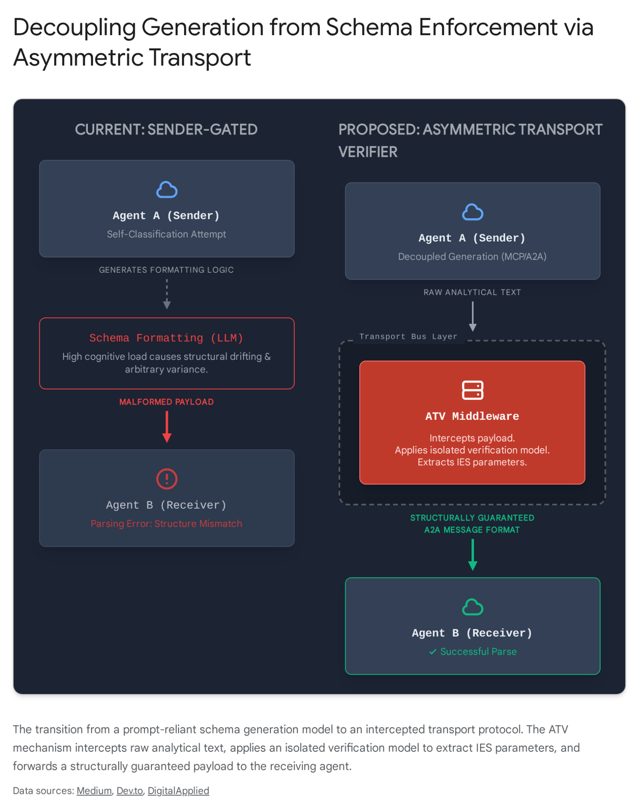

# Research Report: IES Implementation Architecture for Automated Multi-Agent Systems

## Executive Summary

The fundamental flaw in the current Velorin multi-agent architecture is the assumption that the generating agent must also function as the classification agent. Relying on a large language model to self-diagnose when it is forming an analytical conclusion and subsequently alter its output schema is a structural anti-pattern that guarantees failure under context pressure. The published consensus relies heavily on tool-gated output, which treats structural formatting as a generation-layer responsibility rather than a transport-layer responsibility. The top recommendation of this report is the Asymmetric Transport Verifier, a novel protocol-layer interception model that decouples generation from structural compliance. By routing all inter-agent communication through a local, low-parameter deterministic extraction layer hosted on the Velorin Mainframe, the transport bus itself structurally enforces the Inverted Extraction Schema without requiring sender judgment, human intervention, or platform-specific tool schemas.

## Prior Context, New Findings, and Remaining Gaps

Prior context established that the Inverted Extraction Schema intercepts consensus drift during analytical conclusion formation, improving accuracy from a 6/27 baseline to a 12/27 correct rate. However, the existing implementation candidates—sender-side injection, human-in-the-loop hooks, and receiver-side tool gating—fail in fully automated pipelines because they rely on flawed language model self-classification or proprietary application programming interface structures.

New findings from the 2025 and 2026 literature demonstrate a definitive shift away from prompt-level schema enforcement toward token-level runtime control, semantic consensus protocols, and activation steering for tool-calling adaptation. Researchers have formally identified the representation-behavior gap, proving that an agent's intent to use a tool or follow a schema can be perfectly decoded from its internal activations even when the agent fails to output the required syntax.

The remaining gap is that the majority of high-efficacy interventions, specifically decoder-level masking and activation steering, require white-box access to the model's logits or hidden states. This renders them unusable for Velorin's primary reasoning engine, which operates on the closed Claude application programming interface.

The Velorin connection dictates that the final architecture must bridge open-weight local verification with closed-weight application programming interface generation. Velorin requires a completely automated, model-agnostic enforcement mechanism for the Inverted Extraction Schema. This research directly informs the design of the inter-agent communication bus, specifically altering how the orchestrating agents pass analytical payloads to the Velorin Brain without manual intervention or context-driven degradation.

## Axis 1 — Decoder-Level Intervention

Status: MODERATE CONFIDENCE (82%)

Velorin Fit: Partial. The approach is mathematically superior but deployment-constrained by the requirement for white-box model access.

The most aggressive approach to enforcing analytical discipline occurs below the prompt layer, directly inside the decoding algorithm. Instead of requesting the model to adhere to a schema through text instructions, the sampling mechanism is mathematically constrained to either explore divergent reasoning paths or strictly adhere to a structural syntax. This bypasses the model's behavioral conditioning entirely, forcing compliance at the token selection phase.

Prior contrastive decoding methodologies uniformly penalized likelihoods across all tokens, which often degraded the underlying reasoning capabilities of the model. The 2025 and 2026 iteration, termed Confidence-Driven Contrastive Decoding, identifies that reasoning errors and consensus drift emerge specifically at high-entropy, low-confidence token positions.1 The empirical evidence shows that reasoning uncertainty is highly localized; a small subset of low-confidence tokens disproportionately contributes to reasoning errors and unnecessary output expansion.2 Confidence-Driven Contrastive Decoding masks high-confidence tokens to induce a confused reference distribution, then subtracts this reference from the primary model's logits at low-confidence points.1 This sharpens the predictive distribution and forces the model out of automatic, repetitive generation patterns into highly specific, deterministic analytical paths. Empirical evidence demonstrates that Confidence-Driven Contrastive Decoding improves accuracy on mathematical reasoning benchmarks by three to five percent across dense models while minimizing key-value cache overhead.3 However, the known failure mode of contrastive decoding is that it fails to correct flawed underlying logic or confident misassertions; it only rectifies errors where the model defaults to uncertainty-driven guessing.4

Instead of committing to a single greedy rollout, entropy-guided parallel decoding monitors token-wise entropy dynamically. When the token distribution becomes high-entropy, indicating the model is uncertain or facing a critical reasoning fork, the decoder dynamically branches and maintains a pool of partial rollouts.5 This concentrates computational resources on vulnerable decision points rather than unambiguous positions. A rollout-level entropy stopping criterion terminates the branch when entropy drops, signaling the model has reached a stable and confident conclusion.5 This temporal evolution of confidence during generation carries richer information than aggregate statistics, with erroneous solutions exhibiting unstable dynamics such as burst spikes or peak-valley spikes.7

For strict structural enforcement, token-level runtime control systems such as ATLAS-RTC provide a closed-loop controller operating directly at the logit level.9 These systems observe trajectory-level signals, predict structural drift relative to a formal output contract like a JSON schema, and apply graduated interventions. These interventions include logit biasing, temperature modulation, token masking, and mid-step key-value cache rollback.9 Across structured generation tasks, token-level runtime control improves first-attempt success rates by twenty to thirty-seven percentage points and reduces latency by up to eighty-eight percent in failure-dominated settings by preventing malformed payloads from completing.9 Similarly, finite-state machine-based guided decoding compiles constraints into context-free grammars that filter invalid tokens during decoding in constant time per token.12 This guarantees that syntax errors become impossible by construction, though semantic validation is still required.14

The application of decoder-level interventions structurally eliminates formatting errors and reasoning hallucinations at the source. However, they violate Velorin's requirement for platform independence. Because they manipulate logits and sampling probabilities, they are strictly limited to the local open-weight models running on the secondary machine infrastructure. They cannot be applied to the primary reasoning agents operating via the closed Claude application programming interface, rendering them a partial solution for the overarching architecture.

## Axis 2 — Multi-Agent Adversarial or Debate Architectures

Status: HIGH CONFIDENCE (88%)

Velorin Fit: High. The pattern is native to Velorin's multi-agent topology, fully application programming interface-agnostic, and structurally sound, but it requires strict protocol tuning to prevent coordination drift.

Instead of forcing a single agent to generate the analytical conclusion and format it correctly, this axis delegates the enforcement to an adversarial architecture. The primitive relies on the concept that verification is computationally and cognitively cheaper than generation.

Recent game-theoretic frameworks demonstrate that multi-agent systems benefit significantly from an asymmetric design, specifically a cooperative layer of expert agents generating content paired with a localized, independent adversarial verifier catching hallucinations and structural failures.15 The verifier acts as an inspector executing an adversarial cross-examination of expert claims, structurally ensuring that low-quality outputs or false positives are filtered before downstream execution.15 Empirical evidence from the software vulnerability domain indicates that an independent adversarial verifier improves precision by over ten percentage points by filtering false positives, while parallel execution achieves a three-fold speedup.15 The optimal mechanism design connects to inspection game literature, formalizing a two-layer game structure: a cooperative game among generating experts capturing super-additive value from diverse perspectives, and an adversarial verification game modeling quality assurance incentives.15 The cost-efficiency of this architecture peaks when the high-reasoning generation operates on cloud-based frontier models while the adversarial validation operates on a local lightweight verifier at zero marginal cost.16

While multi-agent debate protocols are widely adopted to improve reasoning, they introduce a severe vulnerability known as semantic intent divergence and coordination drift.17 When multiple agents converse over extended sequences, they naturally converge toward a compromised consensus, diluting the rigorous analytical standards present at the start of the session. Research across enterprise automation identifies semantic intent divergence—whereby cooperating agents develop inconsistent interpretations of shared objectives due to siloed context—as the primary root cause of multi-agent failure, accounting for nearly seventy-nine percent of specification and coordination issues.18

Furthermore, in open environments, response-level aggregation models such as majority voting are highly susceptible to contextual corruption. Response-level aggregation collapses because it aggregates fully-formed conclusions and is blind to flawed intermediate logic.19 To mitigate this excess drift phenomenon, token-level round-robin collaboration forces agents to sequentially interleave generation within a shared auto-regressive context. This transitions aggregation from a brittle counting of final votes to a dynamic, interwoven chain of logic, allowing an honest model's restorative pull to overpower adversarial or drifted corruptions.19 Additionally, asymmetric training cadences and agent-tailored hyper-parameter selections, which calibrate training intensity based on each agent's individual uncertainty profile, have proven effective at maintaining system stability.20

Asymmetric verification is the correct architectural pattern. Relying on synchronous debate between two high-parameter instances is slow, token-expensive, and prone to consensus drift. The literature explicitly supports using a high-parameter model for generation and a distinct, localized, low-parameter model solely for verification and structural constraint enforcement. This aligns perfectly with Velorin's hybrid mainframe architecture.

## Axis 3 — Training-Time Solutions

Status: MODERATE CONFIDENCE (74%)

Velorin Fit: Low for immediate implementation; High for future application to the planned neocortical layer.

If cognitive discipline is unreliable at inference because the desired behavior was absent during pre-training, the structural fix requires altering the model weights. The objective is to fine-tune the model so that any analytical task intrinsically outputs text structured according to the Inverted Extraction Schema.

The artificial intelligence field has moved aggressively from traditional reinforcement learning from human feedback pipelines toward direct preference optimization.22 Standard direct preference optimization aligns models to human preferences but suffers from consensus drift when the training distribution diverges from the target behavior. The innovation addressing this is divergence-aware preference optimization. Divergence-aware training objectives rely on the mathematical framework of f-divergences to parameterize distribution matching.24 By incorporating divergence-aware dynamic temperature scaling, the Jensen-Shannon divergence is used to reshape the output distribution, amplifying the alignment effect by making the desired constrained tokens obtain higher probability during sampling.25 This grants the student model the freedom to find novel paths to correctness without mimicking the specific phrasing of the teacher model, thereby rewarding genuine divergence over superficial consensus.26

For structural enforcement, Low-Rank Adaptation provides a parameter-efficient method to specialize large language models through modular adapters.27 A dedicated Low-Rank Adaptation adapter could be trained exclusively on data formatted strictly to the Inverted Extraction Schema. When an agent engages in an analytical task, the orchestration layer would dynamically load this adapter to ensure structural compliance.28 However, deploying fine-tuned adapters introduces distinct vulnerabilities. Federated learning with low-rank adaptation exposes aggregation bias and Jacobian sensitivity, where small adapter changes trigger massive gradient variations.29 As the pool of adapters grows within a multi-agent system, selecting the correct adapter requires advanced routing frameworks. Solutions route queries via task embeddings derived from small validation sets rather than adapter characteristics, scaling with the number of tasks and matching oracle performance on known tasks.27

Furthermore, data-driven weight initialization techniques treat adapter initialization as a domain shift problem, using activation vector constraints to derive closed-form estimates for weights, significantly improving convergence speed and final performance.30 Yet, analyzing system-level tradeoffs reveals that reducing the rank of adapters does not lead to a significant drop in model quality, while simultaneously improving throughput and memory usage, making small rank adapters a compelling choice for structural enforcement.31

Training-time solutions provide the strongest baseline guarantee of behavior, but they present a massive operational hurdle for Velorin's current state. Training an adapter for the Inverted Extraction Schema requires a large, high-quality synthetic dataset of perfectly structured analytical text. Because Velorin is currently struggling to generate this structure reliably at runtime, creating the training data to build the adapter presents a circular dependency. This mechanism belongs in a later phase of development, mapped to the planned neocortical layer once sufficient episodic data has been collected.

## Axis 4 — Mechanistic Interpretability and Activation Steering

Status: HIGH CONFIDENCE (86%)

Velorin Fit: Partial. The conceptual basis perfectly explains the current failure mode, but the execution is restricted to open-weight local inference.

Representation engineering, commonly referred to as activation steering, bypasses the text prompt entirely. It operates by directly intervening on the network's internal activations during a forward pass to control high-level behavior.32

Research into the mechanistic interpretability of tool-calling agents identifies a critical "Lazy Agent" failure mode. In this mode, the intent to use a tool or adhere to a strict structural schema is nearly perfectly decodable from the model's mid-layer activations. However, the model remains conservative and fails to cross the discrete decision threshold required to output the proper syntax.34 This reveals a profound representation-behavior gap; the model internally knows it should apply a schema, but the downstream nonlinearities and interface constraints amplify small formatting errors, causing missed calls and false triggers.34

To bridge this gap, Activation Steering Adapters provide a lightweight, inference-time, training-free mechanism. The adapter reads routing signals from intermediate activations and uses an ultra-light router to produce adaptive control strengths for precise domain alignment.36 It performs a single-shot mid-layer intervention targeting tool domains via a router-conditioned mixture of steering vectors with a probe-guided signed gate to amplify the true intent while suppressing spurious triggers.38 On strict tool-use benchmarks, activation steering adapters improved the F1 score from 0.18 to 0.50 while drastically reducing the false positive rate, using only minimal portable assets and zero weight updates.38

Applying static steering vectors uniformly can trigger a model's natural self-repair behavior or lead to severe degradation in general reasoning capabilities.40 To counteract this, researchers have developed control-theoretic foundations for activation steering using proportional-integral-derivative controllers. The proportional term aligns activations with the target semantic direction, the integral term accumulates errors to enforce persistent corrections across layers, and the derivative term mitigates overshoot by counteracting rapid activation changes.42 This closed-loop design yields interpretable error dynamics and guarantees stability during generation. Additionally, Steering Vector Fields learn a differentiable concept scoring function whose local gradient defines the steering direction at each activation, making interventions explicitly context-dependent and supporting coordinated multi-layer interventions in a shared concept space.44

The discovery that the intent to execute a structural schema exists in the hidden states but fails to manifest in the output perfectly explains why prompt-based schema injection fails under context pressure. However, frontier application programming interfaces do not expose hidden states or permit activation steering. This axis proves precisely why the current Velorin prompt-based setup fails, but it cannot serve as the operational fix for agents running on closed platforms.

## Axis 5 — Protocol-Level Architectural Primitives

Status: CONFIRMED

Velorin Fit: Exact match. Protocol-level enforcement is platform-agnostic, fully automated, and structurally eliminates the classification burden from the reasoning agent.

If the primary reasoning engine cannot be trusted to self-regulate its generation schema, and its decoding layers cannot be manipulated externally, the constraint must be enforced at the network middleware layer. This shifts the focus from agent implementation to the message format and discourse rules governing inter-agent communication.

The enterprise standard for multi-agent coordination relies on formal protocol standards such as the Agent-to-Agent protocol and the Model Context Protocol.46 The Agent-to-Agent protocol defines the syntax, structure, and sequence of messages between independent agents, facilitating seamless collaboration across different environments.46 It enforces a structured context schema to deliver data consistently and relies on agent-side state machines that advance state upon valid message receipt, guaranteeing ordering and error handling.49

A critical failure mode in inter-agent communication is the double serialization trap. When tool results or payloads are passed back through a language model before being forwarded to another agent, the model often re-serializes an already-serialized string. The receiving agent then processes a string-escaped blob instead of a parsed object, which surfaces as an apparent reasoning error but is actually a serialization failure.51 The architectural fix is to pass payloads through as typed objects in the transport layer, completely bypassing the language model's text generation for the payload transfer.51

To govern these interactions, the Semantic Consensus Framework acts as a process-aware middleware architecture. It comprises a semantic intent graph for formal intent representation and a conflict detection engine that identifies contradictory, contention-based, and causally invalid intent combinations in real time.18 Evaluation across hundreds of runs demonstrates that semantic consensus frameworks achieve complete workflow completion while detecting semantic conflicts with high precision, providing complete governance audit trails.18

Furthermore, capturing the internal thought processes of agents requires formal data objects known as cognitive traces. Frameworks infer cognitive traces from behavioral logs using multi-agent systems grounded in information foraging theory.54 Platforms enforce schema uniformity across all agents, guaranteeing syntactic interoperability and reproducible reasoning traces, which enables heterogeneous agents to engage in decentralized governance without ambiguity or loss of context.55

Protocol enforcement solves the classification problem by removing the responsibility from the reasoning agent. If the receiving agent's interface strictly rejects any message that lacks the necessary fields defined by the Inverted Extraction Schema, it creates an impenetrable boundary. The transport layer itself becomes the cognitive discipline enforcer.

## MANDATORY — Novel Recommendation: The Asymmetric Transport Verifier

Velorin's architectural constraint is severe. The system requires a structural guarantee of schema generation, but it cannot rely on the primary reasoning engine to self-regulate, nor can it manipulate the decoder or activations of closed platforms. The published consensus relies heavily on tool-calling, which fails when the agent incorrectly assumes it does not need the tool, resulting in the rule activation gap.

The required, genuinely novel architectural primitive is the Asymmetric Transport Verifier. This primitive synthesizes the asymmetric adversarial architecture from Axis 2, the constrained decoding principles from Axis 1, and the structural message enforcement from Axis 5 into a unified middleware protocol.

The Asymmetric Transport Verifier inverts the standard paradigm of agentic communication. Currently, Velorin assumes that the sender agent generates a formatted JSON object, which is passed through a message bus to the receiver agent. This requires the sender to expend cognitive overhead classifying its own text and formatting the syntax, leading to context pressure failures.

The proposed topology alters this flow. The sender agent generates analytical conclusions in raw, unconstrained markdown. It does not invoke a schema tool or execute a stop-hook validator. It is entirely relieved of the cognitive burden of formatting. The raw message enters Velorin's local command bus, operating on the secondary hardware infrastructure. The transport layer intercepts the payload and passes it to an ultra-fast, localized small language model acting as the verifier.

This local verifier is strictly instructed, or eventually fine-tuned, for one singular task: identifying if the text contains an analytical conclusion, and if so, mapping the raw text into the four required fields of the Inverted Extraction Schema. Because the verifier runs locally, token-level runtime control or finite-state machine-based guided decoding can be applied directly to its output. This structurally guarantees that the verifier produces perfectly formatted syntax. The middleware then repackages the sender's reasoning into the guaranteed payload and delivers it to the receiving agent or the memory pipeline.

This architecture is novel because it uses a local small language model not to generate thoughts, but to act as a highly intelligent, grammatically constrained network firewall. It treats structural formatting as a transport-layer responsibility rather than a generation-layer responsibility. By shifting the formatting burden from the high-parameter inference space to a constrained low-parameter decoding space, reasoning is entirely decoupled from serialization.

Mathematically, this isolates the joint probability distributions. In the current model, the probability of generating correct reasoning and correct structure given the prompt is computed jointly by a single model, leading to interference and divergence. In the proposed model, the probability of reasoning given the prompt is computed on the primary engine, while the probability of structure given the reasoning is computed on the local verifier via constrained decoding. By the chain rule of probability, the output is maintained, but the interference between structural compliance and reasoning divergence is mathematically eliminated. This maximizes entropy and exploration in the reasoning phase while driving entropy to absolute zero in the structural formatting phase.

## Recommendation Matrix

Mechanism| Platform-Independence| Infrastructure Cost| Token Cost| Empirical Support| Novelty| Velorin Fit  
---|---|---|---|---|---|---  
Asymmetric Transport Verifier| Any API (Sender) / Local (Verifier)| Low (Uses existing Mac/PC)| Zero API overhead| Untested (Novel Synthesis)| High| Exact  
Decoder Control (ATLAS-RTC)| Open-weight only| Low| Zero| High (2026 papers)| Low| Fails (Claude API)  
Activation Steering (PID/ASA)| Open-weight only| Low| Zero| High (2026 papers)| Low| Fails (Claude API)  
A2A Semantic Protocols| Any| Medium (Middleware code)| Zero| High (Industry standard)| Low| High  
Divergence-Aware LoRA| Open-weight only| High (Training required)| Zero| Moderate| Medium| Future Layer 0  
Sender-Gated AgentSpec| Any| None| High (Retries)| High (Current baseline)| None| Proven Flawed  
  
## Anti-Patterns for Velorin Build

Based on the empirical evidence and mechanistic analysis, the following architectures present attractive but fundamentally flawed patterns for Velorin's automated context.

Prompt-based classification is the current anti-pattern causing the rule activation gap. Relying on an agent to detect its own analytical state and switch to a formatting tool fails because the intent to use a tool often fails to cross the discrete decision threshold into generation. The model internally registers the requirement but outputs standard text, resulting in skipped tools despite correct internal logic.

Synchronous multi-agent debate is equally flawed for this specific application. Forcing two high-parameter instances to debate a conclusion before formatting it induces coordination drift. The agents converge on a degraded, polite consensus merely to terminate the prompt loop, which destroys the sharp analytical divergence the schema is designed to capture and enforce.

Double serialization must be avoided entirely. Instructing the receiving instance to parse stringified data from the sender triggers parser breaks and hallucinated corrections. The middleware must pass the formatted payload as a native typed object via transport protocols, entirely bypassing the receiving model's text generation engine for the payload transfer itself.

The Asymmetric Transport Verifier resolves the architectural limitation. If the reasoning agents fail to ascertain when to insert structural hooks, the logical solution is to cease requiring them to do so. The transport network must enforce the constraint.

#### Works cited

  1. Thinking by Subtraction: Confidence-Driven Contrastive Decoding for LLM Reasoning, accessed April 24, 2026, [https://arxiv.org/html/2602.18232v1](https://www.google.com/url?q=https://arxiv.org/html/2602.18232v1&sa=D&source=editors&ust=1777093016348240&usg=AOvVaw1RukslcSiufmEznCCYw0VS)
  2. [2602.18232] Thinking by Subtraction: Confidence-Driven Contrastive Decoding for LLM Reasoning - arXiv, accessed April 24, 2026, [https://arxiv.org/abs/2602.18232](https://www.google.com/url?q=https://arxiv.org/abs/2602.18232&sa=D&source=editors&ust=1777093016348526&usg=AOvVaw1WChEtLmashDeIS6CG9hfY)
  3. Thinking by Subtraction: Confidence-Driven Contrastive Decoding for LLM Reasoning - arXiv, accessed April 24, 2026, [https://arxiv.org/pdf/2602.18232](https://www.google.com/url?q=https://arxiv.org/pdf/2602.18232&sa=D&source=editors&ust=1777093016348730&usg=AOvVaw2XAiIZhFtqDb6iP2syYgNg)
  4. How Contrastive Decoding Enhances Large Audio Language Models? - arXiv, accessed April 24, 2026, [https://arxiv.org/html/2603.09232v1](https://www.google.com/url?q=https://arxiv.org/html/2603.09232v1&sa=D&source=editors&ust=1777093016348915&usg=AOvVaw26ZJik_Ips2FAVfsNrYQ6H)
  5. Think Twice Before You Write - an Entropy-based Decoding Strategy to Enhance LLM Reasoning - arXiv, accessed April 24, 2026, [https://arxiv.org/html/2604.00018v1](https://www.google.com/url?q=https://arxiv.org/html/2604.00018v1&sa=D&source=editors&ust=1777093016349131&usg=AOvVaw231oTOR_shZyagcWEorm_y)
  6. Paul Li's research works - ResearchGate, accessed April 24, 2026, [https://www.researchgate.net/scientific-contributions/Paul-Li-2326294994](https://www.google.com/url?q=https://www.researchgate.net/scientific-contributions/Paul-Li-2326294994&sa=D&source=editors&ust=1777093016349347&usg=AOvVaw1t1rIfcm5xU-26XzihYuTK)
  7. (PDF) EDIS: Diagnosing LLM Reasoning via Entropy Dynamics - ResearchGate, accessed April 24, 2026, [https://www.researchgate.net/publication/400369693_EDIS_Diagnosing_LLM_Reasoning_via_Entropy_Dynamics](https://www.google.com/url?q=https://www.researchgate.net/publication/400369693_EDIS_Diagnosing_LLM_Reasoning_via_Entropy_Dynamics&sa=D&source=editors&ust=1777093016349607&usg=AOvVaw2TGi8DD1B0OAMaFBXFm3xx)
  8. EDIS: Diagnosing LLM Reasoning via Entropy Dynamics - arXiv, accessed April 24, 2026, [https://arxiv.org/html/2602.01288v1](https://www.google.com/url?q=https://arxiv.org/html/2602.01288v1&sa=D&source=editors&ust=1777093016349778&usg=AOvVaw3UHR2iXtPwWjc-grIhwQqj)
  9. ATLAS-RTC: Closing the Loop on LLM Agent Output with Token-Level Runtime Control, accessed April 24, 2026, [https://www.researchgate.net/publication/403307248_ATLAS-RTC_Closing_the_Loop_on_LLM_Agent_Output_with_Token-Level_Runtime_Control](https://www.google.com/url?q=https://www.researchgate.net/publication/403307248_ATLAS-RTC_Closing_the_Loop_on_LLM_Agent_Output_with_Token-Level_Runtime_Control&sa=D&source=editors&ust=1777093016350091&usg=AOvVaw3Yk5gHkG77kXOl52PB-hy_)
  10. ATLAS-RTC: Closing the Loop on LLM Agent Output with Token-Level Runtime Control, accessed April 24, 2026, [https://arxiv.org/html/2603.27905v1](https://www.google.com/url?q=https://arxiv.org/html/2603.27905v1&sa=D&source=editors&ust=1777093016350279&usg=AOvVaw1C12EiaRrtJ1yMyjbbllH1)
  11. ATLAS-RTC: Closing the Loop on LLM Agent Output with Token-Level Runtime Control, accessed April 24, 2026, [https://arxiv.org/html/2603.27905v2](https://www.google.com/url?q=https://arxiv.org/html/2603.27905v2&sa=D&source=editors&ust=1777093016350467&usg=AOvVaw2lswejQZoW90VbXVmn0VKo)
  12. Guided Decoding and Its Critical Role in Retrieval-Augmented Generation: A Deep Dive into Structured LLM Outputs - Hugging Face, accessed April 24, 2026, [https://huggingface.co/blog/nmmursit/guided-decoding](https://www.google.com/url?q=https://huggingface.co/blog/nmmursit/guided-decoding&sa=D&source=editors&ust=1777093016350713&usg=AOvVaw2s9TSGWzoEKTfxtOXRrnOZ)
  13. Beyond Free-Form Text: How Constrained Decoding is Reshaping Structured Generation in LLMs | by Brijesh Nambiar | Medium, accessed April 24, 2026, [https://medium.com/@brijeshrn/beyond-free-form-text-how-constrained-decoding-is-reshaping-structured-generation-in-llms-5f7a38bef259](https://www.google.com/url?q=https://medium.com/@brijeshrn/beyond-free-form-text-how-constrained-decoding-is-reshaping-structured-generation-in-llms-5f7a38bef259&sa=D&source=editors&ust=1777093016351050&usg=AOvVaw3_WXVpPz_c_zT7NaghPZdT)
  14. LLM Structured Outputs: Schema Validation for Real Pipelines (2026) | Collin Wilkins, accessed April 24, 2026, [https://collinwilkins.com/articles/structured-output](https://www.google.com/url?q=https://collinwilkins.com/articles/structured-output&sa=D&source=editors&ust=1777093016351277&usg=AOvVaw2X4rATDIHtr68ruKSWQJN9)
  15. Strategic Heterogeneous Multi-Agent Architecture for Cost-Effective Code Vulnerability Detection - arXiv, accessed April 24, 2026, [https://arxiv.org/html/2604.21282v1](https://www.google.com/url?q=https://arxiv.org/html/2604.21282v1&sa=D&source=editors&ust=1777093016351483&usg=AOvVaw2M8WTWeAENjDPqHPaetM-G)
  16. Computer Science - Academus scientific article reader, accessed April 24, 2026, [https://academ.us/list/cs/](https://www.google.com/url?q=https://academ.us/list/cs/&sa=D&source=editors&ust=1777093016351657&usg=AOvVaw12OdESYkeH-0ko5btQt6ED)
  17. [2601.04170] Agent Drift: Quantifying Behavioral Degradation in Multi-Agent LLM Systems Over Extended Interactions - arXiv, accessed April 24, 2026, [https://arxiv.org/abs/2601.04170](https://www.google.com/url?q=https://arxiv.org/abs/2601.04170&sa=D&source=editors&ust=1777093016351867&usg=AOvVaw3T-0eYA63LkllUCyuIv21R)
  18. [2604.16339] Semantic Consensus: Process-Aware Conflict Detection and Resolution for Enterprise Multi-Agent LLM Systems - arXiv, accessed April 24, 2026, [https://arxiv.org/abs/2604.16339](https://www.google.com/url?q=https://arxiv.org/abs/2604.16339&sa=D&source=editors&ust=1777093016352082&usg=AOvVaw1FQWrjA0NsCz6f3lf8j3Zh)
  19. The Consensus Trap: Rescuing Multi-Agent LLMs from Adversarial Majorities via Token-Level Collaboration - arXiv, accessed April 24, 2026, [https://arxiv.org/html/2604.17139v1](https://www.google.com/url?q=https://arxiv.org/html/2604.17139v1&sa=D&source=editors&ust=1777093016352286&usg=AOvVaw0BgdqWZMtYQVwOsGFOhY1h)
  20. Dynamic adversarial neural cryptography for ensuring privacy in smart contracts - PeerJ, accessed April 24, 2026, [https://peerj.com/articles/cs-3286/](https://www.google.com/url?q=https://peerj.com/articles/cs-3286/&sa=D&source=editors&ust=1777093016352473&usg=AOvVaw2Zjo_1E404g0aYvxH5XiJ6)
  21. The Value of Variance: Mitigating Debate Collapse in Multi-Agent Systems via Uncertainty-Driven Policy Optimization - arXiv, accessed April 24, 2026, [https://arxiv.org/pdf/2602.07186](https://www.google.com/url?q=https://arxiv.org/pdf/2602.07186&sa=D&source=editors&ust=1777093016352690&usg=AOvVaw3wVNUQX9ndmedImlS9caW2)
  22. DPO vs RLHF: Two Paths to Aligning Language Models With Human Preferences - Medium, accessed April 24, 2026, [https://medium.com/@AdithyaGiridharan/dpo-vs-rlhf-two-paths-to-aligning-language-models-with-human-preferences-af25869830f8](https://www.google.com/url?q=https://medium.com/@AdithyaGiridharan/dpo-vs-rlhf-two-paths-to-aligning-language-models-with-human-preferences-af25869830f8&sa=D&source=editors&ust=1777093016352982&usg=AOvVaw1fJLJY1qtxGgLDelY3FpAN)
  23. RLHF Evolution in 2026: From PPO to DPO, RLAIF, and Beyond | CallSphere Blog, accessed April 24, 2026, [https://callsphere.tech/blog/rlhf-evolution-2026-dpo-rlaif-advances](https://www.google.com/url?q=https://callsphere.tech/blog/rlhf-evolution-2026-dpo-rlaif-advances&sa=D&source=editors&ust=1777093016353213&usg=AOvVaw1EhXP7pseE5X4DcfyJSRNE)
  24. A Survey of On-Policy Distillation for Large Language Models - arXiv, accessed April 24, 2026, [https://arxiv.org/html/2604.00626v1](https://www.google.com/url?q=https://arxiv.org/html/2604.00626v1&sa=D&source=editors&ust=1777093016353389&usg=AOvVaw2IJaYHsOfnnJQPzu-S-IUN)
  25. SDA: Steering-Driven Distribution Alignment for Open LLMs without Fine-Tuning - arXiv, accessed April 24, 2026, [https://arxiv.org/html/2511.16324](https://www.google.com/url?q=https://arxiv.org/html/2511.16324&sa=D&source=editors&ust=1777093016353572&usg=AOvVaw1MWmkdhEgrd0TbRp6s7lVt)
  26. A Survey of On-Policy Distillation for Large Language Models - arXiv, accessed April 24, 2026, [https://arxiv.org/pdf/2604.00626](https://www.google.com/url?q=https://arxiv.org/pdf/2604.00626&sa=D&source=editors&ust=1777093016353789&usg=AOvVaw2oBMfxy33Wsqca3rokHdaR)
  27. Effective LoRA Adapter Routing using Task Representations - arXiv, accessed April 24, 2026, [https://arxiv.org/html/2601.21795v1](https://www.google.com/url?q=https://arxiv.org/html/2601.21795v1&sa=D&source=editors&ust=1777093016353969&usg=AOvVaw1Fs7exSl1pgLOxWXjq2QHw)
  28. Using LoRA adapters | Modular, accessed April 24, 2026, [https://docs.modular.com/max/serve/lora-adapters/](https://www.google.com/url?q=https://docs.modular.com/max/serve/lora-adapters/&sa=D&source=editors&ust=1777093016354156&usg=AOvVaw1IERJD-LK1y7OGYJzRVyz-)
  29. RFD-LoRA: Robust Federated Distillation for LoRA Fine-Tuning under Heterogeneous and Adversarial Clients | OpenReview, accessed April 24, 2026, [https://openreview.net/forum?id=srLqdXZHR0](https://www.google.com/url?q=https://openreview.net/forum?id%3DsrLqdXZHR0&sa=D&source=editors&ust=1777093016354377&usg=AOvVaw1IGTuIKu93mJagiLObAi_i)
  30. ConsNoTrainLoRA: Data-driven Weight Initialization of Low-rank Adapters using Constraints - CVF Open Access, accessed April 24, 2026, [https://openaccess.thecvf.com/content/ICCV2025/papers/Das_ConsNoTrainLoRA_Data-driven_Weight_Initialization_of_Low-rank_Adapters_using_Constraints_ICCV_2025_paper.pdf](https://www.google.com/url?q=https://openaccess.thecvf.com/content/ICCV2025/papers/Das_ConsNoTrainLoRA_Data-driven_Weight_Initialization_of_Low-rank_Adapters_using_Constraints_ICCV_2025_paper.pdf&sa=D&source=editors&ust=1777093016354742&usg=AOvVaw39_Rukvj739nqmQLjkUKJy)
  31. How Low Can LoRA Go: System-Level Throughput, Energy, and Model Quality Tradeoffs when Fine-Tuning Adapters for ISCA 2025 - IBM Research, accessed April 24, 2026, [https://research.ibm.com/publications/how-low-can-lora-go-system-level-throughput-energy-and-model-quality-tradeoffs-when-fine-tuning-adapters](https://www.google.com/url?q=https://research.ibm.com/publications/how-low-can-lora-go-system-level-throughput-energy-and-model-quality-tradeoffs-when-fine-tuning-adapters&sa=D&source=editors&ust=1777093016355111&usg=AOvVaw2A1yC2GL4aoZ0JBu7VpmAJ)
  32. An Introduction to Representation Engineering - an activation-based paradigm for controlling LLMs - AI Alignment Forum, accessed April 24, 2026, [https://www.alignmentforum.org/posts/3ghj8EuKzwD3MQR5G/an-introduction-to-representation-engineering-an-activation](https://www.google.com/url?q=https://www.alignmentforum.org/posts/3ghj8EuKzwD3MQR5G/an-introduction-to-representation-engineering-an-activation&sa=D&source=editors&ust=1777093016355423&usg=AOvVaw3doQyndeo8ABm_EFUzKSSJ)
  33. An Introduction to Representation Engineering - an activation-based paradigm for controlling LLMs - LessWrong, accessed April 24, 2026, [https://www.lesswrong.com/posts/3ghj8EuKzwD3MQR5G/an-introduction-to-representation-engineering-an-activation](https://www.google.com/url?q=https://www.lesswrong.com/posts/3ghj8EuKzwD3MQR5G/an-introduction-to-representation-engineering-an-activation&sa=D&source=editors&ust=1777093016355711&usg=AOvVaw3sKboWGxW6KDknSFZphamF)
  34. ASA: Activation Steering for Tool-Calling Domain Adaptation - arXiv, accessed April 24, 2026, [https://arxiv.org/html/2602.04935v1](https://www.google.com/url?q=https://arxiv.org/html/2602.04935v1&sa=D&source=editors&ust=1777093016355897&usg=AOvVaw1gjM0aNn7urXXnC3TQVEuM)
  35. [2602.04935] ASA: Training-Free Representation Engineering for Tool-Calling Agents, accessed April 24, 2026, [https://arxiv.org/abs/2602.04935](https://www.google.com/url?q=https://arxiv.org/abs/2602.04935&sa=D&source=editors&ust=1777093016356081&usg=AOvVaw1dhLEqvvZRKUpPVbAKS0fP)
  36. Sicheng Fan's research works - ResearchGate, accessed April 24, 2026, [https://www.researchgate.net/scientific-contributions/Sicheng-Fan-2339138441](https://www.google.com/url?q=https://www.researchgate.net/scientific-contributions/Sicheng-Fan-2339138441&sa=D&source=editors&ust=1777093016356288&usg=AOvVaw3NVPfjYwoNucHjk3I5ZhJT)
  37. Youjin Wang's research works - ResearchGate, accessed April 24, 2026, [https://www.researchgate.net/scientific-contributions/Youjin-Wang-2327058796](https://www.google.com/url?q=https://www.researchgate.net/scientific-contributions/Youjin-Wang-2327058796&sa=D&source=editors&ust=1777093016356490&usg=AOvVaw0Sm9TO_YrKdSI5msu_jEjD)
  38. Shuaishuai Cao - CatalyzeX, accessed April 24, 2026, [https://www.catalyzex.com/author/Shuaishuai%20Cao](https://www.google.com/url?q=https://www.catalyzex.com/author/Shuaishuai%2520Cao&sa=D&source=editors&ust=1777093016356660&usg=AOvVaw00dTukI21VWg9x4hKh3Q3F)
  39. ASA: Training-Free Representation Engineering for Tool-Calling Agents - Hugging Face, accessed April 24, 2026, [https://huggingface.co/papers/2602.04935](https://www.google.com/url?q=https://huggingface.co/papers/2602.04935&sa=D&source=editors&ust=1777093016356869&usg=AOvVaw2vM1jOpbYEV4RMfacBAJht)
  40. Representation Bending for Large Language Model Safety - ACL Anthology, accessed April 24, 2026, [https://aclanthology.org/2025.acl-long.1173.pdf](https://www.google.com/url?q=https://aclanthology.org/2025.acl-long.1173.pdf&sa=D&source=editors&ust=1777093016357063&usg=AOvVaw3mtj3ACKNRq8gqHkDnvITZ)
  41. Steering smarter. Why K-Steering is reshaping LLM… | by Thoughtworks - Medium, accessed April 24, 2026, [https://thoughtworks.medium.com/steering-smarter-4fbfbdb58803](https://www.google.com/url?q=https://thoughtworks.medium.com/steering-smarter-4fbfbdb58803&sa=D&source=editors&ust=1777093016357277&usg=AOvVaw2uxxabbdso39fYTOoQLnvi)
  42. Activation Steering with a Feedback Controller - OpenReview, accessed April 24, 2026, [https://openreview.net/forum?id=vzkEX2SwFD](https://www.google.com/url?q=https://openreview.net/forum?id%3DvzkEX2SwFD&sa=D&source=editors&ust=1777093016357483&usg=AOvVaw3huVrYzwq1GcX1UJb_MVmf)
  43. Activation Steering with a Feedback Controller - ICLR 2026, accessed April 24, 2026, [https://iclr.cc/virtual/2026/poster/10006765](https://www.google.com/url?q=https://iclr.cc/virtual/2026/poster/10006765&sa=D&source=editors&ust=1777093016357665&usg=AOvVaw3V_oECN0wR1QEqOkCcs2hp)
  44. Steering Vector Fields for Context-Aware Inference-Time Control in Large Language Models, accessed April 24, 2026, [https://arxiv.org/html/2602.01654v1](https://www.google.com/url?q=https://arxiv.org/html/2602.01654v1&sa=D&source=editors&ust=1777093016357862&usg=AOvVaw1bIKhUa7vA0bSmV-BzDLti)
  45. EXPLORING DIVERSE GENERATION PATHS VIA INFERENCE-TIME STIEFEL ACTIVATION STEERING - Man-Chung Yue, accessed April 24, 2026, [https://manchungyue.com/stiefel_steering.pdf](https://www.google.com/url?q=https://manchungyue.com/stiefel_steering.pdf&sa=D&source=editors&ust=1777093016358097&usg=AOvVaw3eXkEhS2PKGiJ7C-ftY4W-)
  46. What Are AI Agent Protocols? - IBM, accessed April 24, 2026, [https://www.ibm.com/think/topics/ai-agent-protocols](https://www.google.com/url?q=https://www.ibm.com/think/topics/ai-agent-protocols&sa=D&source=editors&ust=1777093016358280&usg=AOvVaw3WRUFqGeR86Eiv42iqTQED)
  47. What is A2A protocol (Agent2Agent)? - IBM, accessed April 24, 2026, [https://www.ibm.com/think/topics/agent2agent-protocol](https://www.google.com/url?q=https://www.ibm.com/think/topics/agent2agent-protocol&sa=D&source=editors&ust=1777093016358457&usg=AOvVaw0VZ5hUHQjVMRnzBqGvPSSU)
  48. A2A Protocol Explained: Secure Interoperability for Agentic AI 2026 - OneReach.ai, accessed April 24, 2026, [https://onereach.ai/blog/what-is-a2a-agent-to-agent-protocol/](https://www.google.com/url?q=https://onereach.ai/blog/what-is-a2a-agent-to-agent-protocol/&sa=D&source=editors&ust=1777093016358694&usg=AOvVaw1nBLJD_Od775s-F-Sq_J37)
  49. Guide to AI Agent Protocols: MCP, A2A, ACP & More - GetStream.io, accessed April 24, 2026, [https://getstream.io/blog/ai-agent-protocols/](https://www.google.com/url?q=https://getstream.io/blog/ai-agent-protocols/&sa=D&source=editors&ust=1777093016358879&usg=AOvVaw3f0EztvmaWY7Hzidqtnds6)
  50. Structured Inter-Agent Communication - Emergent Mind, accessed April 24, 2026, [https://www.emergentmind.com/topics/structured-inter-agent-communication](https://www.google.com/url?q=https://www.emergentmind.com/topics/structured-inter-agent-communication&sa=D&source=editors&ust=1777093016359101&usg=AOvVaw1t-ZUgZgpMGydb3Ey-Bzu9)
  51. Agent-to-Agent Communication Protocols: The Interface Contracts That Make Multi-Agent Systems Debuggable - TianPan.co, accessed April 24, 2026, [https://tianpan.co/blog/2026-04-09-agent-to-agent-communication-protocols-production](https://www.google.com/url?q=https://tianpan.co/blog/2026-04-09-agent-to-agent-communication-protocols-production&sa=D&source=editors&ust=1777093016359374&usg=AOvVaw37ZECjdOqooGYuu1rOryx_)
  52. Semantic Consensus: Process-Aware Conflict Detection and Resolution for Enterprise Multi-Agent LLM Systems - arXiv, accessed April 24, 2026, [https://arxiv.org/html/2604.16339v1](https://www.google.com/url?q=https://arxiv.org/html/2604.16339v1&sa=D&source=editors&ust=1777093016359588&usg=AOvVaw2ue3M4uAoCXMSlYfuQqbkC)
  53. Semantic Consensus: Process-Aware Conflict Detection and Resolution for Enterprise Multi-Agent LLM Systems - ChatPaper, accessed April 24, 2026, [https://chatpaper.com/fr/paper/270253](https://www.google.com/url?q=https://chatpaper.com/fr/paper/270253&sa=D&source=editors&ust=1777093016359823&usg=AOvVaw3Gecib3m4XEg6fJfx4qNHe)
  54. Beyond the Click: A Framework for Inferring Cognitive Traces in Search - arXiv, accessed April 24, 2026, [https://arxiv.org/html/2602.24265v2](https://www.google.com/url?q=https://arxiv.org/html/2602.24265v2&sa=D&source=editors&ust=1777093016360023&usg=AOvVaw030mLxH2GM7PSRxj_t2EsU)
  55. Beyond Message Passing: A Semantic View of Agent Communication Protocols - arXiv, accessed April 24, 2026, [https://arxiv.org/html/2604.02369v2](https://www.google.com/url?q=https://arxiv.org/html/2604.02369v2&sa=D&source=editors&ust=1777093016360208&usg=AOvVaw3UAIcIkm9ePJT2Nh0wp9bz)