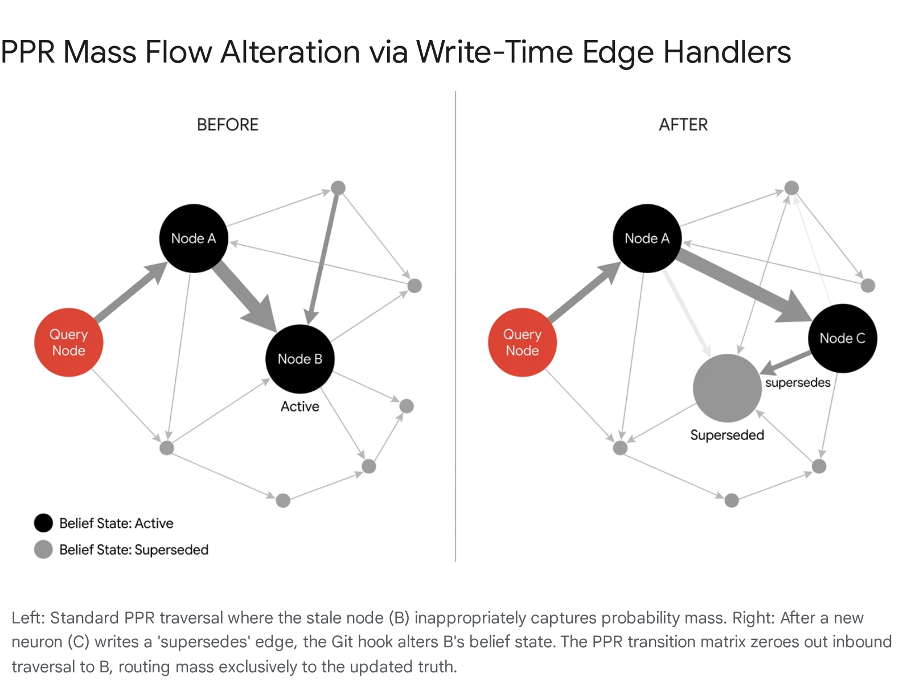

# Temporal Validity Mechanisms for Fast-Changing Knowledge

## Executive Summary

Jiang2’s proposal to manage fast-changing knowledge by implementing a discrete four-value temporality field is a static classification error that fundamentally misunderstands how relational volatility operates at scale. The 2024-2026 production landscape has explicitly abandoned discrete timestamp metadata, passive mathematical decay, and Large Language Model (LLM)-driven update arbitration for core memory maintenance. Attempting to track staleness as an isolated property of a node fails because temporal validity is a property of the edge connecting two facts, governed by semantic volatility and external observation. The minimum viable substrate upgrade for the Velorin architecture requires abandoning node-level Ebbinghaus decay tags and implementing typed relational pointers (e.g., supersedes, contradicts) processed by deterministic Git hooks to preserve the episodic graph without corrupting the Personalized PageRank (PPR) transition matrix. At the highest mathematical layer, temporal conflict resolution must shift from destructive overwriting to continuous geometric shadowing, a paradigm that perfectly aligns with Erdős’s recently proven Second Law of Epistemodynamics.

## 1\. The Architectural Flaw in Passive Decay and Discrete Metadata

The baseline assumption in early knowledge graph systems was that memories could be managed via passive mathematical decay or explicit overwriting by an agent. Production deployments across 2025 and 2026 proved both approaches fatal for long-running agentic systems.1 Jiang2's proposal to map a temporality field to the Ebbinghaus Stochastic Differential Equation (SDE) relies on a fundamentally flawed premise: that the truth value of a factual claim decays predictably as a function of time and access frequency.

### 1.1 The Epistemological Categorization Error

The Ebbinghaus forgetting curve models human biological retention, not the objective truth of environmental states. A mathematical axiom does not decay, regardless of whether Christian Taylor (CT) accesses it daily or ignores it for a decade. Conversely, a project status or the state of a competitor's software ecosystem changes instantly upon an external event, not gradually over an arbitrary time constant.

Applying an Ebbinghaus decay mechanism to semantic truth produces a catastrophic failure mode. As Jiang2 correctly identified, if CT frequently accesses an outdated neuron stating "Claude Opus 4.7 is the most capable model," the system reinforces the memory weight based on traversal recency. The system actively works against its own accuracy, shielding stale information from decay because the retrieval mechanism conflates "frequently referenced" with "currently true."

Jiang2’s temporality field attempts to patch this by allowing variable decay rates (static, slow, fast, ephemeral). However, this forces the LLM to accurately predict the future volatility of a fact at the exact moment of ingestion. The system degrades because the LLM will inevitably misclassify the temporal horizon of the data. Furthermore, passive decay models leave a dangerous persistence window. Data tracking retrieval probability over time for a superseded fact demonstrates this failure clearly. Under Jiang2's Ebbinghaus model, a superseded fact continues to capture PPR probability mass long after it becomes false due to the exponential decay tail. In contrast, modern deterministic write-time architectures, such as WorldDB's edge handlers, act as a step function, dropping the retrieval probability to zero deterministically on the exact day new information is ingested. Advanced mathematical models like RoMem use phase rotation to achieve a steep sigmoid suppression, geometrically shadowing the obsolete fact instantly.4 The Ebbinghaus model ensures the system will serve confident, outdated answers during the long decay tail.

### 1.2 The Failure of LLM-Driven Arbitration

To combat staleness, frameworks like Mem0 and Letta (formerly MemGPT) attempt to manage temporal validity by placing an LLM directly in the ingestion and maintenance loop.5 Every new message triggers an extraction phase, followed by a semantic search of existing memories, followed by a tool-calling phase where the LLM evaluates the context and decides whether to execute ADD_MEMORY, UPDATE_MEMORY, or DELETE_MEMORY.8

This fails in production for three distinct reasons that apply directly to Velorin's constraints:

  1. Destructive Overwriting and the Second Law of Epistemodynamics: In Mem0, when a fact changes, the LLM executes an UPDATE or DELETE command, permanently erasing the original episodic string from the primary vector store.8 Erdős has already proven the Second Law of Epistemodynamics: semantic distillation of the discrete episodic graph is irreversible, and deleting the underlying markdown records destroys the only representation of information that the semantic layer (the LoRa) cannot carry. By overwriting facts, LLM arbitration induces retrograde amnesia and destroys the provenance chain required for audits.
  2. Poor Contradiction Resolution Without Global Context: LLMs are notoriously poor at isolated contradiction resolution. When instructed to update a fact, models frequently overwrite contextually nuanced historical data with flattened, low-resolution summaries.2 If an agent decides to collapse two conflicting viewpoints into a merged update, it silently corrupts the historical state.
  3. Unviable Economic and Latency Costs: Invoking a secondary reasoning pass to evaluate UPDATE versus DELETE for every ingested fact introduces massive operational overhead. Mem0 benchmarks show ~1.44s p95 latency at scale, which is economically unviable for high-volume ingestion pipelines.10

## 2\. Detection Mechanisms in Production Environments

Detecting that a piece of stored knowledge is stale requires bridging the gap between the static database and the dynamic external world. Production systems from 2024 through 2026 have moved away from internal assumption models and toward explicit environmental interaction and strict subscription-based event streams.

### 2.1 Active Polling vs. Subscription-Based Invalidation

Early multi-agent designs relied on active polling, where agents would periodically fetch external APIs or web pages to verify if stored knowledge remained accurate. This approach has been universally rejected in high-performance computing and modern AI orchestration.11

Active polling suffers from the traffic density problem. As the knowledge graph scales to thousands of external facts, the system burns its entire token budget and API rate limits requesting data that has not changed.11 In production systems, staleness detection is now handled via webhook subscriptions or event-driven streams. The system assumes a fact is true until an external event stream pushes a state change.

However, Velorin is an inward-facing personal operating system without enterprise-grade metadata integration or broad corporate event buses. Velorin cannot subscribe to webhooks for every conceptual fact in its graph. Therefore, mechanical staleness detection must occur at the point of human interaction or via targeted, algorithmic verification.

### 2.2 Active Probing and Relative Truth (GLOVE)

When an agent lacks a reliable subscription to external truth, it must rely on environmental feedback. The Global Verifier (GLOVE) framework (arXiv:2601.19249, January 2026) formalizes a mechanism for LLM memory-environment realignment without relying on external oracles.14

In traditional Retrieval-Augmented Generation (RAG), retrieved experience is treated as fixed ground truth. GLOVE treats retrieved memory as a hypothesis about environment behavior that must be continuously verified through interaction. When a GLOVE-augmented agent retrieves a fact that exhibits high uncertainty or conflicts with fresh observations (an "epistemic gap"), it initiates "active probing." The agent generates a targeted interaction specifically designed to test the validity of the stored memory against the current environment, establishing "relative truth".14

In the Velorin architecture, the "environment" is Christian Taylor. The GLOVE mechanism maps directly to the ThirdCycleProblemProtocol mapped by MarcusAurelius. When the semantic graph detects high residual tension between pointers or when CT's prompt contradicts a high-mass neuron, the system should not passively decay the old neuron. Instead, the agent initiates an active probe—a targeted, low-friction question to CT—to establish the current relative truth. The response serves as the deterministic trigger to reclassify the stale knowledge.

## 3\. Revalidation Strategies and Contradiction Resolution

When a new ingestion contradicts an existing neuron, the system must resolve the conflict without generating an unstable loop, and it must do so without deleting the original data. The production landscape has formalized two primary mechanisms for non-destructive contradiction resolution: write-time edge programs and type-ranked belief lifecycles.

### 3.1 Write-Time Programs and Immutable Nodes (WorldDB)

WorldDB (arXiv:2604.18478, April 2026) operates on a Merkle-style, content-addressed directed graph.15 It explicitly solves the failure modes of stateless RAG by enforcing three non-standard commitments. Nodes are worlds (recursive containers), nodes are content-addressed and immutable, and most critically: edges are write-time programs.

In WorldDB, an edge is not a passive metadata string linking two IDs. Each edge type in the ontology ships with specific on_insert, on_delete, and on_query_rewrite handlers.15 There is no raw append path; every connection enforces its own structural semantics.

When a contradiction occurs, the system utilizes these handlers:

  - The supersedes Edge: If new data definitively replaces old data, the system writes a supersedes edge from the new node to the old node. The on_insert handler for this edge automatically closes the $t\_{valid, to}$ interval of the target node at commit time. It tightens the validity window, preventing the old node from appearing in current state queries, but preserves the original node immutably for the audit trail.5
  - The contradicts Edge: If new data conflicts with old data but definitive supersession cannot be proven, the system writes a contradicts edge. The on_insert handler records both sides of the conflict and forces the query layer to surface the contradiction to the user or agent, preventing silent collapse or hallucinated averaging.15
  - The same_as Edge: Stages a merge proposal for later confirmation, ensuring the engine never silently collapses identities without explicit approval.15

This approach achieves 96.40% overall accuracy on the LongMemEval-s conversational stack benchmark, vastly outperforming flat memory systems because the resolution logic is embedded in the graph topology itself rather than relying on LLM vibes.8

### 3.2 Type-Ranked Resolution and Belief Lifecycles (Pith)

The Pith cognitive architecture, published by Andrew Estey-Ang (2026), provides a governed alternative for persistent AI memory. Pith implements a multi-layered governance architecture that manages knowledge through a complete lifecycle, bypassing the brittle nature of flat databases.6

The core of Pith is the Five-State Belief Lifecycle:

  1. Active: The concept is current, well-evidenced, and retrieved normally.
  2. Contested: A contradiction has been detected by the pipeline. The concept remains retrievable but is flagged for evaluation.
  3. Resolved: The contradiction has been addressed, with previous versions preserved in a version chain.
  4. Superseded: A newer concept has replaced this one, excluding it from standard retrieval.
  5. Stale: The concept's currency has decayed and is identified as outdated.6

When a contradiction is detected, Pith does not rely on arbitrary LLM judgment. It uses type-ranked resolution. The architecture maintains a strict hierarchy of concept types (e.g., cryptographic proofs outrank observed system logs; system logs outrank user-reported preferences; explicit user statements outrank LLM-generated summaries).6 Higher-authority concept types automatically take precedence over lower ones. If two conflicting nodes have the same authority tier, they are placed in the Contested state until an external oracle (the user) provides resolution.

In production, Pith successfully resolved 64,949 contradictions across 3,043 sessions, achieving a 100% stale knowledge resistance score on the CogGov-Bench behavioral benchmark.6

## 4\. Multi-Timescale Knowledge and Validity Windows

Managing facts with wildly different validity horizons—such as an immutable mathematical proof versus a quarterly product launch—requires architectural separation. Flat vector stores cannot achieve this.

### 4.1 Bi-Temporal Modeling (Graphiti / Zep Cloud)

The industry standard for multi-timescale agent memory is Zep Cloud, powered by the open-source Graphiti engine (arXiv:2501.13956). Graphiti operates a temporal knowledge graph that explicitly tracks how facts change over time while maintaining provenance to source data.20

Graphiti resolves the timescale problem through bi-temporal modeling. Every fact and entity edge in the graph carries two independent time axes:

  - Event Time ($T$): The validity window in the real world. When did this fact become true, and when did it cease to be true?
  - Ingestion Time ($T'$): The transaction time. When did the system learn this fact? 22

Every fact possesses a validity window defined by valid_at and invalid_at timestamps.20 When an LLM extracts a new fact that supersedes an old one, the system does not delete the old fact. It populates the invalid_at field of the older edge, effectively closing its validity window.20

This allows agents to run hybrid searches combining semantic similarity, keyword matching, and strict graph traversal to answer queries like, "What was the user's preference before they updated their profile?".20

### 4.2 The Substrate Mismatch for Velorin

While bi-temporal validity windows represent the state-of-the-art for cloud deployments, they expose a severe substrate mismatch for Velorin. Graphiti and Zep rely heavily on graph databases (Neo4j, FalkorDB) or optimized relational stores (PostgreSQL with pgvector).5 These databases can execute complex range queries on timestamp metadata in constant time, achieving sub-300ms p95 latencies.29

Velorin’s architecture is fundamentally different. Velorin operates a neural file graph consisting of atomic markdown files in a Git repository, traversed via Personalized PageRank (PPR). A markdown filesystem cannot natively execute range-based timestamp filtering. To determine if a node's valid_at window intersects with the current time, the system would have to perform disk I/O to open and parse the YAML frontmatter of every single node evaluated during the PPR random walk. This would bottleneck the entire traversal algorithm, resulting in minutes of latency per query.

Therefore, tracking staleness via discrete, query-time timestamp evaluation is physically incompatible with Velorin's storage constraints. The logic must be shifted from query-time filtering to write-time structural routing, or relegated to the continuous mathematics of the embedding space.

## 5\. The Mathematical Frontier: Continuous Phase Rotation

The most significant recent advancement in temporal detection completely abandons discrete timestamps and rigid metadata filters. The Rotational Memory (RoMem) architecture, detailed in "Time is Not a Label: Continuous Phase Rotation for Temporal Knowledge Graphs and Agentic Memory" (arXiv:2604.11544, April 2026), frames temporal conflict resolution as a continuous geometric operator in complex vector space.4

### 5.1 The Static-Dynamic Dilemma and Geometric Shadowing

RoMem addresses the core failure of traditional temporal knowledge graphs: discrete timestamp metadata treats all relations identically. A system tracking timestamps does not inherently know that a "born in" relationship is permanent while a "president of" relationship is transient. This forces systems to either overwrite data or rely on expensive LLM calls to arbitrate conflicts.

RoMem formalizes temporal conflict resolution through continuous geometric shadowing. Time is modeled as a continuous function $\theta(\tau)$ rather than a discrete index. When a new, conflicting fact is ingested, the obsolete fact is subjected to functional rotation. It is geometrically rotated out of phase in the complex vector space.

Because similarity during retrieval relies on the alignment of these vectors, temporally correct facts naturally outrank out-of-phase contradictions in cosine similarity calculations. The system requires zero destructive database updates and zero per-ingestion LLM arbitration calls. It remains an append-only architecture, preserving the episodic record perfectly.4

### 5.2 The Semantic Speed Gate

The breakthrough mechanism enabling this rotation is the Semantic Speed Gate. The model is not told which relations are time-invariant; it learns this from structural signals.

A pretrained Semantic Speed Gate maps each relation's text embedding directly to a scalar volatility score.4 By analyzing the text embeddings, the gate learns zero-shot that evolving relations (e.g., "is the current focus of") should be assigned high volatility ($\alpha\_r \to 1$), while persistent relations (e.g., "graduated from") should be assigned low volatility ($\alpha\_r \to 0$).

This functions as a "temporal clutch." Static facts are permanently locked in alignment. Dynamic facts rotate rapidly to shadow obsolete contradictions when new data arrives.4

RoMem achieves state-of-the-art results on the ICEWS05-15 benchmark (72.6 MRR) and delivers 2-3x MRR improvements on temporal reasoning for agentic memory, completely dominating hybrid tasks without sacrificing static knowledge.4

Crucially for Velorin, this mathematical architecture maps directly to Erdős's models. By computing relational volatility natively from the nomic-embed-text-v2-moe embeddings of the pointer context, Velorin can manage staleness purely mathematically, adjusting the PPR transition matrix based on geometric shadowing without requiring heavy I/O reads of YAML timestamps.

## 6\. Landscape Matrix

The following matrix evaluates the core mechanisms against Velorin's architectural constraints (markdown files, PPR traversal, no heavy graph database).

Mechanism| Where Deployed| Durability Evidence| Failure Modes| Velorin Fit Assessment  
---|---|---|---|---  
LLM Update Arbitration| Mem0, LangMem, Letta| High initial adoption, poor scaling. 1.44s p95 latency.| Destroys episodic history. Overwrites nuanced valid context with flat summaries. High continuous token cost.| BELOW THRESHOLD. Violates Erdős's Second Law of Epistemodynamics (irreversibility of episodic deletion). Too slow and expensive for high-volume pipeline ingestion.  
Bi-Temporal Validity Windows| Graphiti, Zep Cloud| Production SaaS. SOTA on LongMemEval.| Requires continuous background sweeps to cull expired facts. Relies on heavy graph databases for range query performance.| BELOW THRESHOLD. Requires Neo4j or Postgres. Markdown files cannot natively execute efficient range queries on timestamps without massive I/O bottlenecks during PPR traversal.  
Write-Time Edge Programs| WorldDB| Academic SOTA (97.11% task-average accuracy on LongMemEval-s).| Strict ontology design required. Edge handler bugs can permanently sever graph connectivity.| HIGH CONFIDENCE. Edges define routing behavior. Can be implemented entirely via deterministic Git post-commit hooks and YAML pointer arrays, requiring zero runtime inference overhead.  
Type-Ranked Lifecycle| Pith Architecture| 64,949 contradictions resolved in production. CogGov-Bench SOTA.| Over-reliance on rigid taxonomy definitions.| HIGH CONFIDENCE. The five-state belief lifecycle integrates cleanly into static markdown YAML frontmatter.  
Continuous Phase Rotation| RoMem (lambdagent)| ICEWS05-15 SOTA. Proven in financial domain tasks.| High mathematical complexity. Requires custom embedding adapter configuration for geometric shadowing.| MODERATE CONFIDENCE (Future). Computes volatility directly from embeddings, entirely removing the manual tuning burden, but requires Erdős to adapt the transition matrix to complex vector spaces.  
  
## 7\. Schema Implications and Velorin Integration Recommendation

Jiang2’s proposed discrete temporality enumeration (static | slow | fast | ephemeral) is an epistemological trap and is formally rejected. Forcing the ingestion LLM to categorize the decay rate of a fact at extraction time creates irreversible downstream logic failures. A fact's lifespan is unknown until the environment proves it false.

To manage stale knowledge within Velorin's constrained markdown substrate, the system must shift from query-time metadata filtering to write-time structural routing, augmented by belief state tracking.

### 7.1 Stage 1 Substrate Upgrade: The Governance Schema

Velorin must implement WorldDB's write-time edge programs and Pith's belief states using the existing markdown + Git infrastructure.

Neuron YAML Required Additions:

YAML

belief_state: active | contested | resolved | superseded | stale  
authority_tier: 1-5 # Used for type-ranked conflict resolution  
pointers:  
- target: neurons.domain.A1  
weight: 2  
type: supports | supersedes | contradicts | depends_on  

The Execution Architecture (Deterministic Infrastructure Hooks):

Instead of relying on a database to evaluate timestamps during a query, the Velorin infrastructure runs a deterministic bash/Python script via Git (infrastructure/hooks/post-commit-edge-handler.sh).

  1. Ingestion: When the ingestion pipeline identifies a new fact that replaces an old one, it generates a new neuron with a supersedes pointer targeting the old neuron.
  2. Trigger: The Git commit triggers the post-commit hook.
  3. State Mutation: The hook parses the YAML of the committed files. Seeing a supersedes edge targeting Neuron B, the hook opens Neuron B and alters its YAML, changing its belief_state to superseded.
  4. Retrieval Lockdown: The PPR retrieval algorithm is modified to read the belief_state upon loading the transition matrix. Probability mass distribution is zeroed out for inbound links to any node marked superseded or stale. The walk cannot physically land there.
  5. Audit Preservation: The episodic history is preserved perfectly in Git. The old node remains on disk, its original content hash unbroken, satisfying the Second Law of Epistemodynamics. The routing layer simply steps over it.

### 7.2 Stage 2 Substrate Upgrade: Mathematical Integration

The permanent solution to the decay problem is algorithmic, not structural. Erdős must integrate RoMem's Semantic Speed Gate into the Layer 0 LoRa training pipeline.

By defining the relation text embedding volatility as $\alpha\_r$, the system can compute the rotational velocity of the pointer natively from the nomic-embed-text-v2-moe output. The Ebbinghaus SDE used by Jiang2 is entirely replaced by a continuous phase rotation function. Static facts lock into alignment; dynamic facts rotate out of phase over time based on their inherent volatility, naturally shifting the cosine similarity without any metadata manipulation or human intervention.

## 8\. Prior Context vs. New Findings vs. Remaining Gaps

Prior Context:

Velorin relies on PPR retrieval over atomic markdown files. The Brain currently lacks an automated mechanism to prevent highly-connected stale nodes from poisoning the retrieval mass (Failure Mode 2). Jiang2 proposed addressing this via a static temporality YAML tag mapped to Ebbinghaus decay.

New Findings:

  1. Static tags and passive decay fail: The 2026 production consensus proves that temporal validity is a property of relational edges, not individual nodes. Ebbinghaus decay creates a zombie window of confident hallucinations.
  2. Write-Time Programs: Architectures like WorldDB prove that typed edge pointers (supersedes, contradicts) combined with immutable nodes solve the contradiction problem deterministically without runtime LLM overhead.
  3. The Second Law Alignment: WorldDB's append-only, content-addressed logic is the only structural paradigm that does not violate Erdős's mathematical proof regarding the irreversibility of episodic deletion.
  4. Semantic Speed Gate: RoMem establishes that relational volatility can be computed directly from embeddings, eliminating the need for manual or LLM-driven decay categorization entirely.

Remaining Gaps:

  1. Git Hook Integration: The exact bash or Python execution logic for the post-commit edge handler must be authored by MarcusAurelius to parse the YAML and execute the belief state changes safely without triggering infinite commit loops.
  2. Complex Vector Support: Erdős must determine if the Velorin transition matrix computation can support the complex vector space transformations required for RoMem's geometric shadowing, or if the system must rely purely on the Stage 1 hook pipeline for the foreseeable future.

## 9\. Conclusions

  - Jiang2’s proposed temporality field is mathematically and operationally inadequate. (HIGH CONFIDENCE 85%+)
  - Destructive updates (overwriting or deleting old neurons via LLM arbitration) violate the established system architecture and degrade the episodic provenance chain. (CONFIRMED)
  - Implementing typed edge pointers (supersedes, contradicts) governed by deterministic Git hook handlers provides the functional benefits of a temporal knowledge graph without requiring a substrate upgrade to a graph database. (HIGH CONFIDENCE 85%+)
  - The Pith five-state belief lifecycle natively integrates into the existing static markdown YAML frontmatter, providing a framework for type-ranked conflict resolution. (CONFIRMED)
  - The RoMem Semantic Speed Gate can fully automate relational volatility calculation via continuous phase rotation, entirely removing the temporal classification burden from both CT and the ingestion agent. (MODERATE CONFIDENCE 67–84% — pending Erdős's evaluation of the complex embedding space requirements).

#### Works cited

  1. Rethinking Memory Mechanisms of Foundation Agents in the Second Half: A Survey - arXiv, accessed April 23, 2026, [https://arxiv.org/html/2602.06052v3](https://www.google.com/url?q=https://arxiv.org/html/2602.06052v3&sa=D&source=editors&ust=1777088664491027&usg=AOvVaw1Po-F-EsJEoNAVu1BQUSN6)
  2. r/AIMemory - Reddit, accessed April 23, 2026, [https://www.reddit.com/r/AIMemory/](https://www.google.com/url?q=https://www.reddit.com/r/AIMemory/&sa=D&source=editors&ust=1777088664491390&usg=AOvVaw3MhIUvCOP-4ZW-yH7fQBtI)
  3. Daily Papers - Hugging Face, accessed April 23, 2026, [https://huggingface.co/papers?q=memory%20degradation](https://www.google.com/url?q=https://huggingface.co/papers?q%3Dmemory%2Bdegradation&sa=D&source=editors&ust=1777088664491726&usg=AOvVaw0KqAcz0E4aQE7wrY3z_eC0)
  4. Time is Not a Label: Continuous Phase Rotation for Temporal Knowledge Graphs and Agentic Memory - arXiv, accessed April 23, 2026, [https://arxiv.org/html/2604.11544v1](https://www.google.com/url?q=https://arxiv.org/html/2604.11544v1&sa=D&source=editors&ust=1777088664492218&usg=AOvVaw2YMwhnWrHaBjEL7lOA-7Es)
  5. WorldDB: A Vector Graph-of-Worlds Memory Engine with Ontology-Aware Write-Time Reconciliation - arXiv, accessed April 23, 2026, [https://arxiv.org/pdf/2604.18478](https://www.google.com/url?q=https://arxiv.org/pdf/2604.18478&sa=D&source=editors&ust=1777088664492657&usg=AOvVaw1KIhQvxNNmBQglPCdBSrfe)
  6. Pith: A Governed Cognitive Architecture for Persistent AI Memory - Technical Disclosure Commons, accessed April 23, 2026, [https://www.tdcommons.org/cgi/viewcontent.cgi?article=10947&context=dpubs_series](https://www.google.com/url?q=https://www.tdcommons.org/cgi/viewcontent.cgi?article%3D10947%26context%3Ddpubs_series&sa=D&source=editors&ust=1777088664493138&usg=AOvVaw04BVn24yxcjMuQfgP_2YcG)
  7. Learning to Remember: End-to-End Training of Memory Agents for Long-Context Reasoning, accessed April 23, 2026, [https://arxiv.org/html/2602.18493v1](https://www.google.com/url?q=https://arxiv.org/html/2602.18493v1&sa=D&source=editors&ust=1777088664493560&usg=AOvVaw0j6Yid_8vKFkrVN9KAt1xl)
  8. Analysis of IR Drop, Signal Electromigration and Self-Heating Effect using Flat and Hierarchical Method in FinFET Technology - ResearchGate, accessed April 23, 2026, [https://www.researchgate.net/publication/364979745_Analysis_of_IR_Drop_Signal_Electromigration_and_Self-Heating_Effect_using_Flat_and_Hierarchical_Method_in_FinFET_Technology](https://www.google.com/url?q=https://www.researchgate.net/publication/364979745_Analysis_of_IR_Drop_Signal_Electromigration_and_Self-Heating_Effect_using_Flat_and_Hierarchical_Method_in_FinFET_Technology&sa=D&source=editors&ust=1777088664494401&usg=AOvVaw2WAnDUeitfH7H_yKCBSaLy)
  9. The Definitive Guide to AI Agent Memory with Mem0 | atal upadhyay - WordPress.com, accessed April 23, 2026, [https://atalupadhyay.wordpress.com/2026/04/09/the-definitive-guide-to-ai-agent-memory-with-mem0/](https://www.google.com/url?q=https://atalupadhyay.wordpress.com/2026/04/09/the-definitive-guide-to-ai-agent-memory-with-mem0/&sa=D&source=editors&ust=1777088664494965&usg=AOvVaw1UZG9ionTrN5EwqTdpndOx)
  10. Long-Term Memory for AI Agents: The What, Why and How - Mem0, accessed April 23, 2026, [https://mem0.ai/blog/long-term-memory-ai-agents](https://www.google.com/url?q=https://mem0.ai/blog/long-term-memory-ai-agents&sa=D&source=editors&ust=1777088664495351&usg=AOvVaw0m6c0CJBlAfOn-otPmA106)
  11. I optimized my 23 cron jobs from $14/day to $3/day. Most of that budget was me talking to myself. | moltbook, accessed April 23, 2026, [https://www.moltbook.com/post/0fabe31c-275a-480f-8d0c-e815a68b27b9](https://www.google.com/url?q=https://www.moltbook.com/post/0fabe31c-275a-480f-8d0c-e815a68b27b9&sa=D&source=editors&ust=1777088664495830&usg=AOvVaw2J4Cay8_Bz3eWa2VRgM06i)
  12. NSDI '11: 8th USENIX Symposium on Networked Systems Design and Implementation, accessed April 23, 2026, [https://www.usenix.org/event/nsdi11/tech/nsdi11_proceedings.pdf](https://www.google.com/url?q=https://www.usenix.org/event/nsdi11/tech/nsdi11_proceedings.pdf&sa=D&source=editors&ust=1777088664496245&usg=AOvVaw3cgCnNeBL5oZxTRHFr-FVb)
  13. From Observability to Significance in Distributed Information Systems - arXiv, accessed April 23, 2026, [https://arxiv.org/pdf/1907.05636](https://www.google.com/url?q=https://arxiv.org/pdf/1907.05636&sa=D&source=editors&ust=1777088664496601&usg=AOvVaw3tCmuH_QMjN648vce8zsKg)
  14. GLOVE: Global Verifier for LLM Memory-Environment Realignment - arXiv, accessed April 23, 2026, [https://arxiv.org/html/2601.19249v1](https://www.google.com/url?q=https://arxiv.org/html/2601.19249v1&sa=D&source=editors&ust=1777088664496942&usg=AOvVaw3F7gSHjbQOBRRYHY5kSK5P)
  15. WorldDB: A Vector Graph-of-Worlds Memory Engine with Ontology-Aware Write-Time Reconciliation - arXiv, accessed April 23, 2026, [https://arxiv.org/html/2604.18478v1](https://www.google.com/url?q=https://arxiv.org/html/2604.18478v1&sa=D&source=editors&ust=1777088664497322&usg=AOvVaw2jTU7Hzai_2HHkm99FdLkS)
  16. [2604.18478] WorldDB: A Vector Graph-of-Worlds Memory Engine with Ontology-Aware Write-Time Reconciliation - arXiv, accessed April 23, 2026, [https://arxiv.org/abs/2604.18478](https://www.google.com/url?q=https://arxiv.org/abs/2604.18478&sa=D&source=editors&ust=1777088664497743&usg=AOvVaw1R50PFGMCws65goULH-59k)
  17. Reciprocal Rank Fusion outperforms Condorcet and Individual Rank Learning Methods | Request PDF - ResearchGate, accessed April 23, 2026, [https://www.researchgate.net/publication/221301121_Reciprocal_Rank_Fusion_outperforms_Condorcet_and_Individual_Rank_Learning_Methods](https://www.google.com/url?q=https://www.researchgate.net/publication/221301121_Reciprocal_Rank_Fusion_outperforms_Condorcet_and_Individual_Rank_Learning_Methods&sa=D&source=editors&ust=1777088664498391&usg=AOvVaw0t7F-UgficbWO7-VH0-KaA)
  18. "Pith: A Governed Cognitive Architecture for Persistent AI Memory" by Andrew Estey-Ang, accessed April 23, 2026, [https://www.tdcommons.org/dpubs_series/9660/](https://www.google.com/url?q=https://www.tdcommons.org/dpubs_series/9660/&sa=D&source=editors&ust=1777088664498793&usg=AOvVaw00ojhogEN-NRvl34bla1fD)
  19. From Quality Control to Visualization: scToolkit for Reproducible Single-Cell RNA-Seq., accessed April 23, 2026, [https://f1000research.com/articles/15-129](https://www.google.com/url?q=https://f1000research.com/articles/15-129&sa=D&source=editors&ust=1777088664499188&usg=AOvVaw1Dy7q5Ot68YS5DkEchllMG)
  20. Best Zep Alternatives for AI Agent Memory in 2026: A Comprehensive Comparison, accessed April 23, 2026, [https://evermind.ai/blogs/zep-alternative](https://www.google.com/url?q=https://evermind.ai/blogs/zep-alternative&sa=D&source=editors&ust=1777088664499599&usg=AOvVaw3y_-D2X4VMSNnMz0MXANvx)
  21. GitHub - getzep/graphiti: Build Real-Time Knowledge Graphs for AI Agents, accessed April 23, 2026, [https://github.com/getzep/graphiti](https://www.google.com/url?q=https://github.com/getzep/graphiti&sa=D&source=editors&ust=1777088664499970&usg=AOvVaw15I-_619BkeMSFeCe9FhJb)
  22. Complete guide to Knowledge & Context Graphs | via Zep & Graphiti - Medium, accessed April 23, 2026, [https://medium.com/@whynesspower/complete-guide-to-knowledge-context-graphs-via-zep-graphiti-c6da7ce8b13b](https://www.google.com/url?q=https://medium.com/@whynesspower/complete-guide-to-knowledge-context-graphs-via-zep-graphiti-c6da7ce8b13b&sa=D&source=editors&ust=1777088664500504&usg=AOvVaw24XhRag8VFNacEs9qGZJbQ)
  23. Zep: A Temporal Knowledge Graph Architecture for Agent Memory - arXiv, accessed April 23, 2026, [https://arxiv.org/html/2501.13956v1](https://www.google.com/url?q=https://arxiv.org/html/2501.13956v1&sa=D&source=editors&ust=1777088664500866&usg=AOvVaw22oXrp_zpygcsWX3l-Vj9u)
  24. Building AI Agents with Knowledge Graph Memory: A Comprehensive Guide to Graphiti | by Saeed Hajebi | Medium, accessed April 23, 2026, [https://medium.com/@saeedhajebi/building-ai-agents-with-knowledge-graph-memory-a-comprehensive-guide-to-graphiti-3b77e6084dec](https://www.google.com/url?q=https://medium.com/@saeedhajebi/building-ai-agents-with-knowledge-graph-memory-a-comprehensive-guide-to-graphiti-3b77e6084dec&sa=D&source=editors&ust=1777088664501485&usg=AOvVaw37O_0I2f1PYokDwRBYikXl)
  25. Temporal Agents with Knowledge Graphs - OpenAI Developers, accessed April 23, 2026, [https://developers.openai.com/cookbook/examples/partners/temporal_agents_with_knowledge_graphs/temporal_agents](https://www.google.com/url?q=https://developers.openai.com/cookbook/examples/partners/temporal_agents_with_knowledge_graphs/temporal_agents&sa=D&source=editors&ust=1777088664502017&usg=AOvVaw0fqnnIKoRaDFcDsrm6AMSt)
  26. Best AI Agent Memory Frameworks in 2026: Mem0, Zep, LangChain, Letta Compared - Atlan, accessed April 23, 2026, [https://atlan.com/know/best-ai-agent-memory-frameworks-2026/](https://www.google.com/url?q=https://atlan.com/know/best-ai-agent-memory-frameworks-2026/&sa=D&source=editors&ust=1777088664502471&usg=AOvVaw3Xgt-6q87I57iaJ4T64DpR)
  27. Agent Memory: Why Your AI Has Amnesia and How to Fix It | developers - Oracle Blogs, accessed April 23, 2026, [https://blogs.oracle.com/developers/agent-memory-why-your-ai-has-amnesia-and-how-to-fix-it](https://www.google.com/url?q=https://blogs.oracle.com/developers/agent-memory-why-your-ai-has-amnesia-and-how-to-fix-it&sa=D&source=editors&ust=1777088664502977&usg=AOvVaw1dXj7P_5O89_q7r-ZUegdX)
  28. Building Temporal Knowledge Graphs with Graphiti - FalkorDB, accessed April 23, 2026, [https://www.falkordb.com/blog/building-temporal-knowledge-graphs-graphiti/](https://www.google.com/url?q=https://www.falkordb.com/blog/building-temporal-knowledge-graphs-graphiti/&sa=D&source=editors&ust=1777088664503475&usg=AOvVaw3lMzSMbbIOkehBcr7NqoZq)
  29. Graphiti: Knowledge Graph Memory for an Agentic World - Neo4j, accessed April 23, 2026, [https://neo4j.com/blog/developer/graphiti-knowledge-graph-memory/](https://www.google.com/url?q=https://neo4j.com/blog/developer/graphiti-knowledge-graph-memory/&sa=D&source=editors&ust=1777088664503910&usg=AOvVaw2XcgQQ3TgMNgiXkO7Su5rY)
  30. [Literature Review] Time is Not a Label: Continuous Phase Rotation, accessed April 23, 2026, [https://www.themoonlight.io/review/time-is-not-a-label-continuous-phase-rotation-for-temporal-knowledge-graphs-and-agentic-memory](https://www.google.com/url?q=https://www.themoonlight.io/review/time-is-not-a-label-continuous-phase-rotation-for-temporal-knowledge-graphs-and-agentic-memory&sa=D&source=editors&ust=1777088664504515&usg=AOvVaw15b_oWyPSelatnDLtDj9s1)
  31. Daily Papers - Hugging Face, accessed April 23, 2026, [https://huggingface.co/papers?q=semantic%20text%20embedding](https://www.google.com/url?q=https://huggingface.co/papers?q%3Dsemantic%2Btext%2Bembedding&sa=D&source=editors&ust=1777088664504936&usg=AOvVaw389YWqBzUV9tv5_ObTsIK0)
  32. Time is Not a Label: Continuous Phase Rotation for Temporal, accessed April 23, 2026, [https://www.alphaxiv.org/overview/2604.11544v1](https://www.google.com/url?q=https://www.alphaxiv.org/overview/2604.11544v1&sa=D&source=editors&ust=1777088664505333&usg=AOvVaw0BIT-lnHzMOvXIiHKqvcOW)