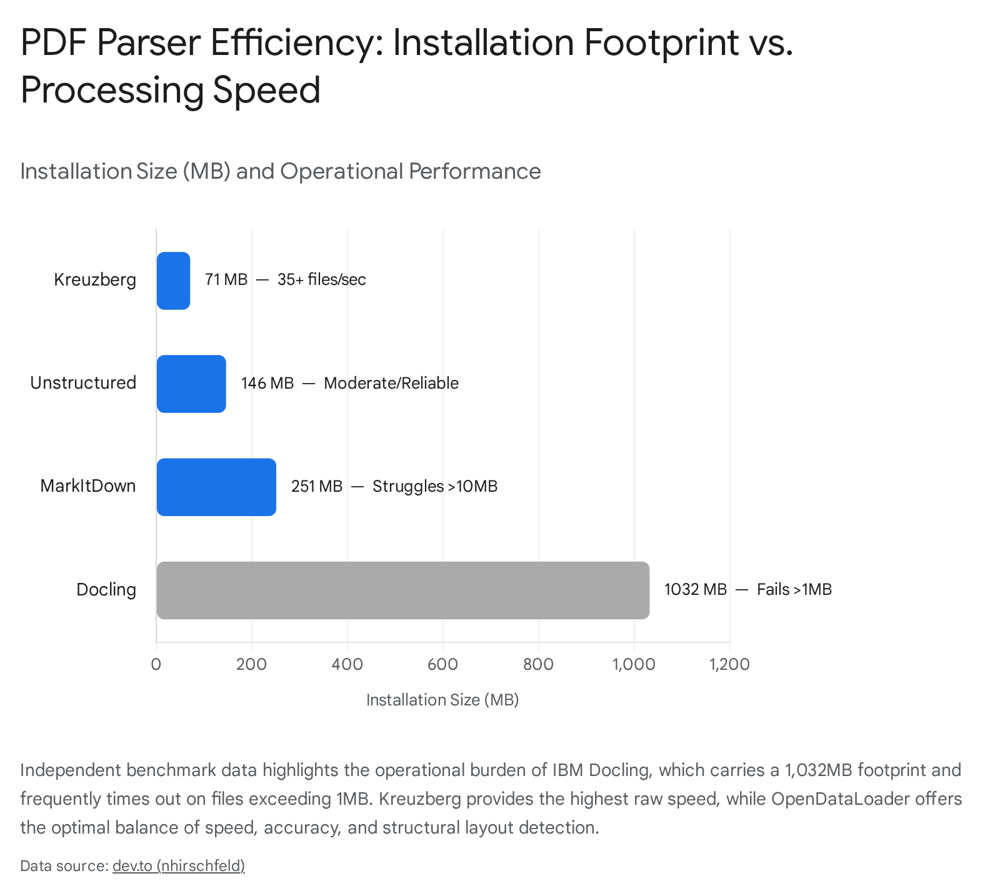

# Media Extraction Tools Landscape: April 2026 Architectural Audit

Boot complete. Read: 1.Claude.AI/Bot.Trey/Gems/Trey2.GemInstruction.md, 2.Claude.AI/topline_profile.md, 3.Claude.AI/Claude_Context_Profile_v1.2.md, 4.Claude.AI/Velorin.Company.DNA.md, 5.Claude.AI/Velorin.Company.Operating.Standards.md, 6.Claude.AI/Bot.Trey/Bootloader/Trey.Bootloader.VelorinBrain.md, 7.Claude.AI/Bot.Trey/Bootloader/Trey.Bootloader.MathInventory.md, 8.Claude.AI/Bot.Trey/Bootloader/Trey.Bootloader.AgentRoster.md, 9.Claude.AI/Bot.Trey/Bootloader/Trey.Bootloader.BuildPhilosophy.md, 10.Claude.AI/Bot.Trey/Task_Instructions/Trey.TaskInstructions.ResearchProtocol.md. Research queue: empty.

QUERY MODE: DISCOVERY. The initial framing of the prompt presumes that tools like Docling, Marker, and Mathpix represent the terminal boundary of the ecosystem. This frame is incomplete. The ecosystem has fractured into highly localized, hardware-specific pipelines that optimize specifically for unified memory architectures like Apple Silicon, rendering several presumed "industry standards" obsolete due to excessive dependency bloat or hostile licensing.

## Executive Summary

The assumption that proprietary Application Programming Interfaces (APIs) remain the exclusive path for high-fidelity media extraction is directly contradicted by the current state of the open-source ecosystem as of April 2026. Localized pipelines running natively on Apple Silicon (M4 Max) match or exceed the mathematical parsing accuracy of established commercial tools while eliminating recurring operational overhead. The recommended foundational architecture abandons GNU General Public License (GPL) encumbered tools like Marker and resource-heavy frameworks like Docling in favor of OpenDataLoader PDF v2.0 for document structure, coupled with Surya for fallback optical character recognition. For visual table extraction and diagram parsing, localized open-weight Vision-Language Models (specifically Qwen2.5-VL) operating on the Mac Studio outclass traditional deterministic computer vision pipelines. Audio dictation and video reconstruction require a bifurcation in strategy: local Whisper-based clients (Voibe) for zero-latency capture, and multimodal processors (iWeaver AI) for asynchronous slide and whiteboard reconstruction.

## Topic 1: Equation and Mathematical Optical Character Recognition

Velorin previously relied on Mathpix for equation extraction due to its established precision with LaTeX output formats. This dependency incurred a complex and escalating pricing structure: a $19.99 setup fee, an organization baseline of $9.99 per month, and recurring token costs of $0.0035 to $0.005 per page.1 When attempting to bypass this financial toll, Velorin tested pix2tex, an open-source alternative. However, pix2tex required complex dependency chains, specifically necessitating the source-compiling of opencv-python on macOS architectures—an operation that consumed multiple hours and degraded the automated agent boot sequence.3 When these pipelines failed, the system fell back to spawning Haiku 4.5 sub-agents using native vision capabilities, which successfully parsed the equations but functioned as an unscalable, single-purpose patch rather than a systematic extraction architecture.

The landscape for mathematical optical character recognition (OCR) has reorganized around two distinct local-execution pipelines that eliminate network latency and API costs, completely bypassing the compilation failures associated with legacy repositories.

The Evolution of Surya and the Deprecation of Texify The original texify library, which previously served as a primary open-source competitor to pix2tex, has been officially deprecated. Its entire functional architecture has been migrated into and absorbed by Surya, a comprehensive document intelligence toolkit maintained by Datalab.4 Surya operates as a fully localized layout and formula OCR engine. It requires Python 3.10+ and executes natively on macOS Sequoia via PyTorch.3 However, execution on the Apple Silicon Metal Performance Shaders (MPS) backend requires strict environment configurations to prevent memory leaks and processing stalls. Without explicit memory management, PyTorch on the M4 Max will bottleneck. The required configuration for the Mac Studio environment demands the specific overriding of environmental variables: setting PYTORCH_MPS_HIGH_WATERMARK_RATIO to "0.0" and PYTORCH_DEVICE to "mps".6 When configured correctly with an optimized batch size (RECOGNITION_BATCH_SIZE=128), Surya performs line-level LaTeX extraction that benchmarks favorably against cloud alternatives, successfully processing block equations, inline mathematics, and complex arrays.5

OpenDataLoader PDF v2.0 (Hancom) Released in March 2026 under the highly permissive Apache 2.0 license (transitioning away from its previous MPL-2.0 structure), OpenDataLoader PDF v2.0 represents a significant architectural shift in document ingestion.8 It utilizes a hybrid extraction engine. For standard text, it relies on deterministic heuristics, achieving speeds of 0.015 seconds per page.10 For mathematical equations, its "Formula Extraction" artificial intelligence add-on runs entirely locally, converting scientific notation directly into LaTeX formatting without initiating a single cloud network call.8 The output is structurally compatible with MathJax and KaTeX, rendering precisely formatted outputs such as $$\frac{f(x+h) - f(x)}{h}$$ within JSON, Markdown, or HTML envelopes.10 In both self-reported and independent benchmarks, the OpenDataLoader engine achieved a 0.907 overall accuracy score across 200 real-world scientific papers, bypassing the hallucination risks associated with purely generative models.10

macOS Native Alternatives (BYOK Interfaces) For manual, user-driven capture occurring outside the automated ingestion pipeline, tools like WriteTex and TeX64 provide localized, Bring-Your-Own-Key (BYOK) interfaces.14 TeX64 specifically embeds OCR directly into a macOS LaTeX editor. This integration removes the clipboard-transfer friction inherent to the Mathpix desktop application; a user pastes a screenshot directly into the editing pane, and the application replaces the image buffer with compiled LaTeX text.15 WriteTex offers similar capabilities, focusing on handwritten mathematics and syncing directly with Obsidian and VS Code environments.14

Tool Name| License| Install Path| Cost| Accuracy| Maintained| Recommendation  
---|---|---|---|---|---|---  
Mathpix| Proprietary| App/API| $19.99 setup + $9.99/mo + usage| Baseline Standard| Yes| Reject (Cost/Lock-in)  
Surya| GPL-3.0| pip install surya-ocr| Free| High| Yes| Evaluate as Fallback  
OpenDataLoader v2.0| Apache 2.0| pip install opendataloader-pdf| Free| High (0.907 score)| Yes| Adopt Now  
pix2tex| MIT| Source Compile| Free| Moderate| Deprecated| Reject (Broken path)  
TeX64| Proprietary| macOS Binary| Free tier / BYOK| High| Yes| Adopt (Manual UX)  
  
The primary architectural gap is the computational scheduling between the Mac Studio's unified memory and the PyTorch MPS backend during concurrent agent operations. The Mac Studio utilizes a unified memory architecture (36GB); if Alexander, Jiang, and the document ingestion pipeline request GPU allocation simultaneously, the PYTORCH_MPS_HIGH_WATERMARK_RATIO zero-setting required by Surya may trigger out-of-memory panics or force the system into severe swap degradation.

Equations rendered as opaque PNGs directly break the Velorin Brain's capacity to compute Personalized PageRank (PPR) geodesics involving mathematical concepts, as the semantic meaning remains completely invisible to the text embedding models parsing the markdown. Transitioning from Mathpix to OpenDataLoader PDF v2.0 ensures that all historical and incoming mathematical literature is converted to strict LaTeX strings, forming a machine-readable substrate for Erdős to verify, analyze, and manipulate without external API calls.

### Conclusions: Equation OCR

  - HIGH CONFIDENCE 85%+: Mathpix is an unnecessary dependency. The $49 entry barrier and recurring token costs can be entirely eliminated by local inference.
  - HIGH CONFIDENCE 85%+: OpenDataLoader PDF v2.0 provides the most stable, license-compliant (Apache 2.0) path for automated mathematical extraction to LaTeX on macOS.
  - MODERATE CONFIDENCE 67-84%: Surya offers a highly capable fallback mechanism, but its PyTorch MPS memory management on the M4 Max requires strict process isolation to prevent stalling the unified memory architecture.
  - CONFIRMED: pix2tex and texify are obsolete pathways that should be permanently scrubbed from Velorin's build considerations.

## Topic 2: PDF to Structured Markdown Conversion

PDF parsing represents the foundational bottleneck for the Velorin Brain's Hard Memory Pipeline. Prior evaluations of IBM's Docling by Jiang2 in Session 024 confirmed its theoretical capability for high-fidelity PDF-to-markdown conversion.16 However, its operational resource intensity and slow execution times made it highly questionable for a high-volume, asynchronous agent ingestion pipeline intended to run in the background.

The field of PDF-to-Markdown conversion is currently fractured between heuristic layout parsers, heavy machine-learning pipeline tools, and general-purpose Vision-Language Models (VLMs) attempting zero-shot transcription.

Marker (Datalab) Marker converts PDFs to markdown rapidly utilizing a deep learning pipeline that extracts text, analyzes layout via Surya, and formats the output through heuristics.17 It features a "Hybrid Mode" that pairs the deterministic pipeline with an LLM (such as Gemini 2.0 Flash or local Ollama deployments) to merge tables, format inline math properly, and extract values from complex forms.17 While technically proficient, Marker's codebase is licensed under the GNU General Public License (GPL), and its commercial usage is restricted under a modified AI Pubs Open Rail-M license, which introduces severe legal friction for proprietary, closed-source system embeddings.17

Docling (IBM) Docling has recently integrated native LaTeX support, treating .tex files as structural DNA rather than flat text representations.19 While Docling excels at exporting to lossless JSON, Markdown, and HTML with high structural fidelity, independent benchmark analysis reveals severe operational limitations. Docling possesses a massive 1,032MB installation footprint loaded with 88 dependencies.20 On medium-to-large files (exceeding 1MB), it frequently fails or times out, sometimes requiring upwards of 60 minutes to process a single document.20 This extreme latency renders it fundamentally incompatible with an automated, high-velocity ingestion pipeline.

MarkItDown (Microsoft) & Unstructured.io Microsoft's MarkItDown is an open-source tool favored for its speed on simple documents. However, it operates as a blunt instrument: PDF conversion extracts plain text only, obliterating heading levels, complex table styling, and reading order, while outputting images as mere placeholder tags.20 Unstructured.io maintains an 88% success rate across document sizes and provides a stable enterprise-grade pipeline, but its table extraction accuracy drops significantly (to 58.8%) on complex, multi-column formats compared to specialized tools.20

Kreuzberg A newly benchmarked library, Kreuzberg, processes an astounding 35+ files per second with a minimal 71MB footprint and only 20 dependencies.20 It achieves this speed by operating entirely on CPU-bound logic, ensuring consistent velocity. However, it lacks the deep visual layout comprehension necessary for scientific papers with complex inline arrays and nested tables.

OpenDataLoader PDF v2.0 This tool utilizes the XY-Cut++ reading order algorithm, an advanced layout analysis technique that successfully maps multi-column layouts so that text flows in the exact sequence intended for human reading, preventing the critical failure mode of reading across columns.11 Crucially for the Velorin Brain's provenance requirements, OpenDataLoader outputs JSON containing precise [x1, y1, x2, y2] bounding box coordinates for every extracted element.11 It achieves an overall benchmark score of 0.907 and a table accuracy score of 0.928 across a corpus of 200 real-world scientific papers.10

Tool Name| License| Install Path| Cost| Accuracy| Maintained| Recommendation  
---|---|---|---|---|---|---  
Docling| MIT| pip install docling| Free| High| Yes| Evaluate Later (Too slow)  
Marker| GPL/Custom| pip install marker| Free| High| Yes| Reject (GPL License)  
MarkItDown| MIT| pip install markitdown| Free| Low (No layout)| Yes| Reject (Destroys tables)  
Kreuzberg| MIT| pip install kreuzberg| Free| Moderate| Yes| Evaluate Later (CPU only)  
OpenDataLoader v2| Apache 2.0| pip install opendataloader-pdf| Free| Very High| Yes| Adopt Now  
Unstructured.io| Apache 2.0| API / pip| Usage / Free| Moderate| Yes| Reject (Table failures)  
  
While XY-Cut++ and deterministic heuristic parsing correctly handle roughly 95% of standard academic layouts, heavily damaged archival scans or deeply nested, borderless financial tables within dense PDFs still force heuristic pipelines into failure states. When heuristics fail, the system must trigger an LLM-vision fallback, introducing latency spikes into the ingestion queue.

The Velorin Brain requires strict, granular provenance. If Christian Taylor asks Alexander a complex strategic question, the system must not only synthesize an answer but cite the exact physical location in the original source document. OpenDataLoader's bounding box coordinate output provides the exact physical mapping required to build these citations natively into the Layer 3 markdown neurons, fulfilling the requirements of the Hard Memory Pipeline without requiring an external database link.

### Conclusions: PDF to Structured Markdown

  - HIGH CONFIDENCE 85%+: Marker's GPL license makes it actively hostile to Velorin's proprietary codebase integration. It must be rejected.
  - HIGH CONFIDENCE 85%+: Docling's massive 1GB footprint and documented tendency to completely time out on files over 1MB disqualifies it from the automated ingestion pipeline.
  - HIGH CONFIDENCE 85%+: OpenDataLoader PDF v2.0 is the demonstrably superior selection, offering Apache 2.0 licensing, XY-Cut++ reading order correction, and explicit bounding box outputs required for provenance tracking.

## Topic 3: Image to Structured Data (Diagrams, Charts, and Tables)

Historically, converting raw images of complex tables, system flowcharts, or handwritten diagrams into structured, machine-readable data (JSON, YAML, CSV) relied on pure Computer Vision (CV) tools. This involved pairing layout models like the Table Transformer (TATR) with character engines like Tesseract.23 This multi-step process was highly brittle; any failure in bounding box detection or line sweeping cascaded into catastrophic OCR alignment errors, merging columns and rendering the extracted data entirely useless.24

The architectural paradigm has shifted fundamentally away from modular CV pipelines toward the utilization of zero-shot Vision-Language Models (VLMs).

The Decline of Pure CV Pipelines Traditional OCR follows a rigid, deterministic path: image binarization, deskewing, noise removal, character separation, and language-rule application.25 When applied to complex flowcharts, architecture diagrams, or nested tables, traditional layout analysis fails to comprehend the semantic relationships between disparate visual nodes.26 Tools such as GenFlowChart attempt to bridge this capability gap by using Segment Anything Models (SAM) for entity isolation before passing text to an LLM, but this process remains computationally inefficient and error-prone compared to native multimodal models.26

The Ascendance of Local Vision-Language Models (VLMs)

VLMs bypass traditional OCR logic by regressing directly from image patches to markdown or JSON tokens. They do not merely "read" text; they comprehend the visual and spatial relationships simultaneously with the semantic meaning, inferring table structures even when gridlines are missing.

For the local Mac Studio M4 Max environment, open-weight VLMs are highly capable and execute fully locally without cloud latency.

  - Qwen2.5-VL: Community consensus and rigorous benchmark data identify the Qwen2.5-VL series (specifically the 3B and 7B parameter models) as the definitive state-of-the-art for complex local OCR and table extraction.28 It processes dense documents, resumes, invoices, and nested tables into structured JSON and Markdown formats far more accurately than established vision models like PaddleOCR or InternVL2.29 Running Qwen2.5-VL 7B locally fits comfortably within the 36GB unified memory budget of the Mac Studio.
  - Gemini 2.0 Flash / Pro: For operations requiring cloud-based extraction, Gemini 2.0 Flash achieves near-perfect table and diagram extraction at a highly efficient cost of approximately $1 per 6,000 pages.25 Crucially, Gemini 2.0 Flash is capable of returning exact pixel coordinates for bounding boxes, replicating the provenance tracking of local heuristic parsers.30

Tool Name| License| Install Path| Cost| Accuracy| Maintained| Recommendation  
---|---|---|---|---|---|---  
Qwen2.5-VL (7B)| Apache 2.0| ollama run qwen2.5-vl| Free| Very High| Yes| Adopt Now  
Gemini 2.0 Flash| Proprietary| Google API| $1 per 6k pgs| Very High| Yes| Evaluate as API Fallback  
PaddleOCR| Apache 2.0| pip install paddleocr| Free| Moderate| Yes| Reject (Layout failure)  
InternVL2| MIT| Local inference| Free| High| Yes| Reject (Slower than Qwen)  
Table Transformer| Apache 2.0| PyTorch| Free| Low| Yes| Reject (Obsolete approach)  
  
While VLMs excel at generating structured markdown from complex diagrams, smaller local models (like Qwen2.5-VL 3B) occasionally hallucinate cell alignments in highly dense financial tables if physical gridlines are completely absent. They may shift data one column to the right, misaligning the JSON structure.

Christian Taylor's reliance on systems thinking, as evidenced by the "five-box" domain model, often involves generating or reviewing flowcharts, architectural diagrams, and relationship maps. Deploying a local VLM on the Mac Studio allows Alexander to ingest a photograph of a whiteboard diagram and immediately output a structured JSON relationship map, injecting the extracted entities and connections directly into the Brain's graph structure as newly minted neurons.

### Conclusions: Image to Structured Data

  - HIGH CONFIDENCE 85%+: Pure Computer Vision tools (Tesseract, standard PaddleOCR, TATR) are functionally obsolete for complex diagram and table parsing. They lack the semantic context necessary to reconstruct layouts.
  - HIGH CONFIDENCE 85%+: Qwen2.5-VL (7B) is the optimal local model for table and diagram extraction on the Mac Studio, offering high fidelity and spatial reasoning without generating cloud API dependencies.
  - MODERATE CONFIDENCE 67-84%: Gemini 2.0 Flash is a highly potent cloud fallback for extreme volume or pixel-perfect coordinate mapping, but relying on it breaks Velorin's strict local-first privacy posture.

## Topic 4: Video to Transcript and Structured Output

Processing multi-hour video assets (such as slide decks, academic lectures, or strategic meetings) previously required a reductive approach: stripping the audio track, passing it through a transcription engine, and entirely ignoring the visual context. This resulted in transcripts that completely missed the core data presented on slides, diagrams, or whiteboards.31

The landscape now supports multimodal video summarization tools that execute high-fidelity speaker diarization while simultaneously executing visual slide reconstruction.

Traditional video processors isolate the audio track, losing all on-screen context. Multimodal engines, conversely, process visual frames alongside audio, executing OCR on slides and synchronizing the extracted text with speaker diarization to produce context-aware structured outputs.

Multimodal Video Processors

  - iWeaver AI: iWeaver AI operates a true multimodal engine. It does not merely transcribe audio; it actively "sees" slides, whiteboards, and on-screen code, correlating the spoken text directly with the visual assets.32 It reconstructs the slide deck, extracts text from the images using OCR, and generates structured summaries (in Markdown or JSON) where every bullet point contains a clickable timestamp linked to the exact video frame.33 This satisfies the requirement for slide content reconstruction paired with speaker notes.
  - Taskade: Taskade functions effectively as an organizational layer, converting YouTube URLs into structured projects complete with transcripts, action items, and embedded AI agents to query the specific video's content.31 However, it is less suited for raw API extraction of proprietary local video files compared to iWeaver.

The Cost Trajectory and Pricing Traps

Traditional video processors have altered their billing structures in ways that are deeply hostile to automated, high-volume agent ingestion.

  - Descript: In late 2025, Descript shifted from billing predictably by "transcription hours" to a convoluted "media minutes" and "AI credits" system.36 This structural change makes it nearly impossible to forecast automated API costs at scale. For 100 hours of video processing, metered AI credit top-ups can effortlessly escalate a $30/month plan into massive, unpredictable overage fees.36

Tool Name| License| Install Path| Cost| Accuracy| Maintained| Recommendation  
---|---|---|---|---|---|---  
iWeaver AI| Proprietary| API / Web| ~$15/mo| High (Multimodal)| Yes| Adopt via API  
Taskade| Proprietary| API / Web| $6/mo| Moderate| Yes| Evaluate Later  
Descript| Proprietary| API / Desktop| $24-65/mo| High (Audio only)| Yes| Reject (Pricing trap)  
Notta| Proprietary| API / Web| $8-13/mo| High (Audio only)| Yes| Reject (Lacks visual OCR)  
  
Completely local, open-source multimodal video reconstruction (processing both 4K video frames and audio locally over a 2-hour file) vastly exceeds the VRAM limitations of a standard 36GB Mac Studio. Attempting to run video frame extraction, VLM processing, and Whisper transcription concurrently will lock the hardware. Therefore, an external API is forced for this specific capability.

When Christian Taylor records a multi-hour strategic planning session on a whiteboard, Velorin requires the transcription, the visual layout of the board, and the synchronization of his speech to his drawings to generate coherent Brain neurons. iWeaver AI's architecture solves this directly, bridging the visual-audio divide.

### Conclusions: Video to Structured Output

  - HIGH CONFIDENCE 85%+: iWeaver AI provides the necessary multimodal capabilities to reconstruct visual slides and whiteboards alongside audio, ensuring zero data loss during the ingestion of video assets.
  - HIGH CONFIDENCE 85%+: Descript's transition to a "media minutes" and AI credit pricing model is financially unpredictable and structurally hostile to automated agent pipelines. It must be actively avoided.

## Topic 5: Audio to Structured Text (Voice Memos and Meetings)

Velorin requires low-latency, privacy-first transcription to capture Christian Taylor's thoughts without sending highly confidential strategic or personal data to third-party cloud servers.

The release of heavily optimized, localized Whisper models (specifically whisper.cpp and CTranslate2 implementations) has made offline, on-device processing highly viable and extremely fast on Apple Silicon.37

Real-Time Dictation (Low Latency)

  - Voibe: Voibe is an emerging on-device alternative built strictly for Apple Silicon. It guarantees 100% offline processing with zero cloud dependency.39 It provides sub-300ms real-time speeds, integrates natively with VS Code and Cursor, and costs $99 for a lifetime license—making it 60% cheaper than its primary competitor.39
  - Superwhisper: Superwhisper operates entirely on-device, offering system-wide real-time dictation with sub-500ms latency.40 It supports custom modes, allowing the user to configure AI prompts and formatting rules specifically for different tasks.40 However, the cost trajectory is steep: $8.49/month or a $249.99 lifetime license.40 A critical security flag: Superwhisper saves audio recordings by default and reportedly stores API keys in plaintext on the disk.40
  - LumeVoice: Built specifically for the "Live Typing" problem, LumeVoice acts as a keyboard replacement with zero-latency input, heavily optimized for macOS.43

Batch Processing and Diarization

  - MacWhisper: MacWhisper excels at batch file transcription rather than live dictation. It processes offline audio files with robust speaker diarization and separation capabilities.39 Priced at €59 for the Pro version, it is the optimal tool for taking pre-recorded multi-hour meeting audio and dumping it into a structured format, but it lacks the system-wide text insertion features necessary for live interaction.40

OpenAI vs. Anthropic Voice Parity

For broader API voice integration, OpenAI maintains a distinct architectural advantage. OpenAI provides a documented real-time speech-to-speech API with WebRTC, WebSocket, and SIP transports, native audio input/output, and integrated tool use. Anthropic's public API remains heavily text-centric, relying on Server-Sent Events (SSE) streaming rather than native real-time speech protocols.

Tool Name| License| Install Path| Cost| Accuracy| Maintained| Recommendation  
---|---|---|---|---|---|---  
Voibe| Proprietary| macOS App| $99 Lifetime| High (<300ms latency)| Yes| Adopt for Live Dictation  
MacWhisper Pro| Proprietary| macOS App| €59 Lifetime| High (Diarization)| Yes| Adopt for Batch Files  
Superwhisper| Proprietary| macOS App| $249 Lifetime| High| Yes| Reject (Security flaws)  
LumeVoice| Proprietary| macOS App| Free/Tiered| High| Yes| Evaluate Later  
Whisper.cpp| MIT| make| Free| High| Yes| Evaluate for Custom Builds  
  
While Whisper.cpp models achieve extraordinary accuracy on clean audio, their performance on multi-speaker conversational audio featuring overlapping crosstalk degrades significantly below what benchmark numbers suggest.47 For multi-hour chaotic meetings, local models will require separate diarization pipelines (like pyannote.audio) which consume heavy GPU memory and add processing latency.

Christian Taylor requires a system that captures his spoken intent immediately without waiting for API roundtrips or enduring privacy risks. Deploying Voibe on the Mac Studio provides instant, privacy-secure text capture that feeds directly into Alexander's terminal interfaces, bypassing the latency of cloud transcribers entirely.

### Conclusions: Audio to Structured Text

  - HIGH CONFIDENCE 85%+: Voibe offers the superior balance of latency (<300ms), absolute privacy (100% on-device), and cost ($99 lifetime) for real-time dictation on Apple Silicon.
  - MODERATE CONFIDENCE 67-84%: MacWhisper is the optimal local tool for batch processing long-form pre-recorded audio files with speaker separation, filling the architectural gap left by live-dictation tools.
  - HIGH CONFIDENCE 85%+: Superwhisper's plaintext API key storage and default audio retention present an unacceptable security risk for Velorin's proprietary environment.

## Build vs. Adopt Analysis

The architectural mandate dictates that Velorin must build its own foundational intelligence while adopting external utilities only when they do not compromise data ownership or architectural flexibility.

  1. Fork Candidate: OpenDataLoader PDF v2.0. Licensed under Apache 2.0. Velorin must fork this parser and deploy it directly onto the Mac Studio. By modifying the Python source, Jiang can pipe the JSON bounding-box outputs directly into the Velorin Brain's metadata tags, permanently solving the provenance and citation problem.
  2. Fork Candidate: Surya. Licensed permissively, this OCR engine should be installed via pip locally. It requires specific tuning (PYTORCH_MPS_HIGH_WATERMARK_RATIO="0.0") to prevent M4 Max memory overflow. It serves as the fallback for OpenDataLoader.
  3. Adopt as-is: Voibe & MacWhisper. Rebuilding a sub-300ms C++ optimized Whisper client for macOS from scratch is a massive misallocation of engineering time. Adopt these tools via their lifetime licenses and deploy immediately.
  4. Adopt via API: iWeaver AI. Processing multi-hour 4K video to reconstruct slide decks locally is beyond the capacity of the current hardware without stalling all other agent operations. Adopt via API for video ingestion only.

## Integration Sketch

The integration of these extraction tools into the Velorin pipeline (specifically the Hard Memory Pipeline) dictates the following localized data flow:

  1. The Raw Input Layer: Christian Taylor drops a PDF, image, or audio file into a designated local ingestion folder (Receiving/) on the Mac Studio.
  2. The Routing Layer: Alexander detects the file type via the filesystem MCP.

  - PDFs are routed to the local OpenDataLoader Python pipeline.
  - Complex Images/Diagrams are routed to the local Qwen2.5-VL instance running via Ollama.
  - Audio files are routed to the local MacWhisper CLI/batch processor.
  - Video links are routed externally to the iWeaver AI API.

  3. The Structuring Layer: The localized tools process the media into pure Markdown. Mathematical equations are normalized to exact LaTeX strings. Images are replaced with text descriptions. Bounding boxes are retained as YAML frontmatter.
  4. The Brain Ingestion Layer: The structured Markdown is passed to Jiang, who segments the text into 15-line atomic neurons, assigns rated pointers based on existing semantic structures, and commits the files to the Velorin Brain repository on GitHub.

## Cost Model

The transition to localized extraction tools fundamentally alters Velorin's operational burn rate, moving from recurring subscriptions to fixed capital expenditures.

Current Trajectory (Relying on APIs):

  - Mathpix (Organization): $9.99/mo + $0.0035 per extra page.
  - Descript (Video): ~$35/mo (rapidly escalating with AI credit overages).
  - Superwhisper: $8.49/mo.
  - Gemini API (Vision extraction): Variable, ~$10/mo at scale.
  - Total Monthly Cost: ~$65/mo.
  - 10x Scale Monthly Cost: ~$450/mo (due to Mathpix and Descript unpredictable overages).

Proposed Trajectory (Velorin Localized Architecture):

  - OpenDataLoader PDF: $0.00 (Apache 2.0, self-hosted).
  - Qwen2.5-VL: $0.00 (Open weights, self-hosted).
  - Voibe: $99.00 one-time lifetime fee.
  - MacWhisper Pro: €59 (~$64) one-time lifetime fee.
  - iWeaver AI (Video): ~$15/mo.
  - Total Initial Setup: ~$163.
  - Total Monthly Cost: ~$15/mo.
  - 10x Scale Monthly Cost: ~$45/mo (iWeaver API scaling).

By moving media extraction to the local Mac Studio hardware, the marginal cost of ingesting a document or image drops to zero, insulating Velorin from vendor pricing changes, arbitrary API rate limits, and privacy breaches.

#### Works cited

  1. Convert API Pricing - Mathpix, accessed April 20, 2026, [https://mathpix.com/pricing/api](https://www.google.com/url?q=https://mathpix.com/pricing/api&sa=D&source=editors&ust=1776742436902067&usg=AOvVaw1vZElGvdNwxwe7l-DRheY8)
  2. Mathpix Snip Pricing, accessed April 20, 2026, [https://mathpix.com/pricing/snip](https://www.google.com/url?q=https://mathpix.com/pricing/snip&sa=D&source=editors&ust=1776742436902261&usg=AOvVaw0mZwu6PYNZHf7HIRZMcTyM)
  3. awesome-stars/topics.md at master - GitHub, accessed April 20, 2026, [https://github.com/wangjiezhe/awesome-stars/blob/master/topics.md](https://www.google.com/url?q=https://github.com/wangjiezhe/awesome-stars/blob/master/topics.md&sa=D&source=editors&ust=1776742436902489&usg=AOvVaw2T1yWk5ytJfcPdPZ3w_I_a)
  4. GitHub - VikParuchuri/texify: Math OCR model that outputs LaTeX and markdown, accessed April 20, 2026, [https://github.com/VikParuchuri/texify](https://www.google.com/url?q=https://github.com/VikParuchuri/texify&sa=D&source=editors&ust=1776742436902699&usg=AOvVaw2ZByhAX0DXh5wFC4Le-dV1)
  5. datalab-to/surya: OCR, layout analysis, reading order, table ... - GitHub, accessed April 20, 2026, [https://github.com/datalab-to/surya](https://www.google.com/url?q=https://github.com/datalab-to/surya&sa=D&source=editors&ust=1776742436902894&usg=AOvVaw2MQGJCuVBfEvTVyIZHXwdM)
  6. Using Surya OCR on MacBook Pro M1 16Gb (and a bit of gratitude to Vikas) #207 - GitHub, accessed April 20, 2026, [https://github.com/datalab-to/surya/issues/207](https://www.google.com/url?q=https://github.com/datalab-to/surya/issues/207&sa=D&source=editors&ust=1776742436903137&usg=AOvVaw2twM2rwunq1Kh_Oub3XiSX)
  7. surya-ocr - PyPI, accessed April 20, 2026, [https://pypi.org/project/surya-ocr/](https://www.google.com/url?q=https://pypi.org/project/surya-ocr/&sa=D&source=editors&ust=1776742436903291&usg=AOvVaw35pbdyhH4LAHzTVMA3yxMX)
  8. OpenDataLoader PDF v2.0 Tops Open-Source PDF Benchmarks in PDF Data Loading, accessed April 20, 2026, [https://pdfa.org/opendataloader-pdf-v20-tops-open-source-pdf-benchmarks-in-pdf-data-loading/](https://www.google.com/url?q=https://pdfa.org/opendataloader-pdf-v20-tops-open-source-pdf-benchmarks-in-pdf-data-loading/&sa=D&source=editors&ust=1776742436903606&usg=AOvVaw18OrLNZxEpScBNEwAaZ7Pd)
  9. What's New in v2.0 - OpenDataLoader, accessed April 20, 2026, [https://opendataloader.org/docs/whats-new-v2](https://www.google.com/url?q=https://opendataloader.org/docs/whats-new-v2&sa=D&source=editors&ust=1776742436903828&usg=AOvVaw3OWdkZRBKaloXodTvV305W)
  10. opendataloader-project/opendataloader-pdf: PDF Parser ... - GitHub, accessed April 20, 2026, [https://github.com/opendataloader-project/opendataloader-pdf](https://www.google.com/url?q=https://github.com/opendataloader-project/opendataloader-pdf&sa=D&source=editors&ust=1776742436904066&usg=AOvVaw36SMJF128pGJul8BDVDBef)
  11. OpenDataLoader PDF - PDF Parser for AI-Ready Data | Automate PDF/UA Accessibility, accessed April 20, 2026, [https://opendataloader.org/](https://www.google.com/url?q=https://opendataloader.org/&sa=D&source=editors&ust=1776742436904309&usg=AOvVaw1AT7BIcSaCj9oksQVkU2Ib)
  12. OpenDataLoader PDF v2.0 is out! - Medium, accessed April 20, 2026, [https://medium.com/data-and-beyond/opendataloader-pdf-v2-0-is-out-bb233a668ca8](https://www.google.com/url?q=https://medium.com/data-and-beyond/opendataloader-pdf-v2-0-is-out-bb233a668ca8&sa=D&source=editors&ust=1776742436904554&usg=AOvVaw39CiFvTUsgYleIJJs-tYxY)
  13. opendataloader/pdf - NPM, accessed April 20, 2026, [https://www.npmjs.com/package/@opendataloader/pdf](https://www.google.com/url?q=https://www.npmjs.com/package/@opendataloader/pdf&sa=D&source=editors&ust=1776742436904751&usg=AOvVaw11dkP72JpfWIq73__sv7u5)
  14. WriteTex - Math OCR & LaTeX - App Store - Apple, accessed April 20, 2026, [https://apps.apple.com/us/app/writetex-math-ocr-latex/id6747911928](https://www.google.com/url?q=https://apps.apple.com/us/app/writetex-math-ocr-latex/id6747911928&sa=D&source=editors&ust=1776742436904967&usg=AOvVaw1Bh73cQ-7DRLNPv6qbxyaR)
  15. I Replaced Mathpix With a LaTeX Editor That Has Built-In OCR - DEV Community, accessed April 20, 2026, [https://dev.to/tex64/i-replaced-mathpix-with-a-latex-editor-that-has-built-in-ocr-25op](https://www.google.com/url?q=https://dev.to/tex64/i-replaced-mathpix-with-a-latex-editor-that-has-built-in-ocr-25op&sa=D&source=editors&ust=1776742436905245&usg=AOvVaw2p84pNgO7PkE2pK3avfrOR)
  16. navyhellcat/velorin-system
  17. GitHub - datalab-to/marker: Convert PDF to markdown + JSON quickly with high accuracy, accessed April 20, 2026, [https://github.com/datalab-to/marker](https://www.google.com/url?q=https://github.com/datalab-to/marker&sa=D&source=editors&ust=1776742436905603&usg=AOvVaw0A6Ovnrczda34jpPV7E2sx)
  18. Marker vs Docling for document ingestion in a RAG stack: looking for real-world feedback, accessed April 20, 2026, [https://www.reddit.com/r/Rag/comments/1niaqzd/marker_vs_docling_for_document_ingestion_in_a_rag/](https://www.google.com/url?q=https://www.reddit.com/r/Rag/comments/1niaqzd/marker_vs_docling_for_document_ingestion_in_a_rag/&sa=D&source=editors&ust=1776742436905904&usg=AOvVaw31fV1wVkgKiZH3otaKr7lE)
  19. Docling Speaks LaTeX: Unlocking Academic and Scientific Documents - DEV Community, accessed April 20, 2026, [https://dev.to/aairom/docling-speaks-latex-unlocking-academic-and-scientific-documents-2hm5](https://www.google.com/url?q=https://dev.to/aairom/docling-speaks-latex-unlocking-academic-and-scientific-documents-2hm5&sa=D&source=editors&ust=1776742436906184&usg=AOvVaw3B35FUJtZIXq8LXaL_Ostu)
  20. I benchmarked 4 Python text extraction libraries (2025) - DEV Community, accessed April 20, 2026, [https://dev.to/nhirschfeld/i-benchmarked-4-python-text-extraction-libraries-2025-4e7j](https://www.google.com/url?q=https://dev.to/nhirschfeld/i-benchmarked-4-python-text-extraction-libraries-2025-4e7j&sa=D&source=editors&ust=1776742436906771&usg=AOvVaw0-H4zEZb-r1dQHm1R6wIJT)
  21. Best Open Source PDF to Markdown Tools (2026): Marker vs MinerU vs MarkItDown, accessed April 20, 2026, [https://jimmysong.io/blog/pdf-to-markdown-open-source-deep-dive/](https://www.google.com/url?q=https://jimmysong.io/blog/pdf-to-markdown-open-source-deep-dive/&sa=D&source=editors&ust=1776742436907873&usg=AOvVaw0utUOoFViwQnyTLzL73jJd)
  22. PDF Data Extraction Benchmark 2025: Comparing Docling, Unstructured, and LlamaParse for Document Processing Pipelines - Procycons, accessed April 20, 2026, [https://procycons.com/en/blogs/pdf-data-extraction-benchmark/](https://www.google.com/url?q=https://procycons.com/en/blogs/pdf-data-extraction-benchmark/&sa=D&source=editors&ust=1776742436908232&usg=AOvVaw1z602l3KXuxUxV2b8x5IYf)
  23. Benchmarking Table Extraction: Multimodal LLMs vs Traditional OCR - ACL Anthology, accessed April 20, 2026, [https://aclanthology.org/2025.xllm-1.2/](https://www.google.com/url?q=https://aclanthology.org/2025.xllm-1.2/&sa=D&source=editors&ust=1776742436908483&usg=AOvVaw1nPh6tZvYhVO4BUe8X4Vu2)
  24. Best OCR Libraries for Developers in 2026 - LlamaIndex, accessed April 20, 2026, [https://www.llamaindex.ai/blog/best-ocr-libraries-for-developers-in-2026](https://www.google.com/url?q=https://www.llamaindex.ai/blog/best-ocr-libraries-for-developers-in-2026&sa=D&source=editors&ust=1776742436908753&usg=AOvVaw2gThvS8Got-gRVv_Tc9Ylz)
  25. Document Data Extraction in 2026: LLMs vs OCRs - Vellum AI, accessed April 20, 2026, [https://www.vellum.ai/blog/document-data-extraction-llms-vs-ocrs](https://www.google.com/url?q=https://www.vellum.ai/blog/document-data-extraction-llms-vs-ocrs&sa=D&source=editors&ust=1776742436908994&usg=AOvVaw06HEjfBLUPEeOxtwASv5lg)
  26. GenFlowchart: Parsing and Understanding Flowcharts Using Generative AI - GitHub, accessed April 20, 2026, [https://github.com/ResponsibleAILab/GenFlowchart](https://www.google.com/url?q=https://github.com/ResponsibleAILab/GenFlowchart&sa=D&source=editors&ust=1776742436909236&usg=AOvVaw1wFXOo7ovG2Rhj1oRQ4jo2)
  27. Code Generation from Flowchart using Optical Character Recognition & Large Language Model | TechRxiv, accessed April 20, 2026, [https://www.techrxiv.org/doi/10.36227/techrxiv.171392799.96378624](https://www.google.com/url?q=https://www.techrxiv.org/doi/10.36227/techrxiv.171392799.96378624&sa=D&source=editors&ust=1776742436909508&usg=AOvVaw3TEy6mpWRCGlU9ZbBXqt7Q)
  28. I benchmarked 7 OCR solutions on a complex academic document (with images, tables, footnotes...) : r/LocalLLaMA - Reddit, accessed April 20, 2026, [https://www.reddit.com/r/LocalLLaMA/comments/1jz80f1/i_benchmarked_7_ocr_solutions_on_a_complex/](https://www.google.com/url?q=https://www.reddit.com/r/LocalLLaMA/comments/1jz80f1/i_benchmarked_7_ocr_solutions_on_a_complex/&sa=D&source=editors&ust=1776742436909814&usg=AOvVaw2Sj51r5v5JXJluV6z2CORU)
  29. Best small vision LLM for OCR? : r/LocalLLaMA - Reddit, accessed April 20, 2026, [https://www.reddit.com/r/LocalLLaMA/comments/1f71k60/best_small_vision_llm_for_ocr/](https://www.google.com/url?q=https://www.reddit.com/r/LocalLLaMA/comments/1f71k60/best_small_vision_llm_for_ocr/&sa=D&source=editors&ust=1776742436910054&usg=AOvVaw38ZzYZzRUOqL9NJyLqeMip)
  30. Best Vision-enabled LLMs for Data Extraction: Cost-Performance Benchmark | by Vasyl Rakivnenko | Legal Design and Innovation | Medium, accessed April 20, 2026, [https://medium.com/legal-design-and-innovation/best-vision-enabled-llms-for-data-extraction-cost-performance-benchmark-b62fe7bc5430](https://www.google.com/url?q=https://medium.com/legal-design-and-innovation/best-vision-enabled-llms-for-data-extraction-cost-performance-benchmark-b62fe7bc5430&sa=D&source=editors&ust=1776742436910430&usg=AOvVaw1I8ooxmE44l8F-eV7L4gsL)
  31. 11 Best YouTube to Notes AI Tools 2026 (Tested + Free) | Taskade Blog, accessed April 20, 2026, [https://www.taskade.com/blog/youtube-to-notes](https://www.google.com/url?q=https://www.taskade.com/blog/youtube-to-notes&sa=D&source=editors&ust=1776742436910671&usg=AOvVaw1geDF0scRp1WYAyCgLhkQu)
  32. 7 Best YouTube Video Summarizers in 2026: The Ultimate Guide - iWeaver AI, accessed April 20, 2026, [https://www.iweaver.ai/guide/best-youtube-video-summarizer/](https://www.google.com/url?q=https://www.iweaver.ai/guide/best-youtube-video-summarizer/&sa=D&source=editors&ust=1776742436910903&usg=AOvVaw0gQJZ5ivjZf9ZUjIPuMVCa)
  33. Video to Summary: AI-Powered Video Summarizer & Insights - iWeaver AI, accessed April 20, 2026, [https://www.iweaver.ai/it/agents/video-to-summary/](https://www.google.com/url?q=https://www.iweaver.ai/it/agents/video-to-summary/&sa=D&source=editors&ust=1776742436911124&usg=AOvVaw1mcvK4LLcu0ArXU3-ydlT2)
  34. iWeaver - Your Personal AI Assistant for Efficient Task Processing., accessed April 20, 2026, [https://www.iweaver.ai/](https://www.google.com/url?q=https://www.iweaver.ai/&sa=D&source=editors&ust=1776742436911336&usg=AOvVaw2CZ8Q9aHZk9FCPmwPOjv25)
  35. 11 Best YouTube to Notes AI Tools 2026 (Tested + Free) | Taskade Blog, accessed April 20, 2026, [https://www.taskade.com/blog/youtube-to-notes-ai](https://www.google.com/url?q=https://www.taskade.com/blog/youtube-to-notes-ai&sa=D&source=editors&ust=1776742436911565&usg=AOvVaw3qMJ3l1kLTLovBF0xiKWG1)
  36. Descript Pricing: How Much Does Descript Really Cost in 2026 - Sonix, accessed April 20, 2026, [https://sonix.ai/resources/descript-pricing/](https://www.google.com/url?q=https://sonix.ai/resources/descript-pricing/&sa=D&source=editors&ust=1776742436911775&usg=AOvVaw3ScRAnJQPGKtNIHsugr0nD)
  37. Best Offline Speech Recognition Software 2026: 6 Tools Compared - Weesper Neon Flow, accessed April 20, 2026, [https://weesperneonflow.ai/en/blog/2026-02-23-best-offline-speech-recognition-software-2026-mac-windows/](https://www.google.com/url?q=https://weesperneonflow.ai/en/blog/2026-02-23-best-offline-speech-recognition-software-2026-mac-windows/&sa=D&source=editors&ust=1776742436912104&usg=AOvVaw3NIoJSB6YGvMAWxdeeBZcD)
  38. Best open source api for speech to text transcriptions and alternative for open AI - Reddit, accessed April 20, 2026, [https://www.reddit.com/r/LocalLLaMA/comments/1rybql4/best_open_source_api_for_speech_to_text/](https://www.google.com/url?q=https://www.reddit.com/r/LocalLLaMA/comments/1rybql4/best_open_source_api_for_speech_to_text/&sa=D&source=editors&ust=1776742436912415&usg=AOvVaw1zUSMTJgJWos0lkcMJsiPw)
  39. 8 Best Apple Dictation Alternatives for Mac In 2026 (Reviewed) - Voibe, accessed April 20, 2026, [https://www.getvoibe.com/blog/apple-dictation-alternatives/](https://www.google.com/url?q=https://www.getvoibe.com/blog/apple-dictation-alternatives/&sa=D&source=editors&ust=1776742436912655&usg=AOvVaw0g_f8eYGjPbgw_Rg52CacM)
  40. MacWhisper vs Superwhisper: Transcription vs Dictation on Mac (2026) | Voibe Resources, accessed April 20, 2026, [https://www.getvoibe.com/resources/macwhisper-vs-superwhisper/](https://www.google.com/url?q=https://www.getvoibe.com/resources/macwhisper-vs-superwhisper/&sa=D&source=editors&ust=1776742436912897&usg=AOvVaw0pilXvddU0RUxDSKBlPmcp)
  41. SuperWhisper vs VoiceInk vs Ottex AI | 2026 Comparison, accessed April 20, 2026, [https://ottex.ai/compare/superwhisper-vs-voiceink](https://www.google.com/url?q=https://ottex.ai/compare/superwhisper-vs-voiceink&sa=D&source=editors&ust=1776742436913100&usg=AOvVaw1x3Il-yevZZqSRCk7f8HI4)
  42. Best Speech-to-Text Apps for Mac 2026: A Complete Buyer's Guide | WhisperClip, accessed April 20, 2026, [https://whisperclip.com/blog/posts/best-speech-to-text-apps-for-mac-2026-complete-buyers-guide](https://www.google.com/url?q=https://whisperclip.com/blog/posts/best-speech-to-text-apps-for-mac-2026-complete-buyers-guide&sa=D&source=editors&ust=1776742436913400&usg=AOvVaw3jtQO9V9UvBBkR4Ll7rfj-)
  43. 7 Best MacWhisper Alternatives in 2026 – Free, Faster & More Private | LumeVoice, accessed April 20, 2026, [https://lumevoice.com/blog/top-7-macwhisper-alternatives/](https://www.google.com/url?q=https://lumevoice.com/blog/top-7-macwhisper-alternatives/&sa=D&source=editors&ust=1776742436913634&usg=AOvVaw1c69FQhxMqv32K6CHk6MzK)
  44. Wispr Flow vs. Superwhisper vs. LumeVoice: Which AI Dictation Wins in 2026?, accessed April 20, 2026, [https://lumevoice.com/blog/wispr-flow-vs-superwhisper-vs-lumevoice/](https://www.google.com/url?q=https://lumevoice.com/blog/wispr-flow-vs-superwhisper-vs-lumevoice/&sa=D&source=editors&ust=1776742436913882&usg=AOvVaw0y8cM-M695WRx6phTIS9RU)
  45. MacWhisper - Jordi Bruin - Gumroad, accessed April 20, 2026, [https://goodsnooze.gumroad.com/l/macwhisper](https://www.google.com/url?q=https://goodsnooze.gumroad.com/l/macwhisper&sa=D&source=editors&ust=1776742436914069&usg=AOvVaw3zel_An02HVL4nQAkgqsTf)
  46. Apple Dictation on Mac: How to Use Talk-to-Text & Top Dictation Apps - Timing App, accessed April 20, 2026, [https://timingapp.com/blog/dictation-on-mac/](https://www.google.com/url?q=https://timingapp.com/blog/dictation-on-mac/&sa=D&source=editors&ust=1776742436914270&usg=AOvVaw3zGeT3iDiFxksuYYucnRuf)
  47. Best open-source speech-to-text models in 2026 - Gladia, accessed April 20, 2026, [https://www.gladia.io/blog/best-open-source-speech-to-text-models](https://www.google.com/url?q=https://www.gladia.io/blog/best-open-source-speech-to-text-models&sa=D&source=editors&ust=1776742436914498&usg=AOvVaw112Jg1R4CRZRVik-gULUET)