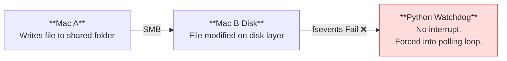

# Architectural Failure of SMB Event Propagation vs TCP Socket Reliability

---

## Scenario 1: Shared Network Folder (SMB) + Watchdog

---

## Scenario 2: Direct TCP Socket Connection

---

## Why

macOS `fsevents` APIs rely on local disk interrupts. When a file is written over an **SMB** network mount, the receiving kernel does not generate an interrupt, forcing the watchdog into an inefficient polling loop.

A direct **TCP socket** bypasses the filesystem entirely, writing straight to the target's memory and triggering the native `pbcopy` binary instantly.

---

## Data Sources

- [Watchdog — GitHub](https://github.com/gorakhargosh/watchdog)
- [FSEvents — Medium](https://medium.com)
- [Parcel — GitHub](https://github.com/nicowillis/parcel)

[VELORIN.EOF]
