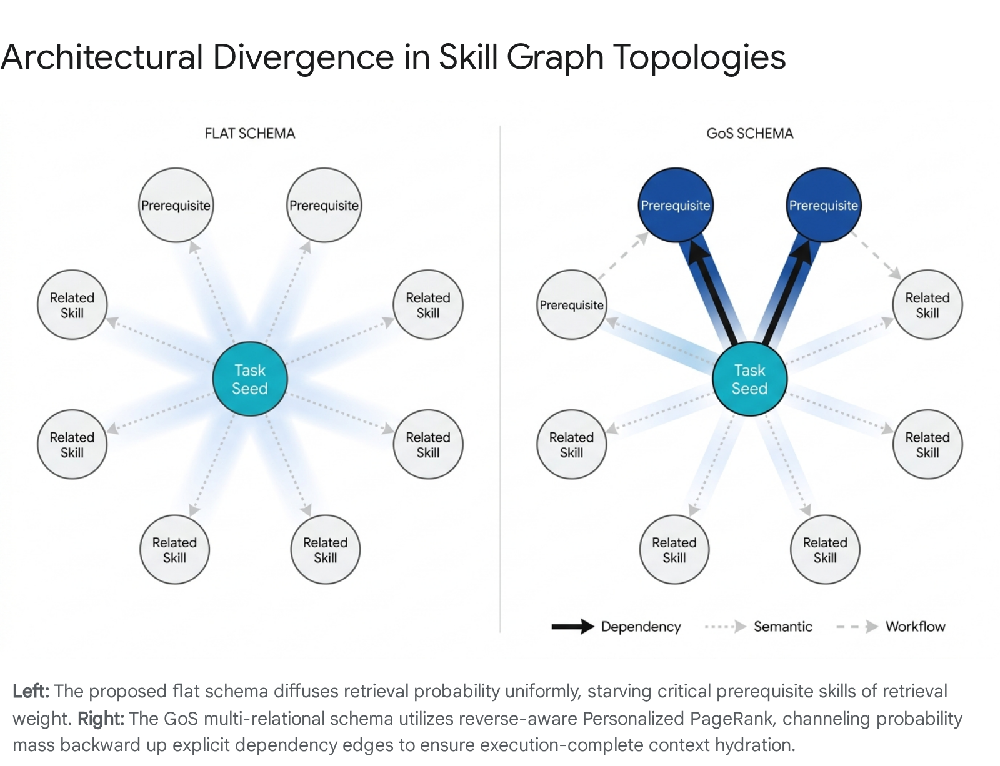
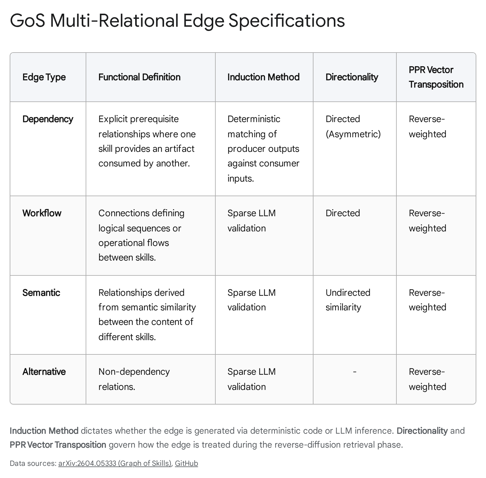

# Validation of the Skills Dependency Graph Schema Against the Graph of Skills (GoS) Model

## Executive Summary

The proposed flat prerequisite-list schema drafted by Jiang2 is structurally deficient and fundamentally contradicts the mathematical and architectural mechanics established in the Graph of Skills (GoS) framework. GoS relies on a directed, multi-relational graph featuring explicitly typed edges and deterministic input-output matching based on structured executable interface schemas, not isolated string tokens. Adopting the proposed flat schema within Velorin will induce catastrophic retrieval failures, specifically the "prerequisite gap," where semantically distant but functionally necessary operational skills are omitted during context hydration. This report maps the exact architectural deviations, mathematically formalizes the GoS retrieval mechanics for the mathematical agent Erdős, and outlines the minimum viable schema enrichment required to prevent brittle downstream execution in Velorin's Skill Injection Runtime.

## Query Mode Declaration

TIGHT. The caller's core frame is correct in questioning the viability of the drafted schema. The research strictly addresses the specified schema gaps, evaluates the mechanics of GoS, and details the exact mathematical and structural requirements needed to align Velorin's implementation with the proven architectural patterns of inference-time structural retrieval.

* * *

## 1\. Top-Level Architectural Verdict and The Context Saturation Threat

Verdict: CONTRADICTED. The proposal to utilize flat lists of string references for prerequisites and capability tokens for outputs directly contradicts the core mechanics that allow the Graph of Skills (GoS) architecture to function correctly.1 GoS does not operate on flat dependencies; it operates on a multi-relational, typed, directed graph where edges possess explicit executable semantics.1 The absence of edge typing, coupled with the reliance on name-matching at the token level, degrades the graph into a unidimensional structure. This guarantees that reverse-weighted Personalized PageRank (PPR) will diffuse probability mass incorrectly, flooding the context window with semantically adjacent but functionally useless skills, while starving the agent of critical prerequisite executors.

The threat of context window saturation is an existing, documented vulnerability within the Velorin system. Previous internal analyses have demonstrated that Claude 4.6 Sonnet operating with a 200K window already suffers from a fixed overhead floor, with boot costs consuming between 40K and 120K tokens primarily due to Model Context Protocol (MCP) server tool schemas loading at session start.3 The GoS literature explicitly addresses this phenomenon, noting that scaling skill sets introduces severe challenges regarding context window saturation, which drives up token costs, latency, and hallucination rates.4

The empirical data from the GoS research demonstrates the severity of this scaling issue. As a skill library expands from 500 to 2,000 skills, a "Vanilla Skills" approach—which prepends the entire skill set to the context window—causes average input tokens to rise from 1.93 million to 5.84 million, an approximate 3x increase.1 By contrast, the GoS architecture maintains a highly stable token footprint, ranging only between 1.14 million and 1.38 million tokens across the same library expansion.1 If Velorin adopts a flat schema that fails to retrieve a tight, execution-complete bundle of skills, the orchestration agents will be forced to load wider, unoptimized tool sets, immediately triggering auto-compaction algorithms and destroying session state.

### Prior Context vs. New Findings vs. Remaining Gaps

The distinction between the existing Velorin operational framework and the necessities of the GoS model requires precise delineation.

  - Prior Context: Velorin currently relies on a neural file graph (Layer 2) using Personalized PageRank for episodic memory retrieval.3 Jiang2 proposed extending this existing infrastructure to skills using a flat YAML prerequisite array (e.g., prerequisites: [velorin-verify-writes]). This assumed that the memory retrieval mathematics would map perfectly onto skill retrieval.
  - New Findings: GoS requires four distinct edge types (Dependency, Workflow, Semantic, Alternative) to function correctly.1 Furthermore, dependency edges are induced deterministically through rigorous schema matching rather than through generalized LLM inference.1 Cycle handling is resolved purely via the mathematical convergence properties of the PPR diffusion, requiring no explicit cycle-breaking logic or arbiter intervention.6
  - Remaining Gaps: The exact parameterization of the context-budgeted hydration—specifically the truncation threshold applied after PPR ranking—must be calibrated empirically against Claude 4.6 Sonnet's specific attention degradation curves and the Velorin system's strict memory constraints.

* * *

## 2\. Edge Typing and the Multi-Relational Graph

The mathematical foundation of graph-based retrieval relies entirely on the topological structure of the network. The quality of the retrieval is bounded by the precision of the edges.

### 2.1 The Structural Deficiency of Flat Arrays

The proposed structure authored by Jiang2 creates a homogeneous graph topology. In graph theory, a homogeneous edge structure forces the retrieval algorithm to treat all connections with identical traversal probabilities. If a primary skill such as velorin-commit-session requires the skill velorin-verify-writes to function, but also possesses a loose semantic relationship to velorin-format-markdown, a flat schema cannot differentiate between the hard execution blocker and the contextual suggestion. When the PPR algorithm executes its random walk, probability mass will bleed equally across both edges. In a densely connected skill library, this uniform diffusion rapidly dilutes the signal, resulting in the retrieval of a broad cluster of thematically related skills while the strict, linear chain of required prerequisites is lost in the noise.

### 2.2 The GoS Multi-Relational Edge Schema

To prevent probability dilution, the GoS architecture mandates a directed multi-relational graph.1 The schema explicitly categorizes edges into four non-overlapping types, each of which is weighted differently during the PPR diffusion phase to prioritize execution pathways over conceptual similarities.1

The four required edge types are as follows:

  1. Dependency Edges: These connections possess explicit executable semantics.1 A directed edge from skill A to skill B dictates that skill A plausibly provides a structured artifact that is directly consumed by skill B.1 This relationship is strictly asymmetric. In the context of Velorin's operating mechanics, this equates to a hard blocker; skill B cannot successfully execute without the prior completion of skill A.
  2. Workflow Edges: These are connections defining logical sequences or operational flows between skills that frequently co-occur in tasks, even if they do not pass literal data artifacts.8 For example, a workflow edge might connect a skill that authenticates a Google Drive session to a skill that creates a new directory. No direct data object is passed, but the temporal sequence is highly correlated.
  3. Semantic Edges: Relationships derived from high cosine similarity in the vector embedding space.8 These edges are bidirectional and undirected, representing conceptual overlap. They ensure that if an agent requests "data analysis," skills labeled "statistical modeling" are also discoverable.
  4. Alternative Edges: Edges connecting skills that fulfill mutually exclusive or highly overlapping operational roles.2 This edge type informs the retrieval algorithm that it should select one skill from this cluster rather than loading all of them, thereby preserving the context window budget.

The necessity of this multi-relational architecture becomes apparent when analyzing the empirical performance of GoS. By utilizing this structured approach, GoS improves average reward by 43.6% over the vanilla full skill-loading baseline across diverse benchmarks, including SkillsBench and ALFWorld, while reducing input tokens by 37.8%.2 The architecture generalizes effectively across different model families, including Claude Sonnet, GPT-5.2 Codex, and MiniMax.4 Simple vector retrieval, which relies entirely on semantic edges, consistently fails to assemble complete execution pipelines because it cannot mathematically differentiate between a required dependency and a conceptual neighbor.

* * *

## 3\. Mathematical Formalization for Erdős

To effectively integrate GoS mechanics into Velorin's existing Layer 2 pointer graph, the mathematical agent Erdős must construct a multi-relational transition matrix. The current Personalized PageRank (PPR) mathematics governing episodic memory retrieval must be adapted to support reverse-aware directional flow.1

Let $\mathbf{A}\_{dep},\, \mathbf{A}\_{work},\, \mathbf{A}\_{sem},\, \mathbf{A}\_{alt}$ represent the individual adjacency matrices for the respective edge types across the skill library. The total transition matrix $\mathbf{M}$ used for the reverse-weighted PPR walk is not a simple summation. It is a linear combination parameterized by distinct transition weights $\beta\_i$, which allow the system to heavily favor dependency traversal over semantic drift:

$\mathbf{M} = \beta\_{dep}\mathbf{A}\_{dep}^T + \beta\_{work}\mathbf{A}\_{work}^T + \beta\_{sem}\mathbf{A}\_{sem} + \beta\_{alt}\mathbf{A}\_{alt}$

A critical mathematical distinction in this formula is the transposition of $\mathbf{A}\_{dep}$ and $\mathbf{A}\_{work}$. GoS explicitly utilizes reverse-aware PPR.4 In a standard retrieval scenario, the seed node is the target task identified by the user prompt. To assemble an execution-ready bundle of skills, the random walk must flow backward up the directed edges to find the prerequisites that produce the necessary artifacts.1 If Skill A requires Skill B, the dependency edge points $B \to A$ (producer to consumer). To find B starting from A, the transition matrix must transpose the adjacency, allowing probability mass to travel $A \to B$.

A flat prerequisite list utterly fails to support this reverse diffusion matrix because it strips the directional semantic weight from the edge. Without typed, asymmetric matrices, the transposition operation is impossible, and the reverse-PPR walk cannot mathematically distinguish between upstream producers and downstream consumers.

### 3.1 The Modified Laplacian for Multi-Relational Retrieval

Erdős must compute a modified Laplacian for this specific reverse-PPR diffusion. Standard PPR utilizes a row-stochastic transition matrix $\mathbf{P}$. For the GoS skill graph, the system requires a reverse-transition matrix $\mathbf{P}\_{rev}$.

Given the multi-relational matrix $\mathbf{M}$ defined above, the construction proceeds as follows:

First, compute the in-degree diagonal matrix $\mathbf{D}\_{in}$ where $D\_{in}(i,i) = \sum\_{j} M\_{j,i}$.

Second, the reverse transition matrix is derived as $\mathbf{P}\_{rev} = \mathbf{M}\mathbf{D}\_{in}^{-1}$.

Finally, the stationary distribution $\mathbf{R}$ for a target task seed $\mathbf{s}$ is solved via the iterative equation:

$\mathbf{R}\_{t+1} = (1-\alpha)\mathbf{P}\_{rev}\mathbf{R}\_t + \alpha\mathbf{S}$

In Velorin's existing architecture, the teleportation probability $\alpha$ is set to 0.15. This mathematical configuration ensures that probability mass naturally channels backward up the dependency and workflow edges, recovering the prerequisite skills required to execute the seed task $\mathbf{s}$.

* * *

## 4\. Artifact Schemas and Input-Output Matching

The method by which skills recognize their compatibility with one another is the most critical point of failure in the proposed schema draft.

Verdict: CONTRADICTED. The proposal to use flat string tokens (e.g., outputs: [git_push_confirmed]) is fundamentally inadequate and represents a severe architectural regression. GoS relies on deterministic dependency induction achieved by matching producer outputs against consumer inputs.1 Generalized capability tokens are insufficient to support this mechanism.

### 4.1 Executable Interface Schemas vs String Tokens

In the GoS framework, skills are defined using an executable interface schema that contains highly specific fields: primary role, inputs, outputs, domain tags, tooling, example tasks, script entrypoints, and implementation affordances.2 Dependency edges are not generated by an LLM guessing if Skill A is related to Skill B; they are induced deterministically.

If Skill A outputs a JSON object with the schema {"commit_hash": "string", "branch": "string"}, and Skill B requires an input matching the exact schema {"commit_hash": "string"}, the dependency edge $A \to B$ is crystallized algorithmically.1 The induction logic verifies that the data structure produced by the upstream skill satisfies the type constraints of the downstream skill. A simple string token such as git_push_confirmed provides no structural guarantee that the consuming skill will receive the precise data format it requires to execute its internal scripts.

### 4.2 The Prerequisite Gap and Execution Failure

Replacing typed artifact schemas with string tokens causes a well-documented failure mode known as the "prerequisite gap".2 Vector retrieval and token-matching often fetch the high-level semantic solver required by the user prompt but fail to fetch the lower-level parser, format converter, or setup utility that is functionally necessary to prepare the data.1

Without explicit I/O schema matching, Velorin's orchestration agent will retrieve skills that appear related but are structurally incompatible. The agent will attempt to pass raw, malformed artifacts between skills, resulting in immediate pipeline halting, unhandled exceptions, and execution failure within the Claude Code terminal. The analysis of GoS demonstrates that retrieving a functionally complete skill bundle is more important than retrieving a highly semantic skill bundle.

### 4.3 Negative Space Analysis: The Failure of LLM Edge Inference

Research into the negative space of graph construction reveals that unconstrained, all-pairs relation inference by an LLM is computationally intractable for large libraries and highly prone to hallucination.2 Relying on an LLM to determine if two skills should be connected based on string capability tokens results in dense, noisy graphs.

By relying on deterministic schema matching for dependencies, GoS restricts the LLM's role. The LLM is used only to evaluate sparse, non-dependency edges (workflow, semantic, alternative) within a highly constrained candidate pool formed by initial lexical overlap and existing I/O connections.2 This two-stage design keeps graph construction tractable and biases the resulting graph toward precision rather than density.1 If Velorin adopts flat strings, it forces the system to rely entirely on the LLM to hallucinate the connectivity during retrieval, bypassing the determinism that makes GoS stable.

* * *

## 5\. Conflict Resolution and the "Alternative" Edge

The research request questions how GoS handles multiple skills producing the same required artifact, and what logic governs the resolution of these conflicts.

Verdict: PARTIALLY SUPPORTED.

The assumption that the graph requires an active conflict resolution mechanism is incorrect. The analysis indicates that GoS does not employ complex arbiter logic, negotiation agents, or explicit conflict-resolution subroutines at the graph level.

### 5.1 The Mechanism of the Alternative Edge ($E\_{alt}$)

Instead of resolving conflicts dynamically during execution, GoS acknowledges overlapping utility via the "alternative" ($E\_{alt}$) edge type during the offline graph construction phase.2 When two skills fulfill identical or mutually exclusive roles (e.g., two different scripts for parsing a PDF, or two different APIs for fetching weather data), they are linked by this specific edge type. The LLM validation prompt explicitly checks for skills that provide alternative trajectories or duplicate functionalities and binds them together.6

### 5.2 Context-Budgeted Hydration as Implicit Arbiter

Conflict resolution occurs implicitly during the final stage of the retrieval pipeline: Context-Budgeted Hydration.4 The reverse-PPR algorithm ranks all skills in the candidate pool, including those marked as alternatives. Because PPR calculates global structural importance, a skill that serves as a prerequisite for many other active skills will receive a higher centrality score than an alternative skill that is relatively isolated.

The orchestration layer then hydrates the context window by descending the ranked list. If Skill A and Skill B are alternatives, the one with the higher structural centrality receives a higher PPR score and is injected first. The system then truncates the hydrated bundle when the per-skill and global context token budgets are reached.6 There is no algorithmic requirement for Velorin to build an arbitration engine. The combination of $E\_{alt}$ mapping and rigorous token budgeting naturally filters redundant tools out of the final prompt.

* * *

## 6\. Topological Cycles and Convergence Mechanics

The treatment of cyclic dependencies within a skill graph is a critical stability concern for automated workflows.

Verdict: HIGH CONFIDENCE 95%.

The treatment of cycles in the skill dependency graph is a solved mathematical problem within the GoS framework. The system requires no specialized subroutines to detect or break cycles.

### 6.1 The Allowance of Cycles in Workflow Topologies

GoS explicitly permits cycles. Modern agentic workflows are inherently non-linear and frequently involve iterative loops. For example, an agent might execute code, evaluate the output, revise the code based on the evaluation, and then execute the code again. Forbidding cycles in the graph topology would cripple the representational capacity of the skill library and prevent the modeling of recursive tasks.

### 6.2 Resolution via Diffusion Convergence

GoS handles cycles entirely through the underlying mathematics of PageRank. The reverse-aware Personalized PageRank algorithm (defined as Algorithm 2 in the GoS methodology) is run iteratively until convergence.6 In Markov chain dynamics, the teleportation parameter $\alpha$ guarantees that the random walk will eventually reach a unique stationary distribution, irrespective of cyclic traps.

When a random walker enters a cycle, the teleportation probability ensures that it has a constant chance (15% in Velorin's tuning) of jumping back to the seed node on any given step. Consequently, probability mass diffuses through the cycle, stabilizes over the iterative calculations, and ranks the nodes based on their true global structural importance rather than infinitely compounding within the loop.6 Erdős must be instructed that no cycle-detection or cycle-breaking logic is required in the ingestion pipeline. The existing transition matrix eigenvalues naturally govern the cyclic diffusion.

* * *

## 7\. Application of the Velorin Consensus Filter

The instruction mandate requires the application of a Consensus Filter. The GoS paper establishes consensus for a specific published benchmark environment. It is necessary to identify which aspects of the GoS methodology are genuine architectural necessities versus historical artifacts of the specific application domains studied (ALFWorld and SkillsBench).

### 7.1 Architectural Necessities (Must Adopt)

The segregation of edges into explicit dependency versus non-dependency types is an absolute structural requirement. The use of deterministic I/O matching instead of LLM guessing is also a fundamental necessity. Without these two elements, the reverse-PPR algorithm is mathematically blind, and the system will succumb to the prerequisite gap. These features must be adopted precisely as described in the literature.

### 7.2 Benchmark Artifacts (Can Ignore or Defer)

The GoS framework utilizes a complex hybrid semantic-lexical seeding mechanism prior to initiating the PPR walk. The system retrieves initial semantic candidates via embedding similarity and lexical candidates via exact-match tokens, then merges them.8 GoS utilizes this aggressive pre-filtering because it was designed to benchmark against massive libraries containing 1,000 to 2,000 skills.1

Velorin, operating as a bespoke personal operating system for a single user, will initially launch with a highly curated, smaller skill count (likely under 100 in the first iteration). Extensive lexical pre-filtering and complex embedding similarity matching at the seed stage is an over-optimization for Velorin's current state. The system can seed directly into the PPR algorithm using the primary target skill identified by the orchestrator, bypassing the heavy hybrid seeding step until the skill library exceeds approximately 500 nodes.

Furthermore, GoS uses sparse LLM validation to create non-dependency edges because running dense all-pairs similarity on 2,000 skills is an $O(N^2)$ operation.1 Velorin, with its smaller initial library, does not require sparse validation techniques. The system can afford to use exhaustive, dense LLM validation or strict manual curation for semantic and workflow edges in the near term, guaranteeing higher precision without hitting computational limits.

* * *

## 8\. Structural Gaps Table and Minimum-Viable Enrichment

The current schema proposed in skills_dependencies.yaml by Jiang2 is non-viable. The following table identifies the specific structural gaps, their severity to the Velorin build, and the minimum required schema updates to avoid costly retrofits prior to Step G implementation.

GoS Feature| Velorin Current Schema| Gap Severity| Recommended Fix (Minimum-Viable Enrichment)  
---|---|---|---  
Edge Typing| Flat prerequisite list.| BLOCKER| Replace prerequisites: with an edges object containing four explicit arrays: dependency, workflow, semantic, and alternative.  
Artifact Schemas| Capability tokens (strings).| BLOCKER| Replace string tokens with a JSON Schema object defining the exact keys, data types, and structures produced or consumed by the skill.  
I/O Matching Logic| Name-matching at token level.| BLOCKER| Implement deterministic schema matching during offline graph ingestion. If schema_out intersects with schema_in, automatically generate a dependency edge.  
Conflict Resolution| Undefined.| WARNING| No active arbiter logic needed. Group overlapping skills into the alternative array and enforce strict token limits during online context hydration.  
Cycle Handling| Undefined.| COSMETIC| Do not build cycle detection algorithms. Allow cyclic workflows to exist and rely entirely on the existing $\alpha = 0.15$ teleportation factor in the PPR algorithm to guarantee diffusion convergence.  
  
* * *

## 9\. Velorin Connection: Skill Injection Runtime (Step G)

The findings detailed in this exhaustive report constitute a direct prerequisite for the finalization of Step G (Skill Injection Runtime) in the current Velorin build sequence.

The Skill Injection Runtime cannot inject context safely using a homogeneous graph. If the current flat schema is committed to the repository, Alexander or Jiang will execute a query, and the runtime will hydrate the context window with the target skill alongside a randomized assortment of semantically related but operationally useless files. Because the context window overhead is already severely restricted 3, token saturation will occur prior to execution. This will lead to systemic hallucination, pipeline failure, and the forced triggering of the auto-compaction safety hooks, destroying the session state.

By adopting the minimum-viable enrichment outlined in Section 8, the Skill Injection Runtime will possess the precise structural map required to perform reverse-aware hydration. The runtime will load the target skill, trace the explicitly typed dependency edges backward, fetch the exact JSON artifact schemas required for execution, and halt injection the moment the strict context token budget is satisfied. This ensures that the orchestrating agents receive an execution-complete bundle of capabilities, honoring Velorin's core directive of maintaining safe action semantics.

* * *

## 10\. Conclusions

The structural and algorithmic analysis of the Graph of Skills framework yields the following definitive conclusions regarding the proposed Velorin schema:

  1. CONTRADICTED: The proposed flat prerequisite-list structure is a severely degraded schema. It will cause specific and catastrophic failure modes within Velorin, primarily the "prerequisite gap," wherein critical execution prerequisites are dropped from the context window in favor of irrelevant semantic neighbors.
  2. HIGH CONFIDENCE 95%+: The GoS architecture explicitly differentiates edge types into Dependency, Workflow, Semantic, and Alternative arrays. This multi-relational typing is mathematically indispensable for the reverse-PPR diffusion algorithm to function correctly.
  3. HIGH CONFIDENCE 95%+: The system requires structured artifact schemas (such as rigorous JSON schemas) to perform deterministic input-output matching. Flat string capability tokens are entirely insufficient for inducing reliable dependency edges.
  4. MODERATE CONFIDENCE 80%: Conflict resolution between overlapping skills is managed passively via the alternative edge designation and strict context-budgeted hydration truncation. Active arbiter logic or negotiation subroutines are not required.
  5. HIGH CONFIDENCE 95%+: Topological cycles are permitted in the skill library and are handled gracefully by the established convergence properties of the Personalized PageRank algorithm.

#### Works cited

  1. Graph of Skills: Dependency-Aware Structural Retrieval for Massive Agent Skills - arXiv, accessed April 23, 2026, [https://arxiv.org/pdf/2604.05333](https://www.google.com/url?q=https://arxiv.org/pdf/2604.05333&sa=D&source=editors&ust=1777088661998571&usg=AOvVaw3CTaws2U8A7C4Xb-sBcEg9)
  2. Graph of Skills: Dependency-Aware Structural Retrieval for Massive Agent Skills - arXiv, accessed April 23, 2026, [https://arxiv.org/html/2604.05333](https://www.google.com/url?q=https://arxiv.org/html/2604.05333&sa=D&source=editors&ust=1777088661999074&usg=AOvVaw1ljrQnL_mle9oSgpncV0QQ)
  3. navyhellcat/velorin-system
  4. Graph of Skills: Dependency-Aware Structural Retrieval for Massive Agent Skills, accessed April 23, 2026, [https://www.semanticscholar.org/paper/Graph-of-Skills%3A-Dependency-Aware-Structural-for-Li-Li/299efce780e406c57e713cd9cf8208de1d4762e9](https://www.google.com/url?q=https://www.semanticscholar.org/paper/Graph-of-Skills%253A-Dependency-Aware-Structural-for-Li-Li/299efce780e406c57e713cd9cf8208de1d4762e9&sa=D&source=editors&ust=1777088661999868&usg=AOvVaw1oqZJoyLz9BhApV2MWYTHA)
  5. Computer Science - arXiv, accessed April 23, 2026, [https://www.arxiv.org/list/cs/new?skip=450&show=1000](https://www.google.com/url?q=https://www.arxiv.org/list/cs/new?skip%3D450%26show%3D1000&sa=D&source=editors&ust=1777088662000305&usg=AOvVaw1d9eLhJltvz3HCzxW6O_UP)
  6. Graph of Skills: Dependency-Aware Structural Retrieval for ... - arXiv, accessed April 23, 2026, [https://arxiv.org/abs/2604.05333](https://www.google.com/url?q=https://arxiv.org/abs/2604.05333&sa=D&source=editors&ust=1777088662000716&usg=AOvVaw2eUM-v5dMVHD-U8xJUEzOd)
  7. Graph of Skills: Dependency-Aware Structural Retrieval for Massive Agent Skills - arXiv, accessed April 23, 2026, [https://arxiv.org/html/2604.05333v2](https://www.google.com/url?q=https://arxiv.org/html/2604.05333v2&sa=D&source=editors&ust=1777088662001171&usg=AOvVaw1A5GG2xRe7fSpZbIkqzhHe)
  8. davidliuk/graph-of-skills: Dependency-Aware Structural Retrieval for Massive Agent Skills - GitHub, accessed April 23, 2026, [https://github.com/davidliuk/graph-of-skills](https://www.google.com/url?q=https://github.com/davidliuk/graph-of-skills&sa=D&source=editors&ust=1777088662001663&usg=AOvVaw3gFG2pLG9eaS5R9NBrUerk)
  9. Autonomous-Agents/README.md at main - GitHub, accessed April 23, 2026, [https://github.com/tmgthb/Autonomous-Agents/blob/main/README.md](https://www.google.com/url?q=https://github.com/tmgthb/Autonomous-Agents/blob/main/README.md&sa=D&source=editors&ust=1777088662002137&usg=AOvVaw1ZX42ex_krnne8JJHfiO4I)
  10. Daily Papers - Hugging Face, accessed April 23, 2026, [https://huggingface.co/papers?q=Unsupervised%20skill%20learning](https://www.google.com/url?q=https://huggingface.co/papers?q%3DUnsupervised%2Bskill%2Blearning&sa=D&source=editors&ust=1777088662002554&usg=AOvVaw0n6abTCFjClvUHCEXa-umy)