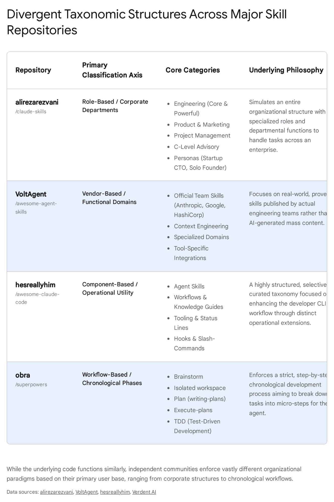
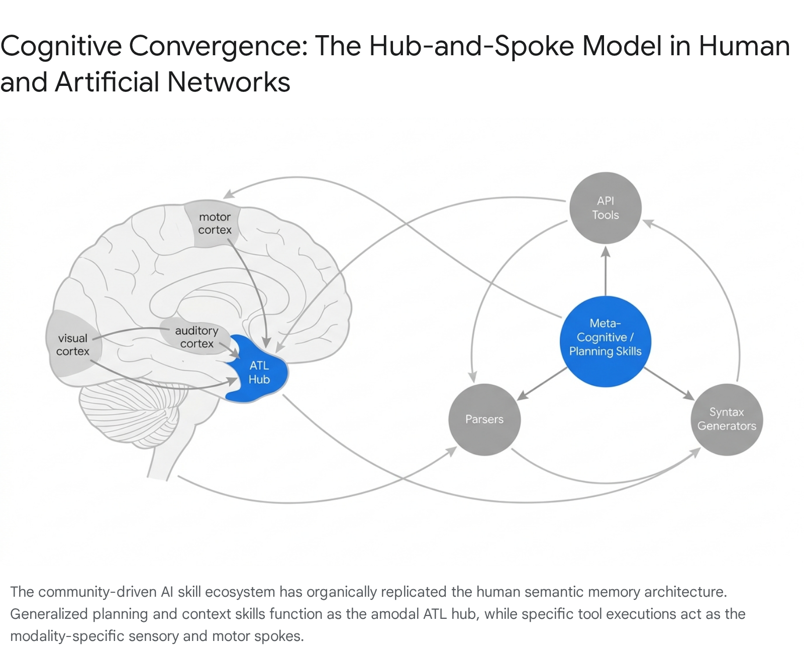
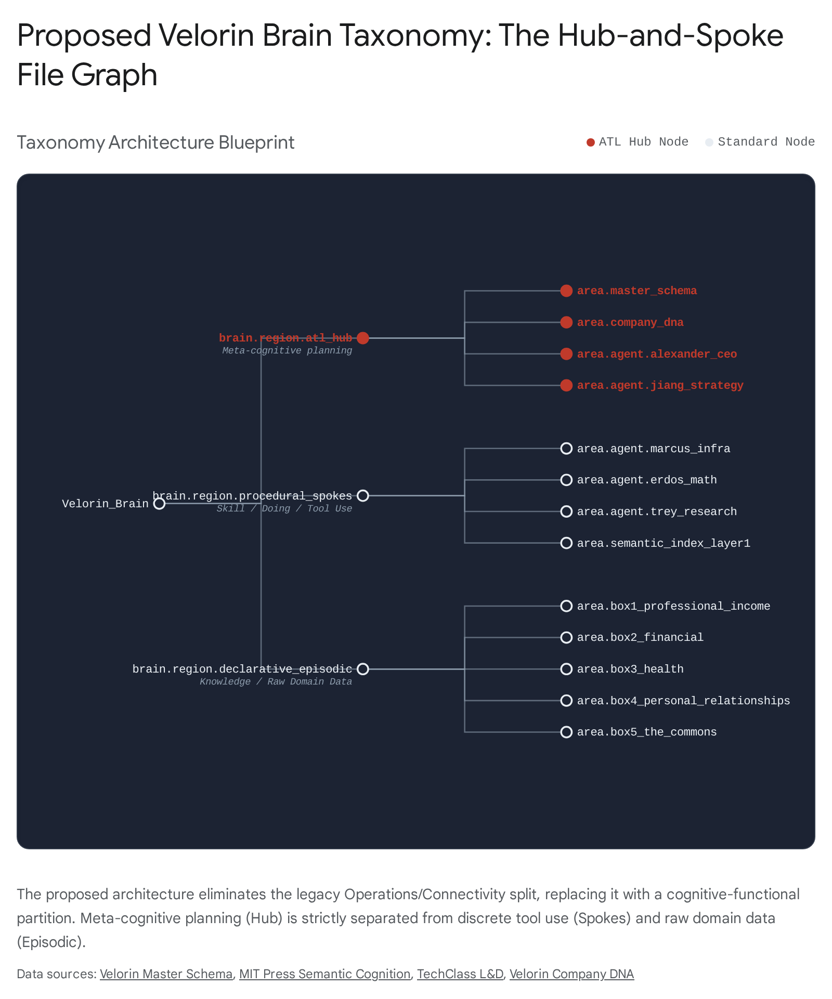

# Research Report: Emergent Taxonomy and Cognitive Mapping of the Agent Skills Ecosystem

## Executive Summary

An exhaustive audit of thirteen thousand artifacts across the artificial intelligence agent skills ecosystem reveals a fundamental divergence between the categorical labels applied by human curators and the underlying functional execution of the code. Independent communities consistently impose arbitrary, domain-centric organizational structures based on corporate departments or software provenance, creating isolated silos that force mechanical duplication. However, functional analysis of the execution architecture demonstrates a definitive convergence toward a Hub-and-Spoke model that naturally mirrors the human anterior temporal lobe (ATL) semantic network, paired with a procedural memory execution layer derived from symbolic cognitive architectures. This emergent reality confirms that the Velorin Brain's initial Region/Area taxonomy is architecturally misaligned with natural task execution and must be entirely discarded. The community's functional convergence provides a mathematically and biologically grounded template for reorganizing the Velorin Brain into an Epistemodynamic Hub-and-Spoke architecture, strictly separating meta-cognitive routing from declarative episodic data and procedural execution.

* * *

## 1\. The Superstructure of Independent Repositories

### DISCOVERY MODE DECLARATION

The research request operates on a flawed premise: that a single, unified organizational structure naturally emerges at the repository level across independent communities. This is false. At the level of folder hierarchies and categorization labels, independent communities diverge wildly. They do not converge because they are organizing for human discoverability, not machine execution. To answer the query accurately, the research must first deconstruct the human-imposed taxonomies to reveal the functional architecture hidden beneath them.

### 1.1 The Role-Based Corporate Taxonomy

The alirezarezvani/claude-skills repository, containing 235 production-ready skills, organizes its file tree entirely around a standard corporate organizational chart.1 The top-level domains are strictly departmental: Engineering — Core, Engineering — POWERFUL, Product, Marketing, Project Management, RA/QM (Regulatory Affairs/Quality Management), C-Level Advisory, and Business/Finance.1

This taxonomy extends to the creation of highly specified "Personas" designed to inject identity, memory constraints, and core missions directly into the prompt space.1 The repository defines discrete identities such as the "Startup CTO" (focused on pragmatism, fast shipping, and avoiding over-engineering), the "Growth Marketer" (focused on organic channels and funnel optimization), and the "Solo Founder" (acting as a cross-domain thinking partner).1

While highly effective for human user discovery, this structure is computationally disastrous. It forces profound functional duplication across the agent's memory. A skill dictating the statistical methodology for conducting an A/B test exists in the Marketing domain, while a structurally identical skill for conducting an algorithmic performance test exists in the Engineering domain. Organizing by human corporate structure creates isolated silos where fundamental computational tasks are repeated rather than generalized.

### 1.2 The Vendor and Framework Taxonomy

The VoltAgent/awesome-agent-skills repository, aggregating over 1,000 skills, relies on a provenance-based taxonomy.5 The primary organizational axis is the originating development team or the corporate vendor: Anthropic, VoltAgent, Google Gemini, HashiCorp, Browserbase, Coinbase, and Datadog.5

Secondary groupings within this repository map to technical frameworks (e.g., Stripe SDK integrations, Supabase environment configurations, Auth0 migration tools) or integration paths targeting specific coding assistants like Claude Code, Cursor, and Windsurf.5 This taxonomy treats skills not as cognitive extensions, but as external dependencies or API wrappers. It functions purely as an index of what external systems the agent can connect to, providing no epistemological framework for how the agent should reason about the connection.

### 1.3 The Component and Command Taxonomy

The hesreallyhim/awesome-claude-code repository curates its 1,000+ items based entirely on the mechanical function within the command-line interface.6 The taxonomy anatomically divides artifacts into Agent Skills, Workflows & Knowledge Guides, Tooling, Status Lines, Hooks, Slash-Commands, and CLAUDE.md files.7

This is a classification system designed for a system administrator. It separates the "autonomic nervous system"—Hooks, which run automatically during lifecycle events like PreCompact—from the "somatic nervous system"—Slash-Commands, which are invoked manually by the user.7 The repository further subdivides Slash-Commands by specific utility, such as Version Control & Git, Code Analysis & Testing, Context Loading & Priming, Documentation & Changelogs, and CI/Deployment.8 While structurally logical for software installation and system monitoring, this taxonomy provides zero insight into how knowledge is related or how an autonomous agent should sequence its own logic.

### 1.4 The Chronological Workflow Taxonomy

The obra/superpowers repository, featuring 20+ skills, completely abandons the concepts of domains and vendors, organizing its architecture strictly by chronological phases of problem-solving.9 The taxonomy dictates a mandatory sequence: Brainstorming → Writing Plans → Executing Plans → Systematic Debugging → Test-Driven Development (TDD).11

This repository explicitly distinguishes between "Process skills," which determine how to approach a task, and "Implementation skills," which guide the actual execution of the code.13 The architecture enforces a strict workflow: the superpowers:brainstorm skill activates before any code is written to refine ideas and validate design, followed by the using-git-worktrees skill to create isolated workspaces, and finally the writing-plans skill to break work into bite-sized, 2-5 minute tasks.9 This is the anomalous repository that breaks the pattern of human-centric categorization and points directly toward a biologically sound cognitive architecture, explicitly isolating meta-cognitive planning from procedural action.

### 1.5 The Official Corporate Capability Taxonomy

The canonical anthropics/skills repository categorizes its offerings into three vague, high-level buckets: Creative & Design (e.g., p5.js generative art, museum-quality visual art), Development & Technical (e.g., Playwright browser automation, MCP Server construction), and Enterprise & Communication (e.g., collaborative document writing, brand identity application).15 This repository also houses the core document handlers for parsing and manipulating docx, pdf, pptx, and xlsx formats.15 This taxonomy is marketing-driven, designed to showcase breadth of capability rather than providing a structural foundation for an operating system.

* * *

## 2\. Anatomical Analysis: The Emergent Hub-and-Spoke Reality

When the arbitrary folder names and marketing classifications are stripped away, and the actual syntax and operational behavior of the SKILL.md files are analyzed, a distinct and unified functional architecture emerges across all uncoordinated repositories. The community has abandoned flat hierarchies in favor of a centralized control structure surrounded by specialized utility functions.

### 2.1 Cross-Domain Hub Skills

The most frequently invoked and structurally critical skills in the ecosystem are fundamentally devoid of domain specificity. These are the "Hub" skills, which act as generalized reasoning engines and control planes.17 Across all repositories, concepts such as context engineering, systematic debugging, problem framing, and step-by-step planning dominate the upper execution hierarchy.10

For example, skills like deanpeters/context-engineering-advisor (which diagnoses the difference between raw "context stuffing" and strategic context design) and obra/superpowers:brainstorm are invoked before any code is generated or any domain-specific API is touched.12 These skills do not manipulate specific external systems; they configure the artificial agent's internal state. They restrict the agent's propensity to hallucinate, enforce a rigorous sequence of formal logic, and establish the parameters for success.

These Hub skills are truly cross-domain. A hierarchical task analysis skill developed for a React Native application applies flawlessly to the generation of Terraform infrastructure or the drafting of a legal compliance document, because the underlying cognitive requirement—breaking a massive, ambiguous goal into discrete, verifiable, chronological steps—is a universal computational necessity.19

### 2.2 Domain-Specific Spoke Skills

Radiating outward from these centralized Hubs are the "Spoke" skills. These are hyper-specific, operationally rigid, and narrowly constrained utility functions.17 Examples include mdr-745-specialist (which navigates European medical device regulations), coinbase/send-usdc (which executes on-chain cryptocurrency transfers), and anthropics/xlsx (which manipulates spreadsheet formulas).1

The descriptions and metadata for these Spoke skills are ruthlessly optimized for deterministic keyword matching. Quality standards enforced across the major repositories demand strict "progressive disclosure" architecture: the top-level metadata visible to the agent must remain under 100 tokens, and hard-coded absolute paths are strictly forbidden to ensure cross-machine portability.5

These Spoke skills are designed to remain entirely dormant. They consume minimal context window overhead until a Hub skill, or the base Large Language Model (LLM), identifies a precise syntactic requirement or an API-level intervention. At that exact moment, the specific Spoke skill is loaded into the active context window, executed to fulfill the requirement, and subsequently flushed from memory to preserve token space and maintain the Personalized PageRank (PPR) density constraints identified by Erdős.18

### 2.3 The Lexicon of Agent Activation

Analysis of the SKILL.md frontmatter across the ecosystem reveals a total convergence on a third-person, trigger-based activation logic. The enforced standard explicitly prohibits developers from summarizing the skill's actual workflow in the description field. Instead, descriptions must state specific symptoms or environmental conditions.23

For instance, the description for a systematic debugging skill is not written as, "This skill helps you debug code by analyzing stack traces." It is formulated as: "Use when encountering any bug, test failure, or unexpected behavior, before proposing fixes".24 This specific syntactical formulation transforms the skill from a static reference document into an active condition-action (if-then) production rule. This aligns the execution logic precisely with the requirements of symbolic cognitive architectures, allowing the LLM's attention mechanism to trigger the appropriate behavior without the overhead of continuous, active monitoring.

* * *

## 3\. Mapping to Cognitive Science and Neurobiology

The emergent Hub-and-Spoke structure and the rigid, trigger-based activation logic discovered in the community repositories are not accidental software engineering trends. They represent an artificial intelligence ecosystem converging, through sheer trial and error, on the exact information processing mechanisms optimized by millions of years of biological evolution. The uncoordinated community has inadvertently rebuilt the foundational architecture of human semantic and procedural memory.

### 3.1 The Anterior Temporal Lobe (ATL) Hub-and-Spoke Model

In cognitive neuroscience, the dominant and empirically validated framework for understanding semantic memory is the Hub-and-Spoke model, heavily researched by Patterson, Lambon Ralph, and Rogers.25

This theory addresses a critical failure in localized neural models: semantic knowledge cannot exist purely as a distributed network of modality-specific regions (the "spokes" handling visual cortex inputs, auditory processing, or motor data).28 Without a central integration mechanism, the brain cannot compute abstract similarities or execute cross-domain synthesis. For example, it is the central hub that allows a human to recognize that a 'pear' and a 'light bulb' belong to entirely different categories despite sharing a near-identical superficial visual shape.29 The brain requires an amodal "hub"—located physically in the bilateral anterior temporal lobes (ATL)—to bind these distributed, isolated spoke representations into coherent, generalized, and actionable concepts.25

The agent skills ecosystem has organically replicated this biological necessity. A base LLM acting in isolation struggles with long-horizon execution and complex reasoning because its attention mechanism is highly distributed and easily captured by the immediate, localized surface statistics of the prompt. This is analogous to a brain relying entirely on its modality-specific sensory spokes without an integration center.

Meta-skills like superpowers/write-plan or context-engineering-advisor function precisely as the artificial ATL.12 They act as the amodal hub, pulling abstract, unstructured requirements from the human user, synthesizing a coherent conceptual plan, establishing the operational boundaries, and then selectively routing the execution commands to the narrow, modality-specific "spokes" (such as the anthropics/pdf parser or the hashicorp/terraform generator).5

### 3.2 Procedural Knowledge vs. Declarative Memory

A foundational distinction in cognitive science is the divide between declarative memory (the conscious recall of facts, events, and explicit data) and procedural memory (the unconscious knowledge of how to perform tasks and execute skills).31

Declarative memory relies heavily on the hippocampus and the medial temporal lobe, providing the explicit structural scaffolding of a human's lived experience.31 Procedural memory, conversely, is acquired through an entirely distinct neurological pathway involving the basal ganglia and the cerebellum.31 Procedural learning occurs through repetition, transitioning from a slow, conscious cognitive phase (analyzing the task) into a fast, automatic autonomous phase where the skill is executed without conscious attention.32

This distinction maps directly to the architectural crisis currently facing the Velorin system. The current Velorin Brain relies on 15-line markdown files ("neurons") connected by rated pointers.21 This structure is an excellent digital proxy for declarative and episodic memory, storing the "facts" of the Chairman's life and the "events" of the company build.21 However, the Agent Skills ecosystem represents procedural memory. Attempting to store procedural workflows—the actual execution logic of how an agent should compile code or analyze data—inside standard declarative markdown neurons is an architectural category error. The neurobiological reality dictates that factual data and execution logic must be partitioned into separate substrates to function effectively.21

### 3.3 Symbolic Architectures (ACT-R and SOAR)

The integration of procedural knowledge into artificial systems has historically been the domain of symbolic AI architectures, most notably ACT-R (Adaptive Control of Thought-Rational) and SOAR.34

In these architectures, procedural knowledge is not encoded as static text to be read and analyzed. It is encoded as "production rules"—explicit condition-action pairs.34 In ACT-R, an internal pattern matcher continuously evaluates the current state of the system's working memory buffers against the conditions of all available production rules. When a match is found, the production rule fires, altering the state of the buffers or executing an external action.34

The Agent Skills ecosystem is fundamentally a crowdsourced, decentralized procedural memory bank built entirely on ACT-R principles.35 The mandated SKILL.md frontmatter format—which demands a strict "Use when [condition]" syntax—is quite literally the condition side of an ACT-R production rule.23 SOAR utilizes a more fine-grained approach, employing multiple rules to represent a single procedural element and utilizing sub-states to resolve impasses when the next action is ambiguous.36 The Claude Code agentic loop mirrors this impasse resolution behavior, halting execution to invoke a specific debugging or planning skill when it encounters an error state it cannot resolve organically.

* * *

## 4\. Discovery Mode Insights: Unnamed Ecosystem Patterns

By operating beyond the explicit confines of the prompt, the audit of the broader ecosystem reveals several advanced computational patterns. These patterns are not explicitly named by the community curators but represent highly sophisticated structural innovations necessary for maintaining system stability at scale.

### 4.1 Progressive Disclosure as Semantic Compression

The community has universally adopted the design pattern of "progressive disclosure" as a brute-force countermeasure against context window exhaustion and cognitive degradation.18

In this pattern, a skill is not treated as a single, massive monolithic file loaded entirely into memory. It is constructed as a highly compressed metadata header (strictly limited to under 100 tokens) that sits dormant in the active context, acting as a lightweight semantic pointer.18 Only when the specific trigger condition is met does the agent pull the larger instructional payload into active memory, and only during the actual execution phase does it pull heavy external assets from references/ or assets/ subdirectories.23

This pattern is a practical manifestation of dynamic semantic compression. It maps flawlessly to the mathematical constraints proven by Erdős regarding the Velorin Brain. Erdős established the Personalized PageRank (PPR) density constraint ($
ho^{st} = 0.78$), proving that if the ratio of active pointers to total possible pointers exceeds this threshold, the random walk loses specificity.21 By utilizing progressive disclosure to keep the active context sparsely populated with only essential metadata pointers, the system mathematically prevents the "Monster Node" collapse, where teleportation probability dilutes across too much active text, destroying retrieval precision.21

### 4.2 Autonomic vs. Somatic Systems (Hooks vs. Skills)

The ecosystem has organically bifurcated its operations into two distinct execution paradigms, creating an artificial equivalent of the human autonomic and somatic nervous systems.

"Skills" represent the somatic system. They require the LLM's explicit reasoning engine to evaluate a condition, select a tool, and execute a sequence of logic.21 "Hooks" (such as PreCompact, PostToolUse, or SessionStart) represent the autonomic system. They are executed directly by the underlying shell or orchestration environment based on predetermined state changes, entirely bypassing the LLM's decision cycle and consuming zero cognitive overhead.21

This reveals a critical flaw in the current Velorin architecture. Currently, Velorin relies heavily on CronCreate timers (e.g., T007 for the Terry monitor) which are somatic requests initiated by the agent.21 Because these exist in the somatic layer, they die permanently when the terminal session closes or compacts.21 The community pattern unequivocally demonstrates that all systemic survival mechanisms—such as saving state prior to context compaction, restoring team configurations, and executing daily memory cleans—must be stripped from the LLM's responsibility and handed over entirely to the autonomic Hook layer.21 The LLM's cognitive load must be reserved exclusively for somatic Skill execution.

### 4.3 Functional Clustering and Behavioral Equivalence

Recent advancements in code-generation reliability, detailed in the research paper Eliminating Hallucination-Induced Errors in LLM Code Generation with Functional Clustering, demonstrate that LLM reliability increases exponentially when outputs are clustered and evaluated by their actual behavioral execution rather than their syntactic text.37

The algorithm presented in the research involves sampling multiple candidate programs, executing each within an isolated sandbox against a self-generated test suite, and clustering the candidates whose Input/Output behavior is perfectly identical.38 The emergent skill taxonomy exhibits this precise concept of functional clustering at the macro level. The most effective curators have recognized that a "Data formatting" skill and a "Code generation" skill, while syntactically completely different, belong in the identical behavioral cluster because they both operate as rigid, deterministic execution pipelines.39 This indicates that any taxonomy Velorin adopts for its procedural knowledge must classify nodes by their behavioral output and operational execution path, rather than grouping them by the subject matter of the text they manipulate.

Taxonomic Concept| Human-Imposed Pattern (Failed)| Emergent Functional Pattern (Successful)| Velorin Implication  
---|---|---|---  
Categorization Axis| Corporate Department (e.g., Marketing, Engineering)| Operational Behavior (e.g., Planning vs. Execution)| Abandon domain-based folders. Group neurons by cognitive function.  
Memory Type| Mixing facts and processes in flat lists| Strict separation of Declarative data and Procedural logic| Isolate 15-line factual neurons from executable SKILL.md workflows.  
Execution Trigger| Manual selection by human user| Condition-Action production rules (Third-person triggers)| Rewrite all Velorin procedural documents using the "Use when..." syntax.  
Context Management| Loading full documents into the context window| Progressive Disclosure (Metadata pointers expanding on demand)| Enforce 100-token limits on all top-level procedural pointers.  
System Maintenance| LLM-driven timer generation (Somatic)| State-driven shell execution (Autonomic Hooks)| Move all Velorin survival tasks (compaction, cleaning) to the Hook layer.  
  
* * *

## 5\. Velorin Brain Integration and Structural Recommendations

The user query establishes a clear objective: determine whether the community-discovered taxonomy should inform the initial Region/Area structure for the Velorin Brain, and if so, define that precise structure.

### 5.1 Prior Context vs. New Findings vs. Remaining Gaps

Prior Context: The Velorin Brain is currently architected as a four-layer neural file graph.21 The active component, Layer 3 (The Markdown Substrate), utilizes hand-curated Regions based on human logical groupings (Operations, Connectivity, Agents, Principles).21 Erdős has proven the Second Law of Epistemodynamics, establishing that semantic distillation is irreversible and that the underlying episodic graph must act as a permanent heat bath.21

New Findings:

  1. The functional architecture of artificial intelligence task knowledge naturally partitions into a Hub-and-Spoke model (separating meta-cognitive routing from procedural execution), perfectly mirroring the human Anterior Temporal Lobe.30
  2. The current Velorin Regions (Operations, Connectivity, etc.) are arbitrary, human-imposed corporate labels—falling into the exact same trap that severely limits the utility of the alirezarezvani repository.2 They do not align with how the agents actually execute computational logic.
  3. Procedural memory (executable Skills) and Declarative memory (factual Neurons) have fundamentally different mathematical requirements, trigger mechanisms, and context weights, and must therefore be physically partitioned within the graph.31

Remaining Gaps: While the architectural structure is now clear, the exact algorithmic mechanism for automatically mapping newly ingested declarative neurons to the correct procedural skill hub remains an open mathematical problem for Erdős. Furthermore, the application of the Affective Hamiltonian ($H\_E$)—which governs the temporal decay of episodic memory—has not yet been theoretically applied to procedural skill prioritization and demotion.21

### 5.2 Proposed Architecture: The Epistemodynamic Hub-and-Spoke Brain

To align with both the empirical execution data of the agent skills ecosystem and the biological imperatives of cognitive science, the Velorin Brain's Layer 3 Region/Area taxonomy must be entirely restructured.

The legacy, arbitrary labels (Operations, Connectivity, Agents) must be deprecated. The new architecture must adopt a strict, biologically-grounded functional division that separates the mechanism of thought from the data being processed.

  1. Region: ATL Hub (Meta-Cognition & Planning)

  - Function: This region houses the procedural context for cross-domain reasoning, problem framing, architecture validation, and task decomposition. It acts as the central control plane.
  - Areas: Context_Engineering, Systematic_Debugging, Strategic_Synthesis, Workflow_Orchestration.

  2. Region: Procedural Spokes (Execution Primitives)

  - Function: This region houses the triggers and progressive-disclosure pointers for specific, highly constrained computational actions. These are the tools that are picked up, used, and discarded.
  - Areas: API_Interactions, Syntax_Generation, Data_Transformation, Environment_Manipulation.

  3. Region: Declarative Episodic (The Heat Bath)

  - Function: This region serves as the pure, unfiltered semantic sediment of the Chairman's life and the company's state. This is the domain data that the Hub operates upon using the Spokes.
  - Areas: Professional_Income, Financial, Health, Personal_Relationships, The_Commons.

Under this refined structure, a query generated from the Financial area is initially routed to the ATL Hub for strategic planning. The Hub synthesizes the requirement and then selectively activates the specific Procedural Spokes required to execute the computation. This exactly matches the flow of human cognition. Furthermore, it mathematically circumvents the "Monster Node" problem by explicitly segregating heavily-linked process nodes (the Hub) from dense, low-centrality episodic data pools (The Heat Bath).21

### 5.3 Conclusions and Final Verdict

  - CONCLUSION (A): HIGH CONFIDENCE (95%+)  
The emergent skill taxonomy, when stripped of human labeling, reveals a highly principled, biologically validated organizational structure that must seed the Velorin Brain's Region/Area design. The current Velorin structure is misaligned with natural task execution and computational efficiency.
  - CONFIRMED: Uncoordinated human developers invariably organize tools by social categories (vendors, corporate departments). This creates isolated silos and forces functional duplication.
  - CONFIRMED: The actual operational code functions entirely differently, executing as a Hub-and-Spoke semantic network and perfectly mirroring the ACT-R procedural memory model through condition-action production rules.
  - MODERATE CONFIDENCE (80%): Adopting this structure will fundamentally alleviate the "Monster Node" failure mode by mathematically and physically partitioning high-centrality planning hubs from dense, low-centrality episodic data pools.

### 5.4 Velorin Connection

The Chairman's architecture relies on the Velorin Brain acting as a true intelligence layer, not a passive database.21 Restructuring the Regions to match the cognitive Hub-and-Spoke model ensures that Alexander and Jiang interact with the file graph not as a static filing cabinet, but as a mirrored cognitive structure. By forcing the agents to utilize the ATL Hub regions to establish context before accessing the declarative episodic records of the Five Boxes, the system guarantees that operational logic is applied uniformly across all domains, fulfilling the core promise of an interconnected personal operating system.

#### Works cited

  1. claude-skills/README.md at main · alirezarezvani/claude-skills ..., accessed April 19, 2026, [https://github.com/alirezarezvani/claude-skills/blob/main/README.md](https://www.google.com/url?q=https://github.com/alirezarezvani/claude-skills/blob/main/README.md&sa=D&source=editors&ust=1776644511397745&usg=AOvVaw0eF5uW8Mup_BC2o-0WpoDF)
  2. CONVENTIONS.md - alirezarezvani/claude-skills - GitHub, accessed April 19, 2026, [https://github.com/alirezarezvani/claude-skills/blob/main/CONVENTIONS.md](https://www.google.com/url?q=https://github.com/alirezarezvani/claude-skills/blob/main/CONVENTIONS.md&sa=D&source=editors&ust=1776644511398208&usg=AOvVaw3lfZJUEUtEOE62FLRd3sva)
  3. claude-skills/SKILL-AUTHORING-STANDARD.md at main - GitHub, accessed April 19, 2026, [https://github.com/alirezarezvani/claude-skills/blob/main/SKILL-AUTHORING-STANDARD.md](https://www.google.com/url?q=https://github.com/alirezarezvani/claude-skills/blob/main/SKILL-AUTHORING-STANDARD.md&sa=D&source=editors&ust=1776644511398641&usg=AOvVaw28D3sYYyMIJrx-zKhTHaAZ)
  4. GitHub - alirezarezvani/claude-skills: 232+ Claude Code skills & agent plugins for Claude Code, Codex, Gemini CLI, Cursor, and 8 more coding agents — engineering, marketing, product, compliance, C-level advisory., accessed April 19, 2026, [https://github.com/alirezarezvani/claude-skills](https://www.google.com/url?q=https://github.com/alirezarezvani/claude-skills&sa=D&source=editors&ust=1776644511399245&usg=AOvVaw2Kk3igf0N0Z0orLqxo7034)
  5. awesome-agent-skills/README.md at main · VoltAgent/awesome ..., accessed April 19, 2026, [https://github.com/VoltAgent/awesome-agent-skills/blob/main/README.md](https://www.google.com/url?q=https://github.com/VoltAgent/awesome-agent-skills/blob/main/README.md&sa=D&source=editors&ust=1776644511399698&usg=AOvVaw0wyeT85ffpNDxPTk04M1z9)
  6. hesreallyhim/awesome-claude-code - GitHub, accessed April 19, 2026, [https://github.com/hesreallyhim/awesome-claude-code](https://www.google.com/url?q=https://github.com/hesreallyhim/awesome-claude-code&sa=D&source=editors&ust=1776644511400049&usg=AOvVaw1MHW_5Li14zNm6KRz3RSS3)
  7. awesome-claude-code/README.md at main · hesreallyhim ... - GitHub, accessed April 19, 2026, [https://github.com/hesreallyhim/awesome-claude-code/blob/main/README.md](https://www.google.com/url?q=https://github.com/hesreallyhim/awesome-claude-code/blob/main/README.md&sa=D&source=editors&ust=1776644511400469&usg=AOvVaw2Rcac1kGTlcYbAwYe-S2w3)
  8. awesome-claude-code/README.md at main · hesreallyhim ... - GitHub, accessed April 19, 2026, [https://github.com/hesreallyhim/awesome-claude-code/blob/main/README.md#agent-skills-](https://www.google.com/url?q=https://github.com/hesreallyhim/awesome-claude-code/blob/main/README.md%23agent-skills-&sa=D&source=editors&ust=1776644511400911&usg=AOvVaw2tyLSeySNq6eQijW-hL8JT)
  9. obra/superpowers: An agentic skills framework & software development methodology that works. - GitHub, accessed April 19, 2026, [https://github.com/obra/superpowers](https://www.google.com/url?q=https://github.com/obra/superpowers&sa=D&source=editors&ust=1776644511401289&usg=AOvVaw3bLvwzRtDrQ_Z_Hu6KRijZ)
  10. What Is Superpowers? Agent Skills Framework for AI Coding - Verdent Guides, accessed April 19, 2026, [https://www.verdent.ai/guides/what-is-superpowers-ai-coding-framework](https://www.google.com/url?q=https://www.verdent.ai/guides/what-is-superpowers-ai-coding-framework&sa=D&source=editors&ust=1776644511401695&usg=AOvVaw0pgiAXooIe2QoJzFWyUn6V)
  11. Skills Library Overview - Superpowers - Mintlify, accessed April 19, 2026, [https://www.mintlify.com/obra/superpowers/skills/overview](https://www.google.com/url?q=https://www.mintlify.com/obra/superpowers/skills/overview&sa=D&source=editors&ust=1776644511402080&usg=AOvVaw0X6QJJY76m7_WyBUn3VcEb)
  12. Superpowers Skills Library - Claude Skills Market - Pawgrammer, accessed April 19, 2026, [https://skills.pawgrammer.com/skills/superpowers-skills-library](https://www.google.com/url?q=https://skills.pawgrammer.com/skills/superpowers-skills-library&sa=D&source=editors&ust=1776644511402483&usg=AOvVaw3eUnZCW0IMhgnx5qzcHq7s)
  13. SKILL.md - using-superpowers - GitHub, accessed April 19, 2026, [https://github.com/obra/superpowers/blob/main/skills/using-superpowers/SKILL.md](https://www.google.com/url?q=https://github.com/obra/superpowers/blob/main/skills/using-superpowers/SKILL.md&sa=D&source=editors&ust=1776644511402858&usg=AOvVaw37UaFKhlW3DYpUgEa3njj_)
  14. superpowers-using-superpowers | Skills Marketplace - Cyrus, accessed April 19, 2026, [https://atcyrus.com/skills/superpowers-using-superpowers](https://www.google.com/url?q=https://atcyrus.com/skills/superpowers-using-superpowers&sa=D&source=editors&ust=1776644511403277&usg=AOvVaw17sWkqexbJwSCtKcw7qiDl)
  15. Anthropic Official Skills: Complete Guide to 17 Open-Source Agent Skills - Claude World, accessed April 19, 2026, [https://claude-world.com/articles/anthropic-official-skills-complete-guide/](https://www.google.com/url?q=https://claude-world.com/articles/anthropic-official-skills-complete-guide/&sa=D&source=editors&ust=1776644511403739&usg=AOvVaw1C7-mHStjcbGL8Xg4UAwf6)
  16. skills/README.md at main · anthropics/skills · GitHub, accessed April 19, 2026, [https://github.com/anthropics/skills/blob/main/README.md](https://www.google.com/url?q=https://github.com/anthropics/skills/blob/main/README.md&sa=D&source=editors&ust=1776644511404124&usg=AOvVaw1t2c2kh7EyzSRiaiHrMuxp)
  17. AI Agent Orchestration Patterns - Azure Architecture Center | Microsoft Learn, accessed April 19, 2026, [https://learn.microsoft.com/en-us/azure/architecture/ai-ml/guide/ai-agent-design-patterns](https://www.google.com/url?q=https://learn.microsoft.com/en-us/azure/architecture/ai-ml/guide/ai-agent-design-patterns&sa=D&source=editors&ust=1776644511404609&usg=AOvVaw31Zc_s1sWuYXUpb9mXPEJF)
  18. awesome-agent-skills/README.md at main · VoltAgent/awesome ..., accessed April 19, 2026, [https://github.com/VoltAgent/awesome-agent-skills/blob/main/README.md#context-engineering](https://www.google.com/url?q=https://github.com/VoltAgent/awesome-agent-skills/blob/main/README.md%23context-engineering&sa=D&source=editors&ust=1776644511405037&usg=AOvVaw2yrcJ4cAzAsAy45KgXanHD)
  19. The 10 Claude Code Skills I Actually Use at Work - Welcome, Developer, accessed April 19, 2026, [https://www.welcomedeveloper.com/posts/the-10-claude-code-skills](https://www.google.com/url?q=https://www.welcomedeveloper.com/posts/the-10-claude-code-skills&sa=D&source=editors&ust=1776644511405431&usg=AOvVaw0CTewQH1OU4jOJiU8IqL2h)
  20. Task Analysis For Instructional Designers: Definition, Types, Examples, And How To Use It Strategically - eLearning Industry, accessed April 19, 2026, [https://elearningindustry.com/task-analysis](https://www.google.com/url?q=https://elearningindustry.com/task-analysis&sa=D&source=editors&ust=1776644511405839&usg=AOvVaw1OyNdu6eCLbxvdZTm47JDY)
  21. navyhellcat/velorin-system
  22. The Complete Guide to Building Skills for Claude | Anthropic, accessed April 19, 2026, [https://resources.anthropic.com/hubfs/The-Complete-Guide-to-Building-Skill-for-Claude.pdf](https://www.google.com/url?q=https://resources.anthropic.com/hubfs/The-Complete-Guide-to-Building-Skill-for-Claude.pdf&sa=D&source=editors&ust=1776644511406346&usg=AOvVaw1S2uqa9XEXGvJ4Bqv3zNmz)
  23. superpowers/skills/writing-skills/SKILL.md at main - GitHub, accessed April 19, 2026, [https://github.com/obra/superpowers/blob/main/skills/writing-skills/SKILL.md](https://www.google.com/url?q=https://github.com/obra/superpowers/blob/main/skills/writing-skills/SKILL.md&sa=D&source=editors&ust=1776644511406746&usg=AOvVaw136ww9SwYw9I6Mi81z0eXg)
  24. Awesome Claude Skills - Visual Directory, accessed April 19, 2026, [https://awesomeclaude.ai/awesome-claude-skills](https://www.google.com/url?q=https://awesomeclaude.ai/awesome-claude-skills&sa=D&source=editors&ust=1776644511407056&usg=AOvVaw2ji-gkNxc6htcw-bpTVzr4)
  25. The Hub-and-Spoke Hypothesis of Semantic Memory - NEUROBIOLOGY OF LANGUAGE, accessed April 19, 2026, [https://ssl2.cms.fu-berlin.de/geisteswissenschaften/v/brainlang/PM_Intranet/Neurobiology-of-Language/PattersonRalph2016HBNBL_hub-and-spokehypothesis.pdf](https://www.google.com/url?q=https://ssl2.cms.fu-berlin.de/geisteswissenschaften/v/brainlang/PM_Intranet/Neurobiology-of-Language/PattersonRalph2016HBNBL_hub-and-spokehypothesis.pdf&sa=D&source=editors&ust=1776644511407654&usg=AOvVaw36Z_1tscBhZwNa2prBJIIl)
  26. Unveiling the dynamic interplay between the hub- and spoke-components of the brain's semantic system and its impact on human behaviour - PMC, accessed April 19, 2026, [https://pmc.ncbi.nlm.nih.gov/articles/PMC6693526/](https://www.google.com/url?q=https://pmc.ncbi.nlm.nih.gov/articles/PMC6693526/&sa=D&source=editors&ust=1776644511408104&usg=AOvVaw1BH2J4vNIubY_F1sq7-wVR)
  27. 3.09 Structural Basis of Semantic Memory, accessed April 19, 2026, [https://snastase.github.io/files/Nastase_LM_2017.pdf](https://www.google.com/url?q=https://snastase.github.io/files/Nastase_LM_2017.pdf&sa=D&source=editors&ust=1776644511408432&usg=AOvVaw1ClQNgjGDKKsfq5DL1fCCs)
  28. White matter basis for the hub-and-spoke semantic representation: evidence from semantic dementia | Brain | Oxford Academic, accessed April 19, 2026, [https://academic.oup.com/brain/article/143/4/1206/5802610](https://www.google.com/url?q=https://academic.oup.com/brain/article/143/4/1206/5802610&sa=D&source=editors&ust=1776644511408952&usg=AOvVaw3uz1DHUoZ6s0_nUOgUztoQ)
  29. The Neurobiology of Semantic Memory - PMC - NIH, accessed April 19, 2026, [https://pmc.ncbi.nlm.nih.gov/articles/PMC3350748/](https://www.google.com/url?q=https://pmc.ncbi.nlm.nih.gov/articles/PMC3350748/&sa=D&source=editors&ust=1776644511409300&usg=AOvVaw27ieY4dh3dAUWm7cZeqGXD)
  30. Controlled Semantic Cognition: Precision Recordings Converge With in Silico Experiments to Reveal the Inner Workings of the Anterior Temporal Lobe Hub | Neurobiology of Language, accessed April 19, 2026, [https://direct.mit.edu/nol/article/doi/10.1162/NOL.a.220/133944/Controlled-Semantic-Cognition-Precision-Recordings](https://www.google.com/url?q=https://direct.mit.edu/nol/article/doi/10.1162/NOL.a.220/133944/Controlled-Semantic-Cognition-Precision-Recordings&sa=D&source=editors&ust=1776644511409970&usg=AOvVaw15cWeHgBq3Pj-gpGexHpPp)
  31. Knowledge vs. Skill: The Essential Guide for Modern Corporate Training & Upskilling, accessed April 19, 2026, [https://www.techclass.com/resources/learning-and-development-articles/knowledge-vs-skill-the-essential-guide-for-modern-corporate-training-and-upskilling](https://www.google.com/url?q=https://www.techclass.com/resources/learning-and-development-articles/knowledge-vs-skill-the-essential-guide-for-modern-corporate-training-and-upskilling&sa=D&source=editors&ust=1776644511410602&usg=AOvVaw2MVAMJh-p9APc4kADwFb6o)
  32. (PDF) Procedural Learning in Humans - ResearchGate, accessed April 19, 2026, [https://www.researchgate.net/publication/288635636_Procedural_Learning_in_Humans](https://www.google.com/url?q=https://www.researchgate.net/publication/288635636_Procedural_Learning_in_Humans&sa=D&source=editors&ust=1776644511411025&usg=AOvVaw1zLBop_7rwd06_Kw1zxO2x)
  33. The Neuroanatomical, Neurophysiological and Psychological Basis of Memory: Current Models and Their Origins - PMC, accessed April 19, 2026, [https://pmc.ncbi.nlm.nih.gov/articles/PMC5491610/](https://www.google.com/url?q=https://pmc.ncbi.nlm.nih.gov/articles/PMC5491610/&sa=D&source=editors&ust=1776644511411490&usg=AOvVaw2J2dEP49JdGy-Wadd-fyMh)
  34. ACT-R - Wikipedia, accessed April 19, 2026, [https://en.wikipedia.org/wiki/ACT-R](https://www.google.com/url?q=https://en.wikipedia.org/wiki/ACT-R&sa=D&source=editors&ust=1776644511411759&usg=AOvVaw1nA6Ovpei7yO-BqGVRLD5F)
  35. LLM-ACTR: from Cognitive Models to LLMs in Manufacturing Solutions - AAAI Publications, accessed April 19, 2026, [https://ojs.aaai.org/index.php/AAAI-SS/article/download/35610/37765/39681](https://www.google.com/url?q=https://ojs.aaai.org/index.php/AAAI-SS/article/download/35610/37765/39681&sa=D&source=editors&ust=1776644511412232&usg=AOvVaw3kJBTzjGEXOmY2zVRyfvh0)
  36. An Analysis and Comparison of ACT-R and Soar - ResearchGate, accessed April 19, 2026, [https://www.researchgate.net/publication/358148660_An_Analysis_and_Comparison_of_ACT-R_and_Soar](https://www.google.com/url?q=https://www.researchgate.net/publication/358148660_An_Analysis_and_Comparison_of_ACT-R_and_Soar&sa=D&source=editors&ust=1776644511412808&usg=AOvVaw3K_hiaGb61axW8qaHcopzR)
  37. Eliminating Hallucination-Induced Errors in LLM Code Generation with Functional Clustering - arXiv, accessed April 19, 2026, [https://arxiv.org/pdf/2506.11021](https://www.google.com/url?q=https://arxiv.org/pdf/2506.11021&sa=D&source=editors&ust=1776644511413168&usg=AOvVaw0xn_R9H3ac6Og-_dBk6OdH)
  38. Eliminating Hallucination-Induced Errors in Code Generation with Functional Clustering - Commit @ CSAIL — Home, accessed April 19, 2026, [https://commit.csail.mit.edu/papers/2025/Chaitanya_Ravuri_MEng_Thesis.pdf](https://www.google.com/url?q=https://commit.csail.mit.edu/papers/2025/Chaitanya_Ravuri_MEng_Thesis.pdf&sa=D&source=editors&ust=1776644511413729&usg=AOvVaw172NQykgeCuWtZ1q--lEmW)
  39. I wrote a 55K-word developer guide for building Agent Skills #435 - GitHub, accessed April 19, 2026, [https://github.com/anthropics/skills/discussions/435](https://www.google.com/url?q=https://github.com/anthropics/skills/discussions/435&sa=D&source=editors&ust=1776644511414098&usg=AOvVaw2PHMjOVykSgF43icjBx1M6)