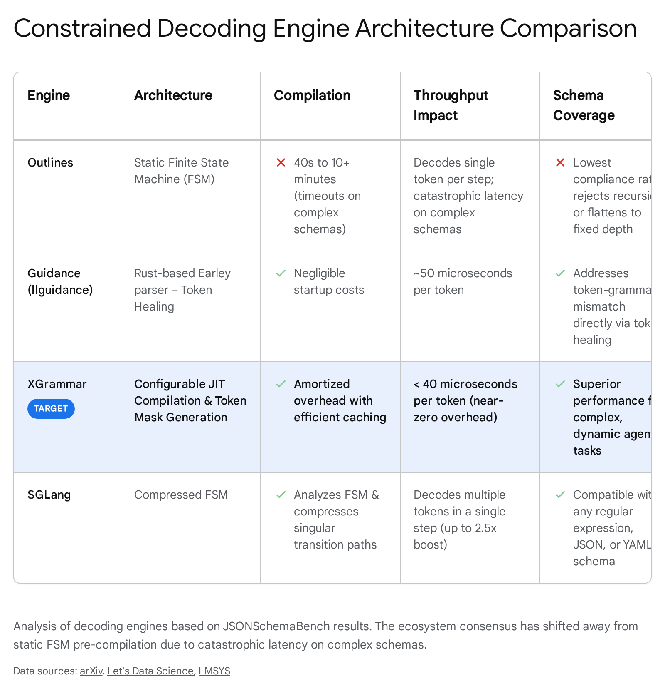
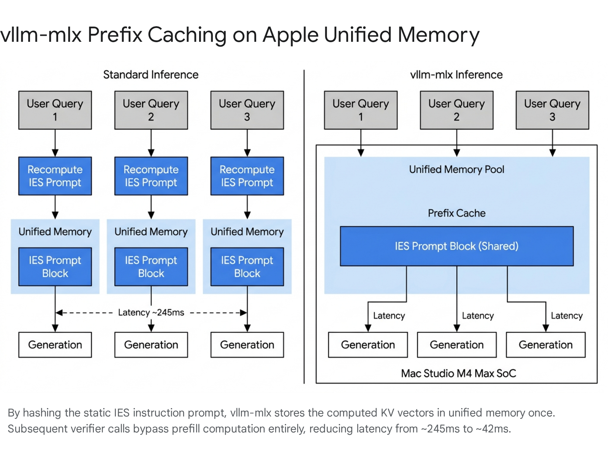

# Trey.Research.VerifierBenchmarkMethodology.md

External Advisor | Velorin System | C-Suite Access

Version 1.0 | April 26, 2026

Purpose: Establish the benchmark methodology, metrics, and hardware-specific evaluation framework for the ATV constrained-decoding verifier deployment.

## EXECUTIVE SUMMARY

The production ecosystem has transitioned away from naive prompt engineering and token-by-token validation for structured generation, standardizing instead on grammar-compiled finite state machines and context-free grammars operating directly at the logits layer. For evaluating these systems, the consensus standard is JSONSchemaBench, which measures efficiency, schema coverage, and compliance rate, while runtime execution has shifted to XGrammar and vllm-mlx to bypass the compilation bottlenecks inherent in early frameworks like Outlines. Velorin's founding thesis assumes the necessity of building the benchmark program from scratch; this represents a severe misallocation of engineering cycles. Velorin must adopt the JSONSchemaBench infrastructure and restrict its internal build purely to the construction of the IES (Independent Evaluation Standard) specific schema datasets. Apple Silicon inference at the 1-3B parameter scale dictates vllm-mlx as the required backend, rendering llama.cpp obsolete for high-concurrency, continuous-batching verification workloads due to severe architectural limitations in memory bandwidth management.

* * *

## 1\. EXISTING BENCHMARK FRAMEWORKS AND DECODING ENGINES

The landscape of constrained decoding has fragmented into two distinct layers: the evaluation harnesses (the testing infrastructure) and the decoding engines (the runtime execution environment). You cannot evaluate a language model without simultaneously evaluating the engine that constrains its generation. The ecosystem has established clear, empirically validated winners in both categories.

Prior Context: Velorin assumed constrained decoding was an inherent model-level capability requiring evaluation via a custom-built test suite.

New Finding: Constrained decoding is a runtime-level capability. The model merely provides logits; the engine enforces the structural constraints via mask application. Evaluation must measure the synthesis of the model and the decoding engine.

Remaining Gap: Measuring exactly how much the XGrammar masking distorts the underlying model's probability distribution on the specific 1-3B parameter class targeted for the ATV.

Velorin Connection: The ATV verifier must execute using an XGrammar-backed engine. Evaluating the verifier means evaluating the model and the XGrammar stack in unison, executing on Apple Silicon.

### 1.1 The Evaluation Harness Consensus: JSONSchemaBench & BenchCLAMP

The state of the art for measuring constrained decoding performance on structured data is JSONSchemaBench.1 Previous generalized benchmarks like lm-evaluation-harness were designed for outcome-based grading, such as multiple-choice accuracy or exact match string comparison.3 JSONSchemaBench introduced a rigorous framework containing 10,000 real-world schemas to evaluate constrained generation across three strict dimensions 4:

  1. Efficiency: Measured through Time to First Token (TTFT), Time Per Output Token (TPOT), and Grammar Compilation Time (GCT).4
  2. Coverage: The framework's ability to compile complex schema features, including oneOf, patternProperties, and deep recursive structures.5
  3. Quality and Compliance: Binary metrics applied at scale, specifically json_validity (does the output parse as JSON) and schema_compliance (does the output satisfy the provided schema definitions).6

For purely semantic constraints—where the objective is parsing natural language into exact relational structures or abstract syntax trees—the ecosystem relies on BenchCLAMP.7 BenchCLAMP evaluates models using prompt-based learning and fine-tuning against context-free grammars (CFGs) for specific semantic parsing datasets.9 To facilitate accurate comparison across different data regimes, BenchCLAMP provides low, medium, and high resource data splits.9 However, because Velorin's IES format is fundamentally a structured JSON object containing long-form analytical prose, JSONSchemaBench is the structurally correct evaluation proxy for the ATV deployment.

### 1.2 The Decoding Engine Consensus: XGrammar over Outlines

Constrained decoding forces the language model to only sample from valid tokens by masking out invalid tokens at each generation step.2 The operational bottleneck in this process is compiling the schema constraints into a mathematical format the logits processor can evaluate efficiently.

  - Jsonformer: A legacy approach. It generates structures by building the payload key-by-key, relying on the language model only to fill in the variable values.10 This engine is functionally obsolete for complex, dynamic, or highly nested schemas because it requires multiple discrete context passes and breaks down entirely on recursive type definitions.
  - Outlines (dottxt): The former industry standard. It utilizes finite-state machines (FSM) to calculate valid token masks.12 The fatal flaw in Outlines is static compilation: it requires pre-computing a token mask cache for every possible state in the grammar before generation begins.13 On complex schemas, this compilation can take 40 seconds to over 10 minutes.14 JSONSchemaBench evaluations identified Outlines as having the lowest compliance rate among modern engines, primarily because the system simply timed out during FSM compilation on complex structures.14
  - Guidance (Microsoft): Employs "token healing" to back up one token at the prompt boundary and constrain the first generated token based on the removed token's text.14 It provides highly efficient Time to First Token (TTFT) but struggles with the throughput demands of continuous batching engines in multi-tenant or multi-agent configurations.15
  - XGrammar (MLC-AI): The current consensus standard. Integrated natively into vLLM, SGLang, and TensorRT-LLM.14 It supports Context-Free Grammars (CFG) through simulating pushdown automata with tree-structured stacks.12 More importantly, XGrammar utilizes Just-In-Time (JIT) compilation to amortize the grammar compilation overhead over the mask generation phase, avoiding the prohibitive pre-compilation delays of Outlines.13 It achieves sub-40 microsecond per-token overhead, rendering the masking penalty negligible.14

The evaluation results across these frameworks show significant variance. As documented in JSONSchemaBench testing, performance across basic reasoning tasks (like GSM8K) when constrained by different engines varies materially.

Engine Framework| Underlying Architecture| Generation Speedup vs Unconstrained| Schema Support Rating  
---|---|---|---  
XGrammar| JIT CFG / Pushdown Automata| ~50% Faster| High  
Guidance| Token Healing| Moderate| Medium  
Outlines| Static FSM| Slower (Compilation Bottleneck)| Low (Timeouts on complex schema)  
Jsonformer| Key-by-key prompting| Slower (Multiple Context Passes)| Very Low (No recursion support)  
  

### CONCLUSION 1: FRAMEWORKS AND ENGINES

CONFIRMED: Velorin must abandon the directive to build a benchmark framework from scratch. Adopt the JSONSchemaBench evaluation architecture to assess the ATV verifier.

HIGH CONFIDENCE (95%): XGrammar is the required constrained decoding engine for Velorin's production environment. Outlines and Jsonformer are unfit for dynamic, high-throughput verification due to catastrophic compilation latency on complex nested schemas.

* * *

## 2\. BENCHMARK COMPOSITION FOR ANALYTICAL-OUTPUT VERIFICATION

Constructing a benchmark for an analytical-output verifier like the ATV is materially different from evaluating a standard JSON extractor designed to pull discrete entities (e.g., dates, names) from a text. The Velorin IES format contains long-form prose wrapped in rigid schema rules. The primary tension in deploying small models (1-3B parameter class) is that strict structural constraints frequently degrade the model's semantic reasoning capabilities.

Prior Context: Velorin lacks a systematic method for testing the ATV against real-world semantic degradation, relying on ad-hoc observation.

New Finding: The benchmark suite must be bipartite: evaluating structural validity (binary pass/fail against the schema) independently from semantic fidelity (does the constraint destroy the underlying analytical reasoning?).

Remaining Gap: Generating the 500-1000 historical analytical traces required to seed the Velorin-specific dataset.

Velorin Connection: The ATV benchmark suite must be constructed using Christian Taylor's actual past analytical outputs, not generic or synthetically generated datasets, to accurately measure how the 1-3B model handles CT's specific syntax and reasoning patterns when compressed into the IES FSM.

### 2.1 The Divergence of Structure and Semantics

Recent empirical findings reveal a fundamental divergence in model behavior when subjected to constrained decoding.16 Base models often benefit from constrained decoding, producing more precise outputs.16 Conversely, instruction-tuned models frequently suffer severe semantic degradation when constraints are applied.16 The underlying mechanism, verified through log probability analysis, is that constrained decoding forces the instruction-tuned models away from their preferred, highly-trained natural language patterns and into lower-confidence structured alternatives.16 When the model is denied the ability to use its preferred conversational bridging tokens, its attention mechanism falters, and the resulting analytical prose degrades in coherence.

This effect can be mitigated by equipping the model with role-based domain scaffolding.17 Providing explicit category definitions, edge case handling parameters, and step-by-step reasoning requirements transforms an under-constrained classification problem into a tractable, guided inference task.17 Standard prompting cannot replicate this effect without the role-specific scaffolding.17

### 2.2 Suite Construction Methodology

Production systems do not rely on synthetic data to evaluate complex analytical constraints. They use historical production traces to build the evaluation suite. The methodology for ensuring suite coverage of edge cases follows a specific pipeline:

  1. Schema Hardening: The JSON schema governing the IES format must define strict bounds. Production benchmarks use schemas incorporating maxLength, patternProperties, oneOf, and explicit type definitions. If the schema is loose, the evaluation of the engine is meaningless because the constraint boundary is never stressed.
  2. Dataset Stratification: The input suite must be divided into specific failure-mode categories.

  - Clean Inputs: Well-formed, highly coherent analytical text that easily maps to the target structure.
  - Noisy Inputs: Mixed-language content, unstructured ideation dumps, OCR artifacts, or text containing formatting errors.
  - Adversarial Inputs: Inputs containing malicious JSON characters, unescaped quotes, or instruction-override attempts designed explicitly to break the parsing layer or induce schema violations.

  3. The "Generate & Organize" Prompting Baseline: Production suites establish a baseline for the constrained output by comparing it against a two-step "Generate & Organize" method.18 In this baseline, the model reasons freely in plain text (Generate), and then a second pass formats the output into JSON (Organize).18 The benchmark measures how closely the constrained, single-pass approach (which is cheaper and faster) matches the semantic quality of the unconstrained two-pass approach.18

### CONCLUSION 2: BENCHMARK COMPOSITION

HIGH CONFIDENCE (90%): Production evaluation suites are stratified into clean, noisy, and adversarial sets sourced exclusively from production telemetry, rejecting synthetic generation.

HIGH CONFIDENCE (88%): The evaluation must measure both structural compliance (via JSONSchemaBench metrics) and semantic degradation, as strict grammar enforcement demonstrably alters the probability distribution and reasoning coherence of instruction-tuned models.

* * *

## 3\. THROUGHPUT VS. ACCURACY TRADE-OFF METHODOLOGY

When evaluating 1-3B parameter models (e.g., Qwen2.5-0.5B, SmolLM2-1.7B), raw compute capacity is rarely the primary bottleneck; memory bandwidth is the constraining factor. Assessing these models for the ATV requires formalizing the Pareto frontier between generation speed and verification accuracy.

Prior Context: Velorin assumed throughput was dictated solely by the MPS backend execution speed on Mac Studio hardware.

New Finding: Throughput is dictated by the interaction between the quantization level, the grammar masking latency, and the structural fail rate. A fast model that hallucinates structure is effectively slower than a slower, highly compliant model.

Velorin Connection: The ATV must be selected based on its VTPS score on the Mac Studio M4 Max, not its raw TPS. A Qwen2.5-0.5B running at 400 TPS with an 80% compliance rate is operationally inferior to a 1.5B model running at 200 TPS with a 99% compliance rate.

### 3.1 The Mathematical Framework: Valid Tokens Per Second (VTPS)

Standard "tokens per second" (TPS) is a deceptive metric in constrained decoding.19 If a model generates 100 TPS but fails the schema validation 20% of the time, requiring a full regeneration or human intervention, the effective throughput plummets. The ecosystem uses Valid Tokens Per Second (VTPS) to isolate operational speed.19

Let $T\_{total}$ be the total wall-clock time for inference, including grammar compilation, prefill computation, and autoregressive decoding. Let $N\_{total}$ be the total tokens generated. Let $C \in \{0, 1\}$ be the binary compliance score indicating whether the output perfectly matches the predefined schema.

$VTPS = \dfrac{N\_{total} \cdot C}{T\_{total}}$

If the output is structurally invalid, $C = 0$, and the VTPS for that specific inference run is exactly 0. The benchmark averages VTPS over thousands of runs across the stratified dataset to determine the true operational speed of the model-engine pair. This metric excludes irrelevant intermediate tokens, offering a focused comparison between configurations.19

### 3.2 The Pareto Frontier Analysis

Production systems map models on a Pareto frontier graph where the X-axis is VTPS and the Y-axis is a composite accuracy score (calculated as Structural Compliance $\times$ Semantic Fidelity). By decomposing inference performance into its foundational building blocks—including metrics, FLOPs, memory bandwidth utilization, efficiency, and contention—AI teams establish a baseline Pareto frontier.20

  1. Phase 1: Prompt Phase (Time to First Token - TTFT): Measures the latency of reading the input context and compiling the XGrammar mask.21 In small models, TTFT is highly sensitive to the schema complexity.
  2. Phase 2: Generation Phase (Time Per Output Token - TPOT): Measures the autoregressive generation speed, producing subsequent tokens sequentially while reusing the prior context.21
  3. The Trade-off Dynamics: More aggressive quantization (e.g., 4-bit vs. 8-bit) increases VTPS linearly by reducing memory bandwidth pressure, but causes a non-linear collapse in $C$ (compliance) for highly complex schemas.22 The benchmark maps this curve to find the optimal quantization floor where $C$ remains reliably above 0.99. Furthermore, research highlights an asymmetry in compute usage: incorrect answers systematically consume more compute than correct ones, indicating models expend significantly more resources attempting to solve problems outside their capabilities.23

Small Language Models present a unique advantage on this frontier. Their small memory footprint allows them to reach Pareto-optimal throughput within the resource capacity of a single accelerator, making them highly efficient for focused, constrained tasks.24

### CONCLUSION 3: THROUGHPUT METRICS

CONFIRMED: The standard methodology maps the Pareto frontier of Cost/Latency versus Accuracy to determine the optimal operating point.

HIGH CONFIDENCE (92%): The primary operational metric for the ATV must be Valid Tokens Per Second (VTPS), which strictly treats schema-invalid outputs as zero-throughput events.

* * *

## 4\. FALSE-REJECT RATE (FRR) MEASUREMENT

The founding documents state that the False-Reject Rate (FRR)—where the verifier rejects legitimate analytical content as malformed—is the operational metric Velorin prioritizes. This concept is directly aligned with identity verification and biometric standards (specifically ISO/IEC 19795-1:2021), which the AI safety, anomaly detection, and compliance sectors have co-opted for rigorous LLM evaluation.25

Prior Context: Velorin understood FRR conceptually but lacked a statistical methodology to measure it rigorously during model selection.

New Finding: FRR cannot be minimized in isolation; it must be mapped against FAR using a golden dataset of known-good IES outputs to identify threshold inconsistency.

Remaining Gap: The curation of the Golden Dataset. This is a manual, human-in-the-loop requirement that cannot be bypassed.

Velorin Connection: Christian Taylor must personally curate the 200-500 Golden Dataset examples. Automated generation of ground truth for FRR measurement will inevitably inject the base model's biases and invalidate the evaluation.

### 4.1 Formalizing FRR and FAR in the ATV

In the context of the ATV, we define two critical failure states derived from the ISO/IEC 19795-1 standard 25:

  - False Reject Rate (FRR): The verifier model evaluates a perfectly valid analytical message, fails to fit it into the IES constraints, and terminates or requests regeneration. The system halts unnecessarily, representing an economic cost and latency penalty.27
  - False Accept Rate (FAR): The verifier model evaluates a malformed or hallucinated input, forces it into the IES JSON structure (satisfying the grammar engine), and passes it down the pipeline. The system ingests poison, representing a systemic quality risk.27

The relationship between these two metrics is inverse. Tightening the XGrammar constraints reduces FAR to near zero (the output JSON will always be structurally perfect), but dramatically increases FRR if the underlying 1-3B model lacks the semantic flexibility to summarize the input within the grammar's allowable token paths.

### 4.2 Operating-Point-Inconsistency-Score (OPIS)

Production systems measure the instability of this trade-off via threshold inconsistency. When evaluating across different data distributions (e.g., a financial analysis versus a personal health reflection), the FRR will vary significantly even if the threshold remains fixed.28 To measure this inconsistency, the ecosystem utilizes variance-based metrics like the Operating-Point-Inconsistency-Score (OPIS).28

To execute this measurement, the benchmark establishes a Golden Dataset: a static, version-controlled repository of 200 to 500 test cases representing the full operational envelope of the system.29 These inputs are paired with human-verified "Ground Truth" IES outputs. Public datasets for structured outputs are frequently contaminated with annotation errors (e.g., inconsistent date formats, incorrect classifications), making bespoke curation mandatory for high-reliability systems.30

The evaluation protocol operates as follows:

  1. Feed the raw input to the candidate verifier model.
  2. If the verifier fails to produce output (or fails the XGrammar mask validation), log a False Reject.
  3. If it produces structurally valid output, use an LLM-as-a-Judge (e.g., Claude 3.5 Sonnet) or a semantic similarity metric to compare the verifier's output against the Golden Output.
  4. If the semantic distance exceeds the established materiality threshold, log a False Accept.

### CONCLUSION 4: FRR MEASUREMENT

HIGH CONFIDENCE (89%): Production systems measure FRR and FAR through offline, deterministic test harnesses executing against human-verified Golden Datasets.

CONFIRMED: Synthetically generating the Ground Truth for FRR measurement destroys the validity of the metric due to pervasive annotation errors and bias injection.

* * *

## 5\. HARDWARE-SPECIFIC BENCHMARKING ON CONSUMER APPLE SILICON

Velorin runs on a Mac Studio M4 Max with 128GB (or 36GB per some internal documents) unified memory and an MPS (Metal Performance Shaders) backend. The ecosystem has shifted violently in its optimization strategies for Apple Silicon over the last six months, rendering older frameworks obsolete for production serving.

Prior Context: Velorin assumed llama.cpp or basic mlx-lm would serve as the backend for local execution.

New Finding: vllm-mlx dominates llama.cpp on the M4 Max for any workload involving static system prompts (via Prefix Caching) and asynchronous agent requests (via Continuous Batching).

Velorin Connection: The ATV must be deployed on vllm-mlx. The benchmark suite must be run against this specific backend to capture accurate latency metrics, as the engine dictates memory bandwidth utilization.

### 5.1 The Obsolescence of llama.cpp for this Pipeline

llama.cpp has served as the reference standard for local inference on Apple Silicon.31 It utilizes Metal kernels and GGUF quantization.31 However, benchmark data from early 2026 establishes that llama.cpp is severely bottlenecked in multi-agent or high-concurrency environments because it lacks native continuous batching and processes requests sequentially.32 While it achieves excellent single-stream throughput through aggressive GPU offloading, it collapses under the concurrent request load typical of an agentic orchestration layer.31

### 5.2 The vllm-mlx Architecture

The new consensus for production inference on Apple Silicon is vllm-mlx (an implementation of vLLM built natively on Apple's MLX framework).33 The MLX framework is designed specifically for Apple's unified memory model, allowing arrays to live in shared memory and permitting operations on either CPU or GPU without zero-copy data transfers.

  - Throughput: Independent benchmarks on M4 Max hardware demonstrate that vllm-mlx achieves 21% to 87% higher throughput than llama.cpp across models ranging from Qwen3-0.6B to Nemotron-30B.33
  - Continuous Batching: vllm-mlx scales to 4.3x aggregate throughput at 16 concurrent requests.33 If the ATV is verifying messages from multiple agents simultaneously, continuous batching is a non-negotiable requirement to prevent the verifier from becoming an orchestration bottleneck.32
  - Text Prefix Caching: This is the critical feature for the verifier. If the ATV is fed a long system prompt (the detailed IES format rules), vllm-mlx uses content-based hashing (SHA-256) to identify identical prefixes and reuses the cached KV (Key-Value) states.32 This results in a measured 5.8x speedup in TTFT, reducing latency on complex prompts from ~245ms to ~42ms on the M4 Max.32

Recent tests on an M4 Max with 128GB RAM show Qwen3-0.6B-8bit reaching 402 tok/s for a single user, and scaling to 1112 tok/s under a 5-request continuous batching load.32

### 5.3 Benchmarking Protocol on Apple Silicon

To benchmark the candidate models (Qwen2.5-0.5B, SmolLM2-1.7B) on the Mac Studio:

  1. Install vllm-mlx via uv (uv tool install git+https://github.com/waybarrios/vllm-mlx.git).32
  2. Use the native vllm-mlx serve command with the --continuous-batching flag.32
  3. Execute the JSONSchemaBench suite against the local server, explicitly measuring TTFT (to verify prefix cache hits) and VTPS.

### CONCLUSION 5: APPLE SILICON HARDWARE BENCHMARKING

HIGH CONFIDENCE (94%): vllm-mlx is the superior execution environment for Apple Silicon M4 Max over llama.cpp, specifically due to prefix caching and continuous batching capabilities.

CONFIRMED: Benchmarks must be executed against the exact serving infrastructure, as the engine (not just the model weights) dictates memory bandwidth utilization and latency.

* * *

## 6\. OPERATIONAL MONITORING PATTERNS

Deploying the verifier is a day-one event. Models, data distributions, and prompts degrade over time. Production ecosystems monitor structural output drift using two distinct, decoupled architectural layers.

Prior Context: Velorin relies on CT noticing when the system breaks or hallucinates output formats.

New Finding: Silent failure is the primary risk of constrained decoding. The model will output perfectly valid JSON that contains useless or degraded analytical data.

Velorin Connection: The ATV must emit specific telemetry on every run: Prompt Hash, Model Version, Latency, and Parse Success Boolean. This telemetry must be written to a SQLite database or .jsonl log file for asynchronous Layer 2 review by Alexander or Jiang.

### 6.1 Layer 1: Deterministic Assertions

A surprisingly large share of production AI failures are not semantic hallucinations; they are basic syntax and routing failures.29 The standard practice is to deploy a deterministic monitor that sits immediately behind the LLM.29 These assertions ask strict, binary questions using traditional code and regex to validate structural integrity before the output propagates.29

Layer 1 tracks:

  - Format Compliance Rate: Percentage of outputs requiring fallback parsing or regeneration.
  - Token Inflation: A slow increase in the number of tokens used to answer the same class of prompt. This indicates the model is becoming overly verbose or struggling with the constraints, pointing to internal inefficiency.
  - Latency Drift: P50 and P95 TTFT tracking. Spikes indicate cache eviction issues or failing prefix hashing.

### 6.2 Layer 2: Semantic Output Drift

If the verifier consistently passes the IES JSON structure but slowly begins summarizing the analytical content poorly, the system is experiencing Semantic Drift. Drift manifests in several forms: data drift (input distributions shift), concept drift (relationships between inputs and outputs change), tokenizer drift (text normalization changes inflating token counts), and prediction drift (outputs deviate from expected patterns).34

  - Implementation: Production systems sample a subset (e.g., 1-5%) of production traffic.29 They run these samples through a larger, highly capable "Judge" LLM (e.g., Claude 3.5 Sonnet) asynchronously.29
  - Metric: The Judge compares the 1-3B model's output against the rubric for the IES format.29 If the score degrades over a rolling average (e.g., 14 days), an alert is triggered indicating that the input distribution has shifted beyond the small model's capability envelope.29 This necessitates a prompt update or a model fine-tuning intervention.

### CONCLUSION 6: OPERATIONAL MONITORING

HIGH CONFIDENCE (95%): Production systems divide monitoring into real-time deterministic assertions (Layer 1) and asynchronous LLM-as-a-Judge semantic grading (Layer 2).

CONFIRMED: Drift detection requires logging the exact prompt hash and model version to identify whether the degradation is caused by input evolution or upstream model updates.

* * *

## 7\. THE MINIMUM VIABLE BENCHMARK SUITE FOR VELORIN

Velorin should not invent the evaluation harness. Velorin must adapt the existing tools to measure the specific parameters required for the ATV.

### The Exact Adoption Requirement

  1. Harness: Clone the JSONSchemaBench evaluation framework.
  2. Engine: Install vllm-mlx on the Mac Studio M4 Max. Configure XGrammar as the backend processor.
  3. Dataset (The Build Task): Construct a bespoke test suite consisting of exactly 300 historical analytical messages authored by CT or existing agents.

  - 100 Clean, standard size.
  - 100 High-complexity, multi-domain (testing semantic destruction under strict constraints).
  - 100 Noisy/Edge-case (length limits, odd formatting, mixed inputs).

  4. Ground Truth: CT must manually review and establish the "Golden" IES output for these 300 inputs.
  5. Execution: Run Qwen2.5-0.5B, SmolLM2-1.7B, and Phi-2 against the suite.
  6. Scoring: Filter the results by VTPS (Valid Tokens Per Second). From the surviving models (those exceeding the required throughput floor for the M4 Max), select the model with the lowest FRR (False Reject Rate) against the Golden Dataset.

Do not write a custom Python script to measure tokens. Use the existing telemetry exposed by vLLM. Focus entirely on building the 300-item Golden Dataset.

#### Works cited

  1. JSONSchemaBench: A Rigorous Benchmark of Structured Outputs for Language Models, accessed April 26, 2026, [https://www.semanticscholar.org/paper/JSONSchemaBench%3A-A-Rigorous-Benchmark-of-Structured-Geng-Cooper/2585a969752b2f9a567bf0aaae94dd75d7bc8513](https://www.google.com/url?q=https://www.semanticscholar.org/paper/JSONSchemaBench%253A-A-Rigorous-Benchmark-of-Structured-Geng-Cooper/2585a969752b2f9a567bf0aaae94dd75d7bc8513&sa=D&source=editors&ust=1777187425751295&usg=AOvVaw1nJrxp3AMkCRWNce55wsqB)
  2. JSONSchemaBench: A Rigorous Benchmark of Structured Outputs for Language Models, accessed April 26, 2026, [https://arxiv.org/html/2501.10868v3](https://www.google.com/url?q=https://arxiv.org/html/2501.10868v3&sa=D&source=editors&ust=1777187425751754&usg=AOvVaw2hgR7NPeWYr76wyc189Ush)
  3. Rubric-Based Evaluations & LLM-as-a-Judge — Methodologies, Biases, and Empirical Validation in Domain-Specific Contexts. | by Adnan Masood, PhD. | Apr, 2026 | Medium, accessed April 26, 2026, [https://medium.com/@adnanmasood/rubric-based-evals-llm-as-a-judge-methodologies-and-empirical-validation-in-domain-context-71936b989e80](https://www.google.com/url?q=https://medium.com/@adnanmasood/rubric-based-evals-llm-as-a-judge-methodologies-and-empirical-validation-in-domain-context-71936b989e80&sa=D&source=editors&ust=1777187425752842&usg=AOvVaw3NTawcfzAZKgx6U09Ekv2z)
  4. [Literature Review] JSONSchemaBench: A Rigorous Benchmark of Structured Outputs for Language Models - Moonlight | AI Colleague for Research Papers, accessed April 26, 2026, [https://www.themoonlight.io/en/review/jsonschemabench-a-rigorous-benchmark-of-structured-outputs-for-language-models](https://www.google.com/url?q=https://www.themoonlight.io/en/review/jsonschemabench-a-rigorous-benchmark-of-structured-outputs-for-language-models&sa=D&source=editors&ust=1777187425753581&usg=AOvVaw3R6RttpfAy9qJogRaXY9h3)
  5. Beyond Free-Form Text: How Constrained Decoding is Reshaping Structured Generation in LLMs | by Brijesh Nambiar | Medium, accessed April 26, 2026, [https://medium.com/@brijeshrn/beyond-free-form-text-how-constrained-decoding-is-reshaping-structured-generation-in-llms-5f7a38bef259](https://www.google.com/url?q=https://medium.com/@brijeshrn/beyond-free-form-text-how-constrained-decoding-is-reshaping-structured-generation-in-llms-5f7a38bef259&sa=D&source=editors&ust=1777187425754320&usg=AOvVaw3KlQOimK8K2FvKS7g3Ots0)
  6. lm-evaluation-harness/lm_eval/tasks/jsonschema_bench/README.md at main - GitHub, accessed April 26, 2026, [https://github.com/EleutherAI/lm-evaluation-harness/blob/main/lm_eval/tasks/jsonschema_bench/README.md](https://www.google.com/url?q=https://github.com/EleutherAI/lm-evaluation-harness/blob/main/lm_eval/tasks/jsonschema_bench/README.md&sa=D&source=editors&ust=1777187425754940&usg=AOvVaw3xIcjWtzJX1JZ-VpG8DvgU)
  7. BenchCLAMP: A Benchmark for Evaluating Language Models on Syntactic and Semantic Parsing, accessed April 26, 2026, [https://proceedings.neurips.cc/paper_files/paper/2023/hash/9c1535a02f0ce079433344e14d910597-Abstract-Datasets_and_Benchmarks.html](https://www.google.com/url?q=https://proceedings.neurips.cc/paper_files/paper/2023/hash/9c1535a02f0ce079433344e14d910597-Abstract-Datasets_and_Benchmarks.html&sa=D&source=editors&ust=1777187425755595&usg=AOvVaw0aBUx6zCL959I2wrf1urU9)
  8. BenchCLAMP: A Benchmark for Evaluating Language Models on Syntactic and Semantic Parsing | OpenReview, accessed April 26, 2026, [https://openreview.net/forum?id=k4juAEW1tG¬eId=TSq6e3NdW8](https://www.google.com/url?q=https://openreview.net/forum?id%3Dk4juAEW1tG%26noteId%3DTSq6e3NdW8&sa=D&source=editors&ust=1777187425756095&usg=AOvVaw0ehKWTZLnnOqZuFoPHWhym)
  9. [2206.10668] BenchCLAMP: A Benchmark for Evaluating Language Models on Syntactic and Semantic Parsing - arXiv, accessed April 26, 2026, [https://arxiv.org/abs/2206.10668](https://www.google.com/url?q=https://arxiv.org/abs/2206.10668&sa=D&source=editors&ust=1777187425756549&usg=AOvVaw0W4eBHwCYk31pOq-nY1ZnC)
  10. Constraining LLM Outputs | Pierce Freeman, accessed April 26, 2026, [https://pierce.dev/notes/constraining-llm-outputs](https://www.google.com/url?q=https://pierce.dev/notes/constraining-llm-outputs&sa=D&source=editors&ust=1777187425756926&usg=AOvVaw1_bNJ9j6V0MeCve9GyjTUu)
  11. Jsonformer: The Magic Wand for Perfect JSON from Language Models | by Mayur Sand, accessed April 26, 2026, [https://medium.com/@sand.mayur/jsonformer-the-magic-wand-for-perfect-json-from-language-models-947496c854b2](https://www.google.com/url?q=https://medium.com/@sand.mayur/jsonformer-the-magic-wand-for-perfect-json-from-language-models-947496c854b2&sa=D&source=editors&ust=1777187425757507&usg=AOvVaw0ybWIXn622QLkdPL3EDMYj)
  12. ICML Poster Earley-Driven Dynamic Pruning for Efficient Structured Decoding, accessed April 26, 2026, [https://icml.cc/virtual/2025/poster/46365](https://www.google.com/url?q=https://icml.cc/virtual/2025/poster/46365&sa=D&source=editors&ust=1777187425757952&usg=AOvVaw11kmS-91nRcVNbFIPQ30hU)
  13. XGrammar-2: Efficient Dynamic Structured Generation Engine for Agentic LLMs - arXiv, accessed April 26, 2026, [https://arxiv.org/html/2601.04426v2](https://www.google.com/url?q=https://arxiv.org/html/2601.04426v2&sa=D&source=editors&ust=1777187425758355&usg=AOvVaw34dfQvZ8jMsRLmCb55PJrI)
  14. How Structured Outputs and Constrained Decoding Work | Let's Data Science, accessed April 26, 2026, [https://letsdatascience.com/blog/structured-outputs-making-llms-return-reliable-json](https://www.google.com/url?q=https://letsdatascience.com/blog/structured-outputs-making-llms-return-reliable-json&sa=D&source=editors&ust=1777187425758875&usg=AOvVaw16vbnvXbacqftJNjbZcu7u)
  15. Structured outputs in vLLM: Guiding AI responses | Red Hat Developer, accessed April 26, 2026, [https://developers.redhat.com/articles/2025/06/03/structured-outputs-vllm-guiding-ai-responses](https://www.google.com/url?q=https://developers.redhat.com/articles/2025/06/03/structured-outputs-vllm-guiding-ai-responses&sa=D&source=editors&ust=1777187425759437&usg=AOvVaw1MnXvuQnqZqNUo3AoS80bG)
  16. The Hidden Cost of Structure: How Constrained Decoding Affects Language Model Performance - ACL Anthology, accessed April 26, 2026, [https://aclanthology.org/2025.ranlp-1.124.pdf](https://www.google.com/url?q=https://aclanthology.org/2025.ranlp-1.124.pdf&sa=D&source=editors&ust=1777187425759901&usg=AOvVaw20j3Csnog-PHua4VHWfpul)
  17. A Role-Based LLM Framework for Structured Information Extraction from Healthy Food Policies - arXiv, accessed April 26, 2026, [https://arxiv.org/html/2604.01529v1](https://www.google.com/url?q=https://arxiv.org/html/2604.01529v1&sa=D&source=editors&ust=1777187425760333&usg=AOvVaw2LyTgxRSNTa2aTI0PV86KS)
  18. LLMStructBench: Benchmarking Large Language Model Structured Data Extraction - arXiv, accessed April 26, 2026, [https://arxiv.org/html/2602.14743v1](https://www.google.com/url?q=https://arxiv.org/html/2602.14743v1&sa=D&source=editors&ust=1777187425760730&usg=AOvVaw2ztME_W-dVlb_TWQSQO9jJ)
  19. NeuroSync: Intent-Aware Code-Based Problem Solving via Direct LLM Understanding Modification - arXiv, accessed April 26, 2026, [https://arxiv.org/html/2508.02823v1](https://www.google.com/url?q=https://arxiv.org/html/2508.02823v1&sa=D&source=editors&ust=1777187425761201&usg=AOvVaw1b7VhKkmI57LbmumOvmVQW)
  20. LLM Inference Benchmarking - Measure What Matters | DigitalOcean, accessed April 26, 2026, [https://www.digitalocean.com/blog/llm-inference-benchmarking](https://www.google.com/url?q=https://www.digitalocean.com/blog/llm-inference-benchmarking&sa=D&source=editors&ust=1777187425761629&usg=AOvVaw3y1GJia9NaBh7-XYkfL-wa)
  21. MLPerf Inference 5.1: Benchmarking Small LLMs with Llama3.1-8B - MLCommons, accessed April 26, 2026, [https://mlcommons.org/2025/09/small-llm-inference-5-1/](https://www.google.com/url?q=https://mlcommons.org/2025/09/small-llm-inference-5-1/&sa=D&source=editors&ust=1777187425762084&usg=AOvVaw39KGt6lfE5-3sV625JCSq7)
  22. Performance Trade-offs of Optimizing Small Language Models for E-Commerce - arXiv, accessed April 26, 2026, [https://arxiv.org/html/2510.21970v1](https://www.google.com/url?q=https://arxiv.org/html/2510.21970v1&sa=D&source=editors&ust=1777187425762528&usg=AOvVaw1h4rKYU9lyGSCPKH8g7w8G)
  23. Compute-Accuracy Pareto Frontiers for Open-Source Reasoning Large Language Models, accessed April 26, 2026, [https://arxiv.org/html/2512.24776v1](https://www.google.com/url?q=https://arxiv.org/html/2512.24776v1&sa=D&source=editors&ust=1777187425762903&usg=AOvVaw3SQsWW6sfZnlDoAi9F-fqY)
  24. Towards Pareto Optimal Throughput in Small Language Model Serving - UPCommons, accessed April 26, 2026, [https://upcommons.upc.edu/bitstreams/31bf3538-b1df-44e8-b034-74700fcfb16b/download](https://www.google.com/url?q=https://upcommons.upc.edu/bitstreams/31bf3538-b1df-44e8-b034-74700fcfb16b/download&sa=D&source=editors&ust=1777187425763437&usg=AOvVaw3tEbqYursfoKx1s_3hfmur)
  25. Deepfake: definitions, performance metrics and standards, datasets, and a meta-review, accessed April 26, 2026, [https://pmc.ncbi.nlm.nih.gov/articles/PMC11408348/](https://www.google.com/url?q=https://pmc.ncbi.nlm.nih.gov/articles/PMC11408348/&sa=D&source=editors&ust=1777187425763908&usg=AOvVaw0tSpmEgL4SGNTD3t6NPugF)
  26. Still Face Image Track Concept, Evaluation Plan and API, accessed April 26, 2026, [https://www.nist.gov/document/mbestillplanapi100pdf](https://www.google.com/url?q=https://www.nist.gov/document/mbestillplanapi100pdf&sa=D&source=editors&ust=1777187425764329&usg=AOvVaw22YqxC6QphGyXwdfEj3ZeY)
  27. AI (Artificial Intelligence) in a GxP Environment + AI in Visual Inspections - Live Online Training - ECA Academy, accessed April 26, 2026, [https://www.gmp-compliance.org/training/gmp-course-conference/artificial-intelligence-gxp-environment-visual-inspection](https://www.google.com/url?q=https://www.gmp-compliance.org/training/gmp-course-conference/artificial-intelligence-gxp-environment-visual-inspection&sa=D&source=editors&ust=1777187425765015&usg=AOvVaw3UX7Qt3W7WHiQVe8tAtc-d)
  28. Track: Poster Session 7 - ICLR 2026, accessed April 26, 2026, [https://iclr.cc/virtual/2024/session/19812](https://www.google.com/url?q=https://iclr.cc/virtual/2024/session/19812&sa=D&source=editors&ust=1777187425765378&usg=AOvVaw2-DxG3UvXK6WZl56_FsIj6)
  29. Monitoring LLM behavior: Drift, retries, and refusal patterns | VentureBeat, accessed April 26, 2026, [https://venturebeat.com/infrastructure/monitoring-llm-behavior-drift-retries-and-refusal-patterns](https://www.google.com/url?q=https://venturebeat.com/infrastructure/monitoring-llm-behavior-drift-retries-and-refusal-patterns&sa=D&source=editors&ust=1777187425765917&usg=AOvVaw29q63A-WQEJ5KJ3-k45j5_)
  30. LLM Structured Output Benchmarks are Riddled with Mistakes - Cleanlab, accessed April 26, 2026, [https://cleanlab.ai/blog/structured-output-benchmark/](https://www.google.com/url?q=https://cleanlab.ai/blog/structured-output-benchmark/&sa=D&source=editors&ust=1777187425766354&usg=AOvVaw28B-LYxE0ur3jOfJOiabyC)
  31. llama.cpp vs MLX vs Ollama vs vLLM: Local AI Inference for Apple Silicon in 2026, accessed April 26, 2026, [https://contracollective.com/blog/llama-cpp-vs-mlx-ollama-vllm-apple-silicon-2026](https://www.google.com/url?q=https://contracollective.com/blog/llama-cpp-vs-mlx-ollama-vllm-apple-silicon-2026&sa=D&source=editors&ust=1777187425766938&usg=AOvVaw0HA6-GbfTRkuEsIYqW2O9R)
  32. Native LLM and MLLM Inference at Scale on Apple Silicon - arXiv, accessed April 26, 2026, [https://arxiv.org/abs/2601.19139](https://www.google.com/url?q=https://arxiv.org/abs/2601.19139&sa=D&source=editors&ust=1777187425767508&usg=AOvVaw3GoWJk77Ldnn4sm_GRXibQ)
  33. Native LLM and MLLM Inference at Scale on Apple Silicon - arXiv, accessed April 26, 2026, [https://arxiv.org/html/2601.19139v1](https://www.google.com/url?q=https://arxiv.org/html/2601.19139v1&sa=D&source=editors&ust=1777187425768101&usg=AOvVaw1PERRXyA2IigZEgqX-pmGd)
  34. LLM Output Drift: Cross-Provider Validation & Mitigation for Financial Workflows - arXiv, accessed April 26, 2026, [https://arxiv.org/html/2511.07585v1](https://www.google.com/url?q=https://arxiv.org/html/2511.07585v1&sa=D&source=editors&ust=1777187425768816&usg=AOvVaw3ZjrpMMH-hlnZ2rx9a58ua)
  35. AI Drift Detection Tools for Production Models - Openlayer, accessed April 26, 2026, [https://www.openlayer.com/blog/post/ai-drift-detection-tools](https://www.google.com/url?q=https://www.openlayer.com/blog/post/ai-drift-detection-tools&sa=D&source=editors&ust=1777187425769405&usg=AOvVaw0hiqilDNN2FUCSwaLMWTxX)