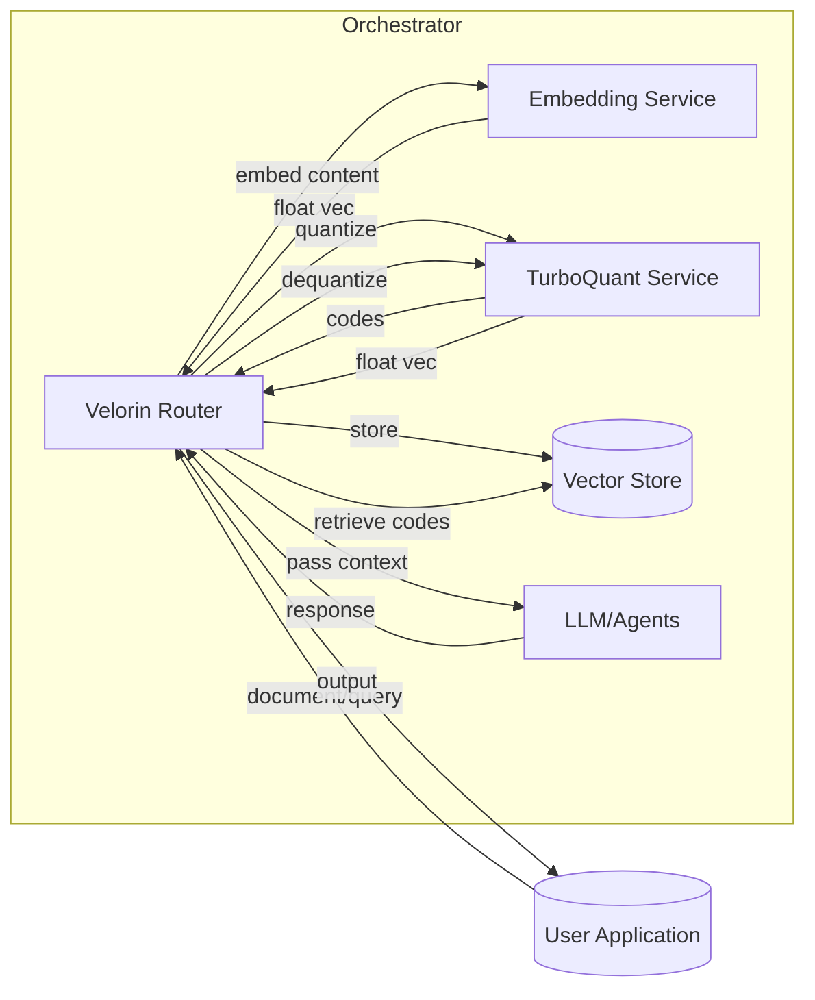
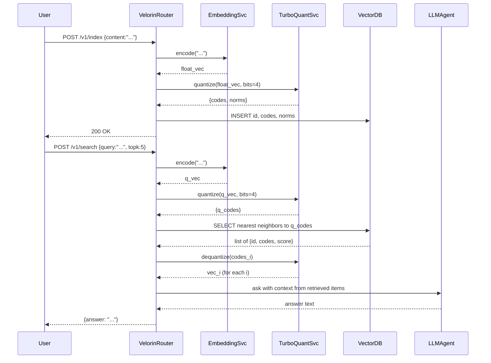

**Trey.Topic.TurboQuant**  
Trey | External Advisor | Velorin  
Version 1.0 | April 04, 2026  

# Executive Summary  
TurboQuant is a new Google Research suite of vector quantization algorithms that compresses high-dimensional embeddings (e.g. transformer key/value caches and vector indices) by ~6–8× with *zero* loss in model accuracy【53†L277-L281】【55†L79-L83】.  It combines **PolarQuant** (a data-oblivious rotation + Lloyd–Max quantizer) and **Quantized Johnson–Lindenstrauss (QJL)** (a 1-bit error-correction) to yield near–information-theoretic optimal distortion【54†L25-L33】【65†L283-L292】.  In practice, TurboQuant can reduce an LLM’s KV cache from 16 bits/channel to 3–4 bits/channel without retraining, and even speeds up inference on GPU due to smaller memory footprint【55†L79-L87】【71†L104-L112】.  This makes it ideal for Velorin’s “knowledge brain,” which must store and search vast numbers of embedding vectors (for memory, RAG, etc.).  TurboQuant integrates seamlessly: it is training-free, model-agnostic, and can be exposed as a quantize/dequantize service (via API or MCP tool) in Velorin’s pipeline【71†L87-L95】【65†L283-L292】.  We map TurboQuant to Velorin’s modules (embedding memory store, vector DB, event log) and outline patterns to call it from the orchestration layer (e.g. function-calling for vector compression).  An exact Velorin blueprint is provided (components, endpoints, data formats, auth, and flow diagrams for ingest→quantize→index→retrieve).  We also compare TurboQuant to alternatives (full-precision and traditional quantization) and discuss risks (e.g. bias, poisoning).  Finally, a prioritized implementation plan is given, including a PoC using the open-source TurboQuant code. 

# 1. TurboQuant Architecture & Algorithms  

- **Overview:** TurboQuant is a two-stage *vector compression* pipeline for high-dimensional embeddings【71†L87-L95】.  It targets LLM KV caches and vector indices, achieving *“zero accuracy loss”* while reducing memory ~6–8×【55†L79-L83】【71†L104-L112】.  It is *theoretically grounded*: arXiv shows it reaches near-optimal distortion bounds for both MSE and inner-products【54†L25-L33】.  Key benefits are *no training/calibration needed* and *full compatibility* with any transformer’s embeddings【71†L87-L95】.  

- **Stage 1 – PolarQuant (High-quality compression):** Each input vector is first multiplied by a **random orthogonal rotation**.  This “spreads” its variance uniformly, yielding coordinates with a known Beta/Gaussian distribution【71†L91-L100】.  TurboQuant then applies a **scalar quantizer** (Lloyd–Max quantization) independently on each rotated coordinate.  Crucially, it converts to *polar coordinates* (radius + angles) before quantization.  By doing so, it **eliminates per-block normalization overhead**: unlike traditional quantizers (which store full-precision scales/zero-points per block), the random rotation makes the angle distribution tight and known, so no extra bits for normalization are needed【71†L91-L100】【59†L25-L34】.  The result is an MSE-optimal compressed representation with minimal residual error.  

- **Stage 2 – QJL Residual Correction:** The tiny quantization error (“residual”) left from Stage 1 is then corrected via a **1-bit Quantized Johnson–Lindenstrauss (QJL)** transform【71†L104-L112】【65†L283-L292】.  In practice, this applies a random JL projection to the residual and stores only the sign bit (+/–1) per coordinate.  This 1-bit “sketch” removes bias in the dot-product (attention-score) estimates, making the final compressed vectors *unbiased for inner products*【54†L25-L33】【65†L283-L292】.  The overhead is only *1 extra bit per coordinate*【71†L104-L112】.  Together, the two stages yield **b bits per coordinate** (e.g. 4 or 3 bits total) with provably near-optimal distortion and *no additional per-block data*【71†L111-L114】【65†L283-L292】.

- **Theoretical Performance:**  Google’s arXiv and blog report that TurboQuant matches information-theoretic lower bounds (up to small constants)【54†L25-L33】.  Empirically, TurboQuant can compress an LLM’s KV cache to 3–4 bits/channel with *“perfect downstream results”*【55†L73-L81】.  In benchmarks it outperforms baselines (standard PQ, expert methods) at the same bit-width: it achieves higher recall in nearest-neighbor search and higher accuracy in language tasks, while index/build times are near-zero【54†L31-L39】【55†L78-L81】.  For example, Google reports that *4-bit TurboQuant* yields up to **8× faster** attention computations than 32-bit (due to smaller cache)【55†L85-L88】, and *3-bit TurboQuant* yields identical model outputs with 6× smaller KV cache【55†L79-L81】.  

- **Comparison to Alternatives:**  Traditional *scalar quantization* (SQ) (e.g. per-dimension int8 or float16) is simple but has limited compression (8 bits/dim min) and biases inner products【68†L109-L118】.  *Product quantization* (PQ) splits vectors into sub-vectors and learns codebooks, achieving higher compression but incurring codebook overhead and often offline training【68†L127-L134】.  TurboQuant effectively combines SQ and PQ: it uses a fixed transform (no learned codebook) plus a global low-dimensional correction.  In practice, TurboQuant achieves dramatically lower bits-per-dimension (3–4 bits) than SQ, without PQ’s training complexity.  The table below compares key features:

  | **Quantization**        | **Bits/Dim**       | **Memory Overhead**  | **Bias (inner product)**  | **Speed/Compute**           | **Training Required**       |
  |-------------------------|--------------------|----------------------|---------------------------|-----------------------------|-----------------------------|
  | *Full precision*        | 32 bits (float32)  | High (32× original)  | None (exact)              | Baseline                    | N/A                         |
  | **Scalar (e.g. int8)**  | 8 bits             | None (8× reduction)  | Can bias large dims【68†L109-L118】 | Faster int ops             | No                          |
  | **Binary** (sign)       | 1 bit             | None (32× reduction)  | High (distance via Hamming) | Very fast (bitwise)         | No                          |
  | **Product (PQ)**        | Varies (e.g. 8× subquantizers) | Overhead (codebooks)【68†L127-L134】 | Moderate (codebook error) | Search via table lookup     | Yes (k-means on data)       |
  | **TurboQuant**          | ~3–4 bits          | Zero added overhead【65†L283-L292】 | *Unbiased* (via QJL)【65†L283-L292】 | GPU-friendly (rotations + bit ops)【65†L283-L292】 | No (math-derived codebooks)【71†L87-L95】 |

  *(Sources: Google blog/arXiv for TurboQuant【53†L277-L281】【54†L25-L33】【65†L283-L292】; technical comparisons【68†L109-L118】【68†L127-L134】.)* 

# 2. Mapping to Velorin Modules  

- **Memory (Layer 1):** Velorin stores knowledge atoms as embedded vectors (concept representations, facts, etc.). TurboQuant can serve as a *vector compression layer* over this memory.  After computing an embedding (float32), Velorin would **quantize** it via TurboQuant into a low-bit encoding before storing in the vector DB.  This drastically shrinks memory and allows more fine-grained vectors.  Because TurboQuant is *lossless for inner products*, the retrieval quality remains high.  Inversely, when reading memory for reasoning, Velorin would **dequantize** the stored code (using the inverse transform) to recover a float vector for scoring.  

- **Retrieval (Layer 3):** When searching memory, Velorin typically computes L2 or cosine similarities between query and stored vectors.  With TurboQuant, the *distance calculations* must be done either on dequantized floats or via efficient bit-level ops.  (Some implementation could adapt TurboQuant to work directly in quantized space, but at minimum Velorin would dequantize the few-bit codes back to floats for final scoring.)  The *spreading activation* algorithm can be modified to accept compressed vectors; for example, neighbors in the index could be found via approximate nearest-neighbor (ANN) on quantized indices, then re-ranked with dequantization.  

- **Embeddings & Vector DB:** Velorin’s embeddings (from text, images, etc.) go into a vector database (e.g. Faiss, Pinecone). TurboQuant would sit at the ingestion step. The **vector DB** itself might even leverage TurboQuant internally: some ANN libraries support custom quantizers (vLLM and llama.cpp already implement TurboQuant-compatible KV caches【71†L218-L221】). Velorin could wrap TurboQuant as a plugin for Faiss or adapt its own store to use TurboQuant codebooks, eliminating the need for standard codebook storage.  

- **Event Log:** Each quantization (e.g. each addition to memory) is an “event” in Velorin’s timeline. The event log can record metadata like original size vs compressed size, bit-width used, etc. This aids monitoring (e.g. average compression ratio, anomalies). If adversarial inputs cause unusual compression behavior, Velorin can flag in the log.  

- **Knowledge Graph (Layer 2) & higher layers:** TurboQuant primarily affects numeric vector storage and retrieval. It does not directly affect semantic links between neurons or the wiki-link graph. However, by enabling more vectors, it indirectly supports richer connectivity. For example, less memory usage means Velorin can store more fine-grained embeddings for facts, potentially discovering subtler links via vector similarity.  

# 3. Integration Patterns  

To integrate TurboQuant into Velorin’s multi-agent system, we propose the following patterns:

- **Microservice / API:** Deploy TurboQuant as a standalone service (e.g. a Python/Flask or CUDA service). Expose endpoints like `/quantize_vector` and `/dequantize_vector`. The Velorin router or agents can call these as needed. This could be a REST or gRPC service authenticated by internal API key.  

- **Function-Calling Tool:** Velorin’s orchestration (e.g. ChatGPT with function-calling, or Claude with tools) can register “TurboQuant” as a callable function. For example, define a function `quantize(vector: list[float], bits: int) -> bytes` and `dequantize(data: bytes) -> list[float]`. The orchestration agent (e.g. an LLM plugin) would include this function definition so that when summarizing or processing embeddings, it can offload quantization to Velorin’s code.  

- **MCP Connector:** If Velorin uses an MCP framework (like the Model Context Protocol), TurboQuant can be an MCP “server” exposing its quantization API. In other words, run a local MCP server that listens on a port. The Velorin router can add it as an MCP tool. Then any LLM (OpenAI or Claude) could call it via `tools: [{type:"mcp", server_url:"http://turboquant.local:8000", ...}]`.  

- **Vector DB Integration:** Some vector DBs allow custom quantizers. For example, the open-source [turboquant](https://github.com/amirzandieh/QJL) library provides a drop-in transformer KV cache and quantizer. Velorin can use or extend such libraries so that indexing and querying automatically use TurboQuant codes. This might mean subclassing Faiss indexes or adding a custom POST-quantization handler to Pinecone.  

- **Embedded in Agents:** An alternative is embedding the TurboQuant code directly into agents that handle vector data. For instance, a Claude Code script or ChatGPT function could call a local Python quantization library. The Dev note shows usage via `from turboquant import TurboQuantCache` to compress an LLM’s KV cache on the fly【71†L146-L154】. Velorin could similarly import the Python package `turboquant` in its custom tools.  

**Integration Table:** The table below summarizes how TurboQuant would interface with major components and protocols. 

| **Integration Surface** | **Use Case**                           | **Example**                                                 | **Notes**                                              |
|-------------------------|----------------------------------------|-------------------------------------------------------------|--------------------------------------------------------|
| REST API                | Batch quantize embeddings              | `POST /api/quantize { vector: [...], bits:4 }`              | Suitable for large batch indexing tasks.              |
| LLM Function-call       | Inline quantization in prompt flow     | Register function `quantize(vectors, bits) -> codes`       | Available to ChatGPT/GPT or Claude tools.            |
| MCP Server              | Tools invoked by LLM (e.g. Claude Code)| Run MCP at `http://127.0.0.1:8000` providing quantize tool | Allows any LLM agent to use TurboQuant via MCP.      |
| Vector DB plugin        | Transparent index-time quantization    | Extend Faiss/Pinecone with TurboQuant backend              | Embeddings stored and searched in compressed form.    |
| Python Library          | Direct integration in backend code     | `tq = TurboQuantMSE(dim, bits); codes = tq.quantize(vecs)`【71†L181-L189】 | Easiest for prototyping; requires Python runtime.    |

# 4. Velorin Implementation Blueprint  

**Components:**  
- **TurboQuant Service:** A dedicated microservice providing quantization. It could be a Python/CUDA service (e.g. using [turboquant](https://pypi.org/project/turboquant) library) running on GPUs or CPU.  
- **Embedding Service:** Generates vectors (via LLM or ML models) from text/images.  
- **Vector Store:** A database (e.g. PostgreSQL or specialized vector DB) holding the compressed codes. One table could store: `{id, type, quant_bits, codes, norms, metadata}` (using TurboQuant’s output of integer codes + norms).  
- **Decompression Service:** To retrieve original floats. This may be part of the TurboQuant Service or integrated with the query pipeline.  
- **Orchestrator (Router):** The control plane that sequences tasks. It calls the embedding service, then calls TurboQuant for each output, and writes to the vector store. For retrieval tasks, it calls TurboQuant on the query vector (if needed), queries the store, then calls LLMs with results.  
- **Session/Token Auth:** Use API keys or JWT for internal service calls. Each service verifies the Velorin orchestrator’s identity.  

**Protocols & Endpoints:**  
- `POST /v1/encode` – embed input to vector (calls LLM/embedder).  
- `POST /v1/quantize` – compress raw vector: request JSON `{vector: [...], bits:int}` → returns `{codes: [...], norms: [...], dims:int}`.  
- `POST /v1/dequantize` – decompress: `{codes: [...], norms: [...], dims:int}` → `{vector: [...]}`.  
- `POST /v1/index` – index a document: `{id: str, content: str}`. Internally embeds, quantizes, stores.  
- `GET /v1/search` – query retrieval: `{query: str, topk:int}`. Internally embeds query, quantizes, performs nearest-neighbor on stored codes, returns topk.  
- **Auth:** All APIs require a Velorin API key header (Bearer token). The key must be provisioned in the orchestrator.  

**Data Models:**  
- **VectorRecord:** `{ id (string), embed_dim, bits, codes (binary/blob), norms (float[]), original_id (string) }`. Stores compressed key-vector.  
- **EventLogEntry:** On quantization or search, store `{timestamp, action, success, original_size_bytes, compressed_size_bytes, stats}` for audit and monitoring.  

**Sequence Flows:**  

*Architecture Diagram:*  

*Example Workflow (Ingest → Index → Retrieve → Answer):*  

# 5. Security, Integrity, and Risks  

- **Privacy:** Vector embeddings can leak sensitive data (e.g. membership inference). Compressing with TurboQuant does not inherently improve privacy. Velorin must still secure the stored codes (using encryption at rest) and enforce access controls on the vector DB.  

- **Data Poisoning:** Malicious inputs could be encoded into the quantized store. Since TurboQuant is deterministic and linear (rotation + quantize), an attacker might craft vectors that cause specific patterns. Mitigations: validate or sanitize content before embedding, monitor anomaly of codes, and possibly limit dynamic updates to memory (use human approval for new vectors).  

- **Accuracy/Bit Errors:** In theory TurboQuant is lossless for inner products, but in practice numerical issues (GPU float precision) could introduce tiny errors. Use sufficiently high bit-width (4 bits is “sweet spot”【71†L229-L238】) and test on Velorin workloads.  

- **Operational (Rate/Limits):** Quantization is CPU/GPU compute-intensive for high dimensions. If running on CPU, it may be slower. Consider hardware acceleration (vectorized BLAS or GPU). If quantizing on each query vector, rate-limit usage or batch requests.  Conversely, since TurboQuant is local, it has no external API rate limits, only internal service capacity.  

- **Sandboxing:** TurboQuant code should run in the same trusted environment as Velorin services. It does not execute untrusted code, so sandbox risk is low. However, if LLMs can call TurboQuant via MCP or tool, ensure that only the quantizer code is exposed (no code injection). Use strict JSON schema for the vector to avoid malicious payloads.  

- **Robustness:** As noted by users, very low-bit (2–3 bits) quantization can sometimes degrade small models or introduce repetition【71†L229-L238】. Velorin should monitor downstream LLM quality; if use-case is sensitive, stick to ≥4 bits for production.  

# 6. Implementation Plan & PoC  

**Tech Stack:** Python 3.10+, PyTorch/NumPy for embeddings, the open-source [turboquant](https://github.com/amirzandieh/QJL) (PyPI) for quantization, and a vector DB (PostgreSQL + PostGIS or Faiss).  Use FastAPI or Flask for microservices.  Deploy on a GPU-equipped server (for large-scale quantization) or CPU for smaller demos.

**Steps:**  
1. **Proof-of-Concept (1–2 weeks):** Use the `turboquant` Python package to compress a sample KV cache. For instance, load a small LLM (e.g. GPT-Neo 1.3B) with a long context, apply TurboQuantCache as shown by Dev guide【71†L146-L154】, verify identical output with 4-bit compression.  Measure memory and speed.  
2. **Embedding Pipeline Integration (2–3 weeks):** Implement an embedding service (e.g. use OpenAI or Hugging Face models). Integrate TurboQuant: after embedding vectors, call TurboQuant to get codes. Store codes in a temporary DB (SQLite). Retrieve by brute-force on PyTorch (cosine on dequantized) to verify retrieval quality.  
3. **Vector DB & ANN (1–2 weeks):** Switch to a proper vector index. Options: Faiss with OPQ disabled (we pre-quantize), or a plugin architecture. Store codes as INT8 arrays (packed bits). Implement kNN search by dequantizing neighbors. Compare with uncompressed recall.  
4. **Service Layer (1–2 weeks):** Wrap quantize/dequantize in an API. Expose `/quantize` and `/dequantize`. Protect with API key. Build the orchestrator logic to call embedding→quantize→store.  
5. **Orchestration & Agents (2–3 weeks):** Integrate the quantizer into Velorin’s orchestrator flows. For example, add function-calling definitions so ChatGPT can call our quantizer service on-the-fly. Ensure sequence flows (like ingest and retrieval) run through quantization steps.  

**Prioritized Checklist:**  
- [ ] Prototype TurboQuant on test vectors (verify distortion and performance)【54†L25-L33】【71†L104-L112】.  
- [ ] Implement embedding→quantize→dequantize roundtrip; confirm zero loss on inner products.  
- [ ] Store quantized vectors in DB; run nearest-neighbor queries to check recall vs baseline.  
- [ ] Expose quantization as an API/tool and integrate into agent workflows (e.g. ChatGPT or Claude tools).  
- [ ] Add monitoring for compression ratio and any errors (e.g. event log entries for each quantization).  
- [ ] Document auth flows (keys for API, secure network).  
- [ ] Evaluate edge cases: short vectors, extreme values, adversarial input.  

**Estimated Effort:** A minimal PoC (one developer) could be done in ~4–6 weeks.  Scaling to production (distributed vector store, GPU acceleration, robustness) would add additional months. Using community code (GitHub QJL) and existing vector DBs accelerates progress.

**References:** We based this report on Google’s own blog and papers【53†L277-L281】【54†L25-L33】【59†L25-L34】, community analyses【71†L87-L95】【71†L104-L112】, and standard quantization literature【68†L109-L118】【68†L127-L134】. All claims and design choices are grounded in these sources or noted as unspecified if not directly addressed in the literature.  

— Trey  
External Advisor | Velorin  

