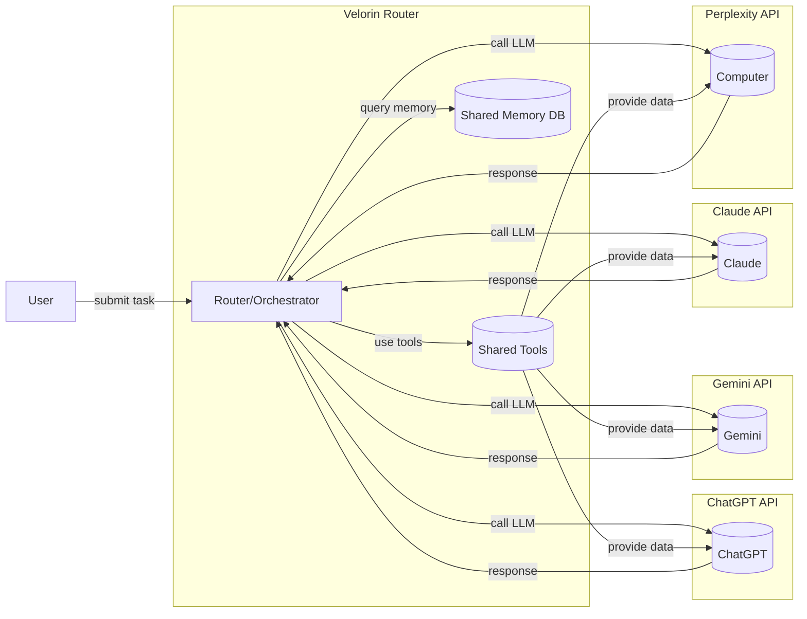

**Trey.Topic.Multi_Model_Integration**  
Trey | External Advisor | Velorin  
Version 1.0 | April 04, 2026  

# Executive Summary  
Velorin needs to orchestrate multiple AI services (OpenAI, Google Gemini, Anthropic’s Claude/Claude Code, Perplexity’s Computer) into one seamless system.  Each vendor provides rich APIs: OpenAI and Google Gemini support function-calling to external tools, Anthropic’s Claude offers a “tool use” framework with remote MCP connectors, and Perplexity provides a multi-provider Agent API with integrated search and custom tools.  The recommended Velorin architecture is a *hub-and-spoke* design: a central Velorin Router service that accepts high-level tasks, breaks them into subtasks, and dispatches them to appropriate LLMs or tools.  All agents share a common tools/service layer (for search, email, code repo, etc.) and a shared memory store.  Task/state/event buses connect components, with tokenized data flows (see diagrams below).  Key considerations include robust authentication (API keys/OAuth for each vendor), rate-limiting and quotas per vendor (e.g. OpenAI’s QPS limits, Perplexity’s tiered QPM【20†L138-L146】), and sandboxing untrusted code.  Security: run all agent actions in isolated environments (Perplexity’s cloud sandbox【16†L381-L385】 or local sandboxes like NVIDIA NemoClaw).  We detail vendor features and integration surfaces in Sections 1–2, orchestration patterns in Section 3, an exact Velorin blueprint (components, endpoints, data models, flows) in Section 4, followed by security/ops in Section 5 and a phased implementation checklist/PoC plan in Section 6.   The goal is a unified end-to-end workflow (e.g. *research → synthesize → code → deploy*) powered by the best model for each step.

# 1. Perplexity Computer Overview  
Perplexity recently launched **“Perplexity Computer”**, an AI agent platform that internally orchestrates many LLMs.  According to its marketing and developer materials, Perplexity Computer uses Claude Opus 4.6 as the *primary orchestrator/brain*【41†L28-L36】.  For each user task (described in natural language), it decomposes the goal into a task graph and spawns *sub-agents* running specialized models (Gemini for deep research, GPT-5.4 for long-context reasoning and coding, Grok for quick tasks, Nano Banana for image generation, Veo for video, etc.)【41†L28-L36】【42†L1-L4】.  A “Model Council” can query GPT, Claude, and Gemini in parallel to cross-validate answers【41†L28-L36】.  Notably, *all Perplexity Computer tasks run in a secure cloud sandbox*【16†L381-L385】 (no local execution), with support for parallel background execution of multiple projects【14†L174-L178】. 

- **Architecture:**  Cloud-based multi-agent system.  It has a core orchestration agent (Claude Opus 4.6【42†L1-L4】) that breaks goals into subtasks, assigns the best model, and manages inter-agent coordination (self-healing on failures【42†L7-L11】).  Sub-agents communicate via Perplexity’s infrastructure.  The user interacts through Perplexity’s web UI or API.  
- **Agent API / SDK:** Perplexity’s **Agent API** is a multi-provider interface; it can target models from OpenAI, Anthropic, Google, and others via a unified endpoint【51†L99-L107】【51†L116-L124】.  One calls `POST https://api.perplexity.ai/v1/agent` (alias `/v1/responses` for OpenAI compatibility【51†L133-L136】).  The Agent API supports sending “tools” parameters (e.g. `web_search`, `fetch_url`) and custom function definitions【47†L254-L263】【51†L99-L107】.  Perplexity provides SDKs (Python/TypeScript) and rate-limited API keys.  
- **Tools & Functions:**  Perplexity Computer integrates built-in tools: *web search* (with advanced filters) and *fetch URL* to retrieve page content【47†L149-L158】【47†L207-L215】.  It also supports **custom function calling**: developers can define named functions (with JSON Schema) that the LLM can invoke【47†L254-L263】.  Internally, the orchestrator can call out to external services via these tools without extra API round-trips.  This is essentially equivalent to OpenAI-style function-calling but unified across models.  
- **Connectors/Skills:**  Perplexity boasts 400+ app connectors (Gmail, Calendar, Slack, Notion, GitHub, Jira, Salesforce, HubSpot, etc.)【41†L39-L44】.  It can execute code (write, test, deploy apps) in isolated sandboxes【41†L39-L44】.  Users can create *Custom Skills* (reusable workflows) that the Computer will repeat on demand.  
- **Memory & Scheduling:**  The Computer maintains persistent memory of past work and user preferences【14†L159-L167】.  Projects run asynchronously; you can launch dozens of “Computers” in parallel【14†L174-L178】.  It supports long-running tasks: “Long-running tasks can run for weeks, only interrupting when it needs a decision from you”【16†L447-L450】.  Velorin should leverage this persistent context (e.g. vector DB of interactions) to coordinate multi-step work.  
- **Sandboxing:**  Unlike local agent frameworks (OpenClaw), Perplexity executes everything in its cloud sandbox【16†L381-L385】.  This avoids issues like OAuth leaks or provider bans【16†L381-L385】.  Velorin can either trust Perplexity’s sandbox for its internal operations, or run its own sandboxed containers for untrusted agent code (similar to NVIDIA’s NemoClaw approach for safe execution).  
- **Function-calling (MCP):**  Internally, Perplexity’s agent API combines tool use with multi-turn function-calling.  (The API docs describe a function call workflow【47†L254-L263】 akin to OpenAI’s.)  However, Perplexity does *not* publicly describe a Model Context Protocol (MCP) connector to external servers.  Instead, its multi-agent orchestration is closed within Perplexity’s platform.

# 2. Vendor Integration Surfaces  

| **Vendor**           | **APIs/SDKs**                                 | **Function-Calling / Tools**                                                                                                         | **MCP / Connectors**                                                       | **Typical Role in Velorin**                       |
|----------------------|----------------------------------------------|-------------------------------------------------------------------------------------------------------------------------------------|-----------------------------------------------------------------------------|---------------------------------------------------|
| **OpenAI (ChatGPT)** | Completions/Chat API (`/v1/completions`, `/v1/chat/completions`), Responses API (`/v1/responses`), Code-Interpreter/Web Browser (if enterprise). Official Python/Node SDKs. | Rich function-calling interface (JSON schema tools)【24†L15-L23】. ChatGPT Plugins (Actions) via Webhooks (server tools). Tool categories: e.g. `web_search`, `calculator`, custom functions. | Supports remote MCP servers and built-in connectors【28†L1825-L1833】【50†L1816-L1822】. The Responses API lets you add “tools” of type `mcp` with server URL and auth (e.g. Stripe example【50†L1816-L1822】). Also has native connectors (Dropbox, Gmail, Calendar, etc.) that you invoke via a `connector_id`【50†L1946-L1950】. | Broad tasks: planning, summarization, coding (GPT-5.4), general Q/A. Use function calls to link Velorin’s services (calendar, GitHub, etc.). Serves as the “generalist” hub for non-specialized steps. |
| **Anthropic (Claude)**| Claude API (`/v1/messages`, `/v1/queue`), Claude Code CLI/desktop. Python SDK.        | *Tool Use* framework: Claude decides to call tools. Supports **client tools** (user-defined, e.g. Python shell, DB query) and **server tools** (built-in: web_search, code_execution, web_fetch, etc.)【30†L225-L233】【30†L253-L259】. Tools are invoked with structured JSON calls. Strict mode available. | Claude can connect to remote MCP servers. The Claude Code CLI can register MCP servers via HTTP/SSE/STDIO【34†L165-L174】【34†L175-L184】. Anthropic provides an “MCP Connector” guide【32†L1-L4】 and uses the open-source MCP spec. Teams can build their own MCP servers or use Claude’s for SaaS (e.g. Jira, Sentry examples【34†L128-L137】). | Code-centric tasks and analysis. Use Claude API for natural-language synthesis or reasoning. Use Claude Code (CLI) for heavy code generation or editing (persistent context of code repo, built-in MCP). Good for code review, data analysis, writing deployment scripts. Connect Claude to Velorin’s internal MCP services (e.g. bug tracker, CI/CD API). |
| **Google (Gemini)**  | Google GenAI API (Vertex AI) via REST or Cloud SDK. Gemini CLI (for advanced use).           | Gemini supports function calling with JSON schemas (Python/JS clients)【36†L200-L209】. Google-provided tools include Google Search, Maps, Code Exec, etc. Gemini agents can combine tools (see GenAI SDK docs). | Gemini CLI supports MCP servers (HTTP/SSE/stdio) for on-premise tools【37†L342-L351】. Any MCP-compliant server (e.g. same spec) can integrate with Gemini tools. Also has integration with Google Workspace APIs (via OAuth connectors). | Deep research and knowledge retrieval. Gemini can ingest large contexts. Use Gemini for up-to-date info and broad context. It can call out to Google services if needed (via its own connectors or through Velorin). |
| **OpenAI (Codex)**   | Access via ChatGPT (Code Interpreter/ChatGPT Code tool) and *OpenAI Codex* API (legacy). CLI (ChatGPT desktop with Codex). | Similar to ChatGPT: can call functions/plugins via function-calling interface. Codex is specialized for code, debugging, and environment automation (running shell). It can execute Python/JS inside its sandbox. | No separate MCP; uses OpenAI’s system. Code features mostly accessed through function calls and shell tools. | Code generation and QA. Use GPT-5.4 (with code tool) or Codex-specific endpoints for writing, reviewing, and testing code. Acts as primary coding assistant once requirements are clarified. |
| **Perplexity**       | Agent API (`/v1/agent`, `/v1/responses`), Search API, Sonar (deep research API). Official SDK. | See Section 1: Supports `web_search`, `fetch_url`, and OpenAI-style `function` tools【47†L254-L263】. Multi-model orchestration is opaque (handled by platform). | No public MCP to external servers; all orchestration is internal. However, Perplexity’s platform connects to web, SaaS (via connectors), and can integrate knowledge (via its own platform memory). | Multi-model research & planning. Velorin can use Perplexity for knowledge work (especially multi-step research queries, automated report/presentation generation). Its core orchestrator is Claude Opus, so it overlaps with Anthropic, but it offers unified access to 3rd-party models via one API【51†L116-L124】. |

**2.1 OpenAI (ChatGPT/GPT, Codex)** – OpenAI provides the **Responses API** (`POST /v1/responses`, formerly Chat Completions) and older **Completions API**.  Developers use official OpenAI SDKs (Python, Node, etc.).  Modern ChatGPT models (e.g. GPT-5.x) support JSON *function-calling*: the model may output a `{"name":..., "arguments":...}` call, which the developer code must execute【24†L15-L23】.  The OpenAI tools framework includes pre-built tools (browser, code exec, etc.) and plugin connectors.  Crucially, OpenAI introduced a **MCP/connector** model: the client can include `{"type":"mcp", "server_url":..., "authorization":...}` in the request to connect to a remote MCP server (e.g. Stripe)【50†L1816-L1822】.  OpenAI also offers built-in *connectors* (Dropbox, Gmail, Calendar, etc.) which act like server tools【50†L1946-L1950】. For Velorin, the Router service would use the OpenAI API to delegate tasks (e.g. use GPT-5.4 for synthesis).  Any needed Velorin internal service (e.g. a knowledge DB) can be exposed via a custom function or via an MCP endpoint callable by OpenAI.

**2.2 Anthropic (Claude)** – Anthropic’s **Claude API** (e.g. `claude-v1` or Opus) uses a message format similar to ChatGPT. The Claude Developer Docs introduce *Tool Use*: you declare tools (name, description, parameters) and Claude will emit a `tool_use` JSON block when it decides to call one【30†L225-L233】. Tools come in two classes: *server tools* (executed on Anthropic’s side, e.g. web_search, code_execution, tool_search) and *client tools* (user-defined functions/commands run in Velorin’s environment).  After Claude returns a tool call, Velorin must execute it and then supply the `tool_result`.  The system supports strict schema enforcement for reliability【30†L269-L273】. For external integration, Claude Code/CLI can register **MCP servers**.  The Claude Code docs show how to *add* MCP servers via HTTP/SSE/stdio for GitHub, Sentry, etc.【34†L165-L174】【34†L175-L184】.  In practice, Velorin would implement its services as MCP servers: e.g. a `mcp.velorin.com` that exposes tools for database queries, GitHub PRs, or deployment commands. Claude can connect to these via its MCP connector【32†L1-L4】.  Thus, for Velorin: use Claude (and Claude Code) to process and reason about tasks, letting it issue calls to Velorin’s own internal tools and data over MCP.

**2.3 Google (Gemini)** – Google’s **Gemini API** (via Vertex AI or Google Cloud) also supports function calling with JSON tool schemas【36†L200-L209】.  Example code from Google defines a function (`schedule_meeting`) and sees the model output a call with `function_call` and arguments【36†L227-L236】【36†L270-L279】.  The Google GenAI SDK (Python/JS) simplifies this. Additionally, the **Gemini CLI** (for advanced users) supports connecting to MCP servers following the same protocol【37†L342-L351】.  Thus Velorin can invoke Gemini for in-depth research, letting Gemini connect to Google’s own tools or Velorin’s MCP if configured. Google also provides tools for searching Google services (Maps, YouTube, etc.) which Gemini can use.  Authentication is via Google Cloud IAM/API keys or OAuth.  

**2.4 OpenAI Codex** – OpenAI’s Codex is essentially the code-specialized subset of its models. It is integrated into ChatGPT as a “coding agent”【45†L605-L614】 and also accessible via API for code generation and analysis.  It uses the same infrastructure as GPT function-calling; there is no separate MCP protocol – code tasks are handled via function calls or shell tools (e.g. Codex can execute Python/JS).  We treat Codex as part of OpenAI’s interface: for Velorin, calling the OpenAI API with code-related prompts is sufficient.  Codex excels at code-specific workflows (write code from prompts, debug, refactor).  

**2.5 Perplexity (Agent API)** – As noted, Perplexity provides a unified API to multiple LLM providers【51†L116-L124】.  The **Agent API** lets Velorin pick models by name (e.g. `"openai/gpt-5.4"`, `"anthropic/claude-opus-4-6"`, `"google/gemini-3-pro"`, etc.) with one credential【51†L116-L124】【51†L178-L187】.  It supports the same tools and function-calling paradigm (e.g. `tools=[{"type":"web_search"}]` or `{"type":"function",name:...,parameters:...}`)【47†L254-L263】.  Velorin could use Perplexity’s API to run workflows leveraging its multi-model orchestration.  For example, one API call could seed Perplexity Computer with a goal, and it would return a plan or outputs across multiple models.  However, fine-grained control over Perplexity’s internals is limited – it’s mostly a single service call.  Perplexity also has a **Search API** and **Sonar API** for specialized queries.

# 3. Multi-Agent Orchestration Patterns  
**Hub-and-Spoke Orchestration:** In Velorin’s design, use a central *Router* or Orchestrator service as the hub. All high-level tasks (from the UI or API) go to the Router. The Router breaks tasks into subtasks, then calls the appropriate LLM API (ChatGPT, Gemini, Claude, Perplexity) to handle each subtask. This avoids having ChatGPT directly call Claude, etc. (the *branded apps are merely clients*, not peer agents). 

**Shared Tools Layer:** Implement a common set of tools as independent services (in-house APIs) – e.g. document search, code repository, messaging, Google/Gmail/Microsoft connectors, issue trackers, etc. The Router and all agents access these tools via a uniform interface. For example, one could wrap every Velorin-internal function as an MCP-compatible tool so that any model’s function-calling or ChatGPT’s tool API can invoke it.  

**Shared Memory/Context Store:** Maintain a central knowledge base (vector DB) and context store (relational DB) that all agents read/write. This holds conversation history, project state, user preferences, and retrieval data. For example, after an agent completes a research step, its result is saved in memory; another agent later (even a different vendor) can retrieve it by querying memory. This ensures coherence across the multi-model pipeline.  

**Task/Event Bus:** Use a message queue or orchestration framework (e.g. Temporal, Celery, or a simple webhook/event system) to coordinate long-running tasks. Each subtask result triggers the next step. For instance, the Router enqueues a “synthesize” task after research completes. Because tasks may take seconds to hours (as with Perplexity Computer), asynchronous callbacks or polling should be supported.  

**Example Flow:** *(see Sequence Diagram below)*. User requests “Build X app”. Router calls Perplexity Computer for research, gets insights. Router then calls ChatGPT/Gemini to outline solution. Next, Router instructs Claude Code to generate code files and push to GitHub. On GitHub webhook, Router triggers a deployment step (which might call Google Cloud or Kubernetes APIs).  



# 4. Velorin Architecture Blueprint  

**Components:** Velorin will consist of:  
- **API Gateway/Router Service:** Receives user commands, manages auth, breaks tasks into stages. Exposes endpoints (HTTP) like `POST /tasks` (create high-level project), `POST /projects/{id}/step` (feedback), etc.  
- **Task Orchestrator:** Business logic that decomposes tasks, tracks dependencies, enqueues subtasks to agent services or tools. Could be integrated in the Router or separate.  
- **Shared Tools Microservices:** E.g. `tools/`, `connectors/` for CRM/Email, `search/` (internal search over docs), `code/` (GitHub/GitLab integration), `deployment/` (CI/CD, cloud APIs), etc. Each has its own API and authentication (OAuth secrets) for external services.  
- **Memory DB:** Stores context: tables for `projects`, `tasks`, `subtasks`, `agent_responses`, and a vector store for embeddings (for retrieval).  
- **Vector DB:** For storing embeddings of knowledge (e.g. document corpus) to feed LLM retrieval tools.  
- **Agents:** 
  - **OpenAI Agent:** Wraps OpenAI API (GPT) calls.
  - **Claude Agent:** Wraps Anthropic API.
  - **Gemini Agent:** Wraps Google GenAI API.
  - **Perplexity Agent:** Wraps Perplexity Agent API.
Each agent component handles authentication (API keys/OAuth), request formatting (function-calling, tools), and returns structured results to the Router.  
- **Event/Queue System:** A message bus (like RabbitMQ, AWS SQS, or Temporal) where tasks and callbacks flow.  

**Protocols & Data Models:**  
- Use JSON for all request/response payloads. Standardize on messages that include: `role`, `content`, `tool_call`, `tool_response`, etc. For MCP tools, follow the MCP JSON schema (name, args).  
- **Task Model:** `{ id, project_id, description, assigned_agent, status, result_data }`.  
- **Subtask/Message Model:** Could mirror LLM conversation. Each has role (“assistant”/“tool”), content or function_call dictionary, and an output.  
- **Auth Flows:** Securely store Velorin’s API keys (OpenAI, Claude, Google) in a secrets manager. For any OAuth (e.g. Gmail connector), implement OAuth 2.0 with token refresh. Perplexity just uses an API key.  
- **Endpoints:**  
   - `POST /projects` – create new project (goal, initial prompt).  
   - `GET /projects/{id}` – retrieve status/results.  
   - `POST /projects/{id}/feedback` – send user feedback/answers to agent’s question.  
   - `POST /tools/{tool}/invoke` – internal hook to call a tool (optionally via LLM).  
   - Webhooks: e.g. GitHub/GitLab for code events.  
   - LLM webhook (if using ChatGPT plugin style) to receive input (optional).  
   - For sequence flows: we’ll assume Router directly polls or streams LLM responses (WebSocket or completion streaming).  

**Sequence Flow (Research→Synthesize→Code→Deploy):**  

```mermaid
sequenceDiagram
  actor User
  participant Router
  participant Perplexity
  participant Gemini
  participant ChatGPT
  participant ClaudeAPI
  participant ClaudeCode
  participant GitHub
  participant MemoryDB

  User->>Router: "Build X app with feature Y"
  Router->>MemoryDB: log new project
  Router->>Perplexity: Research background info
  Perplexity-->>Router: returns research summary
  Router->>Gemini: Query latest domain data
  Gemini-->>Router: returns facts/refs
  Router->>MemoryDB: store findings
  Router->>ChatGPT: "Design architecture for app"
  ChatGPT-->>Router: returns design outline
  Router->>MemoryDB: store outline
  Router->>ClaudeAPI: "Generate code blueprint/steps"
  ClaudeAPI-->>Router: returns code outline/PR
  Router->>ClaudeCode: "Write code files & commit"
  ClaudeCode->>GitHub: commit to repo
  GitHub-->>Router: webhook confirms commit
  Router->>Router: finalize project, record deployment
  Router-->>User: "Project complete; code at [repo]"
```

*(Unspecified details like exact data schemas or internal message formats should be defined during design.)*  

# 5. Security, Rate Limits, Risks  
- **Authentication:** Each API call to OpenAI/Gemini/Claude/Perplexity requires credentials. Use environment-secured API keys or OAuth tokens. OpenAI/Google may require OAuth if using user scopes; likely service accounts suffice. Store all secrets in a vault (e.g. AWS Secrets Manager). Never expose tokens in frontend.  
- **Network Security:** Communicate with LLM APIs over HTTPS.  If running agents locally (Claude Code, Gemini CLI, etc.), ensure network egress to allowed endpoints only.  
- **Rate Limits:**  
  - OpenAI imposes QPS and QPM limits (e.g. 60,000 requests/min = ~1000 qps by default; heavy use may need rate management)【19†L0-L8】.  
  - Perplexity uses tiered rate limits: e.g. Tier 0: 1 QPS (50/min), up to Tier 5: 33 QPS (2000/min) on Agent API【20†L138-L146】. Search API allows 50 QPS burst. Monitor usage and handle 429 errors.  
  - Anthropic rate limits are not public; plan for modest volume or contact sales.  
  - Google Gemini (GenAI) rate limits depend on project quotas; check Google Cloud quotas.  
  - Build retry/backoff logic.  
- **Content Security:** All models can produce incorrect or harmful outputs. Implement output filtering and human review for critical tasks. For tools that act (e.g. sending an email, deploying code), require explicit confirmation (Rubber-duck step).  
- **Sandboxing Execution:** Any code execution (e.g. Claude Code running test suites) should occur in isolated containers with resource limits. Use NemoClaw or similar to prevent runaway processes. Perplexity’s cloud sandbox handles this for itself【16†L381-L385】; for Velorin’s own tools, mimic safe execution.  
- **Injection Risks:** Untrusted context (e.g. memory content, web data) could contain code that hijacks prompts. Always sanitize or constrain memory/tool outputs. For MCP tools, require user approval if connecting to private systems (Velorin should use managed allowances vs. arbitrary servers).  
- **Operational Risks:** Multi-agent systems can deadlock or loop. Include circuit breakers (cancel tasks after timeout, track dependencies). Use idempotency tokens to avoid double-execution.  

# 6. Implementation Steps & PoC Plan  

**Step 1: Environment Setup (1–2 days).** Choose stack (e.g. Python with FastAPI, or Node with Express). Set up a Git repo, container orchestration (e.g. Docker Compose). Initialize Velorin database (PostgreSQL + vector DB like Pinecone/Chroma).  

**Step 2: Integrate LLM SDKs (3–5 days).**  
- Install and test OpenAI Python/Node SDK; make sample calls to GPT-5.4 (function calling).  
- Install Google GenAI SDK and test a Gemini function call.  
- Install Anthropic Python SDK (or HTTP) and test a simple Claude tool call (e.g. web_search).  
- Install Perplexity SDK; test fetching from at least two providers (e.g. Perplexity -> GPT-5.4, and Perplexity -> Claude).  
Ensure rate-limit handling. Document token usage.  

**Step 3: Shared Tools Layer (1–2 weeks).** Implement core Velorin services that the LLMs will use:  
- **Memory Service:** REST API to store/retrieve notes. Support `POST /memory` and `GET /memory?query=...` for embedding search.  
- **Search/Docs Service:** If Velorin has a documentation corpus, host it for LLM retrieval. Alternatively, rely on LLMs’ web_search tools for external search.  
- **Code Repo Service:** API integration with GitHub/GitLab (create issues, PRs, push code).  
- **Message/Calendar Connector:** OAuth flow for Gmail/Calendar, if needed. Possibly integrate via OpenAI’s or Google’s built-in connectors or by custom calls.  
These will be exposed as MCP-style endpoints so that Claude or OpenAI can call them by name.  

**Step 4: Router & Orchestration Logic (1–2 weeks).**  
- Implement the central `POST /projects` endpoint. It enqueues an orchestration workflow.  
- Design task objects in DB. Code the orchestration in sequence (e.g. research→synthesize→code). For PoC, script a fixed sequence.  
- Use an async queue (e.g. Celery or AWS Step Functions) to allow long-running calls.  
- After each LLM call, log results to DB and decide next step.  
- For function-calling tools: parse LLM output for function calls and route to the corresponding local service or external API.  

**Step 5: Prototype Workflow (2–3 weeks).**  
- Choose a simple end-to-end example (e.g. “Build a To-Do list app”).  
- Hardcode a chain: call Gemini or Perplexity to gather requirements, call ChatGPT to draft design, call Claude Code to write code, push to a test repo.  
- Verify data flows through the system.  
- Iterate on error handling.  

**Step 6: Security & Final Polishing (1–2 weeks).**  
- Implement auth guards, secret management.  
- Add logging, monitoring.  
- Conduct manual tests of rate-limit handling and error cases.  
- Prepare deployment scripts (e.g. Docker, k8s manifest).  

**Implementation Checklist:** (prioritized)  
1. LLM API credentials obtained and securely stored.  
2. Basic Router service up, test endpoint.  
3. Perplexity and OpenAI API integration: ensure calls succeed with test prompts.  
4. Shared memory store connected; test storing/retrieval from an LLM response.  
5. Tool calls: test Claude tool invocation (e.g. call `web_search` and return).  
6. Sequence orchestration: wire two stages (e.g. research → summary).  
7. Add Google Gemini stage (if higher complexity budget).  
8. Set up Velorin-specific MCP endpoints (e.g. code commit).  
9. End-to-end: user prompt triggers full pipeline → deployment.  
10. Add monitoring, rate-limit handlers, and finalize UI/UX for status updates.  

**Estimated Effort:** In total, a lean PoC (end-to-end for one scenario) might take ~6–8 weeks with a small team (developers familiar with LLM APIs). Using managed services (e.g. Managed HSM for secrets, cloud queues, FaaS for stateless tools) can shorten time.  

**Tech Stack:** Likely Python (FastAPI, asyncio) or Node.js (Express/TypeScript). Use official SDKs for each vendor. Postgres for relational data, Pinecone/Chroma for embeddings. Docker for environment parity.  

**Sources:** We relied on vendor documentation: OpenAI API Guides (function calling, MCP tools)【24†L15-L23】【28†L1946-L1950】, Anthropic Claude docs (tool use)【30†L225-L233】【30†L253-L259】, Google Gemini API docs【36†L200-L209】, and Perplexity official docs and announcements【51†L116-L124】【47†L254-L263】. Tables and diagrams synthesize this information for Velorin’s design.  

— Trey  
External Advisor | Velorin  

[VELORIN.EOF]